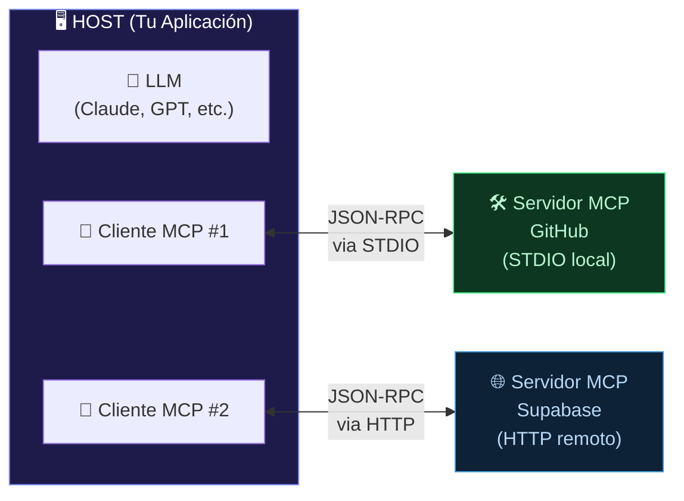

**Tags:** #mcp #arquitectura #transporte #host #cliente #servidor

> [!info] Navegación
> ◀ Anterior: [[📂MCP/01 - Qué es MCP y Problema que Resuelve|Qué es MCP]] | Siguiente ▶: [[📂MCP/03 - Primitivos de MCP Tools Resources y Prompts|Primitivos]]

---

# 02 — Arquitectura de MCP: Host, Cliente y Servidor

> [!quote] Concepto Clave
> MCP funciona con una arquitectura **cliente-servidor** muy bien delimitada. Entender las 3 piezas y cómo se comunican es fundamental para saber qué hace qué y dónde vive cada responsabilidad.

---

## 🏗️ Los Tres Actores Principales



### 1. 🖥️ El Host (La Aplicación)

Es el **entorno donde trabaja el usuario**. Es la "casa" donde vive el LLM y los clientes MCP.

**Ejemplos de Hosts:**
- **Claude Desktop** → La app de escritorio de Anthropic
- **VS Code / Cursor** → Editores de código con extensiones de IA
- **Amazon Bedrock Console** → Cuando usas Bedrock con [[📂AWS/📂IA Practitioner/📂M4 - Bedrock y Amazon Q/03 - Agents for Bedrock|Agents for Bedrock]]
- **Tu aplicación web propia** → Si integras un LLM en tu backend

> [!tip] Clave
> El Host es lo que **tú ves y usas**. Puede contener **múltiples Clientes MCP** simultáneamente, cada uno conectado a un servidor diferente.

### 2. 🔌 El Cliente MCP

Es el componente **interno del Host** que se encarga de hablar el protocolo MCP. Tú no lo ves ni interactúas directamente con él. Trabaja por detrás.

**Responsabilidades del Cliente:**
- Descubrir las [[📂MCP/03 - Primitivos de MCP Tools Resources y Prompts|herramientas disponibles]] en el servidor
- Traducir las peticiones del LLM al formato JSON-RPC
- Enviar las llamadas al servidor y devolver las respuestas al modelo
- **Relación 1:1** → Cada Cliente MCP se conecta a exactamente **un** Servidor MCP

### 3. 🛠️ El Servidor MCP

Es un **programa independiente** (un proceso separado) que tiene acceso real a la herramienta, base de datos o servicio externo. Es el **único** que toca tus datos.

**Responsabilidades del Servidor:**
- Exponer un **catálogo de herramientas** (Tools), **recursos** (Resources) y **plantillas** (Prompts)
- Recibir las peticiones del Cliente, ejecutar la acción solicitada y devolver el resultado
- **Gestionar las credenciales** de acceso de forma segura (las API keys, tokens, contraseñas...)

> [!warning] El modelo NUNCA accede directamente a tus datos
> El LLM no toca tu base de datos ni tu GitHub. Le pide al Cliente MCP que se lo pida al Servidor MCP, y el Servidor ejecuta la acción con sus propias credenciales locales. El modelo solo recibe el **resultado textual** de vuelta.

---

## 🚀 Tipos de Transporte (Cómo se Comunican)

El Cliente MCP y el Servidor MCP necesitan un "canal de comunicación". MCP define dos tipos de transporte:

### 📟 STDIO (Standard Input/Output) — Servidor Local

El servidor se ejecuta como un **proceso local en tu propia máquina**. La comunicación se hace a través de la entrada/salida estándar del sistema operativo (stdin/stdout), como si fuera una tubería (pipe).

```bash
# Ejemplo: El Host lanza el servidor MCP de filesystem como un proceso local
npx -y @modelcontextprotocol/server-filesystem /ruta/a/tu/directorio
```

| Característica | Detalle |
| :--- | :--- |
| **Dónde corre** | En tu máquina local |
| **Latencia** | Mínima (comunicación local) |
| **Seguridad** | Máxima (los datos nunca salen de tu PC) |
| **Ejemplo** | Servidor MCP de filesystem (leer/escribir archivos locales) |
| **Cuándo usarlo** | Herramientas locales, archivos del proyecto, bases de datos locales |

### 🌐 HTTP (Streamable HTTP) — Servidor Remoto

El servidor se ejecuta en un **servidor remoto en internet** (cloud). La comunicación se hace mediante peticiones HTTP con Server-Sent Events (SSE) para respuestas en streaming.

| Característica | Detalle |
| :--- | :--- |
| **Dónde corre** | En la nube / servidor remoto de un tercero |
| **Latencia** | Mayor (red de internet) |
| **Seguridad** | Requiere autenticación OAuth / API Key |
| **Ejemplo** | MCP de GitHub remoto, Supabase, Stripe |
| **Cuándo usarlo** | Servicios SaaS, APIs de terceros, herramientas corporativas |

> [!tip] Analogía del Transporte
> - **STDIO** es como hablar con alguien que está sentado a tu lado en la misma sala. Rápido, directo, privado.
> - **HTTP** es como hacer una videollamada a alguien en otro país. Funciona perfectamente, pero necesitas internet y verificar que es quien dice ser (autenticación).

---

## 🔄 Flujo Completo de una Petición MCP

```mermaid
sequenceDiagram
  participant U as 👤 Usuario
  participant H as 🖥️ Host (Claude Desktop)
  participant LLM as 🧠 LLM (Claude)
  participant C as 🔌 Cliente MCP
  participant S as 🛠️ Servidor MCP (GitHub)
  participant GH as 🐙 API de GitHub

  U->>H: "¿Qué issues abiertos hay en mi repo?"
  H->>LLM: Envía el prompt + catálogo de tools disponibles
  LLM->>C: "Necesito ejecutar: listar_issues(repo='mi-repo')"
  C->>S: JSON-RPC: {"method": "listar_issues", "params": {"repo": "mi-repo"}}
  S->>GH: GET /repos/mi-repo/issues (con token privado)
  GH-->>S: [issue #1: "Bug en login", issue #2: "Mejorar docs"]
  S-->>C: Resultado JSON con los issues
  C-->>LLM: "Hay 2 issues abiertos: #1 Bug en login, #2 Mejorar docs"
  LLM-->>H: Formatea la respuesta en lenguaje natural
  H-->>U: "Tienes 2 issues abiertos en tu repo:
  1. Bug en login
  2. Mejorar docs"
```

> [!example] Lo que pasa por detrás (invisible al usuario)
> 1. El usuario pregunta en lenguaje natural
> 2. El LLM analiza la pregunta y decide qué herramienta MCP necesita
> 3. El Cliente MCP envía la petición al Servidor vía JSON-RPC
> 4. El Servidor ejecuta la acción real (llamar a la API de GitHub con su token privado)
> 5. El resultado viaja de vuelta por la cadena hasta el usuario
> 
> **El usuario nunca ve JSON-RPC, tokens ni APIs. Solo habla en español y recibe respuestas en español.**

---
→ Volver al índice: [[📂MCP/00 - MOC MCP|🔌 MOC MCP]]
