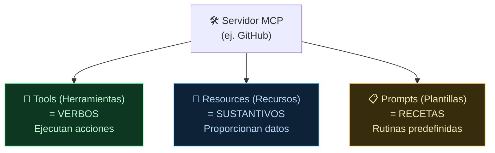

**Tags:** #mcp #primitivos #tools #resources #prompts

> [!info] Navegación
> ◀ Anterior: [[📂MCP/02 - Arquitectura Host Cliente y Servidor|Arquitectura]] | Siguiente ▶: [[📂MCP/04 - Cómo Conectar y Utilizar Servidores MCP|Conexión y Uso]]

---

# 03 — Primitivos de MCP: Tools, Resources y Prompts

> [!quote] Concepto Clave
> Un [[📂MCP/02 - Arquitectura Host Cliente y Servidor|Servidor MCP]] expone sus capacidades al modelo de IA mediante exactamente **3 tipos de primitivos**. Cada uno tiene un propósito muy diferente. Confundirlos es fácil, así que esta nota los distingue con claridad.

---

## 🧩 Las 3 Capacidades de un Servidor MCP

---

## 🔧 Tools (Herramientas) — Los Verbos de Acción

### ¿Qué son?
Son **funciones ejecutables** que el LLM puede invocar para **hacer cosas** en el mundo real: crear, modificar, consultar, enviar, borrar. Son acciones que producen un efecto.

### Características Clave
- **Controladas por el modelo:** Es el LLM quien decide cuándo y qué Tool ejecutar, basándose en la intención del usuario.
- **Pueden tener efectos secundarios:** Modificar una base de datos, enviar un email, crear un archivo. No son de solo lectura.
- **Requieren confirmación** (opcionalmente): El Host puede pedir al usuario que apruebe antes de ejecutar una acción peligrosa (Human-in-the-Loop).

### Ejemplo Práctico: Servidor MCP de GitHub

| Tool | Qué Hace | Tipo de Acción |
| :--- | :--- | :--- |
| `crear_issue(titulo, cuerpo)` | Crea un nuevo issue en un repositorio | ✏️ Escritura |
| `buscar_codigo(query, repo)` | Busca código dentro de un repositorio | 🔍 Lectura |
| `abrir_pull_request(rama, titulo)` | Abre un nuevo Pull Request | ✏️ Escritura |
| `listar_issues(repo, estado)` | Lista los issues de un repositorio | 🔍 Lectura |
| `fusionar_pr(pr_id)` | Fusiona un Pull Request | ✏️ Escritura |

> [!example] En la práctica
> El usuario escribe en el chat: *"Crea un issue en mi repo llamado 'Bug en el login' con la descripción 'El formulario no valida el email'"*.
> 
> El LLM analiza la frase, identifica que necesita la tool `crear_issue` y la ejecuta con los parámetros extraídos del lenguaje natural.

---

## 📄 Resources (Recursos) — Los Sustantivos de Información

### ¿Qué son?
Son **datos en modo de solo lectura** que el servidor expone para que el modelo tenga **contexto adicional**. No ejecutan acciones: proporcionan información.

### Características Clave
- **Controlados por la aplicación (Host):** Es la aplicación (no el LLM) quien decide qué Resources cargar en el contexto.
- **Solo lectura:** No modifican nada. Son fuentes de información pasivas.
- **Ahorran tokens:** En lugar de que el usuario pegue manualmente un archivo entero en el chat, el Resource lo inyecta automáticamente.

### Ejemplo Práctico: Servidor MCP de un Proyecto

| Resource | Qué Proporciona | Formato |
| :--- | :--- | :--- |
| `proyecto://README.md` | El contenido del README del proyecto | Texto Markdown |
| `db://clientes/esquema` | El esquema (tablas y columnas) de la base de datos | JSON |
| `config://env.production` | Las variables de entorno de producción (sin secretos) | Texto plano |
| `docs://api/endpoints` | Documentación de los endpoints de la API | OpenAPI JSON |

> [!example] En la práctica
> Cuando abres un proyecto en tu IDE con un servidor MCP configurado, la herramienta automáticamente carga el README, el esquema de la base de datos y la configuración como contexto. Así, cuando le preguntas al LLM *"¿Qué tablas tiene mi base de datos?"*, ya tiene la respuesta sin que tú pegues nada.

---

## 📋 Prompts (Plantillas) — Las Recetas Reutilizables

### ¿Qué son?
Son **plantillas de prompt predefinidas** que el servidor ofrece al usuario para realizar tareas repetitivas de forma optimizada. Son como "atajos" o "recetas" que encapsulan un flujo de trabajo completo.

### Características Clave
- **Controlados por el usuario:** El usuario elige explícitamente qué Prompt Template usar (normalmente desde un menú o un comando `/`).
- **Aceptan argumentos:** Pueden tener huecos (`{{variable}}`) que el usuario rellena (similar a los [[📂AWS/📂IA Practitioner/📂M3 - IA Generativa/12 - Técnicas de Prompt Engineering|Prompt Templates de Bedrock]]).
- **Optimizan tokens:** El servidor sabe exactamente qué contexto necesita cada plantilla y lo carga automáticamente.

### Ejemplo Práctico: Servidor MCP de Code Review

| Prompt Template | Qué Hace | Argumentos |
| :--- | :--- | :--- |
| `/revisar-pr` | Analiza un Pull Request y genera una revisión con sugerencias | `{pr_url}` |
| `/explicar-error` | Analiza un stack trace y explica la causa raíz en lenguaje sencillo | `{error_text}` |
| `/generar-tests` | Genera tests unitarios para una función específica | `{función}`, `{framework}` |
| `/documentar` | Genera documentación JSDoc/Javadoc para una función | `{código}` |

> [!example] En la práctica
> En lugar de escribir un prompt largo cada vez que quieres una code review, ejecutas `/revisar-pr https://github.com/mi-repo/pull/42` y el servidor MCP carga automáticamente el diff del PR, las reglas de estilo del proyecto y la plantilla de revisión optimizada.

---

## 📊 Tabla Comparativa de los 3 Primitivos

| | **🔧 Tools** | **📄 Resources** | **📋 Prompts** |
| :--- | :--- | :--- | :--- |
| **Analogía** | Verbos (hacer cosas) | Sustantivos (datos existentes) | Recetas (flujos predefinidos) |
| **Quién lo controla** | El LLM decide cuándo usarlas | La aplicación (Host) las carga | El usuario las elige |
| **Lectura / Escritura** | Ambas (pueden modificar datos) | Solo lectura | Lectura (generan prompts optimizados) |
| **Ejemplo GitHub** | `crear_issue()`, `fusionar_pr()` | `repo://README.md` | `/revisar-pr {url}` |
| **Ejemplo DB** | `ejecutar_query(sql)` | `db://esquema/tablas` | `/optimizar-query {sql}` |
| **Efecto secundario** | ✅ Sí (puede crear, borrar, modificar) | ❌ No (solo informa) | ❌ No (genera un prompt) |

> [!tip] Regla Mnemotécnica
> - **Tools** = 🔧 Hacer algo → *"Crea esto, envía aquello, borra eso"*
> - **Resources** = 📄 Saber algo → *"Dame el contexto, enséñame los datos"*
> - **Prompts** = 📋 Automatizar algo → *"Usa esta receta para hacer X de forma optimizada"*

---
→ Volver al índice: [[📂MCP/00 - MOC MCP|🔌 MOC MCP]]
