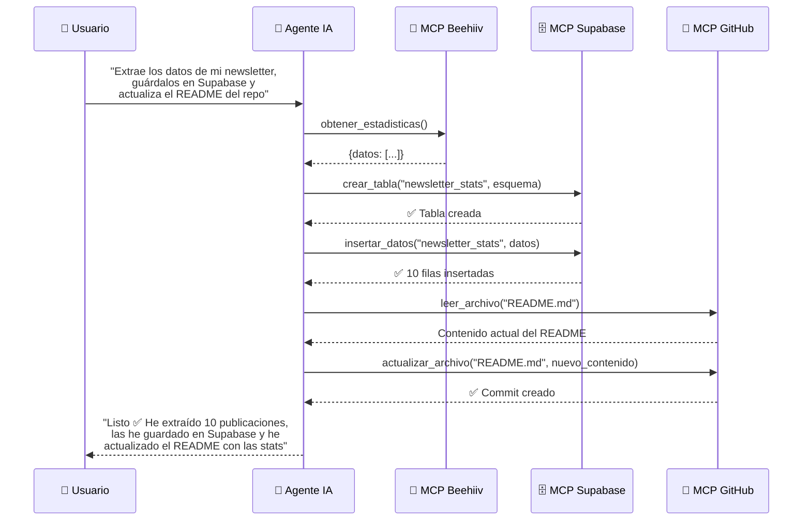

**Tags:** #mcp #casos-reales #ejemplos #beehiiv #multi-mcp

> [!info] Navegación
> ◀ Anterior: [[📂MCP/04 - Cómo Conectar y Utilizar Servidores MCP|Conexión y Uso]] | Siguiente ▶: [[📂MCP/06 - Cómo Crear un Servidor MCP en Python|Crear un Servidor]]

---

# 05 — Casos de Uso Reales y Proyecto Práctico

> [!quote] Concepto Clave
> MCP no es un concepto teórico: decenas de empresas ya ofrecen servidores MCP oficiales. En esta nota vemos el ecosistema real y un proyecto práctico paso a paso.

---

## 🌍 Ecosistema de Integraciones Reales

Estas empresas ya ofrecen servidores MCP oficiales listos para usar:

| Empresa / Servicio | Qué ofrece su MCP | Tipo de Servidor |
| :--- | :--- | :--- |
| **GitHub** | Gestionar repos, issues, PRs, buscar código | STDIO (local) o HTTP (remoto) |
| **Supabase** | Crear/leer/modificar tablas y datos en PostgreSQL gestionado | HTTP (remoto) |
| **Notion** | Leer y crear páginas, bases de datos y bloques | HTTP (remoto) |
| **Slack** | Enviar mensajes, leer canales, buscar conversaciones | HTTP (remoto) |
| **Stripe** | Consultar pagos, crear productos, gestionar suscripciones | HTTP (remoto) |
| **Figma** | Leer diseños, extraer componentes, obtener tokens de diseño | HTTP (remoto) |
| **Beehiiv** | Estadísticas de newsletters, gestionar suscriptores, publicaciones | HTTP (remoto) |
| **Docker** | Gestionar contenedores, imágenes, volúmenes y redes locales | STDIO (local) |
| **PostgreSQL** | Ejecutar queries, leer esquemas, gestionar tablas | STDIO (local) |
| **Filesystem** | Leer, escribir y buscar archivos en tu disco local | STDIO (local) |
| **Brave Search** | Búsquedas web en tiempo real | STDIO (local) |

> [!tip] Dónde encontrar más servidores MCP
> - **Repositorio oficial:** `github.com/modelcontextprotocol/servers` → lista curada de servidores oficiales y comunitarios.
> - **mcp.so** → Directorio comunitario con cientos de servidores MCP clasificados por categoría.
> - **Glama.ai** → Otro directorio visual de servidores MCP.

---

## 🛠️ Proyecto Práctico: Dashboard de Newsletter con Beehiiv

Vamos a recorrer un caso real completo donde un agente de IA usa MCP para crear una aplicación funcional.

### El Objetivo
Crear un **dashboard web local** que muestre las estadísticas de rendimiento de una newsletter de Beehiiv (plataforma de email marketing), todo orquestado por un agente de IA usando MCP.

### Paso 1: Conectar el MCP de Beehiiv

El usuario configura el servidor MCP de Beehiiv en su IDE (ver [[📂MCP/04 - Cómo Conectar y Utilizar Servidores MCP|Cómo Conectar]]):

```json
{
  "servers": {
    "beehiiv": {
      "type": "http",
      "url": "https://mcp.beehiiv.com/v1",
      "auth": {
        "type": "oauth"
      }
    }
  }
}
```

### Paso 2: El Agente Extrae Datos

El usuario le dice al agente:
> *"Dame las estadísticas de mis 10 mejores publicaciones de los últimos 3 meses, ordenadas por tasa de apertura"*

El agente usa las [[📂MCP/03 - Primitivos de MCP Tools Resources y Prompts|Tools]] del servidor MCP de Beehiiv:
1. `obtener_publicaciones(periodo="3m", ordenar_por="open_rate", limite=10)`
2. Recibe un JSON con los datos: título, fecha, suscriptores, aperturas, clics, tasa de conversión

### Paso 3: El Agente Genera el Dashboard

El usuario dice:
> *"Ahora crea una página HTML con un dashboard bonito que muestre estos datos con gráficos de barras"*

El agente genera el código HTML + JavaScript con los datos reales extraídos vía MCP:
- Gráfico de barras con las tasas de apertura
- Tabla con las métricas detalladas
- Estilos CSS profesionales

### Paso 4: Resultado Final

El usuario abre el archivo `dashboard.html` en su navegador y tiene un dashboard funcional con datos reales de su newsletter, sin haber escrito una sola línea de código ni haber tocado la API de Beehiiv manualmente.

---

## 🔗 Orquestación Multi-MCP

La verdadera potencia de MCP aparece cuando **combinas varios servidores simultáneamente**. Un solo agente puede usar múltiples herramientas de diferentes servicios en una misma conversación.

### Ejemplo: Pipeline Automatizado



> [!example] Lo que ha pasado en una sola conversación
> El agente ha:
> 1. **Leído** datos de Beehiiv (MCP #1)
> 2. **Creado una tabla y escrito** datos en Supabase (MCP #2)
> 3. **Leído y modificado** un archivo en GitHub (MCP #3)
> 
> Todo en una sola conversación, en lenguaje natural, sin que el usuario haya escrito una sola línea de código.

---

## 💡 Más Ideas de Proyectos Multi-MCP

| Proyecto | MCPs Involucrados | Descripción |
| :--- | :--- | :--- |
| **Bot de soporte inteligente** | Notion + Slack + Supabase | Lee la documentación en Notion, responde preguntas por Slack y registra las incidencias en Supabase |
| **Pipeline de diseño a código** | Figma + GitHub + Filesystem | Extrae tokens de diseño de Figma, genera CSS y lo commitea en GitHub |
| **Monitor de pagos** | Stripe + Slack + PostgreSQL | Detecta pagos fallidos en Stripe, notifica por Slack y registra en la BD |
| **Asistente de DevOps** | Docker + GitHub + Filesystem | Gestiona contenedores, lee logs y actualiza configuraciones en repos |

---
→ Volver al índice: [[📂MCP/00 - MOC MCP|🔌 MOC MCP]]
