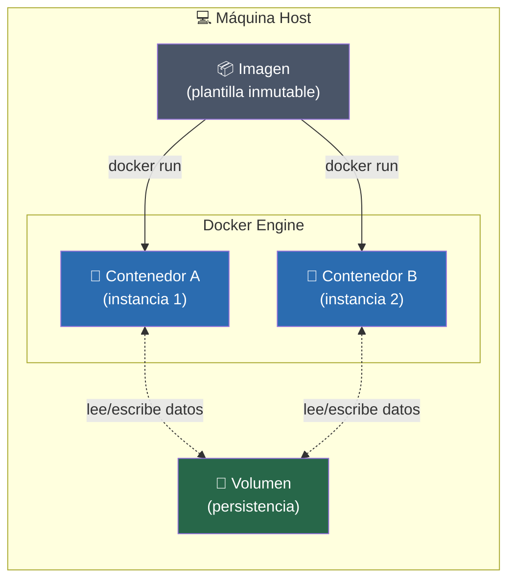

## 🧭 ¿Qué es Docker?

**Docker** es una plataforma que permite **empaquetar una aplicación junto con todo lo que necesita para funcionar** (código, dependencias, librerías, variables de entorno, sistema de archivos mínimo) en una unidad estándar llamada **contenedor**.

> [!TIP] 
> La frase que debes recordar **"Funciona en mi máquina"** deja de ser un problema porque Docker no mueve solo tu código, mueve **todo el entorno** donde ese código corre.

Docker se apoya en dos tecnologías del kernel de Linux:

- **Namespaces** → aíslan lo que el proceso _puede ver_ (red, procesos, sistema de archivos).
- **Cgroups** → limitan lo que el proceso _puede consumir_ (CPU, RAM, disco).

Gracias a esto, un contenedor **no es una máquina virtual completa**: es un proceso aislado que comparte el kernel del sistema operativo anfitrión (host). Esto lo veremos en detalle en la siguiente nota.

---

## 🏗️ Las 3 piezas clave: Imagen, Contenedor y Volumen

### 🍰 Analogía maestra: la receta de cocina

Piensa en Docker como un restaurante:

|Concepto Docker|Analogía|Explicación|
|---|---|---|
|**Imagen**|📖 La **receta escrita**|Un plano inmutable: ingredientes y pasos exactos para preparar el plato|
|**Contenedor**|🍽️ El **plato ya cocinado y servido**|Una instancia real, viva, ejecutándose. Puedes hacer varios platos (contenedores) de la misma receta (imagen)|
|**Volumen**|🧊 La **nevera del restaurante**|Almacenamiento externo a la cocina (contenedor). Si la cocina se incendia (el contenedor se borra), la comida guardada en la nevera sobrevive|

---

### 📦 Imagen (Image)

> [!EXAMPLE] Definición técnica Una **imagen** es una plantilla **de solo lectura**, inmutable, compuesta por **capas superpuestas** (layers), que contiene todo lo necesario para ejecutar una aplicación: sistema de archivos base, binarios, dependencias y configuración.

**Características clave:**

- Es **estática**: no se ejecuta, solo existe como archivo/plantilla.
- Está compuesta por **capas** (layers) apiladas — cada instrucción del `Dockerfile` genera una capa nueva.
- Las capas se **cachean y reutilizan** entre imágenes → esto es clave para builds rápidos (lo veremos en la nota de Dockerfile).
- Se identifica con un nombre y un tag: `nombre:tag` (ej. `node:20-alpine`).

```bash
# Listar todas las imágenes descargadas en tu máquina
docker images

# Descargar una imagen desde Docker Hub sin crear un contenedor todavía
docker pull node:20-alpine
```

---

### 🏃 Contenedor (Container)

> [!EXAMPLE] Definición técnica Un **contenedor** es una **instancia en ejecución** de una imagen. Es un proceso aislado con su propio sistema de archivos (una capa de escritura extra sobre la imagen), su propia red y su propio espacio de procesos.

**Características clave:**

- Se crea **a partir de** una imagen (`docker run`).
- Es **efímero por naturaleza**: si lo borras, todo lo que escribió en su propio sistema de archivos desaparece (por eso existen los volúmenes).
- Puedes tener **múltiples contenedores** corriendo simultáneamente desde la **misma imagen**, totalmente aislados entre sí.

```bash
# Crear y arrancar un contenedor a partir de una imagen
# -d → modo "detached" (segundo plano)
# --name → le da un nombre legible en vez de un ID aleatorio
docker run -d --name mi_app node:20-alpine

# Ver los contenedores que están corriendo ahora mismo
docker ps

# Ver TODOS los contenedores, incluidos los parados
docker ps -a

# Parar y eliminar un contenedor
docker stop mi_app
docker rm mi_app
```

> [!WARNING] Error común de principiante Confundir "borrar el contenedor" con "borrar la imagen". Borrar un contenedor (`docker rm`) **no** borra la imagen de la que salió. Puedes volver a crear otro contenedor desde esa misma imagen cuando quieras.

---

### 🧊 Volumen (Volume)

> [!EXAMPLE] Definición técnica Un **volumen** es un mecanismo de **persistencia de datos** gestionado por Docker, que existe **fuera del ciclo de vida del contenedor**. Vive en el sistema de archivos del host, pero gestionado por el propio Docker (no lo tocas tú a mano).

**¿Por qué existen?** Porque los contenedores son efímeros: si un contenedor se destruye, su sistema de archivos interno se pierde. Los datos que **sí** te importan (bases de datos, uploads de usuarios, logs) deben vivir en un volumen.

```bash
# Crear un volumen con nombre, gestionado por Docker
docker volume create datos_db

# Listar los volúmenes existentes
docker volume ls

# Montar el volumen "datos_db" dentro del contenedor, en la ruta /var/lib/mysql
# -v nombre_volumen:ruta_dentro_del_contenedor
docker run -d --name mi_bd -v datos_db:/var/lib/mysql mysql:8
```

> [!TIP] Tipos de almacenamiento en Docker (para no perderte)
> 
> - **Volumes** → gestionados por Docker, la opción recomendada casi siempre.
> - **Bind mounts** → enlazas una carpeta concreta de tu host (ej. tu código fuente en desarrollo). Tú controlas la ruta exacta.
> - **tmpfs** → almacenamiento solo en memoria RAM, se pierde al parar el contenedor. Útil para datos sensibles temporales.

---

## 🔗 Cómo se relacionan estas 3 piezas



**Lectura del diagrama:** una misma imagen puede generar múltiples contenedores independientes. Todos esos contenedores pueden compartir (o no) el mismo volumen para persistir o compartir datos entre ellos.

---

## 🧠 Resumen relámpago (repaso en 30 segundos)

|Pregunta|Respuesta en una frase|
|---|---|
|¿Qué es Docker?|Una plataforma para empaquetar y ejecutar apps en entornos aislados y reproducibles|
|¿Qué es una Imagen?|La receta / plantilla inmutable de la que salen los contenedores|
|¿Qué es un Contenedor?|Una instancia en ejecución de una imagen, aislada y efímera|
|¿Qué es un Volumen?|Almacenamiento persistente, externo al ciclo de vida del contenedor|

> [!QUESTION]- ¿Se me ha olvidado algo? (Callout plegable — pulsa para abrir) Si dentro de 6 meses esta nota no te basta, revisa también:
> 
> - [[02 - VMs vs Contenedores]] para entender el "por qué" técnico del aislamiento
> - [[03 - Dockerfile y Comandos Base]] para ver cómo se **construye** una imagen paso a paso

---

⬅️ Siguiente nota: [[02 - VMs vs Contenedores]]