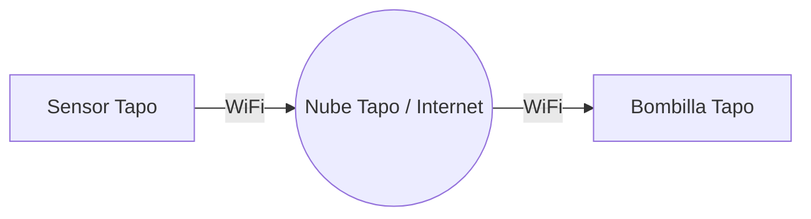

#domotica #home-assistant #iot #smart-home

> **Resumen ejecutivo:**
> 1. La domótica busca automatizar rutinas del hogar. Existen dos enfoques: usar la **nube del fabricante** (fácil, cerrado) o **Home Assistant** (control total, local, multiprotocolo).
> 2. Un **sensor mmWave** detecta presencia (incluso respiración o estando quieto), a diferencia de un sensor PIR clásico que solo detecta movimiento evidente.
> 3. Montar tu propio Home Assistant requiere hardware local (Raspberry Pi / Mini PC / ZimaBoard 2) siempre encendido, pero te independiza de internet y de marcas específicas.

---

## 1. El Dilema Inicial: ¿Cómo quiero automatizar?

Imagina que tu objetivo es simple: *"Quiero entrar en mi habitación y que la luz se encienda sola, y se apague cuando no estoy"*. 

Tienes dos caminos para lograrlo:

### Opción A: Ecosistema de Fabricante (Tapo, Aqara, Hue)

Compras todo de la misma marca y usas su aplicación oficial. La bombilla y el sensor se conectan a los servidores de esa marca en internet (la nube), y la app ejecuta la regla.



| ✅ Ventajas | ❌ Desventajas |
| :--- | :--- |
| Instalación en 5 minutos (Plug & Play). | **Dependencia de la nube:** Si te quedas sin internet, la luz no se enciende. |
| No requiere hardware adicional (solo el móvil). | **Walled Garden:** Estás atado a comprar siempre dispositivos de esa marca. |
| Inversión inicial mínima. | Es muy difícil (o imposible) mezclar marcas (ej. sensor Aqara encendiendo una luz Tapo). |

### Opción B: Home Assistant (El cerebro local)

Instalas un pequeño ordenador en tu casa que funciona como un "traductor universal". No dependes de la nube; todo ocurre dentro de tu propia red local.

```mermaid
graph LR
    S[Cualquier Sensor] -- Zigbee/WiFi --> HA[[Home Assistant<br>(Mini PC/Raspberry)]]
    HA -- Zigbee/WiFi --> B[Cualquier Bombilla]
```

| ✅ Ventajas                                                                                                                     | ❌ Desventajas                                                            |
| :----------------------------------------------------------------------------------------------------------------------------- | :----------------------------------------------------------------------- |
| **Independencia:** Funciona sin internet. Todo es local y privado.                                                             | Mayor coste inicial (necesitas comprar el Mini PC/Raspberry/ZimaBoard2). |
| **Traductor universal:** Puedes mezclar un sensor Aqara, un enchufe Sonoff, una luz de IKEA y pedirle a Alexa que lo controle. | Curva de aprendizaje más alta (requiere configuración y mantenimiento).  |
| Automatizaciones extremadamente complejas.                                                                                     | Tienes un equipo encendido 24/7.                                         |

> [!TIP] ¿Qué elegir?
> - **Para 1 o 2 habitaciones simples:** Ve por la Opción A (Tapo o Xiaomi).
> - **Si quieres aprender redes, domótica seria y mezclar marcas libremente:** Lánzate a por Home Assistant.

---

## 2. Arquitectura de Home Assistant (El Hardware)

Si te decides por Home Assistant, este es el hardware que necesitas comprar. 

### 1. El Cerebro (El Servidor)

Necesitas un ordenador encendido 24/7 que ejecute el sistema operativo de Home Assistant (HAOS). Hoy en día hay dos opciones recomendadas:

| Dispositivo                                        | Precio Aprox. | Pros y Contras                                                                                                                                                                                      |        ¿Recomendado?        |
| :------------------------------------------------- | :-----------: | :-------------------------------------------------------------------------------------------------------------------------------------------------------------------------------------------------- | :-------------------------: |
| **Raspberry Pi 4 / 5**                             |  120€ - 165€  | Consume poquísimo. **Contra:** Necesita tarjeta SD (que se acaban corrompiendo) o comprar un SSD aparte. Ha subido mucho de precio.                                                                 |         🟡 Regular          |
| **Home Assistant Green**                           |     ~100€     | Es el hardware oficial. Plug & Play, ya viene instalado. Ideal si no quieres complicarte montando piezas.                                                                                           |            🟢 Sí            |
| **Mini PC (Intel N100)**<br>*(Beelink, NiPoGi...)* |  250€ - 350€  | **El rey actual**. Trae disco duro NVMe (no falla como las SD), 16GB de RAM, muchísimo más potente que una Raspberry y su consumo eléctrico es ínfimo (6-10W).                                      |    ⭐ **La mejor opción**    |
| **Zimaboard**                                      |  200€ - 350€  | **El servidor entusiasta**. Es un híbrido entre Raspberry y Mini PC, sin ventiladores (0 ruido), con puertos PCIe expuestos para ampliarlo y diseñado específicamente para ser un servidor casero 24/7. | ⭐ **Excelente alternativa** |

### 2. El Coordinador Zigbee (El "Antenista")

Para no saturar el Wi-Fi de tu casa con 30 bombillas, la domótica profesional usa el protocolo **Zigbee** (crea una red de malla independiente). Home Assistant necesita una antena USB para hablar Zigbee.

- **Recomendación:** *Sonoff Zigbee 3.0 USB Dongle Plus* (Versión E o P).
- **Precio:** ~25€ en Amazon (~15€ en AliExpress).

---

## 3. Sensores y Actuadores (Ejemplo Habitación)

Volviendo al objetivo: *Habitación que se ilumina sola si hay alguien.*

### El Sensor: PIR vs mmWave

| Sensor PIR (Movimiento clásico) | Sensor mmWave (Presencia por radar) |
| :--- | :--- |
| Solo detecta cambios bruscos de temperatura (movimiento grande). | Usa ondas de radar milimétricas (como los radares de los coches). |
| **Problema:** Si estás sentado estudiando quieto, leyendo o en el PC, el sensor cree que te has ido y **te apaga la luz**. Tienes que levantar los brazos para que te vea. | Detecta micromovimientos: **tu respiración, el latido del corazón o teclear**. Nunca te apagará la luz mientras estés en la habitación. |
| **Precio:** Barato (~10€) | **Precio:** Más caros, pero valen la pena para habitaciones en las que pasas mucho tiempo. |

#### Opciones de compra para mmWave:

1. **Aqara FP2 (Wi-Fi):** ~80€. Es el mejor del mercado. Permite dividir la habitación en zonas (si estoy en la cama enciende luz roja, si estoy en el escritorio enciende luz blanca).
   
2. **Tuya/Moes mmWave (Zigbee):** ~30€. Más barato pero requiere el pincho Zigbee de Sonoff para hablar con Home Assistant.

### La Bombilla (Actuador)

- **Ikea TRÅDFRI (Zigbee):** ~10€. Fiables, baratas y amplían la red Zigbee.
- **Tapo L530E (Wi-Fi):** ~10€. Colores RGB, muy buenas, directas al Wi-Fi.

---

## 4. Presupuestos Estimados

### 🛒 Presupuesto "Pro" (Home Assistant Local)

Si quieres montarte el laboratorio completo, aprender y no depender de internet:

1. **Mini PC Intel N100:** ~250€
2. **Antena Sonoff Zigbee USB:** ~25€
3. **Sensor mmWave Zigbee (Tuya):** ~30€
4. **Bombilla Zigbee IKEA:** ~10€
   
**TOTAL:** **~315€** *(Pero a partir de aquí, cada habitación extra solo te cuesta 40€)*.

### 🛒 Presupuesto "Silencioso" Wi-Fi (Zimaboard sin Zigbee)

Si tienes claro que **como mucho vas a poner 2 o 3 bombillas**, no necesitas comprar la antena Zigbee. Tu router de operadora puede manejar 3 bombillas Wi-Fi sin problema. Puedes montar Home Assistant en el servidor más silencioso y usar los mejores dispositivos Wi-Fi del mercado:

1. **Zimaboard (El Servidor):** ~200€
2. **Sensor mmWave Wi-Fi (Aqara FP2):** ~80€ *(El mejor del mercado)*
3. **Bombilla Wi-Fi (Tapo L530E):** ~10€
   
**TOTAL:** **~290€** *(Ideal si quieres potencia y cero ruido, pero sin complicarte creando una red Zigbee porque tienes pocos dispositivos).*

### 🛒 Presupuesto "Fácil" (Sin Home Assistant)

Si solo quieres la habitación, todo por Wi-Fi usando la app oficial (depende de internet):

1. **Sensor Tapo Inteligente (T100, es PIR, no mmWave):** ~18€
2. **Hub Tapo H100 (Obligatorio para el sensor):** ~20€
3. **Bombilla Tapo L530E:** ~10€
   
**TOTAL:** **~48€** *(Limitado a la app de Tapo y con sensor PIR que te puede apagar la luz si estás quieto).*

> [!NOTE] Cuidado con los ecosistemas Wi-Fi
> Llenar la casa de dispositivos Wi-Fi (como 20 bombillas Tapo) puede saturar el router de tu operadora, haciendo que Netflix o tus juegos vayan mal. Por eso, a largo plazo, siempre se usa Zigbee + Home Assistant.

---

## 5. Ejemplo de Automatización Avanzada en Home Assistant

Una vez montado, la lógica gráfica en Home Assistant se ve así (sin picar código, aunque por detrás genera YAML):

```yaml
# Si la habitación detecta presencia
trigger:
  - platform: state
    entity_id: sensor.mmwave_habitacion
    to: "detected"
# Y es de noche (condición)
condition:
  - condition: time
    after: "23:00:00"
    before: "07:00:00"
# Entonces:
action:
  - service: light.turn_on
    target:
      entity_id: light.bombilla_habitacion
    data:
      brightness_pct: 15 # Enciende al 15% para no deslumbrar
      color_name: red
```

### ¿Qué hace exactamente este código?

Aunque en Home Assistant todo esto se hace arrastrando bloques de colores (como si fuera un puzzle), por debajo se genera este código YAML que es muy fácil de leer. Tiene tres partes fundamentales:

1. **`trigger` (El Gatillo):** Es lo que "despierta" la automatización. En este caso le decimos que vigile el estado (`platform: state`) del sensor de presencia de la habitación (`sensor.mmwave_habitacion`). En el milisegundo en el que ese sensor cambie su estado a "detectado" (`to: "detected"`), la regla se dispara.
   
2. **`condition` (El Filtro):** Antes de encender la luz, Home Assistant comprueba si se cumplen las condiciones. Aquí le decimos que mire el reloj (`condition: time`). Si estás entre las 11 de la noche y las 7 de la mañana, te deja pasar a la siguiente fase. Si son las 5 de la tarde, la regla se aborta aquí mismo (no hace falta luz).
   
3. **`action` (La Acción):** Es lo que ocurre al final. Llama al servicio de "encender luz" (`light.turn_on`) apuntando a tu bombilla específica (`light.bombilla_habitacion`). Y le pasa dos datos clave (`data`): que se encienda solo al 15% de brillo (`brightness_pct: 15`) y en color rojo (`color_name: red`) para no dejarte ciego y no cortarte el sueño cuando vas al baño de madrugada.

---

## 6. El Flujo Completo: Cómo se une todo físicamente

Para que te hagas una imagen mental clara de cómo funciona el montaje, este es el camino físico que recorre la información:

1. **Zimaboard (El Hierro):** Es la placa base física. La enchufas a la corriente y la conectas con un cable de red directo a tu router para que tenga la máxima velocidad y estabilidad.
   
2. **Home Assistant (El Cerebro):** Es el sistema operativo (software) que instalas dentro de la Zimaboard. Se encarga de procesar todo 24 horas al día.
   
3. **El Sensor mmWave (El Ojo):** Está pegado a la pared o al techo de tu habitación. Por dentro tiene un radar buscando presencia. Cuando entras, el sensor manda una señal inalámbrica por el Wi-Fi de tu casa que viaja hasta el router, y el router se la pasa por el cable a la Zimaboard.
   
4. **La Lógica:** Home Assistant recibe el aviso *"¡Hay alguien!"*. Revisa el reloj (YAML), ve que son las 23:30h, y decide que hay que encender la luz en rojo.
   
5. **La Bombilla (El Músculo):** Home Assistant manda la orden de vuelta por el cable al router, el router la emite por Wi-Fi, y la bombilla inteligente la recibe y se enciende al 15% en color rojo.

Todo este viaje (Sensor → Router → Zimaboard/HA → Router → Bombilla) **ocurre en menos de 100 milisegundos**. Tú pisas la habitación y la luz ya está encendida.
