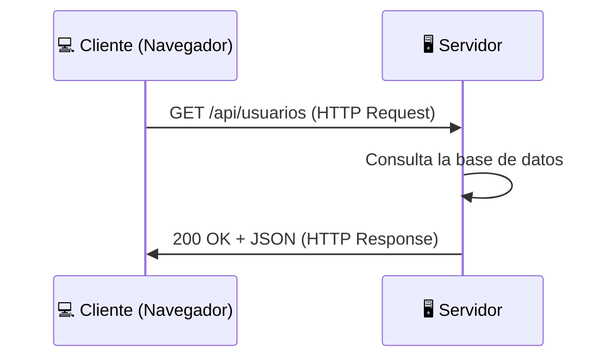

#programacion #fundamentos #poo #algoritmos #solid #llm #ia #conceptos-esenciales

> [!info] Navegación
> 📂 Carpeta: [[📂Programación|Programación]] | 🔗 Relacionado: [[📂Desarrollo con IA/📂Curso - El Nuevo Programador/01 - El Nuevo Programador y Fundamentos de LLM|El Nuevo Programador]]

---

# Todos los Conceptos de Programación Esenciales

Una guía de referencia rápida que cubre desde los fundamentos más básicos hasta los paradigmas avanzados y los conceptos de Inteligencia Artificial. Cada concepto explicado de forma clara, directa y con ejemplos reales.

---

## 🧱 Los Ladrillos Fundamentales

### Datos y Variables

- **Dato:** La unidad mínima de información. Un número, una letra, un valor booleano.
- **Variable:** Un contenedor con nombre que almacena un dato que puede cambiar.
- **Constante:** Como una variable pero su valor nunca cambia tras su definición.

```python
# Variable (puede cambiar)
edad = 25
edad = 26  # válido

# Constante (convención: mayúsculas)
PI = 3.14159
```

### Tipos de Datos Básicos

| Tipo | Descripción | Ejemplo |
|---|---|---|
| **String** | Texto (cadena de caracteres) | `"Hola Mundo"` |
| **Integer** | Número entero | `42`, `-7` |
| **Float** | Número decimal | `3.14`, `-0.001` |
| **Boolean** | Verdadero o Falso | `True`, `False` |
| **Null/None** | Ausencia de valor | `None`, `null` |

### Operadores

```python
# Aritméticos
5 + 3   # Suma = 8
10 % 3  # Módulo (resto) = 1

# Comparación (devuelven Boolean)
5 > 3   # True
5 == 5  # True (igual a)
5 != 3  # True (distinto de)

# Lógicos
True and False  # False
True or False   # True
not True        # False
```

---

## 🗃️ Estructuras de Datos

### Arrays / Listas

Colección **ordenada** de elementos del mismo tipo (o no, en lenguajes dinámicos). El acceso es por **índice** (empieza en 0).

```python
frutas = ["manzana", "pera", "naranja"]
frutas[0]  # "manzana"
frutas[-1] # "naranja" (el último)
```

### Diccionarios / Mapas (Hash Maps)

Colección de pares **clave: valor**. El acceso es por clave, no por índice. Búsqueda en O(1) promedio.

```python
persona = {
    "nombre": "Izar",
    "edad": 20,
    "ciudad": "Madrid"
}
persona["nombre"]  # "Izar"
```

---

## 🔀 Control de Flujo

### Condicionales

```python
if temperatura > 30:
    print("Hace calor")
elif temperatura > 20:
    print("Temperatura agradable")
else:
    print("Hace frío")
```

### Bucles

```python
# For: cuando sabes cuántas iteraciones
for i in range(5):          # 0, 1, 2, 3, 4
    print(i)

# While: cuando no sabes cuántas iteraciones
while usuario_conectado:
    procesar_eventos()
```

---

## 🔧 Funciones — Modularización

Una función es un bloque de código reutilizable con nombre. Encapsula una lógica para no repetirla.

```python
def calcular_iva(precio: float, porcentaje: float = 21.0) -> float:
    """
    Calcula el precio con IVA incluido.
    
    Args:
        precio: Precio base sin IVA.
        porcentaje: Porcentaje de IVA (por defecto 21%).
    
    Returns:
        Precio final con IVA.
    """
    return precio * (1 + porcentaje / 100)

# Uso
precio_final = calcular_iva(100)       # 121.0
precio_final = calcular_iva(100, 10)   # 110.0
```

### Scope (Ámbito)

```python
x = "global"  # Variable global

def mi_funcion():
    x = "local"   # Variable local, solo existe dentro de la función
    print(x)      # "local"

mi_funcion()
print(x)  # "global" — la variable global no cambió
```

### Recursividad

Una función que **se llama a sí misma** para resolver un problema dividiéndolo en subproblemas más pequeños.

```python
def factorial(n: int) -> int:
    if n <= 1:          # Caso base (condición de parada)
        return 1
    return n * factorial(n - 1)  # Llamada recursiva

factorial(5)  # 5 * 4 * 3 * 2 * 1 = 120
```

> [!warning] Cuidado con la recursividad sin caso base
> Una función recursiva sin condición de parada entra en bucle infinito y colapsa el programa con un `StackOverflowError` o `RecursionError`.

---

## 🏛️ Programación Orientada a Objetos (POO)

### Los 4 Pilares

> [!note] Los 4 pilares de la POO
>
> **1. Abstracción:** Ocultar la complejidad interna y exponer solo lo necesario. El usuario de una clase no necesita saber cómo funciona internamente.
>
> **2. Encapsulamiento:** Los datos internos de un objeto están protegidos. Solo se accede a ellos a través de métodos definidos (getters/setters). Evita que código externo corrompa el estado interno.
>
> **3. Herencia:** Una clase puede heredar atributos y métodos de otra clase "padre". Evita duplicar código.
>
> **4. Polimorfismo:** Objetos de distintas clases pueden responder al mismo mensaje de formas diferentes. `animal.hablar()` devuelve "Guau" para un Perro y "Miau" para un Gato.

```python
class Animal:
    def __init__(self, nombre: str):
        self.nombre = nombre  # Atributo encapsulado

    def hablar(self) -> str:
        raise NotImplementedError  # Abstracción: obliga a implementar en subclases

class Perro(Animal):  # Herencia
    def hablar(self) -> str:
        return f"{self.nombre} dice: ¡Guau!"  # Polimorfismo

class Gato(Animal):
    def hablar(self) -> str:
        return f"{self.nombre} dice: ¡Miau!"

# Polimorfismo en acción
animales = [Perro("Rex"), Gato("Whiskers")]
for animal in animales:
    print(animal.hablar())  # Cada uno responde diferente al mismo mensaje
```

---

## ⚡ Concurrencia y Paralelismo

> [!note] Concurrencia vs. Paralelismo — Una distinción crítica
>
> - **Concurrencia:** Múltiples tareas **progresan** (se intercalan) en el mismo intervalo de tiempo, pero no necesariamente al mismo instante. Un solo núcleo puede ser concurrente.
>
> - **Paralelismo:** Múltiples tareas se ejecutan **exactamente al mismo instante**. Requiere múltiples núcleos o procesadores.

- **Hilo (Thread):** La unidad mínima de ejecución dentro de un proceso. Comparte memoria con otros hilos del mismo proceso.
- **Proceso:** Un programa en ejecución con su propio espacio de memoria aislado.
- **`ExecutorService` / `ThreadPool`:** Gestores de grupos de hilos reutilizables para evitar el overhead de crear/destruir hilos continuamente.

---

## 📐 Principios de Calidad de Software

### SOLID

Los 5 principios fundamentales de diseño orientado a objetos:

| Letra | Principio | En una frase |
|---|---|---|
| **S** | Single Responsibility | Una clase = una responsabilidad |
| **O** | Open/Closed | Abierto para extensión, cerrado para modificación |
| **L** | Liskov Substitution | Las subclases deben ser intercambiables con su clase padre |
| **I** | Interface Segregation | Interfaces específicas mejor que una interfaz general |
| **D** | Dependency Inversion | Depende de abstracciones, no de implementaciones concretas |

### DRY — Don't Repeat Yourself

Si copias y pegas código, algo va mal. Extrae la lógica repetida en una función o clase.

> [!tip] La regla de las 3 veces
> La primera vez: escríbelo directamente. La segunda vez: nota la repetición. La tercera vez: **refactoriza**.

### Notación Big O — Complejidad Algorítmica

Mide cómo escala el tiempo de ejecución de un algoritmo con el tamaño de la entrada `n`.

| Notación | Nombre | Ejemplo |
|---|---|---|
| **O(1)** | Constante | Acceso a un array por índice |
| **O(log n)** | Logarítmica | Búsqueda binaria |
| **O(n)** | Lineal | Recorrer una lista |
| **O(n log n)** | Lineal-logarítmica | Mergesort, Quicksort |
| **O(n²)** | Cuadrática | Bucle doble anidado |
| **O(2ⁿ)** | Exponencial | Fuerza bruta de contraseñas |

---

## 🤖 Conceptos de Inteligencia Artificial y LLMs

### Machine Learning y Deep Learning

- **Machine Learning:** Algoritmos que aprenden patrones a partir de datos sin ser programados explícitamente para cada caso.
- **Deep Learning:** ML con redes neuronales artificiales de múltiples capas (profundas). Dominan en visión computacional, NLP e IA generativa.

### LLMs y Conceptos Clave

> [!note] Glosario de IA para desarrolladores
>
> - **LLM (Large Language Model):** Modelo de lenguaje masivo entrenado sobre enormes corpus de texto. Predice el siguiente token dado un contexto.
> - **Token:** La unidad mínima de texto que procesa un LLM (~¾ de una palabra en inglés). "Hola mundo" = 2-3 tokens.
> - **Ventana de Contexto:** La cantidad máxima de tokens que el modelo puede "ver" a la vez. Todo lo que quede fuera se olvida.
> - **Prompt:** El texto de instrucción/consulta que envías al modelo.
> - **Alucinación:** Cuando el modelo genera información plausible pero **incorrecta o inventada** con total confianza.
> - **Temperatura:** Controla la aleatoriedad de las respuestas. 0 = determinista/conservador, 2 = muy creativo/caótico.

### Embeddings y Bases de Datos Vectoriales

- **Embedding:** Representación numérica (vector) de texto o imagen en un espacio matemático de alta dimensión. Textos semánticamente similares tienen vectores similares.
- **Base de Datos Vectorial:** Almacén especializado en búsqueda por similitud de vectores (ej: Pinecone, ChromaDB, Weaviate, pgvector).

### RAG — Retrieval-Augmented Generation

> [!note] ¿Qué es RAG?
> El problema: un LLM tiene conocimiento estático hasta su fecha de corte. RAG resuelve esto **recuperando documentos relevantes de una base de datos externa** (búsqueda vectorial) y añadiéndolos al contexto del modelo antes de generar la respuesta.
>
> **Resultado:** El LLM responde con información actualizada y específica de tu dominio, sin necesidad de reentrenar el modelo.

### Fine-Tuning

Reentrenar un modelo base con un dataset específico para especializarlo en una tarea o dominio concreto. Mucho más costoso que RAG pero puede lograr comportamientos que RAG no puede.

### Agentes IA con Human-in-the-Loop

Un **agente IA** es un LLM con capacidad de usar herramientas (buscar en internet, ejecutar código, leer archivos, llamar APIs) para completar tareas de forma autónoma.

**Human-in-the-Loop (HITL):** Un humano supervisa y aprueba las acciones del agente en puntos críticos del flujo, manteniendo el control sobre decisiones irreversibles.

→ Ver: [[📂Desarrollo con IA/📂Curso - El Nuevo Programador/00 - MOC Curso Desarrollo con IA|Curso: El Nuevo Programador]] para el desarrollo práctico con agentes.

---

## 🌐 Arquitectura de Software

### Modelo Cliente-Servidor y HTTP



- **CRUD:** Las 4 operaciones básicas sobre datos: **C**reate (POST) / **R**ead (GET) / **U**pdate (PUT/PATCH) / **D**elete (DELETE)
- **REST API:** Interfaz HTTP que expone recursos de forma estandarizada y stateless.
- **JSON:** El formato de intercambio de datos universal entre servicios web.

### SQL vs NoSQL

| | SQL (Relacional) | NoSQL (No Relacional) |
|---|---|---|
| **Estructura** | Tablas con esquema fijo | Flexible (documentos, grafos, clave-valor) |
| **Relaciones** | JOINs entre tablas | Desnormalización o referencias manuales |
| **Escalado** | Vertical (más hardware) | Horizontal (más servidores) |
| **Ideal para** | Datos estructurados, transacciones ACID | Datos variables, escala masiva, tiempo real |
| **Ejemplos** | PostgreSQL, MySQL, SQLite | MongoDB, Redis, Cassandra, DynamoDB |
