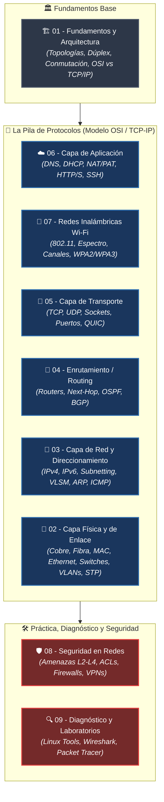

---
tags:
  - redes
  - moc
  - dashboard
  - indice
  - ccna
  - networking
  - ciberseguridad
folder: "📂00 - Dashboard y Mapeo"
aliases:
  - "Índice Maestro de Redes"
  - "MOC Redes Informáticas"
  - "Dashboard Redes"
date: 2026-09-07
---

# 🌐 00 - Índice Maestro de Redes Informáticas

> [!abstract] 🧠 Tu Centro de Mando y Mapa de Contenido (MOC)
> ¡Te damos la bienvenida al mapa interactivo de **Redes Informáticas desde Cero**! 
> Esta bóveda está diseñada con un **enfoque pedagógico ascendente (bottom-up)**: partimos de cómo los electrones y pulsos de luz viajan por cables y antenas, escalamos capa a capa por los modelos OSI y TCP/IP hasta los servicios en la nube, y culminamos con defensas perimetrales, auditorías de tráfico y laboratorios prácticos.
> 
> Cada nota combina **rigor técnico de nivel Cisco CCNA**, **perspectiva ofensiva/defensiva de Ciberseguridad (Pentesting)** y **analogías cotidianas** para que ningún concepto quede en el aire.

---

## 🗺️ Mapa de Navegación por Capas (Arquitectura Global)

---

## 📚 Mapa de Contenido Detallado

### 🟢 Bloque 1: Fundamentos y Arquitectura de Redes
*El punto de partida: qué es una red, cómo se estructura y los modelos que rigen las telecomunicaciones.*

| # | Tema | Nota | Descripción en una línea |
|:---:|:---|:---|:---|
| **01.1** | **Introducción a las Redes** | [[01.1 - Introducción a las Redes Informáticas]] | Propósito de las redes, escalas geográficas (PAN a WAN) y topologías físicas vs lógicas explicadas con mapas urbanos. |
| **01.2** | **Principios de Comunicación** | [[01.2 - Principios de Comunicación y Rendimiento]] | Modos dúplex, conmutación de circuitos vs paquetes y métricas críticas de rendimiento (ancho de banda, latencia, jitter y pérdida). |
| **01.3** | **Modelos de Referencia** | [[01.3 - Modelos de Referencia (OSI vs TCP-IP y Encapsulación)]] | Comparativa entre las 7 capas de OSI y las 4 de TCP/IP, y el viaje de empaquetado de las PDUs (Datos, Segmento, Paquete, Trama, Bits). |

---

### 🔵 Bloque 2: Capa Física y de Enlace (Capas 1 y 2 OSI)
*Cómo se transmiten las señales y cómo se comunican los equipos dentro de la misma red local (LAN).*

| # | Tema | Nota | Descripción en una línea |
|:---:|:---|:---|:---|
| **02.1** | **Medios de Transmisión** | [[02.1 - Medios de Transmisión y Capa Física]] | Cables de par trenzado UTP/STP, código de colores T568A/B, fibra monomodo vs multimodo y espectro electromagnético. |
| **02.2** | **Protocolos y Dispositivos L2** | [[02.2 - Protocolos y Dispositivos de Enlace (Ethernet, MAC y CSMA)]] | El estándar Ethernet 802.3, anatomía de la dirección MAC, estructura de la trama y arbitraje del medio (CSMA/CD y CSMA/CA). |
| **02.3** | **Conmutación y Redes Locales** | [[02.3 - Conmutación, Switches, VLANs y Spanning Tree (STP)]] | Aprendizaje de switches y tabla CAM, segmentación lógica con VLANs (802.1Q) y prevención de bucles de broadcast con STP. |

---

### 🟡 Bloque 3: Capa de Red y Direccionamiento (Capa 3 OSI)
*El núcleo de Internet: cómo viajan los paquetes entre redes distintas a nivel global.*

| # | Tema | Nota | Descripción en una línea |
|:---:|:---|:---|:---|
| **03.1** | **Protocolo IP e IPv4** | [[03.1 - Protocolo IP y Direccionamiento IPv4]] | Cabecera IPv4 (TTL, flags), direccionamiento público vs privado (RFC 1918) y rangos reservados (Loopback, APIPA, Multicast). |
| **03.2** | **Subnetting y VLSM** | [[03.2 - Subnetting y VLSM (Cálculo Práctico de Subredes)]] | Álgebra booleana aplicada a máscaras de red, notación CIDR, cálculo rápido FLSM y diseño eficiente de subredes con VLSM. |
| **03.3** | **Protocolo IPv6** | [[03.3 - Protocolo IPv6 (Estructura, Tipos y Autoconfiguración)]] | Estructura hexadecimal de 128 bits, reglas de simplificación, tipos de direcciones (GUA, Link-Local) y autoconfiguración SLAAC vs DHCPv6. |
| **03.4** | **Protocolos de Soporte L3** | [[03.4 - Protocolos de Soporte en Capa 3 (ARP e ICMP)]] | Resolución IP a MAC mediante ARP (con su riesgo de envenenamiento) y mensajes de diagnóstico y control con ICMP (`ping`/`traceroute`). |

---

### 🟠 Bloque 4: Enrutamiento (Routing - Nivel Intermedio)
*La toma de decisiones de los routers para encontrar el mejor camino a través del mundo interconectado.*

| # | Tema | Nota | Descripción en una línea |
|:---:|:---|:---|:---|
| **04.1** | **Fundamentos de Routers** | [[04.1 - Fundamentos de Routers y Enrutamiento Estático]] | Anatomía de la tabla de rutas, concepto de siguiente salto (Next-Hop), Gateway predeterminado y enrutamiento Router-on-a-Stick. |
| **04.2** | **Enrutamiento Dinámico** | [[04.2 - Protocolos de Enrutamiento Dinámico (RIP, OSPF y BGP)]] | Distancia Administrativa y métricas, algoritmo Dijkstra en OSPF (Área 0, LSDB) y cómo el protocolo BGP conecta los Sistemas Autónomos. |

---

### 🟣 Bloque 5: Capa de Transporte (Capa 4 OSI)
*Garantizar la entrega de datos de extremo a extremo entre procesos y aplicaciones.*

| # | Tema | Nota | Descripción en una línea |
|:---:|:---|:---|:---|
| **05.1** | **Conceptos de Capa 4** | [[05.1 - Conceptos de Capa 4 (Puertos, Sockets y Multiplexación)]] | Multiplexación de aplicaciones mediante puertos (0 a 65535: Well-known, Registered, Ephemeral) y la anatomía de un Socket (IP:Puerto). |
| **05.2** | **Protocolo TCP** | [[05.2 - Protocolo TCP (3-Way Handshake, Flujo y Confiabilidad)]] | Fiabilidad absoluta orientada a conexión, negociación SYN/SYN-ACK/ACK, control de flujo con ventana deslizante y cierre de sesión. |
| **05.3** | **Protocolo UDP** | [[05.3 - Protocolo UDP (Datagramas, Rendimiento y QUIC)]] | Transporte ligero y ultrarrápido sin conexión para audio/video en tiempo real, juegos, DNS y la revolución moderna de QUIC / HTTP/3. |
| **05.4** | **Comparativa y Evolución** | [[05.4 - Comparativa TCP vs UDP y Evolución Moderna]] | Tabla comparativa definitiva entre fiabilidad y velocidad, con análisis de casos prácticos en producción e impacto en ciberseguridad. |

---

### 🔴 Bloque 6: Capa de Aplicación y Servicios de Red
*Los servicios fundamentales que dotan de utilidad real a la red para usuarios y sistemas.*

| # | Tema | Nota | Descripción en una línea |
|:---:|:---|:---|:---|
| **06.1** | **Servicio DNS** | [[06.1 - DNS (Domain Name System - Jerarquía, Consultas y Registros)]] | La libreta de teléfonos de Internet: jerarquía (Root, TLD, autoritativo), resolución iterativa vs recursiva y registros (A, AAAA, CNAME, MX, TXT). |
| **06.2** | **Servicio DHCP** | [[06.2 - DHCP (Dynamic Host Configuration Protocol y Proceso DORA)]] | Asignación automática de IP, máscara y DNS mediante el ciclo DORA (Discover, Offer, Request, Ack) y el agente DHCP Relay. |
| **06.3** | **NAT, PAT y CGNAT** | [[06.3 - NAT, PAT y CGNAT (Traducción de Direcciones de Red)]] | Cómo conviven millones de dispositivos con una sola IP pública mediante sobrecarga de puertos (PAT), NAT estático y los límites de CGNAT. |
| **06.4** | **Protocolos de Aplicación** | [[06.4 - Protocolos de Aplicación Comunes (HTTP-S, SSH, FTP, Correo y Gestión)]] | Funcionamiento de la web (HTTP/S), gestión remota segura (SSH vs Telnet), transferencia de archivos, correo (SMTP/IMAP) y monitorización (SNMP/NTP). |

---

### 🟤 Bloque 7: Redes Inalámbricas (Wi-Fi)
*El medio no guiado: transmisión por el aire, frecuencias y protección en entornos modernos.*

| # | Tema | Nota | Descripción en una línea |
|:---:|:---|:---|:---|
| **07.1** | **Estándares IEEE 802.11** | [[07.1 - Estándares IEEE 802.11 (De Wi-Fi 4 a Wi-Fi 7)]] | Evolución de velocidades y modulaciones desde 802.11b hasta Wi-Fi 6/6E y Wi-Fi 7 (OFDMA, MU-MIMO, modulación 4096-QAM). |
| **07.2** | **Frecuencias, Canales y Celdas** | [[07.2 - Frecuencias, Canales, Celdas y Roaming]] | Bandas de 2.4 GHz, 5 GHz y 6 GHz, canales no solapados, planificación de anchos de canal y movilidad entre puntos de acceso (BSSID/ESSID). |
| **07.3** | **Seguridad Inalámbrica** | [[07.3 - Seguridad en Redes Inalámbricas (WPA2, WPA3 y Enterprise)]] | Del declive de WEP/WPA al 4-Way Handshake en WPA2-PSK, defensa anti-diccionario con WPA3-SAE y autenticación corporativa 802.1X/RADIUS. |

---

### ⚫ Bloque 8: Seguridad Básica e Intermedia en Redes
*Protección de perímetros, análisis de vectores de ataque y securización del tráfico.*

| # | Tema | Nota | Descripción en una línea |
|:---:|:---|:---|:---|
| **08.1** | **Amenazas Comunes en Redes** | [[08.1 - Amenazas Comunes en Redes (Ataques Capas 2, 3 y 4)]] | Anatomía y mitigación de ataques reales: ARP Poisoning, inundación CAM, DHCP Starvation, IP Spoofing, SYN Flood y Man-in-the-Middle. |
| **08.2** | **Mecanismos de Protección** | [[08.2 - Mecanismos de Protección y Filtrado (ACLs, Firewalls y Zonas)]] | Listas de Control de Acceso (ACLs estándar y extendidas), firewalls Stateless vs Stateful, inspección profunda NGFW y diseño de zonas DMZ. |
| **08.3** | **VPNs (Redes Privadas Virtuales)**| [[08.3 - VPNs (Redes Privadas Virtuales, IPsec y WireGuard)]] | Criptografía aplicada al tráfico: túneles Site-to-Site vs Remote Access, análisis de IPsec (IKEv2, ESP), OpenVPN y la agilidad de WireGuard. |

---

### ⚪ Bloque 9: Diagnóstico, Monitorización y Laboratorio Práctico
*La caja de herramientas indispensable: dominar la terminal, capturar paquetes y simular infraestructuras.*

| # | Tema | Nota | Descripción en una línea |
|:---:|:---|:---|:---|
| **09.1** | **Comandos Esenciales** | [[09.1 - Comandos Esenciales de Diagnóstico de Red (Linux y Windows)]] | Guía práctica de comandos para terminal: `ip`, `ss`, `ping`, `traceroute`/`tracert`, `dig`, `nslookup`, `arp` y `route` con ejemplos listos para copiar. |
| **09.2** | **Análisis con Wireshark** | [[09.2 - Análisis de Tráfico de Red con Wireshark y Tcpdump]] | Captura e inspección en vivo de paquetes, sintaxis de filtros de visualización (BPF vs display filters) y disección práctica de flujos TCP/DNS/ARP. |
| **09.3** | **Laboratorios de Simulación** | [[09.3 - Entornos de Simulación y Laboratorio (Packet Tracer, GNS3 y EVE-NG)]] | Cómo desplegar topologías de práctica y laboratorios de prueba para certificaciones Cisco CCNA y escenarios de Red Team / Blue Team. |

---

## 🧭 ¿Cómo estudiar y navegar esta bóveda?

> [!tip] 💡 Tres rutas de aprendizaje según tu objetivo
> 
> 1. **Ruta "Desde Cero" a CCNA (Recomendada)**: 
>    Sigue el orden numérico estricto del Bloque 01 al Bloque 09. Cada nota construye sobre la base de la anterior y te prepara para razonar la red de abajo hacia arriba.
> 
> 2. **Ruta Ciberseguridad y Pentesting**:
>    Empieza por [[01.3 - Modelos de Referencia (OSI vs TCP-IP y Encapsulación)]], domina [[02.2 - Protocolos y Dispositivos de Enlace (Ethernet, MAC y CSMA)]] y [[03.4 - Protocolos de Soporte en Capa 3 (ARP e ICMP)]], y salta directamente al [[08.1 - Amenazas Comunes en Redes (Ataques Capas 2, 3 y 4)]] y [[09.2 - Análisis de Tráfico de Red con Wireshark y Tcpdump]].
> 
> 3. **Ruta Sysadmin / DevOps / Troubleshooting**:
>    Dirígete a los bloques de transporte y servicios: [[05.1 - Conceptos de Capa 4 (Puertos, Sockets y Multiplexación)]], [[06.1 - DNS (Domain Name System - Jerarquía, Consultas y Registros)]], [[06.3 - NAT, PAT y CGNAT (Traducción de Direcciones de Red)]] y la caja de herramientas de [[09.1 - Comandos Esenciales de Diagnóstico de Red (Linux y Windows)]].

---

## 🏷️ La Regla de Oro de la Documentación en Redes

> [!brain] 🔬 Por cada protocolo documentado en tus notas, encontrarás:
> 1. **Capa OSI/TCP-IP** en la que opera.
> 2. **PDU que manipula** (Bits, Tramas, Paquetes, Segmentos o Datos).
> 3. **Analogía de la vida real** para anclar el concepto intuitivamente.
> 4. **Comando de terminal Linux** para inspeccionarlo en vivo.
> 5. **Perspectiva de Ciberseguridad**: qué riesgos entraña y cómo protegerlo o auditarlo.

---

## 📦 Glosario Visual Rápido de Acrónimos de Red

| Acrónimo | Nombre Completo en Inglés | Significado en Castellano | Capa Principal |
|:---|:---|:---|:---:|
| **LAN** | Local Area Network | Red de Área Local | Capas 1-2 |
| **WAN** | Wide Area Network | Red de Área Amplia (Interconexión global) | Capas 1-3 |
| **MAC** | Media Access Control | Dirección física de 48 bits grabada en la NIC | Capa 2 |
| **VLAN** | Virtual Local Area Network | Red de Área Local Virtual (Segmentación lógica) | Capa 2 |
| **STP** | Spanning Tree Protocol | Protocolo para evitar bucles en conmutación | Capa 2 |
| **MTU** | Maximum Transmission Unit | Tamaño máximo de paquete sin fragmentar (1500 bytes en Ethernet) | Capa 2/3 |
| **CIDR** | Classless Inter-Domain Routing | Enrutamiento y máscaras sin clase (notación `/24`) | Capa 3 |
| **ARP** | Address Resolution Protocol | Resolución de direcciones IP a direcciones MAC | Capa 2/3 |
| **ICMP** | Internet Control Message Protocol | Mensajes de control, error y diagnóstico (`ping`) | Capa 3 |
| **TTL** | Time To Live | Límite de saltos de un paquete IP para evitar bucles | Capa 3 |
| **OSPF** | Open Shortest Path First | Protocolo de enrutamiento dinámico por estado de enlace | Capa 3 |
| **BGP** | Border Gateway Protocol | Protocolo de enrutamiento entre Sistemas Autónomos | Capa 3/4 |
| **TCP** | Transmission Control Protocol | Protocolo de transporte confiable orientado a conexión | Capa 4 |
| **UDP** | User Datagram Protocol | Protocolo de transporte no orientado a conexión y veloz | Capa 4 |
| **MSS** | Maximum Segment Size | Carga útil máxima que cabe en un segmento TCP (típicamente 1460 bytes) | Capa 4 |
| **DNS** | Domain Name System | Sistema de resolución de nombres de dominio a direcciones IP | Capa 7 |
| **DHCP** | Dynamic Host Configuration Protocol | Asignación automática de configuración IP a clientes | Capa 7 |
| **NAT/PAT** | Network/Port Address Translation | Traducción de direcciones IP y puertos privados a públicos | Capa 3/4 |
| **WPA** | Wi-Fi Protected Access | Estándar de cifrado y autenticación para redes Wi-Fi | Capa 2 |
| **ACL** | Access Control List | Lista de reglas de filtrado de tráfico por IPs y puertos | Capas 3-4 |
| **VPN** | Virtual Private Network | Conexión segura y cifrada a través de una red pública | Capas 3-4 |
