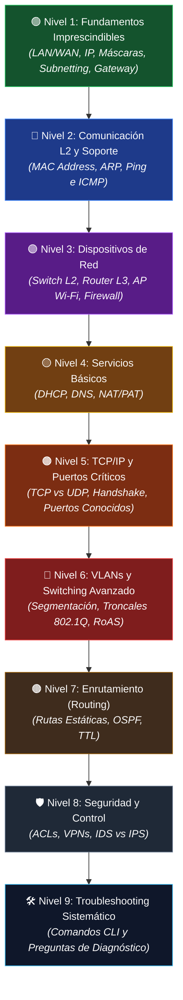

**Tags:** #redes #fundamentos #ccna #troubleshooting #networking #cheat-sheet #sysadmin #helpdesk

> [!abstract] 🧭 Propósito de esta Guía de Conceptos (Niveles 1 al 9)
> Esta nota sintetiza los **fundamentos imprescindibles y habilidades operativas de redes** estructurados en **9 niveles progresivos**, desde qué ocurre cuando un paquete sale de un ordenador hasta el diagnóstico avanzado de incidencias en entornos empresariales.
> 
> Dominar estos 9 niveles constituye el conocimiento estándar requerido para perfiles de **Helpdesk Avanzado, Soporte IT N2, Administrador Junior de Sistemas (Sysadmin) y Administrador Junior de Redes**, sirviendo de puente directo hacia certificaciones como **Cisco CCNA** o especializaciones en **Ciberseguridad y Cloud Networking**.

---

---

## 🟢 Nivel 1: Fundamentos Imprescindibles

### 1. ¿Qué es una red y cómo viajan los datos?

Una red informática es un conjunto de dispositivos interconectados que comparten recursos e información mediante protocolos estandarizados.

* **LAN (Local Area Network):** Red de área local (un hogar, una oficina, un edificio). Alta velocidad y administración privada.
* **WAN (Wide Area Network):** Red de área amplia que interconecta ciudades o países. El mayor ejemplo es Internet.
* **Internet:** Red pública global descentralizada de redes interconectadas mediante el protocolo IP y enrutamiento BGP.
* **Intranet:** Red privada interna de una organización a la que solo tienen acceso empleados autorizados.

> [!important] Flujo Básico de Salida a Internet
> Todo técnico de sistemas debe memorizar el flujo físico y lógico de un paquete doméstico o corporativo:
> $$\text{PC / Dispositivo Final} \longrightarrow \text{Switch (Capa 2)} \longrightarrow \text{Router / Default Gateway (Capa 3)} \longrightarrow \text{ISP / Internet}$$

*Nota detallada en:* [[🌐 01.1 - Introducción a las Redes Informáticas]]

---

### 2. Direcciones IP (IPv4)

Una dirección IPv4 es un identificador lógico de **32 bits** expresado en 4 octetos decimales separados por puntos (ejemplo: `192.168.1.10`).

* **IP Pública:** Dirección única y enrutable en todo Internet, asignada por el proveedor (ISP).
* **IP Privada:** Dirección reservada exclusivamente para redes locales internas (no enrutable en Internet).
* **Rangos Privados Reservados (RFC 1918):**
  * **Clase A:** `10.0.0.0/8` (`10.0.0.0` a `10.255.255.255`) ➔ Millones de hosts (grandes corporaciones).
  * **Clase B:** `172.16.0.0/12` (`172.16.0.0` a `172.31.255.255`) ➔ Redes medianas y centros educativos.
  * **Clase C:** `192.168.0.0/16` (`192.168.0.0` a `192.168.255.255`) ➔ Redes domésticas y pymes.

*Nota detallada en:* [[🌐 03.1 - Protocolo IP y Direccionamiento IPv4]]

---

### 3. Máscaras de Red y Subnetting Práctico

La máscara de red delimita qué parte de la IP identifica a la **Red** y qué parte a los **Hosts** (equipos). En la actualidad se expresa mediante notación **CIDR** (`/prefijo`).

> [!example] Ejercicio Clave: Resolver `192.168.1.73/27`
> Una máscara `/27` significa 27 bits a `1` y 5 bits a `0`: `255.255.255.224`.
> 
> * **Tamaño de salto de bloque:** $256 - 224 = 32$.
> * **Redes posibles:** `.0`, `.32`, `.64`, `.96`...
> * La IP `.73` cae en el rango del bloque que empieza en **`.64`**:
>   * **Dirección de Red:** `192.168.1.64` (primer valor del bloque, no asignable a host).
>   * **Primera IP útil:** `192.168.1.65` (siguiente a la red).
>   * **Última IP útil:** `192.168.1.94` (anterior al broadcast).
>   * **Dirección de Broadcast:** `192.168.1.95` (último valor del bloque, reservado para difusión).
>   * **Hosts útiles:** $2^{5} - 2 = 32 - 2 = \mathbf{30 \text{ hosts}}$.

*Nota detallada en:* [[🧮 03.2 - Subnetting y VLSM (Cálculo Práctico de Subredes)]]

---

### 4. Default Gateway (Puerta de Enlace)

El Gateway es la IP de la interfaz del router que conecta con la red local del host.

* **Si el destino está en mi misma subred:** El host envía el tráfico **directamente** al equipo destino mediante su dirección MAC (usando ARP).
* **Si el destino está en otra subred o en Internet:** El host entrega el paquete a la dirección MAC del **Default Gateway**, y este se encarga de enrutarlo hacia el destino.

---

## 🔵 Nivel 2: Cómo se Comunican los Equipos (Capa de Enlace y Soporte)

### 5. Dirección MAC (Media Access Control)

Identificador físico único de **48 bits** (6 pares hexadecimales, ej: `00:11:22:33:44:55`) grabado por el fabricante en la tarjeta de red (NIC).

* **OUI (Organizationally Unique Identifier):** Los primeros 3 bytes identifican al fabricante (Cisco, Intel, Realtek).
* **NIC Specific:** Los últimos 3 bytes identifican al chip individual.
* **Diferencia con IP:** La MAC es la identidad física local (no cambia al mover el equipo). La IP es la ubicación lógica enrutable (cambia según la red a la que te conectes).

*Nota detallada en:* [[🔗 02.2 - Protocolos y Dispositivos de Enlace (Ethernet, MAC y CSMA)]]

---

### 6. Protocolo ARP (Address Resolution Protocol)

ARP es el puente entre Capa 3 (IP) y Capa 2 (MAC). Permite responder a la pregunta: *"Conozco la IP a la que quiero hablar, pero ¿cuál es su dirección MAC para meterla en la trama Ethernet?"*.

1. **ARP Request:** Difusión en broadcast (`FF:FF:FF:FF:FF:FF`): *"¿Quién tiene la IP 192.168.1.1? ¡Dígaselo a 192.168.1.10!"*.
2. **ARP Reply:** El dueño de esa IP responde por unicast: *"Yo tengo esa IP y mi MAC es 00:11:22:33:44:55"*.
3. **Caché ARP:** El emisor almacena esa relación en su tabla ARP local (`arp -a`).

*Nota detallada en:* [[🛠️ 03.4 - Protocolos de Soporte en Capa 3 (ARP e ICMP)]]

---

### 7. Ping e ICMP (Internet Control Message Protocol)

ICMP es el protocolo de diagnóstico de Capa 3. La utilidad `ping` envía paquetes de prueba para verificar conectividad y medir la latencia de ida y vuelta (RTT):

* **ICMP Type 8 (Echo Request):** Mensaje de solicitud de eco enviado por el emisor.
* **ICMP Type 0 (Echo Reply):** Mensaje de respuesta de eco devuelto por el receptor si está vivo y no tiene firewall bloqueándolo.

---

## 🟣 Nivel 3: Dispositivos Fundamentales de Red

| Dispositivo | Capa OSI | Función Principal | Tabla Operativa |
| :--- | :---: | :--- | :--- |
| **Switch (Conmutador)** | **Capa 2** (Enlace) | Conecta equipos en la misma LAN. Aprende qué MAC está en cada puerto físico para evitar inundaciones. | **Tabla CAM / MAC** |
| **Router (Enrutador)** | **Capa 3** (Red) | Conecta redes lógicas distintas. Examina la IP destino y decide el siguiente salto (*Next Hop*). | **Tabla de Enrutamiento (Routing Table)** |
| **Access Point (AP)** | **Capa 2** (Enlace) | Puente transparente de medios: convierte tramas inalámbricas 802.11 (Wi-Fi) a tramas cableadas 802.3 (Ethernet). | Tabla de Clientes Asociados |
| **Firewall (Cortafuegos)** | **Capas 3 / 4 / 7** | Inspecciona paquetes para permitir o bloquear tráfico según políticas de seguridad, puertos y estados de conexión. | Tabla de Estados (*State Table*) |

*Notas detalladas en:* [[🔀 02.3 - Conmutación, Switches, VLANs y Spanning Tree (STP)]] y [[🧭 04.1 - Fundamentos de Routers y Enrutamiento Estático]]

---

## 🟡 Nivel 4: Servicios de Infraestructura Básicos

### 12. DHCP (Dynamic Host Configuration Protocol)

Entrega automáticamente a los clientes los 4 parámetros indispensables para comunicarse en red mediante el proceso **DORA**:

1. **D**iscover: El cliente busca un servidor DHCP en broadcast.
2. **O**ffer: El servidor ofrece una IP disponible.
3. **R**equest: El cliente solicita formalmente esa IP.
4. **A**cknowledge (ACK): El servidor confirma la concesión (*lease*) con: **Dirección IP**, **Máscara de subred**, **Default Gateway** y **Servidores DNS**.

*Nota detallada en:* [[📡 06.2 - DHCP (Dynamic Host Configuration Protocol y Proceso DORA)]]

---

### 13. DNS (Domain Name System)

La libreta de direcciones de Internet. Traduce nombres alfanuméricos legibles por humanos a direcciones IP numéricas:

$$\text{google.com} \xrightarrow{\quad\text{DNS}\quad} 142.250.200.14$$

* **Registro A:** Mapea un nombre de dominio a una dirección **IPv4**.
* **Registro AAAA:** Mapea un nombre de dominio a una dirección **IPv6**.
* **Registro MX (Mail Exchange):** Indica los servidores encargados de recibir correo para el dominio.
* **Registro PTR (Pointer):** Resolución inversa (dada una IP, devuelve el nombre del host).
* **Registro CNAME:** Alias o apodo que apunta a otro nombre canónico.

*Nota detallada en:* [[📖 06.1 - DNS (Domain Name System - Jerarquía, Consultas y Registros)]]

---

### 14. NAT (Network Address Translation)

Mecanismo del router que traduce las IPs privadas de una red local a una única IP pública enrutable en Internet:

$$\text{Host Local (192.168.1.10:54321)} \xrightarrow{\quad\text{Router con NAT/PAT}\quad} \text{IP Pública (80.25.14.3:61001)} \longrightarrow \text{Internet}$$

Permite que cientos de dispositivos naveguen consumiendo una sola dirección IPv4 pública contratada con el ISP.

*Nota detallada en:* [[🔁 06.3 - NAT, PAT y CGNAT (Traducción de Direcciones de Red)]]

---

## 🟠 Nivel 5: Capa de Transporte (TCP/IP) y Puertos Esenciales

### 15 y 16. TCP vs UDP

| Característica | TCP (Transmission Control Protocol) | UDP (User Datagram Protocol) |
| :--- | :--- | :--- |
| **Conexión** | Orientado a conexión (**3-Way Handshake: SYN, SYN-ACK, ACK**) | No orientado a conexión (envía sin saludar) |
| **Fiabilidad** | **Alta:** retransmite paquetes perdidos y reordena datos | **Baja:** si se pierde un paquete, no lo reenvía |
| **Velocidad** | Más lento debido a la sobrecarga de control | **Ultrarrápido** y liviano |
| **Casos de uso** | Web (HTTP/S), Correo (SMTP), Archivos (FTP), Terminal (SSH) | Streaming de vídeo, Gaming online, DNS, VoIP |

*Notas detalladas en:* [[🤝 05.2 - Protocolo TCP (3-Way Handshake, Flujo y Confiabilidad)]] y [[⚖️ 05.4 - Comparativa TCP vs UDP y Evolución Moderna]]

---

### 17. Puertos Esenciales para Memorizar

| Puerto | Protocolo | Transporte | Descripción y Uso |
| :---: | :---: | :---: | :--- |
| **20 / 21** | **FTP** | TCP | Transferencia de archivos (datos / control) |
| **22** | **SSH** | TCP | Conexión remota segura por terminal cifrada |
| **23** | **Telnet** | TCP | Conexión remota heredada (texto plano inseguro) |
| **25** | **SMTP** | TCP | Envío y retransmisión de correo electrónico |
| **53** | **DNS** | UDP / TCP | Resolución de nombres de dominio |
| **80** | **HTTP** | TCP | Navegación web sin cifrar |
| **110** | **POP3** | TCP | Descarga local de buzón de correo electrónico |
| **143** | **IMAP** | TCP | Sincronización de correo electrónico en servidor |
| **443** | **HTTPS** | TCP | Navegación web segura cifrada con TLS/SSL |
| **3389** | **RDP** | TCP | Escritorio remoto de Microsoft Windows |

*Nota detallada en:* [[🚪 05.1 - Conceptos de Capa 4 (Puertos, Sockets y Multiplexación)]]

---

## 🔴 Nivel 6: VLANs y Switching Avanzado

### 18. VLAN (Virtual Local Area Network)

Permite dividir un switch físico en múltiples switches lógicos independientes a nivel de Capa 2:

* **VLAN 10:** Usuarios / Oficinas
* **VLAN 20:** Recursos Humanos / Contabilidad
* **VLAN 30:** Servidores de Producción

Los equipos de la VLAN 10 **no pueden comunicarse** con los de la VLAN 20 aunque estén enchufados al mismo switch físico.

---

### 19. Enlaces Troncales (Trunk) y Estándar IEEE 802.1Q

Un puerto normal de switch (*Access*) solo transporta tráfico de una única VLAN y no modifica la trama.

Un puerto troncal (*Trunk*) interconecta switches o switches con routers, transportando el tráfico de **múltiples VLANs simultáneamente** mediante el etiquetado **IEEE 802.1Q**:
* Inyecta una etiqueta de **4 bytes** en la cabecera de la trama Ethernet que contiene el **VLAN ID** (de 1 a 4094).

---

### 20. Enrutamiento Inter-VLAN (Router-on-a-Stick vs Switch L3)

Dado que cada VLAN es una subred IP distinta y un dominio de difusión aislado, dos VLANs **requieren obligatoriamente un dispositivo de Capa 3** para comunicarse:

1. **Router-on-a-Stick (RoAS):** Una sola interfaz física de router conectada por un enlace troncal al switch, dividida en **subinterfaces lógicas** (`g0/0/0.10`, `g0/0/0.20`), cada una actuando como Default Gateway de su VLAN.
2. **Switch de Capa 3 (Multicapa):** El propio switch enruta internamente entre VLANs a velocidad de silicio mediante interfaces virtuales **SVI** (`interface vlan 10`).

*Proyecto práctico en:* [[🔀 07 - Segmentación de Redes. VLANs, Trunking y Enrutamiento (Router-on-a-Stick)]]

---

## 🟤 Nivel 7: Enrutamiento (Routing) y Capa de Red Avanzada

### 21. Tipos de Rutas en la Tabla de Enrutamiento

* **Directamente conectadas (`C`):** Subredes conectadas a puertos físicos o subinterfaces activas del propio router.
* **Rutas Estáticas (`S`):** Configuradas manualmente por el administrador (`ip route red mascara siguiente-salto`). Alta previsibilidad, pero no se adaptan a caídas de enlaces.
* **Rutas Dinámicas (`O`, `D`, `B`):** Aprendidas automáticamente entre routers mediante protocolos de enrutamiento.

---

### 22. OSPF (Open Shortest Path First)

Protocolo estándar de enrutamiento dinámico interno (**IGP - Interior Gateway Protocol**).
* Utiliza el algoritmo de **Dijkstra (SPF - Shortest Path First)**.
* Se basa en **estado de enlace**: cada router conoce la topología completa del área y calcula el camino más corto basado en el ancho de banda (*coste métrico*).

*Nota detallada en:* [[🚀 04.2 - Protocolos de Enrutamiento Dinámico (RIP, OSPF y BGP)]]

---

### 23. TTL (Time To Live)

Campo de 8 bits en la cabecera del paquete IPv4 (en IPv6 llamado *Hop Limit*):
* Su valor máximo es 255.
* Cada router que reenvía el paquete **resta 1 al TTL**.
* Si el TTL llega a **0**, el router descarta el paquete y devuelve un mensaje ICMP *Time Exceeded*.
* **Propósito vital:** Evita que un paquete huérfano quede circulando indefinidamente en la red consumiendo ancho de banda si existe un bucle de enrutamiento.

---

## 🛡️ Nivel 8: Seguridad y Control Perimetral

### 24. ACL (Access Control Lists)

Listas secuenciales de reglas de filtrado aplicadas a interfaces de routers o switches para permitir o denegar tráfico basándose en IPs o puertos:

* *Ejemplo:*
  * `permit ip 192.168.10.0/24 host 10.0.0.5` ➔ Permite a los usuarios de VLAN 10 acceder al servidor.
  * `deny ip 192.168.20.0/24 host 10.0.0.5` ➔ Deniega el acceso al servidor a la red de invitados.

---

### 25. VPN (Virtual Private Network)

Túnel seguro cifrado punto a punto que encapsula el tráfico privado a través de una red pública no confiable (Internet):

$$\text{Portátil de Empleado (en casa)} \xrightarrow{\quad\text{Túnel IPsec / WireGuard / SSL Cifrado}\quad} \text{Firewall / Gateway Corporativo} \longrightarrow \text{Servidores Internos}$$

*Nota detallada en:* [[🛡️ 08.3 - VPNs (Redes Privadas Virtuales, IPsec y WireGuard)]]

---

### 26. IDS vs IPS

* **IDS (Intrusion Detection System):** Dispositivo pasivo. Analiza una copia del tráfico en modo promiscuo (SPAN/Mirror port). Si detecta un patrón de ataque, genera una alerta pero **no bloquea el paquete**.
* **IPS (Intrusion Prevention System):** Dispositivo activo en línea (*in-line*). El tráfico pasa físicamente a través de él. Si detecta una amenaza, **descarta el paquete en tiempo real** e interrumpe la conexión maliciosa.

*Nota detallada en:* [[🛡️ 08.2 - Mecanismos de Protección y Filtrado (ACLs, Firewalls y Zonas)]]

---

## 🛠️ Nivel 9: Metodología y Comandos de Troubleshooting (Resolución de Incidencias)

### 🧰 Comandos Esenciales de Terminal

| Comando | Sistema Operativo | ¿Qué diagnostica? |
| :--- | :---: | :--- |
| `ping <ip/host>` | Windows / Linux | Prueba de conectividad básica de ida y vuelta (ICMP). |
| `ipconfig` / `ip addr` | Windows / Linux | Muestra IP local, máscara de red, Default Gateway y DNS asignados. |
| `tracert <host>` / `traceroute` | Windows / Linux | Mapea salto a salto cada router que atraviesa el paquete hasta el destino. |
| `nslookup <dominio>` / `dig` | Windows / Linux | Consulta directa a los servidores DNS para verificar resolución de nombres. |
| `arp -a` / `ip neigh` | Windows / Linux | Muestra la tabla de correspondencia IP local ➔ Dirección física MAC. |
| `netstat -ano` / `ss -tulpn` | Windows / Linux | Lista los puertos abiertos a la escucha y las conexiones de red activas por proceso. |

*Nota detallada en:* [[🧰 09.1 - Comandos Esenciales de Diagnóstico de Red (Linux y Windows)]]

---

### 🎯 Las 3 Preguntas de Oro del Diagnóstico de Red

> [!tip] Caso 1: El equipo responde a `ping 8.8.8.8` pero falla al hacer `ping google.com`
> * **Diagnóstico:** ✅ **Fallo del Servidor DNS**.
> * **Causa:** El equipo tiene conectividad IP local y salida a Internet perfecta, pero no puede traducir el nombre a una dirección IP. Comprobar la IP del servidor DNS configurada o si el puerto UDP 53 está bloqueado.

> [!tip] Caso 2: El equipo se comunica con otros PCs de su red local, pero no accede a Internet
> * **Diagnóstico:** ✅ **Fallo del Default Gateway (Puerta de Enlace)**.
> * **Causa:** El tráfico local se resuelve por Capa 2 (Switch/ARP), pero para salir a redes externas el host necesita entregar los paquetes a la IP del router. Comprobar si el Gateway está caído, mal configurado en el cliente o si el router no tiene ruta hacia Internet.

> [!tip] Caso 3: El equipo obtiene una dirección IP del tipo `169.254.x.x`
> * **Diagnóstico:** ✅ **Fallo del Servidor DHCP (Dirección APIPA)**.
> * **Causa:** El sistema operativo activó *Automatic Private IP Addressing* porque envió solicitudes DHCP Discover pero **ningún servidor DHCP respondió**. Comprobar cable de red, conectividad con el switch, estado del servicio DHCP o agotamiento del pool de IPs.

---

## 🚀 Perfil Profesional y Próximos Pasos de Estudio

Al dominar los conceptos de estos 9 niveles, tu capacitación técnica se sitúa en:
* ✅ **Soporte IT / Helpdesk N2**
* ✅ **Administrador de Sistemas Junior (Junior Sysadmin)**
* ✅ **Administrador de Redes Junior (Junior Network Administrator)**

### Hoja de Ruta Avanzada para Seguir Creciendo:
1. **Auditoría y Análisis Forense:** Inspección profunda de paquetes con [[🦈 09.2 - Análisis de Tráfico de Red con Wireshark y Tcpdump|Wireshark y Tcpdump]].
2. **Prevención de Bucles L2:** Protocolo Spanning Tree (STP / RSTP 802.1w).
3. **Alta Disponibilidad y Rendimiento:** Balanceadores de Carga (HAProxy, AWS ALB), Proxies Inversos (Nginx, Traefik).
4. **Firewalls de Próxima Generación (NGFW):** Fortinet FortiGate, Palo Alto Networks.
5. **Redes en la Nube (Cloud Networking):** AWS VPC (Subnets, Route Tables, NAT Gateways, Transit Gateway) y Azure VNet.
6. **Arquitecturas Empresariales:** SD-WAN y enrutamiento global con BGP.

---
→ Volver al centro de mando: [[🌐 00 - Índice Maestro de Redes Informáticas|🌐 Volver al Índice Maestro de Redes]]
