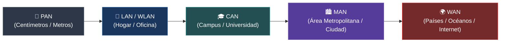
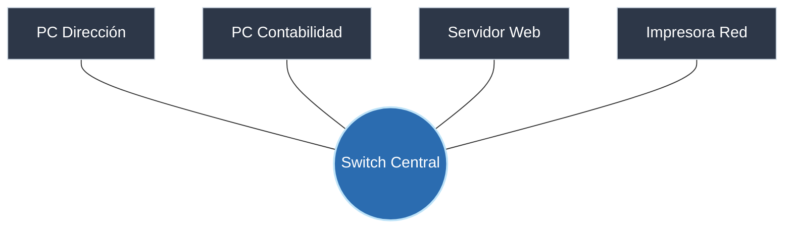
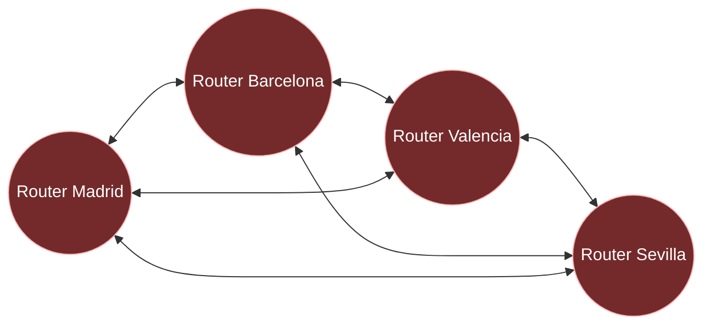

---
tags:
  - redes
  - ccna
  - topologias
  - pan
  - lan
  - wan
  - fundamentos
folder: "📂01 - Fundamentos y Arquitectura de Redes"
aliases:
  - "Introducción a las Redes Informáticas"
  - "Topologías y Clasificación de Redes"
date: 2026-09-07
---

> [!info] 🧭 Navegación
> ◀ [[00 - Índice Maestro de Redes]] · 🔼 [[00 - Índice Maestro de Redes]] · ▶ [[01.2 - Principios de Comunicación y Rendimiento]]

---

# 🌐 01.1 - Introducción a las Redes Informáticas

## 1. ¿Qué es una Red Informática y Cuál es su Propósito?

Una **red informática** es un conjunto de dispositivos autónomos interconectados entre sí (ordenadores, servidores, routers, switches, impresoras, teléfonos móviles, dispositivos IoT) que comparten **recursos**, **servicios** e **información** utilizando un conjunto de reglas comunes denominadas **protocolos**.

> [!abstract] 🏠 Analogía del Portal y el Sistema de Carreteras
> Imagina una casa aislada en la montaña sin camino ni buzón: todo lo que produce se queda allí y nada de fuera puede entrar. Una red informática es como construir una calle que conecta tu casa con las de tus vecinos, con tiendas y con centros de distribución. 
> - El **cable o la antena** es la calzada de asfalto.
> - Los **coches y camiones** son los paquetes de datos.
> - El **código de circulación** son los protocolos de red (las reglas para no chocar y entenderse).

En sus orígenes con **ARPANET** a finales de los años 60, el objetivo era la resiliencia militar y la interconexión de centros universitarios de cálculo. Hoy en día, los tres pilares fundamentales de cualquier arquitectura de red moderna son:

1. **Compartición de recursos**: Centralizar almacenamiento (NAS/SAN), potencia de cálculo (clústeres, cloud computing) y periféricos costosos.
2. **Disponibilidad y redundancia**: Si un enlace o un servidor cae, el tráfico se redirige por rutas alternativas sin que el usuario sufra interrupción.
3. **Comunicación en tiempo real**: Mensajería, VoIP, videollamadas y sincronización de bases de datos distribuidas.

---

## 2. Clasificación de Redes según su Alcance Geográfico

La extensión física que abarca una red determina la tecnología física de transmisión (cable trenzado, fibra monomodo, radiofrecuencia microondas) y el modelo de propiedad de la infraestructura (propia vs. contratada a un proveedor de servicios o ISP).



### Tabla Comparativa de Tipos de Redes

| Tipo | Siglas | Cobertura Típica | Tecnología de Enlace Común | Velocidad Típica | Propiedad del Medio | Ejemplo Práctico |
|:---|:---|:---:|:---|:---:|:---:|:---|
| **PAN** | *Personal Area Network* | < 10 metros | Bluetooth, BLE, Zigbee, NFC, USB | 1 a 24 Mbps | 100% Personal | Tu reloj inteligente enviando tus pulsaciones a tu móvil. |
| **LAN** | *Local Area Network* | Un edificio o piso (< 1 km) | Ethernet (Cat6/Cat6a), Wi-Fi (802.11) | 1 Gbps a 10 Gbps | Propia (Privada) | La red de tu casa con el router, PC, SmartTV y móviles. |
| **WLAN** | *Wireless LAN* | Cobertura local sin cables | Wi-Fi (802.11ax/be), frecuencias 2.4/5/6 GHz | 300 Mbps a 9.6 Gbps | Propia | Conexión inalámbrica a la red Wi-Fi de una cafetería u oficina. |
| **CAN** | *Campus Area Network* | 1 a 5 km (Varios edificios adyacentes) | Fibra óptica multimodo/monomodo en zanja propia | 10 Gbps a 40 Gbps | Institucional (Universidad, Base militar) | Los diferentes edificios de facultades conectando sus laboratorios. |
| **MAN** | *Metropolitan Area Network* | Una ciudad o comarca (hasta 50 km) | Anillos Metro-Ethernet, Fibra oscura (DWDM) | 10 Gbps a 100 Gbps | Consorcio público o telco | Red de cámaras de tráfico municipales y comisarías interconectadas. |
| **WAN** | *Wide Area Network* | Países, continentes o global | Fibra submarina, satélite (Starlink), MPLS, BGP | 100 Mbps a Terabits/s | Proveedores Tier 1 / ISP | **Internet** o la red que une la sede de un banco en Madrid con Tokio. |
| **SAN** | *Storage Area Network* | Dentro de un Centro de Datos | Fibre Channel (FC), iSCSI, RoCE | 32 a 128 Gbps | Privada (Data Center) | Servidores de virtualización accediendo a cabinas masivas de discos. |

---

## 3. Topologías Físicas vs. Topologías Lógicas

Un concepto clave de examen CCNA y de diseño de redes es la diferencia entre cómo están colocados los cables y cómo viajan los datos en realidad:

- **Topología Física**: Es la disposición geométrica real de los cables, antenas y conectores físicos.
- **Topología Lógica**: Es la forma en que los datos viajan a través de los medios de transmisión de nodo a nodo, independientemente de la forma física de los cables.

> [!tip] 💡 Mnemotecnia de Examen
> *La topología física es el mapa del electricista; la topología lógica es el mapa del cartero.*
> En el antiguo estándar Token Ring de IBM, físicamente los cables iban a un concentrador central (parecía una estrella), pero internamente un token electrónico giraba en círculo de puerto en puerto (lógicamente era un anillo). En las redes Ethernet modernas con switch, físicamente es una estrella y lógicamente es punto a punto conmutado.

---

## 4. Análisis de Topologías de Red

### 4.1 Topología en Estrella (*Star Topology*)
Es el estándar indiscutible de las redes de área local (LAN) actuales. Todos los equipos cliente se conectan a un nodo central (conmutador o switch).



- **Ventajas**: Si el cable de un ordenador se corta o falla, el resto de la red sigue funcionando sin inmutarse. Es trivial añadir o quitar dispositivos.
- **Desventajas**: El nodo central representa un **Punto Único de Fallo (SPOF - Single Point of Failure)**. Si el switch se apaga o arde, toda la red cae.

### 4.2 Topología en Malla (*Mesh Topology*)
Cada nodo está conectado a uno o a todos los demás nodos de la red. Puede ser:
- **Malla completa (*Full Mesh*)**: Cada equipo tiene un enlace directo dedicado con absolutamente todos los demás. La fórmula de enlaces necesarios es:
  $$\text{Enlaces} = \frac{n(n - 1)}{2}$$
  Para conectar 10 routers en malla completa necesitas 45 interfaces y cables. Para 100 routers necesitarías 4.950 enlaces (inviable en costes y puertos).
- **Malla parcial (*Partial Mesh*)**: Los nodos críticos tienen múltiples conexiones de respaldo, mientras que los secundarios se conectan a solo dos o tres.



- **Ventajas**: Máxima tolerancia a fallos y redundancia. No existe un punto único de fallo; si un cable transoceánico se corta, el tráfico se redirige por otra ruta gracias a protocolos como [[04.2 - Protocolos de Enrutamiento Dinámico (RIP, OSPF y BGP)]].
- **Desventajas**: Coste desorbitado de cableado e interfaces en redes de acceso. Se reserva para el *core* de Internet y centros de datos de misión crítica.

### 4.3 Topologías Históricas: Bus y Anillo
- **Bus**: Un único cable coaxial dorsal (*backbone*) compartido por todos los equipos con terminadores resistivos de 50 ohmios en cada extremo. Si el cable se rompía en cualquier punto, la señal rebotaba creando ondas estacionarias y cayendo toda la red. Generaba constantes colisiones.
- **Anillo (*Ring*)**: Los datos viajaban en un único sentido de un nodo al siguiente mediante un *token*. Si un nodo intermedio se apagaba sin un relé de bypass, rompía el anillo.

---

## 5. Perspectiva de Ciberseguridad (Pentesting Mindset)

> [!warning] 🚨 Riesgos de Seguridad según la Topología
> En una topología de estrella con switch, los paquetes teóricamente viajan de forma aislada entre emisor y receptor (a diferencia del bus, donde todos leían todo). Sin embargo, un atacante en la misma red local puede:
> 1. **Inundar la tabla CAM del switch (*MAC Flooding*)**: Provocar que el switch se quede sin memoria RAM para recordar qué MAC está en qué puerto y comience a operar como un viejo *hub*, retransmitiendo todo el tráfico por todos los puertos para capturarlo con Wireshark ([[08.1 - Amenazas Comunes en Redes (Ataques Capas 2, 3 y 4)]]).
> 2. **Ejecutar un ataque Man-in-the-Middle vía ARP Spoofing**: Engañar a los vecinos y al switch haciéndose pasar por el router ([[03.4 - Protocolos de Soporte en Capa 3 (ARP e ICMP)]]).
> 
> *La topología física te da comodidad operativa, pero la seguridad la aporta la segmentación con VLANs y el filtrado por puerto (Port Security).*

---

## 6. Práctica de Laboratorio en Terminal Linux

Para inspeccionar cómo tu sistema operativo detecta su interfaz física, su estado y los enlaces activos de su red local, ejecuta en tu terminal:

```bash
# 1. Listar todas las interfaces de red físicas e inalámbricas y su estado (UP/DOWN)
ip -brief link show

# 2. Ver las direcciones IP asignadas a tus tarjetas de red
ip -brief address show

# 3. Inspeccionar el estado de la conexión física a nivel de Capa 1 y Capa 2
# (Reemplaza 'eth0' por el nombre de tu interfaz, e.g. enp3s0)
ethtool eth0 2>/dev/null | grep -E "(Speed|Duplex|Link detected)"

# 4. Descubrir vecinos en tu red local inmediata (requiere privilegios de root)
sudo arp-scan --localnet
```

> [!brain] 🔬 Desglose del comando `ip link`
> Cuando ejecutas `ip link`, el flag `<BROADCAST,MULTICAST,UP,LOWER_UP>` te indica:
> - `UP`: La interfaz ha sido activada administrativamente por el kernel (`ip link set eth0 up`).
> - `LOWER_UP`: La Capa Física (Capa 1) tiene portadora eléctrica o lumínica (el cable está conectado al switch del otro lado). Si ves `NO-CARRIER`, tienes un problema de cable o el switch remoto está apagado.

---

## 7. Resumen y Siguiente Paso

En esta nota hemos aprendido qué define una red, la escala que abarca (desde centímetros en una PAN hasta el planeta en una WAN) y por qué la topología en estrella domina las redes locales y la malla parcial domina Internet.

En la siguiente nota ([[01.2 - Principios de Comunicación y Rendimiento]]), profundizaremos en **cómo se transmiten los datos**: simplex vs dúplex, conmutación de circuitos vs paquetes, y las cuatro métricas que determinan la calidad real de tu conexión: ancho de banda, latencia, jitter y pérdida de paquetes.
