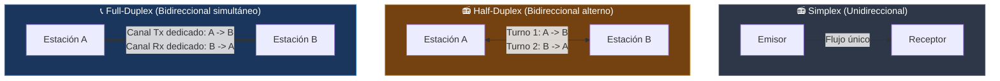
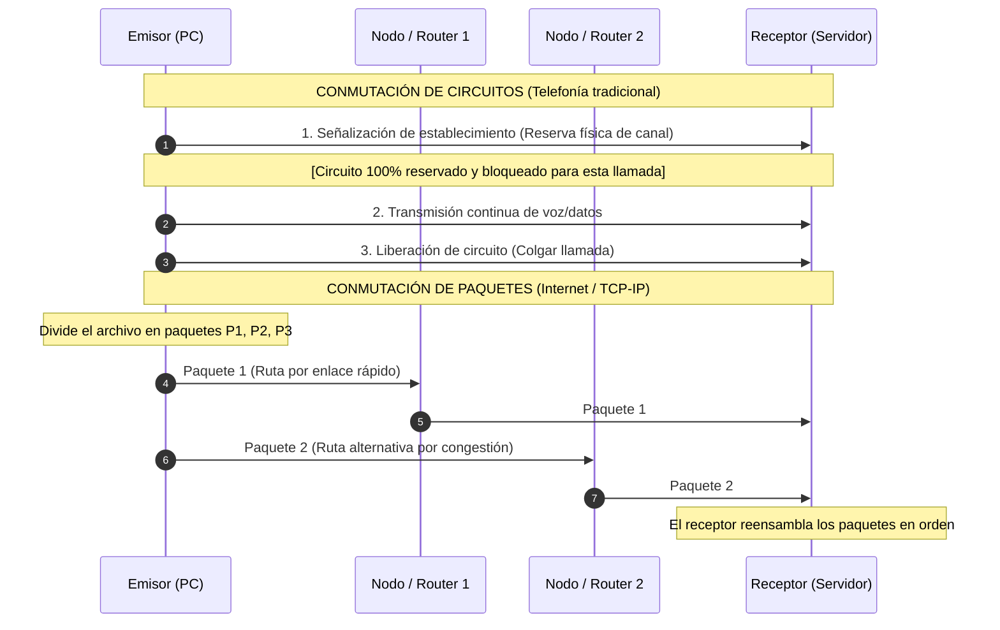
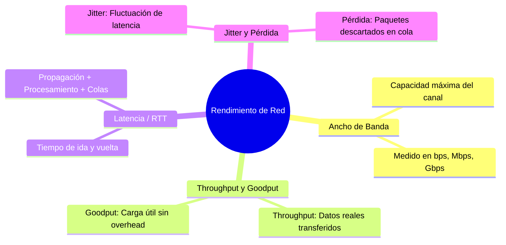

---
tags:
  - redes
  - ccna
  - rendimiento
  - throughput
  - latencia
  - jitter
  - duplex
  - conmutacion
folder: "📂01 - Fundamentos y Arquitectura de Redes"
aliases:
  - "Principios de Comunicación y Rendimiento"
  - "Métricas de Red y Modos de Transmisión"
date: 2026-09-07
---

> [!info] 🧭 Navegación
> ◀ [[01.1 - Introducción a las Redes Informáticas]] · 🔼 [[00 - Índice Maestro de Redes]] · ▶ [[01.3 - Modelos de Referencia (OSI vs TCP-IP y Encapsulación)]]

---

# ⚡ 01.2 - Principios de Comunicación y Rendimiento

## 1. Modos de Transmisión: El Flujo de la Información

La forma en que viajan las señales entre dos extremos en un canal de comunicación se clasifica en tres modos fundamentales según la dirección y simultaneidad del flujo:



### Tabla Comparativa de Modos

| Modo | Dirección del Flujo | Transmisión Simultánea | Analogía Cotidiana | Ejemplo en Redes / Hardware |
|:---|:---:|:---:|:---|:---|
| **Simplex** | Solo en un sentido | No (Receptor nunca responde) | La megafonía de un aeropuerto o la radio FM | Teclado enviando pulsaciones al PC, sensores meteorológicos industriales. |
| **Half-Duplex** | En ambos sentidos | No (Un turno a la vez) | Walkie-talkie (dices "cambio" y liberas el canal) | Redes Wi-Fi convencionales (medio compartido), antiguos concentradores (*Hubs* con CSMA/CD). |
| **Full-Duplex** | En ambos sentidos | **Sí (Simultáneamente)** | Una llamada telefónica convencional donde ambos pueden hablar a la vez | Enlaces Ethernet modernos con switch (cables UTP con pares Tx y Rx separados). |

> [!brain] 🔬 Duplex Mismatch: La pesadilla silenciosa del administrador
> Si configuras manualmente un extremo de un cable Ethernet en **Full-Duplex** (por ejemplo, tu servidor) y dejas el switch en **Auto-negotiation** o **Half-Duplex**, el switch creerá que debe pausar sus envíos cuando detecte tráfico entrante. El resultado: colisiones fantasma, descarte masivo de paquetes y la velocidad se desplomará de 1 Gbps a menos de 1 Mbps. 
> *Regla CCNA de oro*: O ambos extremos en `Auto`, o ambos forzados de forma idéntica a `Full-Duplex`.

---

## 2. Conmutación de Circuitos vs. Conmutación de Paquetes

¿Cómo se envía la información desde un extremo del mundo al otro a través de nodos intermediarios? Históricamente han existido dos filosofías radicalmente distintas:



### 2.1 Conmutación de Circuitos (*Circuit Switching*)
- Se establece una **ruta física dedicada** exclusiva de extremo a extremo antes de transmitir un solo bit (como la red telefónica clásica RTB/RDSI).
- **Ventaja**: Garantía absoluta de ancho de banda y latencia fija y predecible.
- **Desventaja**: Extremadamente ineficiente para informática. Si nadie habla durante 5 minutos, ese circuito sigue ocupado y reservado sin que nadie más pueda usarlo.

### 2.2 Conmutación de Paquetes (*Packet Switching*)
- La información se fragmenta en trozos pequeños llamados **paquetes**, cada uno con su cabecera conteniendo la IP de origen y de destino.
- Los paquetes viajan de forma independiente (*Store and Forward*) a través de múltiples routers. Si un enlace se satura, el paquete 1 puede ir por Londres y el paquete 2 por París.
- **Multiplexación Estadística**: Cientos de personas pueden compartir el mismo cable de fibra submarina simultáneamente, aprovechando los silencios de unos para transmitir los datos de otros. Es la base de **Internet**.

---

## 3. Las Cuatro Métricas Críticas de Rendimiento de Red

Cuando un usuario se queja de que "Internet va lento", un ingeniero de redes no mira la velocidad genérica; audita estas cuatro dimensiones:



### 3.1 Ancho de Banda (*Bandwidth*) vs. Rendimiento Real (*Throughput* y *Goodput*)

> [!abstract] 🏠 Analogía de la Tubería y la Carretera
> - **Ancho de banda**: Es el diámetro de una tubería de agua o el número de carriles de una autopista. Si tienes una fibra de 1 Gbps, caben mil millones de bits cada segundo.
> - **Throughput**: Es el volumen real de agua que circula en este momento o el tráfico que avanza fluidamente por la autovía.
> - **Goodput**: Es únicamente el agua limpia que aprovechas para beber. En redes, representa solo los **datos útiles de tu archivo**, descontando el tamaño de las cabeceras Ethernet, IP y TCP.

$$\text{Capacidad Teórica (Bandwidth)} \ge \text{Throughput} > \text{Goodput}$$

### 3.2 Latencia y Tiempo de Ida y Vuelta (*Round-Trip Time - RTT*)
La **latencia** es el retraso temporal que experimenta un paquete desde que el emisor envía el primer bit hasta que el receptor recibe el último. Se mide en milisegundos (ms) y se compone de cuatro factores:

$$\text{Latencia Total} = T_{\text{propagación}} + T_{\text{transmisión/serialización}} + T_{\text{procesamiento}} + T_{\text{cola}}$$

1. **Retardo de propagación**: Lo que tarda la onda electromagnética en recorrer la distancia física (a la velocidad de la luz en el medio: aprox. $200.000\text{ km/s}$ en fibra de vidrio).
2. **Retardo de transmisión (Serialización)**: El tiempo que tarda la tarjeta de red en empujar los bits al cable ($L / R$, tamaño del paquete entre ancho de banda).
3. **Retardo de procesamiento**: El tiempo que tarda la CPU del router en leer la cabecera IP, calcular el checksum y consultar la tabla de rutas.
4. **Retardo de encolado (*Queuing delay*)**: El tiempo que pasa el paquete esperando en el búfer de memoria del router mientras otros paquetes salen por la interfaz. Si los búferes se saturan, se produce el fenómeno conocido como **Bufferbloat**.

### 3.3 Jitter (Fluctuación de Fase)
El **jitter** es la variación estadística en el tiempo de llegada entre paquetes consecutivos.
- Si envías 5 paquetes separados por 20 ms, lo ideal es que lleguen a destino con una separación de 20 ms.
- Si el paquete 1 tarda 15 ms, el 2 tarda 80 ms, el 3 tarda 12 ms... el receptor sufre un desbarajuste temporal.
- **Impacto letal**: En videollamadas (Zoom, Teams) y videojuegos en línea, el jitter provoca voz metálica, cortes y saltos de posición (*teletransportes* de personajes).

### 3.4 Pérdida de Paquetes (*Packet Loss*)
Porcentaje de paquetes transmitidos que nunca llegan a su destino.
- Causas habituales: Saturación de colas en routers (*Tail Drop*), interferencias electromagnéticas en cables no blindados, o colisiones en Wi-Fi.
- Para navegación web o descarga de ficheros, [[05.2 - Protocolo TCP (3-Way Handshake, Flujo y Confiabilidad)]] retransmite los paquetes perdidos transparentemente (provocando caída de velocidad). Para VoIP y llamadas (UDP), un 2% de pérdida ya arruina la conversación.

---

## 4. Perspectiva de Ciberseguridad: Ataques de Rendimiento

> [!warning] 🚨 Denegación de Servicio (DoS / DDoS) por Saturación
> Los atacantes explotan directamente las métricas de rendimiento:
> - **Ataques volumétricos (Agotamiento de Ancho de Banda)**: Envío masivo de tráfico UDP o peticiones DNS amplificadas para saturar la tubería del proveedor de internet (ISP) de la víctima.
> - **Agotamiento de búferes y recursos (Agotamiento de Latencia/CPU)**: Ataques como el **Slowloris**, donde el atacante abre miles de conexiones HTTP muy lentas, o el **SYN Flood** ([[08.1 - Amenazas Comunes en Redes (Ataques Capas 2, 3 y 4)]]), obligando al servidor a agotar su tabla de estados de conexión sin necesidad de consumir gigabits de ancho de banda.

---

## 5. Laboratorio Práctico en Terminal Linux

Abre tu terminal para auditar y medir las métricas de tu enlace:

```bash
# 1. Medir latencia (RTT) y pérdida de paquetes hacia el DNS de Cloudflare
ping -c 20 1.1.1.1

# 2. Medir RTT, jitter y pérdida de paquetes salto a salto en tiempo real con MTR
# (Instalar con: sudo apt install mtr)
mtr -rwzbc 50 8.8.8.8

# 3. Medir el Throughput real de red entre dos máquinas con iPerf3
# En el servidor de pruebas:
# iperf3 -s
# En tu máquina cliente:
iperf3 -c speedtest.wtnet.de -p 5201 -P 4
```

> [!tip] 💡 Cómo interpretar el resultado de `ping`
> Al finalizar `ping -c 20`, fíjate en la última línea:
> `rtt min/avg/max/mdev = 12.341/14.215/19.820/1.840 ms`
> - `avg`: Tu latencia media real.
> - `mdev` (*Mean Deviation*): Es una aproximación directa de tu **Jitter**. Cuanto más cercano a 0 ms esté `mdev`, más estable y de mayor calidad es tu conexión para gaming o VoIP.

---

## 6. Resumen y Siguiente Paso

En esta nota hemos analizado:
- Por qué Full-Duplex es el estándar en cable y Half-Duplex en Wi-Fi.
- Cómo la conmutación de paquetes permite que Internet sea escalable y resistente.
- La diferencia fundamental entre ancho de banda, throughput, latencia, jitter y packet loss.

En la siguiente nota ([[01.3 - Modelos de Referencia (OSI vs TCP-IP y Encapsulación)]]), descubriremos las dos piedras angulares de toda la arquitectura de redes: el **Modelo OSI de 7 capas**, la pila **TCP/IP** y el proceso de **Encapsulación y Desencapsulación** de datos.
