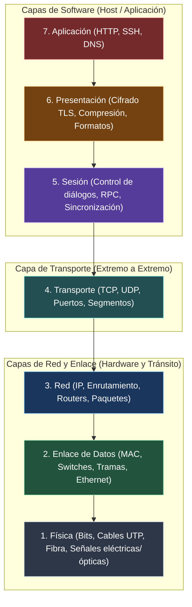
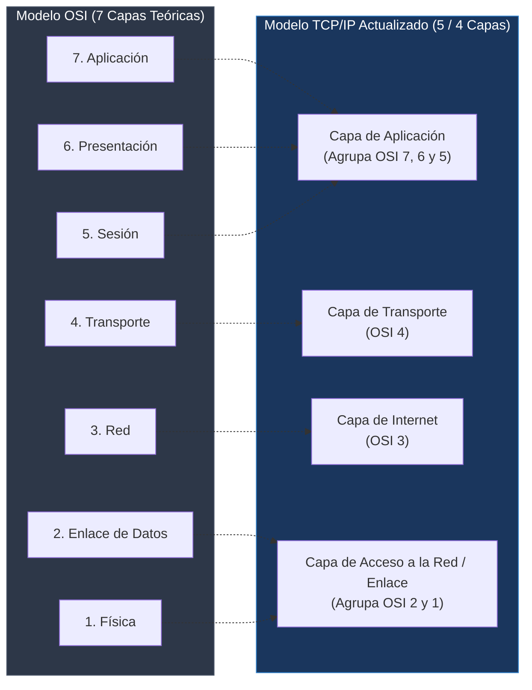

---
tags:
  - redes
  - ccna
  - osi
  - tcp-ip
  - encapsulacion
  - pdu
  - wireshark
folder: "📂01 - Fundamentos y Arquitectura de Redes"
aliases:
  - "Modelos de Referencia (OSI vs TCP-IP)"
  - "Proceso de Encapsulación y Desencapsulación"
date: 2026-09-07
---

> [!info] 🧭 Navegación
> ◀ [[01.2 - Principios de Comunicación y Rendimiento]] · 🔼 [[00 - Índice Maestro de Redes]] · ▶ [[02.1 - Medios de Transmisión y Capa Física]]

---

# 🏛️ 01.3 - Modelos de Referencia (OSI vs TCP-IP y Encapsulación)

## 1. ¿Por Qué Necesitamos Modelos de Capas?

En los años 70 y principios de los 80, cada fabricante tecnológico vendía un ecosistema propietario y cerrado: los ordenadores de IBM solo hablaban con IBM (**SNA**), y los de Digital Equipment Corporation solo con DEC (**DECnet**). Si una empresa quería conectar equipos de distintos fabricantes, era un infierno técnico.

Para solucionar este caos, nacieron los modelos de capas con un propósito claro: **modularidad, estandarización e interoperabilidad**.

> [!abstract] 🏠 Analogía: El Envío de un Paquete por Amazon
> Imagina que compras una taza de cerámica en Amazon:
> 1. **Aplicación**: Tú pulsas "Comprar" y eliges la taza.
> 2. **Empaquetado (Transporte)**: Un empleado mete la taza en una caja protectora con burbujas (Segmento).
> 3. **Dirección postal (Red)**: Se pega una etiqueta con tu dirección: Calle, Número, Código Postal y Ciudad (Paquete).
> 4. **Logística local (Enlace)**: Se mete en una furgoneta de reparto con matrícula específica que circula por la carretera de tu barrio (Trama).
> 5. **Carretera física (Física)**: Las ruedas de la furgoneta ruedan sobre el asfalto (Bits/Señales).
> 
> El conductor de la furgoneta **no necesita saber qué hay dentro de la caja**, solo lee la etiqueta de la calle. Cada capa hace su trabajo de forma autónoma sin preocuparse por los detalles de las capas superiores o inferiores.

---

## 2. El Modelo OSI (Open Systems Interconnection)

Creado por la Organización Internacional de Normalización (**ISO**) en 1984, el **Modelo OSI** divide la comunicación en **7 capas conceptuales**:



### Descripción Detallada de las 7 Capas OSI

| Capa | Nombre | Función Principal | PDU | Dispositivos Clave | Protocolos / Ejemplos |
|:---:|:---|:---|:---:|:---:|:---|
| **7** | **Aplicación** | Interfaz directa con los programas del usuario (navegador, cliente correo). | Datos | Proxy, WAF, Gateways | HTTP, HTTPS, DNS, SSH, FTP, SMTP |
| **6** | **Presentación** | Traduce, formatea, comprime y cifra/descifra los datos. | Datos | Host OS / Bibliotecas | TLS/SSL, ASCII, UTF-8, JPEG, JSON |
| **5** | **Sesión** | Abre, mantiene, sincroniza y cierra los diálogos entre aplicaciones. | Datos | Host OS / APIs | NetBIOS, RPC, Sockets API |
| **4** | **Transporte** | Conexión extremo a extremo, multiplexación por puertos, control de flujo y retransmisión. | **Segmento** (TCP) / **Datagrama** (UDP) | Balanceadores L4, Firewalls | TCP, UDP |
| **3** | **Red** | Direccionamiento lógico global (IP) y selección de la mejor ruta (Routing). | **Paquete** | **Router**, Switch L3 | IPv4, IPv6, ICMP, OSPF, BGP |
| **2** | **Enlace de Datos** | Direccionamiento físico local (MAC), detección de errores y acceso al medio. | **Trama (*Frame*)** | **Switch L2**, Puente, NIC | Ethernet (802.3), Wi-Fi (802.11), ARP |
| **1** | **Física** | Transmisión binaria no estructurada de bits mediante voltajes, luz u ondas de radio. | **Bits** | Cable, Conector RJ45, Fibra, Hub, Repetidor | 1000BASE-T, Monomodo, Ondas RF |

> [!tip] 💡 Reglas Mnemotécnicas para Memorizar OSI
> - **De Capa 7 a Capa 1 (Descendente)**:
>   - *Inglés*: **A**ll **P**eople **S**eem **T**o **N**eed **D**ata **P**rocessing.
>   - *Español*: **A**lgunos **P**rofesores **S**uelen **T**ener **N**otas **D**e **P**oco valor.
> - **De Capa 1 a Capa 7 (Ascendente)**:
>   - *Español*: **P**or **F**avor **N**o **T**oques **S**us **P**artes **A**ltas *(Física, Enlace, Red, Transporte, Sesión, Presentación, Aplicación)*.

---

## 3. El Modelo TCP/IP (El Modelo Real de Internet)

Mientras la ISO diseñaba el modelo OSI en comités teóricos, el Departamento de Defensa de EE. UU. (DoD) y la comunidad académica crearon la pila **TCP/IP**, basada en código funcional y pragmático. Es el modelo que realmente mueve el tráfico mundial hoy.

### Correspondencia entre el Modelo OSI y el Modelo TCP/IP



> [!note] Nota Histórica vs. Actual
> En la literatura clásica del RFC 1122, TCP/IP tenía 4 capas: *Application, Transport, Internet, Link*. En los planes de estudio modernos de Cisco CCNA y CompTIA, se suele desdoblar la capa inferior en dos (Física y Enlace de datos) creando el **modelo híbrido de 5 capas**, que es el más útil para trabajar.

---

## 4. El Proceso de Encapsulación y Desencapsulación

La **encapsulación** es el proceso mediante el cual una capa superior entrega sus datos a la capa inferior inmediata, y esta le añade su propia información de control al principio (denominada **Cabecera** o *Header*) y a veces al final (denominada **Cola** o *Trailer*).

```mermaid
sequenceDiagram
    autonumber
    participant App as Capa Aplicación (L7)
    participant Trans as Capa Transporte (L4)
    participant Net as Capa Red (L3)
    participant Link as Capa Enlace (L2)
    participant Phys as Capa Física (L1)

    Note over App: 1. Datos puros generados (Payload)
    App->>Trans: Datos
    Note over Trans: 2. Añade Cabecera L4 (Puerto Origen / Destino)<br>PDU: SEGMENTO TCP
    Trans->>Net: Cabecera TCP + Datos
    Note over Net: 3. Añade Cabecera L3 (IP Origen / Destino, TTL)<br>PDU: PAQUETE IP
    Net->>Link: Cabecera IP + Cabecera TCP + Datos
    Note over Link: 4. Añade Cabecera L2 (MACs) y Trailer FCS (Checksum)<br>PDU: TRAMA ETHERNET
    Link->>Phys: Cabecera MAC + Paquete IP + Trailer FCS
    Note over Phys: 5. Transforma todo en señales eléctricas/ópticas/RF<br>PDU: BITS (01011100...)
```

### Anatomía de las PDUs (*Protocol Data Units*)

1. **Datos (*Data*)**: La información generada por la aplicación (ej. una petición `GET /index.html HTTP/1.1`).
2. **Segmento (*Segment* - Capa 4)**: 
   - Añade: **Puerto Origen** (ej. 52341) y **Puerto Destino** (ej. 443 para HTTPS), número de secuencia y flags de control (SYN, ACK).
3. **Paquete (*Packet* - Capa 3)**:
   - Añade: **IP Origen** (ej. `192.168.1.50`) e **IP Destino** (ej. `142.250.200.14`), campo TTL (*Time to Live*) y protocolo superior (TCP = 6).
4. **Trama (*Frame* - Capa 2)**:
   - Añade Cabecera: **MAC Origen** (de tu tarjeta de red) y **MAC Destino** (del router/gateway local), tipo de protocolo (*EtherType* `0x0800` para IPv4).
   - Añade Cola: **FCS (*Frame Check Sequence*)**, código CRC de 32 bits para comprobar si el cable tuvo interferencias y corrompió algún bit durante el viaje.
5. **Bits (Capa 1)**: La trama convertida en pulsos de luz en fibra óptica o variaciones de voltaje en cobre.

---

## 5. El Viaje del Paquete y la Desencapsulación en Destino

Cuando el router o el servidor destino recibe los bits:
1. La tarjeta de red (Capa 1) lee los voltajes y reconstruye los bytes de la **Trama**.
2. Capa 2 valida el FCS. Si es correcto y la MAC destino coincide con la suya (o es broadcast), **desprende la cabecera Ethernet y la cola FCS** y entrega el paquete a Capa 3.
3. Capa 3 revisa si la IP destino es la suya. Si es así, **desprende la cabecera IP** y lee el campo protocolo para saber a qué protocolo de Capa 4 entregarlo.
4. Capa 4 valida los puertos, reconstruye el orden de los datos, **desprende la cabecera TCP** y entrega el contenido útil a la aplicación (Capa 7).

---

## 6. Perspectiva de Ciberseguridad: Diagnóstico y Ataques por Capa

> [!warning] 🚨 La Metodología del Pentester y del Ingeniero de Redes
> Cuando un atacante audita una infraestructura, analiza cada capa de forma independiente para encontrar debilidades:
> - **Ataques en Capa 2**: [[08.1 - Amenazas Comunes en Redes (Ataques Capas 2, 3 y 4)]] (MAC Flooding, ARP Spoofing). Aquí los routers no pueden protegerte porque todo ocurre dentro de la LAN.
> - **Ataques en Capa 3**: IP Spoofing, fragmentación de paquetes maliciosos para evadir firewalls.
> - **Ataques en Capa 4**: Escaneos de puertos SYN stealth con `nmap -sS`, denegaciones SYN Flood.
> - **Ataques en Capa 7**: Inyecciones SQL, Cross-Site Scripting (XSS), abusos de APIs.
> 
> *Para solucionar problemas (Troubleshooting), la regla de oro CCNA es el enfoque Divide-and-Conquer o Bottom-Up: Si no hay link físico (Capa 1), no pierdas el tiempo comprobando si el DNS (Capa 7) funciona.*

---

## 7. Práctica en Terminal Linux: Visualizando la Encapsulación

Podemos ver la encapsulación en directo realizando una petición HTTP y analizando cómo viaja por las capas:

```bash
# 1. Petición web detallada en Capa de Aplicación (Capa 7)
# Verás las cabeceras HTTP de envío (>) y respuesta (<)
curl -v https://icanhazip.com

# 2. Capturar y visualizar en terminal las cabeceras completas con tcpdump
# (Ejecuta en una terminal mientras haces el curl en otra)
sudo tcpdump -i any -nn -vvv -c 2 host icanhazip.com
```

> [!brain] 🔬 Salida de `tcpdump` analizada capa por capa:
> ```text
> 12:04:15.123456 IP (tos 0x0, ttl 64, id 38291, protocol TCP (6), length 60)
>     192.168.1.35.54120 > 104.18.25.10.443: Flags [S], seq 184920184, win 64240, ...
> ```
> - `IP`: Indica protocolo de Capa 3 (IPv4).
> - `ttl 64`: Campo TTL de Capa 3.
> - `protocol TCP (6)`: Capa 3 avisando que su carga útil es TCP (Capa 4).
> - `192.168.1.35.54120 > 104.18.25.10.443`: IP Origen + Puerto efímero de origen apuntando a IP Destino + Puerto 443 (HTTPS).
> - `Flags [S]`: Flag SYN de Capa 4 para iniciar el 3-Way Handshake.

---

## 8. Resumen y Siguiente Paso

Con esta nota completamos el **Bloque 1**. Ahora posees una base sólida sobre:
- La historia y razón de ser de los modelos modulares.
- Las 7 capas del modelo teórico OSI y las 4/5 capas del modelo práctico TCP/IP.
- El ciclo de vida de una PDU y cómo se envuelven y desenvuelven las cabeceras.

En el **Bloque 2** daremos el salto al hardware real comenzando con [[02.1 - Medios de Transmisión y Capa Física]]: cables de cobre UTP/STP, norma de crimpado T568A/B, fibra óptica monomodo vs multimodo y el espectro de radio.
