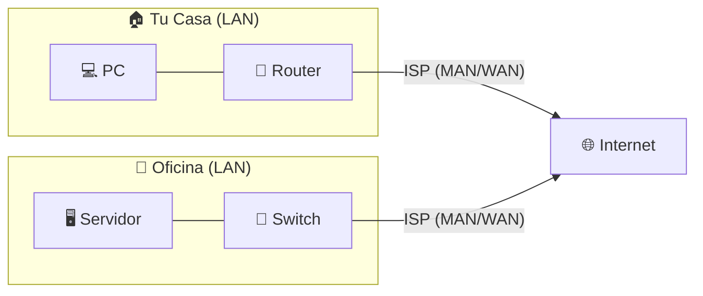

#redes #tipos-de-red #lan #wan #vpn #vlan #infraestructura

> [!info] Navegación
> ◀ Anterior: [[🏛️ 01.3 - Modelos de Referencia (OSI vs TCP-IP y Encapsulación)|Modelos OSI y TCP/IP]] | Siguiente ▶: [[⚡ 01.2 - Principios de Comunicación y Rendimiento|Principios de Rendimiento]]

---

# 01.4 — Todos los Tipos de Redes Explicados

Cuando hablamos de "redes", estamos hablando de un concepto enorme. No todas las redes son iguales: se diferencian en **alcance geográfico**, **quién puede acceder a ellas** y **para qué sirven**. Aquí tienes el mapa completo, de lo más pequeño a lo más grande.

---

## 📡 Por Tamaño y Alcance Geográfico

### PAN — Personal Area Network (Red de Área Personal)

Es la red más pequeña que existe. Cubre el espacio personal del usuario, literalmente tu "burbuja".

- **Tecnologías:** [[Bluetooth]], [[USB]], [[NFC]].
- **Rango:** Unos pocos metros.
- **Ejemplos reales:** Tu auricular Bluetooth conectado al móvil, pasar archivos entre dos móviles por NFC, conectar un ratón inalámbrico al portátil.

> [!example] Caso práctico
> Cuando conectas tus AirPods al iPhone estás creando una PAN. Cuando pegas tu tarjeta bancaria al TPV por NFC, también.

---

### LAN — Local Area Network (Red de Área Local)

La red del día a día en hogares, oficinas y colegios. Conecta dispositivos dentro de un **edificio o conjunto de edificios cercanos**.

- **Tecnología cableada:** [[Ethernet]] con cable RJ-45. Muy baja latencia y alta estabilidad.
- **Tecnología inalámbrica:** [[Wi-Fi]] (WLAN — Wireless LAN). Mayor movilidad pero susceptible a interferencias del espectro de 2.4 GHz.
- **Velocidades típicas:** 100 Mbps a 10 Gbps en cableado; 100 Mbps a varios Gbps en Wi-Fi 6/7.

> [!tip] Diferencia clave LAN vs WLAN
> LAN y WLAN son lo mismo conceptualmente (red local), la diferencia es solo el **medio físico**: cable de cobre vs. ondas de radio.

---

### CAN — Campus Area Network (Red de Área Campus)

Interconecta **múltiples LAN** dentro de un complejo físico amplio: una universidad, un hospital, un gran campus corporativo.

- Se usa **fibra óptica** entre edificios para conectar los switches de cada LAN.
- Es mayor que una LAN pero menor que una MAN.

---

### MAN — Metropolitan Area Network (Red de Área Metropolitana)

Cubre una **ciudad entera** o zona metropolitana. La gestionan normalmente operadores de telecomunicaciones o administraciones públicas.

- **Ejemplo:** La red de fibra que conecta los distintos barrios de Madrid para dar internet a los edificios.
- **Tecnología:** Fibra óptica de alta densidad, a veces tecnología inalámbrica de largo alcance (WiMAX).

---

### WAN — Wide Area Network (Red de Área Amplia) e Internet

La mayor red de todas. Interconecta LANs, MANs y países enteros. La WAN más grande que existe es **Internet**.

- La columna vertebral de Internet son los **cables submarinos de fibra óptica** que atraviesan los océanos.
- Las empresas multinacionales tienen sus propias WANs privadas para conectar sus sedes internacionales.

---

### SAN — Storage Area Network (Red de Almacenamiento)

Una red especializada y de alta velocidad que **solo existe para conectar servidores con sistemas de almacenamiento** masivo (matrices de discos). No es para usuarios finales.

- **Velocidad:** Hasta 128 Gbps con tecnología Fibre Channel.
- **Uso:** Centros de datos, entornos empresariales críticos donde el acceso al almacenamiento debe ser rapidísimo y fiable.

---

## 🔒 Por Segmentación y Privacidad

### VPN — Virtual Private Network (Red Privada Virtual)

Una VPN **no es un tipo de red física**, es una tecnología que crea un **túnel cifrado** sobre una red pública (como Internet) para que la comunicación sea segura y privada.

> [!note] ¿Qué resuelve una VPN?
> Imagina que tienes que mandar una carta confidencial por correo ordinario (Internet). Una VPN sería meterla en una caja fuerte cifrada antes de enviarla: aunque alguien intercepte el paquete, no puede leer nada.

- **Casos de uso:**
  - Un empleado conectándose de forma segura a la red interna de su empresa desde casa.
  - Cifrar tu conexión en una Wi-Fi pública de un aeropuerto.
  - Cambiar tu IP aparente para acceder a contenidos geobloqueados.

- **Protocolos más usados:** [[IPsec]], [[WireGuard]], OpenVPN.

> [!warning] Mito popular
> Una VPN **no te hace anónimo al 100%**. El proveedor de VPN puede registrar tu tráfico. Solo traslada la confianza del ISP a la empresa de VPN.

---

### VLAN — Virtual LAN (Red de Área Local Virtual)

Una VLAN permite **segmentar lógicamente una red física** en varias redes virtuales independientes, **sin necesitar hardware adicional**.

> [!example] Ejemplo práctico de empresa
> Una empresa tiene un único switch con 48 puertos. Con VLANs puede crear:
> - **VLAN 10:** Solo para el departamento de Contabilidad (no pueden ver PCs de otros departamentos).
> - **VLAN 20:** Solo para Recursos Humanos.
> - **VLAN 30:** Solo para Invitados/WiFi público (sin acceso a servidores internos).
> Todo en el mismo switch físico, totalmente aislado lógicamente. 🎯

- Configuradas en switches gestionables (managed switches) mediante el estándar [[IEEE 802.1Q]].
- Mejoran la **seguridad**, el **rendimiento** y la **gestión** de la red.

---

## 🏛️ Por Arquitectura: P2P vs Cliente-Servidor

### Peer-to-Peer (P2P)

Todos los dispositivos son iguales: cualquiera puede ser cliente o servidor.

- **Ventaja:** Sencillo, sin necesidad de servidor central, muy resistente a fallos.
- **Desventaja:** Difícil de gestionar y asegurar a escala.
- **Ejemplos:** BitTorrent, compartir archivos entre dos PCs en un hogar.

---

### Cliente-Servidor

Hay un **servidor central** que gestiona y sirve recursos, y los **clientes** los consumen.

- **Ventaja:** Control centralizado, fácil de administrar, más seguro.
- **Desventaja:** Si el servidor cae, toda la red lo nota.
- **Ejemplos:** Una empresa con Active Directory, cualquier web que visitas (tú eres el cliente, AWS o Google Cloud es el servidor).

---

## 🏢 Intranet y Extranet

| Concepto | Quién puede acceder | Ejemplo |
|---|---|---|
| **Intranet** | Solo empleados internos | Portal interno de RRHH de una empresa |
| **Extranet** | Empleados + socios externos autorizados | Portal de proveedores o clientes B2B |
| **Internet** | Todo el mundo | Esta misma web |

---

> [!tip] 💡 Truco para memorizar la escala
> **PAN → LAN → CAN → MAN → WAN** va de menor a mayor alcance geográfico. Si lo recuerdas como un zoom hacia afuera en un mapa, nunca lo confundirás.
