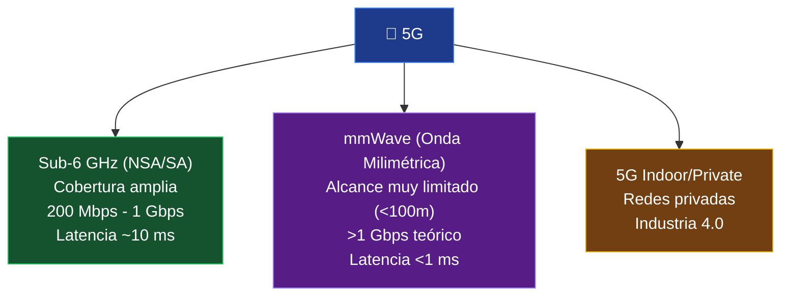

#redes #internet #velocidad-internet #fibra-optica #dsl #5g #conexion

> [!info] Navegación
> 🔗 Relacionado: [[📡 01.5 - Tecnologías de Red (Ethernet, Fibra, WiFi, 5G, Mesh, LoRaWAN)|Tecnologías de Red]] | [[📶 07.4 - Todas las Generaciones Wi-Fi (802.11 a Wi-Fi 7 y 8)|Generaciones Wi-Fi]]

---

# Evolución de la Velocidad de Internet Explicada

De los 56 kbps que bloqueaban la línea del teléfono a los 10 Gbps de la fibra simétrica. La historia de cómo pasamos de esperar horas para descargar una canción a transmitir en 4K sin pensar en ello.

---

## 📞 La Era Prehistórica: Dial-Up (Años 90)

La conexión a Internet de la primera generación de usuarios domésticos.

**Cómo funcionaba:**
1. El módem marcaba un número de teléfono de tu ISP.
2. Establecía una conexión analógica por la línea telefónica convencional.
3. **La línea telefónica quedaba ocupada.** Si alguien llamaba, te desconectabas.

- **Velocidad máxima:** 56 kbps (~7 KB/s)
- **Sonido:** El inconfundible chirrido de handshake que toda una generación recuerda.
- **Uso real:** Correo electrónico básico, páginas web de texto puro, descarga de una canción MP3: ~15 minutos.

> [!note] Curiosidad
> La famosa melodía de conexión Dial-Up era el protocolo de handshake entre módems negociando la velocidad y el esquema de compresión a usar. Era literalmente "escuchar a dos ordenadores hablar".

---

## 🔗 DSL — Digital Subscriber Line (1999-2000)

La primera tecnología que resolvió el problema principal del Dial-Up: **separar los datos del teléfono**.

**Cómo funciona:**
El cableado telefónico de cobre tiene mucho más ancho de banda del que usa la voz humana (~4 kHz). DSL usa las **frecuencias altas del mismo cable** para datos sin interferir con la voz.

- **ADSL (Asymmetric DSL):** Mucha más velocidad de descarga que de subida (lógico para usuarios que descargan más de lo que suben). 8 Mbps bajada / 1 Mbps subida típicamente.
- **ADSL2+:** Hasta 24 Mbps de bajada.
- **VDSL/VDSL2:** Hasta 100 Mbps bajada, pero requiere estar muy cerca de la central.
- **El gran problema de DSL:** La velocidad **cae drásticamente con la distancia** al armario de la central. A 5 km, ADSL puede dar solo 1-2 Mbps.

---

## 📺 Cable Internet (DOCSIS)

Los operadores de televisión por cable tenían infraestructura de cable coaxial llena de ancho de banda sin usar. La aprovecharon para internet.

**DOCSIS (Data Over Cable Service Interface Specification):**
- **Cable coaxial:** Mucho más ancho de banda que el par de cobre telefónico.
- **Velocidades:** DOCSIS 3.0 → hasta 1 Gbps de bajada (teórico, en red compartida).
- **DOCSIS 3.1:** Hasta 10 Gbps de bajada.

> [!warning] El problema del cable: nodo compartido
> A diferencia del DSL donde cada usuario tiene su par de cobre dedicado, en cable **los usuarios de un mismo barrio comparten el mismo segmento de red**. En horas punta (sobrecargas), la velocidad y la latencia se degradan para todos. Si tu vecino descarga torrents, tú lo sufres.

---

## 🔆 Fibra Óptica (FTTH) — La Revolución

La tecnología que cambió todo para siempre.

**FTTH (Fiber To The Home):** El cable de fibra óptica llega **físicamente hasta dentro de tu casa** (o edificio).

| Característica | Fibra Óptica | ADSL | Cable |
|---|---|---|---|
| **Velocidades** | 100 Mbps - 10 Gbps | 8-100 Mbps | 100 Mbps - 1 Gbps |
| **Simetría** | ✅ Simétrica (=bajada=subida) | ❌ Asimétrica | ❌ Asimétrica |
| **Latencia** | 1-5 ms | 15-60 ms | 10-30 ms |
| **Degradación por distancia** | Ninguna (hasta 80 km) | Alta | Media |
| **Interferencias electromagnéticas** | Inmune | Sensible | Media |

> [!tip] Por qué la simetría importa
> Para el usuario medio descargando Netflix: la asimetría no importa. Para trabajadores en remoto haciendo videollamadas, streamers subiendo contenido, desarrolladores haciendo push a repositorios y usuarios de servicios cloud: **la velocidad de subida es igual de crítica**.

---

## 📱 Evolución Móvil: 3G a 5G

### 3G (2001-2010)

La primera generación que permitió "navegar por Internet" desde el móvil, aunque de forma muy básica.

- **Velocidades:** 384 kbps - 14 Mbps (HSPA+)
- **Usos reales:** Email en el móvil, mapas básicos, páginas web simplificadas, vídeo de muy baja calidad.

### 4G LTE (2009-presente)

El salto que hizo viable el smartphone como dispositivo principal de conexión.

- **Velocidades:** 50-150 Mbps típicos, hasta 450 Mbps en condiciones ideales.
- **Latencia:** ~20-50 ms
- **Habilitó:** Streaming HD en el móvil, Uber/Cabify, Instagram/TikTok, Google Maps en tiempo real, videollamadas de calidad.

### 5G (2019-presente)

No es solo "4G pero más rápido". 5G tiene tres modos de operación muy distintos:

- **Sub-6 GHz:** Lo que experimentas en la calle. Mejor que 4G LTE, cobertura razonable.
- **mmWave:** Velocidades de vídeo de cine en segundos, latencia de gaming competitivo. Solo en zonas muy específicas (estadios, aeropuertos, centros comerciales).
- **Aplicaciones clave del 5G real:** Vehículos autónomos (latencia < 1 ms para reacciones de emergencia), fábricas inteligentes, telemedicina, IoT masivo.

---

## 🌐 Wi-Fi vs. Proveedor de Internet — Una Confusión Muy Común

> [!warning] Aclaración fundamental
> El **Wi-Fi** es la tecnología que distribuye la conexión **dentro de tu casa**. Es como las tuberías internas de un edificio.
>
> El **plan de internet de tu ISP** es la presión del agua que entra desde la calle.
>
> **Tener Wi-Fi 7 no acelera tu plan de 100 Mbps**. Si la fibra que te da tu operador llega a 100 Mbps, eso es el máximo que verás en cualquier dispositivo. El Wi-Fi rápido solo garantiza que ese techo se alcanza sin cuellos de botella inalámbricos.

---

## 📊 Tabla Evolutiva de Velocidades

| Tecnología | Época | Velocidad tipica | Latencia | Característica |
|---|---|---|---|---|
| Dial-Up | 1990s | 56 kbps | >200 ms | Bloquea teléfono |
| ADSL | 2000s | 8 Mbps ↓ / 1 Mbps ↑ | 15-60 ms | Asimétrico |
| ADSL2+ | 2005+ | 24 Mbps ↓ | 15-50 ms | Sensible a distancia |
| Cable DOCSIS 3.0 | 2010+ | 100-500 Mbps ↓ | 10-30 ms | Red compartida |
| 4G LTE | 2012+ | 50-150 Mbps | 20-50 ms | Móvil masivo |
| **Fibra FTTH** | **2015+** | **100 Mbps - 10 Gbps** | **1-5 ms** | **Simétrico, estable** |
| 5G Sub-6 GHz | 2020+ | 200 Mbps - 1 Gbps | 10 ms | Móvil de nueva gen |
| 5G mmWave | 2020+ | 1-10 Gbps | <1 ms | Cobertura limitada |
