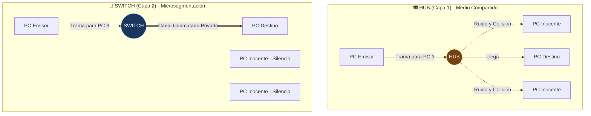
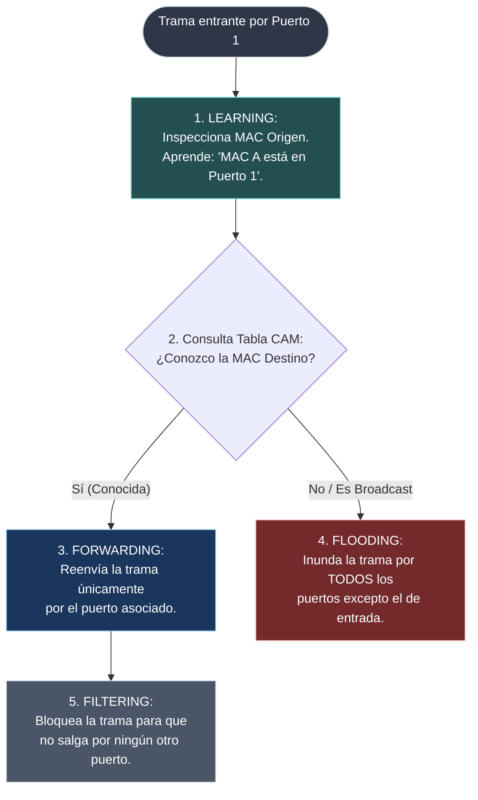
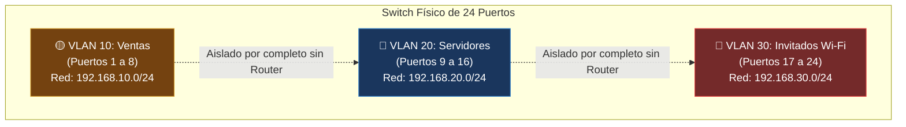
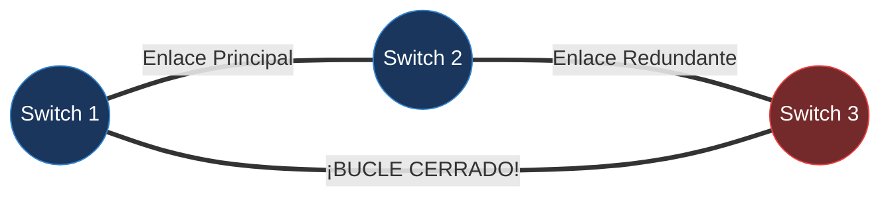

---
tags:
  - redes
  - ccna
  - switches
  - cam-table
  - vlans
  - 802-1q
  - stp
  - spanning-tree
folder: "📂02 - Capa Física y de Enlace"
aliases:
  - "Conmutación, Switches, VLANs y Spanning Tree"
  - "Funcionamiento de Switches y Protocolo STP"
date: 2026-09-07
---

> [!info] 🧭 Navegación
> ◀ [[02.2 - Protocolos y Dispositivos de Enlace (Ethernet, MAC y CSMA)]] · 🔼 [[00 - Índice Maestro de Redes]] · ▶ [[03.1 - Protocolo IP y Direccionamiento IPv4]]

---

# 🔀 02.3 - Conmutación, Switches, VLANs y Spanning Tree (STP)

## 1. De los Hubs a los Switches: La Revolución de la Microsegmentación

En las primeras redes Ethernet, los equipos se conectaban mediante un **Hub** (concentrador de Capa 1). Un hub es un repetidor tonto: todo bit eléctrico que entra por un puerto se replica de forma ciega por absolutamente todos los demás puertos.

Un **Switch** (conmutador de Capa 2), en cambio, es un dispositivo inteligente con procesador y memoria dedicada. Examina las tramas Ethernet entrantes, lee las direcciones MAC y conmuta el paquete únicamente hacia el puerto donde está conectado el destinatario real.



### Dominios de Colisión vs. Dominios de Difusión (*Broadcast*)

| Concepto | Definición | ¿Quién lo delimita / separa? |
|:---|:---|:---:|
| **Dominio de Colisión** | Área de la red donde las señales de dos o más equipos pueden chocar físicamente. | **El Switch** (cada puerto del switch es un dominio de colisión independiente de 1 solo equipo en Full-Duplex). |
| **Dominio de Difusión (*Broadcast Domain*)** | Área de la red donde una trama dirigida a `FF:FF:FF:FF:FF:FF` es escuchada por todos los dispositivos. | **El Router** (los switches retransmiten el broadcast por toda la LAN; los routers nunca reenvían broadcasts). |

---

## 2. El Cerebro del Switch: La Tabla CAM y los Cuatro Verbos de la Conmutación

Para saber por qué puerto mandar cada trama, el switch construye dinámicamente en su memoria de alta velocidad una tabla llamada **Tabla CAM** (*Content Addressable Memory*) o **Tabla de Direcciones MAC**.

El switch opera mediante cuatro acciones fundamentales:



1. **Learning (Aprender)**: Cuando entra una trama, el switch lee la **MAC Origen**. Si no está en su tabla CAM, añade una entrada: *"La MAC `00:1A:2B:3C:4D:5E` está en el Puerto Fa0/1"*. Reinicia el temporizador de caducidad (*Aging Time*, típicamente 300 segundos).
2. **Flooding (Inundación)**: El switch lee la **MAC Destino**. Si no existe en la tabla CAM (fenómeno llamado *Unknown Unicast*) o es una dirección de Broadcast (`FF:FF:FF:FF:FF:FF`), la reenvía por **absolutamente todos los puertos activos excepto el puerto por el que entró**.
3. **Forwarding (Reenvío)**: Si la MAC Destino ya figuraba en la tabla CAM, el switch conmuta la trama directamente al puerto de salida correspondiente.
4. **Filtering (Filtrado)**: Si la MAC destino se encuentra en el mismo puerto por el que entró la trama, el switch descarta la trama para no saturar el resto de puertos innecesariamente.

---

## 3. VLANs (Virtual Local Area Networks): Segmentación Lógica

En una empresa mediana, tener a los ordenadores de Recursos Humanos, Contabilidad, los servidores de producción y la red Wi-Fi de Invitados en la misma red local física es una catástrofe de seguridad y rendimiento (cualquiera puede escuchar los broadcasts de los demás).

Una **VLAN** permite dividir un switch físico en múltiples switches virtuales independientes, **creando múltiples dominios de broadcast dentro del mismo hardware**.



> [!abstract] 🏠 Analogía: El Edificio de Oficinas Compartido
> El switch es un edificio de oficinas con un único pasillo (el bus/placa base). Sin VLANs, la puerta de cada despacho está abierta y si alguien grita por el pasillo (un broadcast), todos se enteran. 
> Con **VLANs**, instalamos tarjetas de acceso electrónico: los empleados de la planta 10 solo pueden entrar y hablar con la planta 10. Si alguien de Ventas necesita hablar con Contabilidad, debe salir a la recepción principal del edificio (el **Router**) para que revise su autorización.

---

## 4. Puertos de Acceso vs. Enlaces Troncales (Trunk - IEEE 802.1Q)

Cuando conectamos varios switches entre sí, ¿cómo viaja el tráfico de 10 VLANs distintas por un solo cable sin mezclarse?

1. **Puertos de Acceso (*Access Ports*)**:
   - Se conectan a dispositivos finales (PCs, impresoras, servidores).
   - Pertenecen a **una única VLAN**.
   - Las tramas que salen hacia el PC son tramas Ethernet normales y corrientes (**sin etiquetar**). El PC ni siquiera sabe qué es una VLAN.
2. **Puertos Troncales (*Trunk Ports*)**:
   - Interconectan switches entre sí o switches con routers.
   - Transportan tráfico de **múltiples VLANs simultáneamente** mediante el estándar **IEEE 802.1Q**.

### La Etiqueta 802.1Q (*Tagging*)
Para saber a qué VLAN pertenece cada trama en un enlace troncal, el switch emisor inyecta una **etiqueta de 4 bytes** justo después de la MAC Origen:

```
  ┌──────────┬──────────┬───────────────────┬───────────┬─────────┬────────┐
  │ MAC Dest │ MAC Orig │ 802.1Q Tag (4 B)  │ EtherType │ Payload │  FCS   │
  └──────────┴──────────┴───────────────────┴───────────┴─────────┴────────┘
                        ▲
  ┌─────────────────────┴─────────────────────┐
  │ TPID (2 Bytes): 0x8100 (Indica 802.1Q)    │
  │ PCP (3 bits): Prioridad QoS (Voz/Video)   │
  │ DEI (1 bit): Descarte admisible           │
  │ VID (12 bits): ID de la VLAN (1 a 4094)   │
  └───────────────────────────────────────────┘
```

> [!tip] 💡 La VLAN Nativa
> En un enlace troncal 802.1Q, existe siempre una VLAN designada como **VLAN Nativa** (por defecto la VLAN 1). Las tramas que viajen por el troncal pertenecientes a la VLAN nativa **no llevan etiqueta 802.1Q**. 
> *Regla de seguridad CCNA*: Cambia siempre la VLAN nativa por defecto (ej. asigna la VLAN 999 no usada) en ambos extremos para evitar ataques de salto de VLAN.

---

## 5. STP (Spanning Tree Protocol): La Prevención de Tormentas de Capa 2

Para garantizar que una empresa nunca se quede sin red si un cable se rompe, los ingenieros de redes instalamos cables redundantes formando anillos entre switches.

Sin embargo, la redundancia en Capa 2 tiene un peligro mortal: **Los bucles de conmutación**.



### ¿Por qué los bucles son mortales en Capa 2?
A diferencia de los paquetes de Capa 3 que tienen un contador TTL (*Time to Live*) que disminuye en cada salto, **las tramas Ethernet no tienen ningún campo TTL**.
Si un PC emite una trama de broadcast (como una petición ARP):
1. El Switch 1 la inunda al Switch 2 y Switch 3.
2. El Switch 2 la inunda al Switch 3.
3. El Switch 3 la reenvía de vuelta al Switch 1.
4. **Tormenta de Difusión (*Broadcast Storm*)**: En menos de 2 segundos, millones de copias de la misma trama circulan a la velocidad de la luz en bucle infinito. El uso de CPU de todos los switches salta al 100%, la tabla CAM se corrompe por constante aleteo (*MAC Flapping*) y toda la red de la empresa cae instantáneamente.

### Cómo actúa Spanning Tree (IEEE 802.1D / 802.1w RSTP)
STP monitoriza constantemente la topología intercambiando paquetes de control llamados **BPDU** (*Bridge Protocol Data Units*):
1. **Elige un Root Bridge**: El switch con la prioridad más baja (o la MAC más baja en caso de empate) se convierte en el "árbol central".
2. **Calcula el camino más corto**: Cada switch calcula la ruta más rápida hacia el Root Bridge basándose en el coste del ancho de banda del enlace.
3. **Bloquea los puertos redundantes (*Alternate / Blocking Port*)**: Apaga lógicamente el enlace sobrante. Si el enlace principal se rompe, STP despierta automáticamente el puerto bloqueado en cuestión de milisegundos (con RSTP 802.1w).

---

## 6. Perspectiva de Ciberseguridad: Ataques de Capa 2

> [!warning] 🚨 Vectores de Ataque en Conmutación
> 1. **Inundación de Tabla CAM (*MAC Flooding*)**:
>    El atacante ejecuta herramientas como `macof` para inyectar cientos de miles de direcciones MAC falsas por segundo al switch. La memoria CAM se desborda y el switch entra en **Modo Fail-Open**, empezando a actuar como un Hub (inundando todo el tráfico confidencial por todos los puertos, donde el atacante lo captura con Wireshark).
>    - *Mitigación*: Habilitar **Port Security** en los switches Cisco (limitar el puerto a un máximo de 1 o 2 MACs autorizadas; si detecta una tercera, apaga el puerto administrativamente: `switchport port-security violation shutdown`).
> 2. **Salto de VLAN (*VLAN Hopping*)**:
>    - **DTP Spoofing**: El atacante se hace pasar por un switch enviando tramas DTP (*Dynamic Trunking Protocol*) para negociar un enlace troncal con el switch y acceder a todas las VLANs. *Mitigación*: Desactivar DTP (`switchport nonegotiate`).
>    - **Double Tagging**: El atacante envía una trama con dos etiquetas 802.1Q aprovechando la VLAN Nativa para alcanzar una VLAN restringida en un solo sentido. *Mitigación*: Forzar el etiquetado de la VLAN nativa o aislarla.

---

## 7. Práctica en Terminal Linux: Creación de VLANs y Puentes

En Linux podemos crear switches virtuales (bridges) y configurar interfaces con etiquetas VLAN 802.1Q directamente con el comando `ip`:

```bash
# 1. Cargar el módulo 802.1Q en el kernel si no estuviera activo
sudo modprobe 8021q

# 2. Crear una subinterfaz para la VLAN 10 sobre la tarjeta física eth0
sudo ip link add link eth0 name eth0.10 type vlan id 10

# 3. Asignar una dirección IP a nuestra interfaz de VLAN 10 y levantarla
sudo ip addr add 192.168.10.50/24 dev eth0.10
sudo ip link set dev eth0.10 up

# 4. Crear un puente de red (Switch virtual por software) y asignarle puertos
sudo ip link add name br0 type bridge
sudo ip link set dev eth1 master br0
sudo ip link set dev eth2 master br0
sudo ip link set dev br0 up

# 5. Ver la tabla de direcciones MAC aprendidas por el switch virtual
bridge fdb show dev br0
```

> [!brain] 🔬 Salida de `bridge fdb show`:
> ```text
> 52:54:00:12:34:56 dev eth1 master br0
> 00:1a:2b:44:55:66 dev eth2 master br0
> ```
> El kernel de Linux almacena la correlación exacta entre MAC física y puerto del puente, replicando el comportamiento de un switch físico Cisco o Juniper.

---

## 8. Resumen y Siguiente Paso

Con esta nota cerramos el **Bloque 2**. Ahora dominas:
- Cómo un switch aprende MACs en su tabla CAM mediante *Learning, Flooding, Forwarding y Filtering*.
- Cómo segmentar redes locales lógicamente con VLANs y enlaces troncales 802.1Q.
- El peligro crítico de las tormentas de broadcast y cómo Spanning Tree (STP) bloquea bucles para salvar la red.

En el **Bloque 3** abandonamos la red local para entender cómo conectamos el mundo entero: entraremos en la **Capa 3** con [[03.1 - Protocolo IP y Direccionamiento IPv4]].
