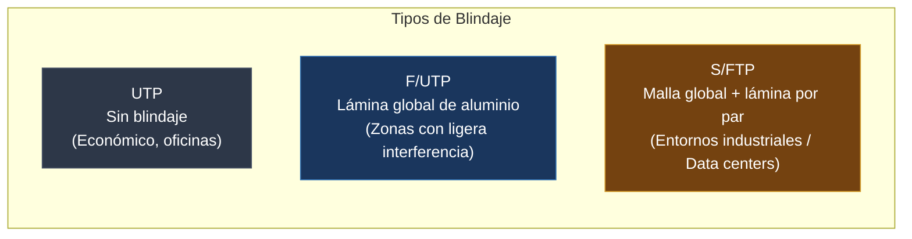
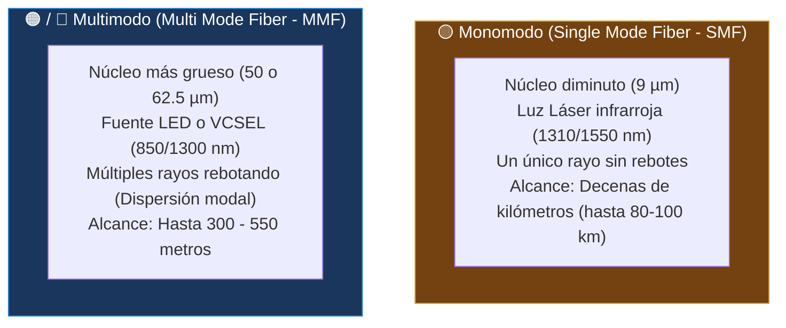

#redes #ccna #capa-fisica #cableado #fibra-optica #utp #rj45 #t568b

> [!info] 🧭 Navegación
> ◀ [[🏛️ 01.3 - Modelos de Referencia (OSI vs TCP-IP y Encapsulación)]] · 🔼 [[🌐 00 - Índice Maestro de Redes Informáticas]] · ▶ [[🔗 02.2 - Protocolos y Dispositivos de Enlace (Ethernet, MAC y CSMA)]]

---

## 🔌 1. La Capa Física (Capa 1 OSI): El Reino de las Señales

La **Capa Física** es responsable de la transmisión pura de bits no estructurados a través de un medio físico de comunicación. Su trabajo no es entender qué significan esos bits, sino garantizar que un `1` enviado como una señal eléctrica, un pulso de luz o una onda electromagnética sea recibido como un `1` en el otro extremo.

Los tres medios de transmisión universales son:

1. **Cobre**: Transmisión mediante impulsos eléctricos de voltaje.
2. **Fibra Óptica**: Transmisión mediante pulsos lumínicos (fotones).
3. **Inalámbrico (Wireless)**: Transmisión mediante ondas electromagnéticas en el espacio libre.

---

## 🔌 2. Cables de Cobre y Par Trenzado

El medio más extendido en redes locales de oficina y hogar es el cable de **par trenzado** (*Twisted Pair*), compuesto por 8 hilos de cobre aislados por plástico y trenzados de dos en dos formando 4 pares.

> [!abstract] 🏠 Analogía del Trenzado y el Cancelamiento de Ruido
> ¿Por qué están trenzados los cables y no van paralelos y rectos?
> Imagina dos personas hablando en voz baja mientras pasa un tren ensordecedor. Si los cables fueran en paralelo, el cable más cercano al motor del ascensor o fluorescente absorbería todo el ruido parásito. Al ir **trenzados**, ambos hilos absorben exactamente la misma cantidad de interferencia externa; el receptor simplemente resta ambas señales (señalización diferencial) y el ruido electromagnético se anula mágicamente a cero.



### 🔹 2.1 Categorías de Cable de Par Trenzado

| Categoría | Frecuencia Máxima | Velocidad Máxima | Distancia Máxima | Uso Típico |
|:---|:---:|:---:|:---:|:---|
| **Cat 5e** | 100 MHz | 1 Gbps (1000BASE-T) | 100 metros | Redes residenciales básicas y enlaces antiguos. |
| **Cat 6** | 250 MHz | 1 Gbps / 10 Gbps (hasta 55m) | 100m (1G) / 55m (10G) | Cableado estructurado estándar en oficinas modernas. |
| **Cat 6a** | 500 MHz | 10 Gbps (10GBASE-T) | **100 metros a 10 Gbps** | Recomendado para despliegues nuevos y puntos de acceso Wi-Fi 6/7. |
| **Cat 7 / 7a** | 600 - 1000 MHz | 10 Gbps / 40 Gbps | 100 metros (con apantallamiento total) | Centros de cálculo e infraestructuras industriales. |
| **Cat 8** | 2000 MHz | **25 Gbps / 40 Gbps** | 30 metros | Interconexión entre servidores y switches en racks (*ToR*). |

> [!warning] 🚨 La Regla de los 100 Metros de Ethernet
> La especificación IEEE 802.3 impone un límite físico estricto de **100 metros** para cable de cobre (típicamente 90 m de cable rígido en pared + 10 m en latiguillos flexibles). Superar esta distancia provoca una atenuación severa y desfases temporales que rompen la detección de colisiones y corrompen las tramas.

---

## 🔹 3. Conector RJ-45 y Normas de Crimpado ANSI/TIA-568A y 568B

El estándar utiliza el conector modular **RJ-45** (*Registered Jack 45*). Para ordenar los 8 hilos de colores existen dos estándares universales: **T568A** y **T568B**. En la actualidad, **T568B** es el estándar predominante en la industria comercial.

```
       PINES CONECTOR RJ-45 (Pestaña hacia abajo)
   ┌───┬───┬───┬───┬───┬───┬───┬───┐
   │ 1 │ 2 │ 3 │ 4 │ 5 │ 6 │ 7 │ 8 │
   └───┴───┴───┴───┴───┴───┴───┴───┘
```

### ⚖️ Tabla de Código de Colores de los Pines

| Pin | Norma T568A | Norma T568B (Más Común) | Función en 10/100 Mbps | Función en 1/10 Gbps |
|:---:|:---|:---|:---:|:---:|
| **1** | Blanco / Verde | **Blanco / Naranja** | Transmisión (Tx+) | Bidireccional Par 1 |
| **2** | Verde | **Naranja** | Transmisión (Tx-) | Bidireccional Par 1 |
| **3** | Blanco / Naranja | **Blanco / Verde** | Recepción (Rx+) | Bidireccional Par 2 |
| **4** | Azul | **Azul** | No usado | Bidireccional Par 3 |
| **5** | Blanco / Azul | **Blanco / Azul** | No usado | Bidireccional Par 3 |
| **6** | Naranja | **Verde** | Recepción (Rx-) | Bidireccional Par 2 |
| **7** | Blanco / Marrón | **Blanco / Marrón** | No usado | Bidireccional Par 4 |
| **8** | Marrón | **Marrón** | No usado | Bidireccional Par 4 |

### ⚖️ Cable Directo (*Straight-Through*) vs. Cable Cruzado (*Crossover*)

- **Cable Directo**: Ambos extremos tienen la misma norma (B en un lado y B en el otro). Se usa para conectar **dispositivos diferentes** (ej. PC a Switch, Switch a Router).
- **Cable Cruzado**: Un extremo es T568A y el otro es T568B (cruza los pines 1-3 y 2-6). Antiguamente era obligatorio para conectar **dispositivos iguales** (PC a PC, Switch a Switch, Router a Router).
- **Auto-MDIX**: Las tarjetas de red y switches modernos incorporan la tecnología *Automatic Medium-Dependent Interface Crossover* (Auto-MDIX), que detecta automáticamente si el cable está cruzado o directo y reconfigura los pines internamente. Ya casi nunca necesitas un cable cruzado físico.

---

## 🔌 4. Fibra Óptica: Velocidad a la Velocidad de la Luz

La fibra óptica transmite pulsos de luz modulados a través de un filamento extremadamente puro de vidrio de sílice (dióxido de silicio), basándose en el principio físico de la **reflexión interna total**.



### ⚖️ Comparativa Monomodo vs. Multimodo

| Parámetro | Fibra Monomodo (SMF) | Fibra Multimodo (MMF) |
|:---|:---|:---|
| **Diámetro del Núcleo** | Diminuto (~9 micrómetros) | Grueso (50 o 62.5 micrómetros) |
| **Emisor de Luz** | Láser de precisión (Caro) | LED o VCSEL (Económico) |
| **Color de Cubierta Estándar** | **Amarillo** | **Naranja** (OM1/OM2) o **Turquesa / Aqua** (OM3/OM4) |
| **Distancia de Alcance** | Desde 10 km hasta más de 80 km sin repetidores | De 300 a 550 metros |
| **Fenómeno Limitante** | Atenuación del vidrio | **Dispersión Modal** (los rayos llegan a destiempo) |
| **Casos de Uso** | Enlaces interurbanos, WAN, telecomunicaciones (ISP), fibra transoceánica | Centros de datos, cableado troncal vertical (*backbone*) de edificios |

### 🔌 Conectores y Empalmes de Fibra Óptica

![[Conectores_Fibra.png]]

A diferencia del cable de cobre que usa casi universalmente el RJ-45, en la fibra óptica existen múltiples formatos dependiendo del entorno y la época de instalación. 

#### 1. Tipos de Conectores (Fila superior de la imagen)

- **SC (*Subscriber Connector* / *Square Connector*)**: 
  - **Forma:** Cuadrado, de inserción a presión (*push-pull*).
  - **Caso de uso:** Muy común en los routers de fibra óptica que nos ponen las operadoras en casa (ONTs o PTROs) y en paneles de parcheo antiguos. Suele ser verde SC/APC (pulido APC, es el que se usa por estandar en las casas) o azul SC/UPC (pulido UPC).
    
- **LC (*Lucent Connector* / *Little Connector*)**: 
  - **Forma:** Cuadrado pero **mucho más pequeño** (la mitad que el SC), con una pestaña de retención tipo RJ-45.
  - **Caso de uso:** Es el rey absoluto en los Centros de Datos actuales. Su pequeño tamaño permite meter muchos más puertos en un switch. Es el estándar para los módulos transceptores SFP/SFP+ de los switches corporativos.
    
- **FC (*Ferrule Connector*)**: 
  - **Forma:** Metálico, redondo y con rosca.
  - **Caso de uso:** Entornos industriales o de alta vibración, ya que la rosca impide que se suelte accidentalmente. Hoy en día está en desuso para redes de datos estándar.
    
- **ST (*Straight Tip*)**: 
  - **Forma:** Metálico, redondo y con cierre de media vuelta (tipo bayoneta, como los cables coaxiales de antena antigua).
  - **Caso de uso:** Fue muy popular en los años 90 para las primeras redes Ethernet de fibra. Ya casi no se instala en redes nuevas.
    
- **E2000**: 
  - **Forma:** Rectangular con una pequeña tapa retráctil (*shutter*) que tapa el cristal automáticamente al sacarlo.
  - **Caso de uso:** Entornos de alta seguridad o telecomunicaciones con láseres de altísima potencia. La tapa protege los ojos del operario de quemaduras por el láser invisible y evita que entre polvo al cristal.
    
- **MPO/MTP (*Multi-fiber Push On*)**: 
  - **Forma:** Un conector ancho y plano que agrupa múltiples fibras (típicamente 12 o 24 fibras en un solo cabezal).
  - **Caso de uso:** Redes troncales (*backbones*) de altísima velocidad (40 Gbps, 100 Gbps, 400 Gbps) en Data Centers, donde se necesitan enviar datos en paralelo por muchos hilos a la vez para alcanzar esas velocidades salvajes.

#### 2. Terminaciones y Empalmes (Fila inferior de la imagen)

Cuando pasas un cable de fibra óptica de la calle a una casa, o por los tubos de un edificio, el cable va "pelado" (sin conector) porque un conector no cabría por las tuberías. Una vez pasado, hay que ponerle un conector en la punta. Hay tres conceptos clave:

- **Pigtail (Rabillo):** Es un trozo de fibra corto que ya viene de fábrica con un conector perfecto en una punta, y cortado/pelado por la otra. El instalador coge este trozo y lo empalma al cable largo que ha pasado por la pared. Es el método más profesional porque el conector de fábrica es insuperable.
  
- **Splice-on (Empalme por fusión):** Es la máquina empalmadora de fibra (la caja negra de la derecha que lanza un destello azul). Esta máquina de precisión alinea microscópicamente el cable largo con el *pigtail* y los funde usando un arco eléctrico a altísima temperatura para que queden unidos como un solo cristal ininterrumpido. Su pérdida de señal es casi cero (ideal y estándar).
  
- **Fast Connector (Conector Rápido / Mecánico):** Es un conector que se pone "a mano" sin usar la cara máquina de fusión. El instalador pela la fibra, la mete dentro de esta pieza de plástico (la del centro abajo) y la pinza o atornilla. 
  - **Caso de uso:** Reparaciones de emergencia en campo o cuando el presupuesto no da para comprar una fusionadora (que cuestan miles de euros). La calidad de la señal es peor (genera más atenuación o rebotes de luz) porque la unión de los cristales nunca es tan perfecta como si los fundes a láser.

---

## 🔹 5. Medios No Guiados: Fundamentos Inalámbricos

En los medios no guiados, las señales electromagnéticas se propagan por el aire o el vacío sin un conductor físico:

- **Bandas de Frecuencia**: Las redes Wi-Fi operan principalmente en el espectro no licenciado ISM (*Industrial, Scientific, and Medical*): **2.4 GHz**, **5 GHz** y recientemente **6 GHz** (Wi-Fi 6E/7) ([[📻 07.2 - Frecuencias, Canales, Celdas y Roaming]]).
- **Factores de Degradación**:
  - **Atenuación**: La señal pierde fuerza al viajar por el aire según la ley de la inversa del cuadrado.
  - **Absorción y Reflexión**: Hormigón, metal, agua y personas atenúan o reflejan la onda.
  - **Interferencias electromagnéticas**: Microondas, teléfonos inalámbricos y Bluetooth compiten en la misma banda de 2.4 GHz.

---

## 🛡️ 6. Perspectiva de Ciberseguridad (Pentesting)

> [!warning] 🚨 Ataques Físicos e Intercepción de Señal
> - **Sniffing en Cobre (Network Taps)**: Un cable de cobre emite un minúsculo campo electromagnético. Existen pinzas de inducción (*vampire taps*) capaces de escuchar el tráfico sin cortar el cable si no está blindado (STP).
> - **Inviolabilidad de la Fibra**: La fibra no emite radiación electromagnética y es inmune a tormentas y ruido eléctrico. Sin embargo, puede ser pinchada curvando el cable de fibra (*fiber bending*) con una herramienta óptica especializada para capturar la fuga de luz sin romper la continuidad del enlace.
> - **Seguridad del Puerto Físico**: Si un atacante tiene acceso físico a una roseta RJ-45 en una sala de reuniones, puede conectar una Raspberry Pi invisible como implante de red si el switch no tiene configurado **802.1X** o **Port Security** ([[🛡️ 08.2 - Mecanismos de Protección y Filtrado (ACLs, Firewalls y Zonas)]]).

---

## 💻 7. Práctica en Terminal Linux: Auditoría de la Capa Física

En Linux puedo interrogar directamente a la controladora de red (NIC) para verificar la salud de la Capa 1:

```bash
# 1. Consultar capacidades físicas, velocidad negociada y modo dúplex

sudo ethtool eth0

# 2. Diagnóstico de cable: Comprobar si la tarjeta soporta comprobación de integridad

sudo ethtool --test eth0 online

# 3. Ver estadísticas de errores de Capa 1 (errores CRC, colisiones, paquetes descartados)

ip -s link show dev eth0
```

> [!brain] 🔬 Interpretación de Errores de Capa 1 en `ip -s link`
> - `RX errors / CRC`: Si este contador sube deprisa, tienes un cable de cobre defectuoso, mal crimpado, interferencias eléctricas cercanas (un motor o tubo fluorescente) o una fibra óptica sucia.
> - `dropped`: La tarjeta de red no tuvo suficiente búfer para procesar las tramas que entraban al vuelo.

---

## 📌 8. Resumen y Siguiente Paso

En esta nota he cubierto los fundamentos tangibles de la red:

- Cobre, par trenzado, categorías Cat5e a Cat8 y normas de crimpado T568A/B.
- La física de la fibra óptica, monomodo vs multimodo y sus conectores.
- Los factores que degradan los medios no guiados.

En la siguiente nota ([[🔗 02.2 - Protocolos y Dispositivos de Enlace (Ethernet, MAC y CSMA)]]), subiremos a la **Capa 2** para entender el estándar **Ethernet**, cómo funcionan las direcciones físicas **MAC**, la estructura de la **trama** y cómo los equipos evitan colisiones al hablar por el mismo cable.
