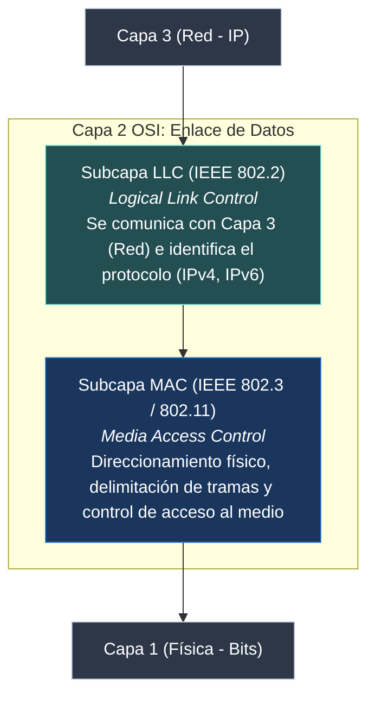
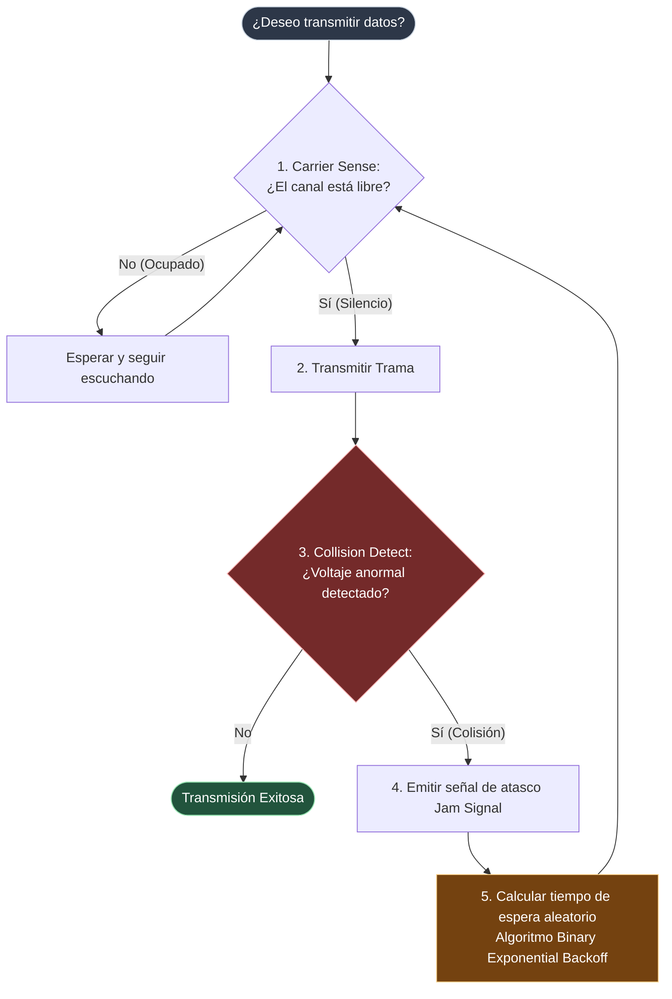

#redes #ccna #capa-enlace #ethernet #mac #csma-cd #csma-ca #tramas

> [!info] 🧭 Navegación
> ◀ [[🔌 02.1 - Medios de Transmisión y Capa Física]] · 🔼 [[🌐 00 - Índice Maestro de Redes Informáticas]] · ▶ [[🔀 02.3 - Conmutación, Switches, VLANs y Spanning Tree (STP)]]

---

## 🔗 1. La Capa de Enlace de Datos (Capa 2 OSI)

Si la Capa Física se encarga de mover voltajes y fotones por el cable, la **Capa de Enlace de Datos** es la que dota de significado y orden a esos bits, agrupándolos en unidades lógicas llamadas **Tramas (*Frames*)**.
Para organizar sus responsabilidades, el IEEE divide la Capa 2 en dos subcapas:



1. **LLC (*Logical Link Control* - IEEE 802.2)**: Es la interfaz con la Capa de Red. Coloca información en la cabecera para indicar qué protocolo de Capa 3 viaja dentro de la trama.
2. **MAC (*Media Access Control*)**: Ensambla y desensambla las tramas, controla el acceso al medio físico compartido (para no colisionar) y gestiona el direccionamiento físico mediante **direcciones MAC**.

---

## 🔗 2. Anatomía de la Dirección MAC (*Media Access Control*)

La **dirección MAC** (también llamada *Dirección Física*, *Hardware Address* o **BIA** - *Burned-In Address*) es un identificador único de **48 bits** (6 bytes) grabado a fuego en la memoria no volátil (ROM/EEPROM) de cada tarjeta de red (NIC) durante su fabricación.

Se representa visualmente como 12 dígitos hexadecimales organizados en pares separados por dos puntos (`00:1A:2B:3C:4D:5E`) o guiones (`00-1A-2B-3C-4D-5E`), o en bloques de cuatro puntos según Cisco (`001a.2b3c.4d5e`).

```
           ANATOMÍA DE UNA DIRECCIÓN MAC (48 BITS / 6 BYTES)
  ┌───────────────────────────────┬───────────────────────────────┐
  │   OUI (24 bits / 3 bytes)     │  NIC Specific (24 bits/3 B)   │
  │   Identificador de Fabricante │  Número de Serie de la Tarjeta│
  └───────────────────────────────┴───────────────────────────────┘
     00   :   1A   :   2B             3C   :   4D   :   5E
     ──       ──       ──             ──       ──       ──
              ▲                                ▲
     Asignado por la IEEE           Asignado por el fabricante
     (Ej: Cisco, Intel, Apple)      (Cisco: Serie única)
```

> [!abstract] 🏠 Analogía: El DNI vs. La Dirección Postal
> - La **Dirección MAC** es como tu número de **DNI / Pasaporte**: te identifica a ti como individuo físico de forma permanente sin importar en qué país estés.
> - La **Dirección IP** es tu **dirección postal**: indica dónde vives hoy (calle, número, código postal). Si te mudas de casa (cambias de red Wi-Fi), tu IP cambia por completo, pero tu DNI (tu MAC) sigue siendo el mismo.

### 🔗 Bits Especiales en el Primer Byte de la MAC

El primer octeto contiene dos bits clave de control:

1. **Bit I/G (*Individual / Group*)**:
   - `0`: Dirección **Unicast** (apunta a una tarjeta de red específica).
   - `1`: Dirección **Multicast** o **Broadcast** (apunta a un grupo o a todos).
2. **Bit U/L (*Universal / Local*)**:
   - `0`: Administrada universalmente (el fabricante respetó el OUI oficial).
   - `1`: Administrada localmente (la MAC ha sido modificada por software, ej. modo privacidad en iOS/Android o spoofing).

### 📍 Direcciones MAC Reservadas que Debes Memorizar

- **Broadcast L2**: `FF:FF:FF:FF:FF:FF` (Todos los 48 bits a 1. Todos los dispositivos de la LAN deben abrir y procesar esta trama).
- **Multicast IPv4**: Empieza siempre por `01:00:5E:...` ([[🌐 03.1 - Protocolo IP y Direccionamiento IPv4]]).
- **Multicast IPv6**: Empieza siempre por `33:33:...` ([[🌌 03.3 - Protocolo IPv6 (Estructura, Tipos y Autoconfiguración)]]).

---

## 🔗 3. Estructura de la Trama Ethernet II

La trama Ethernet estándar de facto en Internet y redes corporativas es el formato **Ethernet II** (o DIX Ethernet).

```
  ┌───────────┬─────┬──────────┬──────────┬───────────┬───────────────────┬────────┐
  │ Preámbulo │ SFD │ MAC Dest │ MAC Orig │ EtherType │ Carga Útil (Data) │  FCS   │
  │  7 bytes  │ 1 B │ 6 bytes  │ 6 bytes  │  2 bytes  │  46 - 1500 bytes  │ 4 bytes│
  └───────────┴─────┴──────────┴──────────┴───────────┴───────────────────┴────────┘
  ▲                                                                                ▲
  └─────────── No forman parte del conteo oficial de tamaño ───────────────────────┘
```

### 🔗 Campos de la Trama Desglosados

1. **Preámbulo (7 bytes)**: Patrón alternante de unos y ceros (`10101010...`) para sincronizar los relojes de las tarjetas emisora y receptora.
2. **SFD (*Start Frame Delimiter* - 1 byte)**: Termina con la secuencia `10101011`. Indica que el siguiente bit ya es la cabecera real de la trama.
3. **MAC Destino (6 bytes)**: Dirección física del siguiente salto (el receptor o el router).
4. **MAC Origen (6 bytes)**: Dirección física del equipo emisor.
5. **EtherType (2 bytes)**: Define qué protocolo de Capa 3 va encapsulado dentro.
   - `0x0800`: IPv4
   - `0x0806`: ARP ([[🛠️ 03.4 - Protocolos de Soporte en Capa 3 (ARP e ICMP)]])
   - `0x86DD`: IPv6
   - `0x8100`: Etiqueta VLAN 802.1Q ([[🔀 02.3 - Conmutación, Switches, VLANs y Spanning Tree (STP)]])
6. **Payload / Carga Útil (46 a 1500 bytes)**: El paquete IP completo. Si el paquete ocupa menos de 46 bytes, se rellena con ceros (*Padding*) para que la trama alcance el tamaño mínimo.
7. **FCS (*Frame Check Sequence* - 4 bytes)**: Código CRC de 32 bits para verificar que ningún bit sufrió corrupción en el cable. Si el CRC calculado en destino no coincide, la trama se descarta silenciosamente.

> [!brain] 🔬 Límites de Tamaño de la Trama Ethernet
> - **Tamaño Mínimo**: **64 bytes** (excluyendo preámbulo). Si una trama mide menos de 64 bytes se llama *Runt* y se descarta como colisión.
> - **Tamaño Máximo Estándar (MTU)**: **1518 bytes** (64B min + 1500B MTU + cabeceras). Tramas mayores sin fragmentar se llaman *Giants*.
> - **Jumbo Frames**: En centros de datos y almacenamiento SAN, se habilitan tramas de hasta **9000 bytes** para reducir la sobrecarga de CPU del servidor.

---

## ⚖️ 4. Control de Acceso al Medio: CSMA/CD vs. CSMA/CA

Cuando varios equipos comparten el mismo medio físico (un cable coaxial antiguo, un concentrador *Hub* o el aire en Wi-Fi), si dos transmiten a la vez, las señales chocan y se destruyen: ocurre una **colisión**.

Para arbitrar quién habla, se crearon los protocolos CSMA (*Carrier Sense Multiple Access*):



### 🔗 4.1 CSMA/CD (*Collision Detection* - Redes Cableadas Half-Duplex)

- **Carrier Sense**: Escucha antes de hablar.
- **Multiple Access**: Todos los nodos tienen igual derecho a usar el cable.
- **Collision Detection**: Durante la transmisión, la tarjeta sigue monitorizando el voltaje del cable. Si detecta un pico anormal de tensión (dos equipos hablaron a la vez):
  1. Emite una señal de atasco de 32 bits (**Jam Signal**) para que toda la red sepa que hubo colisión.
  2. Cada equipo activa un temporizador aleatorio (*Binary Exponential Backoff*) antes de volver a intentarlo, evitando que colisionen en bucle infinito.

> [!tip] 💡 ¿Por qué CSMA/CD está prácticamente extinto en redes modernas?
> Con la llegada de los **Switches** y el cableado en **Full-Duplex**, cada puerto del switch es un canal dedicado de transmisión y recepción independiente. **Ya no existen colisiones en redes cableadas con switch.**

### 📻 4.2 CSMA/CA (*Collision Avoidance* - Redes Inalámbricas Wi-Fi 802.11)

En el aire, una antena de radio no puede transmitir a alta potencia y al mismo tiempo escuchar con suficiente sensibilidad para detectar colisiones (el propio emisor ensordece su receptor). Por tanto, en Wi-Fi no se pueden detectar colisiones en curso; hay que **evitarlas**:

1. Escucha si el canal está libre durante un periodo fijo (**DIFS**).
2. Si está libre, espera un tiempo aleatorio adicional (*Random Contention Window*).
3. Opcionalmente utiliza el mecanismo de reserva previa **RTS/CTS** (*Request to Send / Clear to Send*): el cliente pide permiso al punto de acceso antes de lanzar tramas pesadas, mitigando el problema del nodo oculto.

---

## 🛡️ 5. Perspectiva de Ciberseguridad: Suplantación de MAC (*MAC Spoofing*)

> [!warning] 🚨 La Ilusión de Seguridad del Filtrado MAC
> Muchas redes Wi-Fi residenciales o puertos corporativos intentan protegerse mediante "Filtrado por MAC" (solo permitir direcciones autorizadas en una lista blanca).
> **Para un pentester, el filtrado MAC es completamente inútil**:
> - Las direcciones MAC viajan en texto claro y sin cifrar en cada trama transmitida por el aire.
> - Un atacante escucha el tráfico con Wireshark, identifica la MAC de un cliente legítimo conectado y clona esa misma dirección en su tarjeta con un simple comando en Linux:
> ```bash
> sudo ip link set dev wlan0 down
> sudo ip link set dev wlan0 address 00:11:22:33:44:55
> sudo ip link set dev wlan0 up
> ```
> Para proteger la Capa 2 se requiere **autenticación 802.1X** con certificados o credenciales de usuario, nunca la dirección MAC como elemento de confianza.

---

## 💻 6. Práctica en Terminal Linux: Inspección y Manipulación de MAC

```bash
# 1. Ver la dirección MAC real y el fabricante de tus interfaces

ip link show

# 2. Descubrir el fabricante a partir del OUI (primeros 3 bytes)

# (Puedes buscar los 6 primeros dígitos en https://maclookup.app o usar la herramienta macchanger)

sudo apt install macchanger -y
macchanger -s eth0

# 3. Asignar una MAC aleatoria para anonimizar tu equipo en una red pública

sudo macchanger -r eth0

# 4. Capturar tramas Ethernet en crudo y ver las MACs de origen y destino en la terminal

sudo tcpdump -i eth0 -e -c 5
```

> [!brain] 🔬 Salida de `tcpdump -e`:
> ```text
> 12:30:01.000000 52:54:00:12:34:56 > 00:1a:2b:aa:bb:cc, ethertype IPv4 (0x0800), length 98: ...
> ```
> Con la opción `-e`, `tcpdump` imprime la cabecera de Capa 2 mostrando claramente la MAC Origen, la MAC Destino y el EtherType (`0x0800`).

---

## 📌 7. Resumen y Siguiente Paso

En esta nota he dominado:

- Las subcapas LLC y MAC de la Capa 2.
- Los 48 bits de la dirección MAC (OUI de fabricante + número de serie de interfaz).
- La estructura formal de la trama Ethernet II, MTU y chequeo de integridad FCS.
- La diferencia fundamental entre CSMA/CD (detección en cable) y CSMA/CA (evasión en Wi-Fi).

En la siguiente nota ([[🔀 02.3 - Conmutación, Switches, VLANs y Spanning Tree (STP)]]), analizo el cerebro de la LAN: el **Switch**, cómo aprende las direcciones MAC, cómo segmentamos redes con **VLANs (802.1Q)** y cómo **STP** evita que un bucle accidental derribe una empresa entera.
