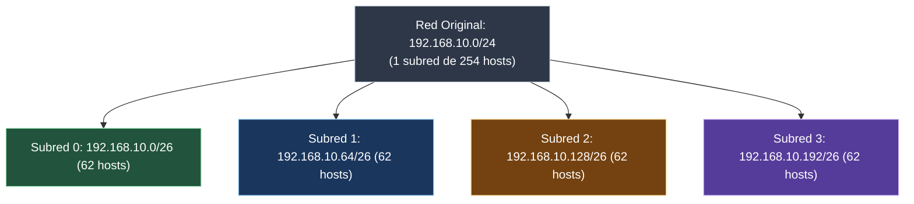

---
tags:
  - redes
  - ccna
  - subnetting
  - vlsm
  - cidr
  - mascara-red
  - calculo-ip
folder: "📂03 - Capa de Red y Direccionamiento"
aliases:
  - "Subnetting y VLSM (Cálculo Práctico)"
  - "Cálculo de Subredes y Máscaras CIDR"
date: 2026-09-07
---

> [!info] 🧭 Navegación
> ◀ [[03.1 - Protocolo IP y Direccionamiento IPv4]] · 🔼 [[00 - Índice Maestro de Redes]] · ▶ [[03.3 - Protocolo IPv6 (Estructura, Tipos y Autoconfiguración)]]

---

# 🧮 03.2 - Subnetting y VLSM (Cálculo Práctico de Subredes)

## 1. ¿Por Qué Hacemos Subnetting?

El **Subnetting** (o subdivisión en subredes) es el proceso de dividir una red física o lógica grande en múltiples subredes más pequeñas e independientes. 

Las razones fundamentales para hacer subnetting son:
1. **Reducción de Dominios de Difusión (*Broadcast*)**: Una red con 2.000 ordenadores colapsaría por el tráfico continuo de peticiones ARP ([[03.4 - Protocolos de Soporte en Capa 3 (ARP e ICMP)]]). Al dividirla en 8 subredes de 250 equipos, el broadcast se contiene localmente.
2. **Seguridad y Control de Tráfico**: Permite aplicar listas de control de acceso (ACLs) y reglas de firewall entre departamentos (ej. prohibir que la subred de Invitados acceda a la subred de Servidores).
3. **Eficiencia en el Uso de Direcciones**: Evita el desperdicio masivo de direcciones IPv4.

---

## 2. Anatomía Binaria de la Máscara de Subred

Toda dirección IPv4 está compuesta por dos partes inseparables:
- **Porción de Red**: Identifica a qué subred pertenece el equipo.
- **Porción de Host**: Identifica de forma única a ese dispositivo dentro de su subred.

La **Máscara de Subred** es una secuencia de 32 bits compuesta por **unos consecutivos seguidos de ceros consecutivos**. Los `1`s indican qué bits corresponden a la Red, y los `0`s indican qué bits quedan para los Hosts:

```
  Dirección IP:   192  .  168  .    1  .   50
  Binario:        11000000.10101000.00000001.00110010
  Máscara (/24):  11111111.11111111.11111111.00000000  (255.255.255.0)
                  └───────── PORCIÓN RED ──────┴── HOST ──┘
```

> [!abstract] 🏠 Analogía: El Prefijo Telefónico y la Extensión
> Imagina el número de teléfono de una empresa: `+34 91 555 [1234]`.
> - `+34 91 555`: Es la porción de red (el número de la centralita). Todos los teléfonos del edificio comparten este mismo prefijo.
> - `1234`: Es la extensión del empleado (el host). Cada mesa tiene una distinta.
> La máscara le dice al router exactamente dónde termina el prefijo de la empresa y dónde empieza la extensión del empleado.

### La Operación Booleana AND
Cuando un ordenador quiere saber si el destino está en su misma red local o debe enviar el paquete al Gateway, ejecuta una operación lógica **AND** bit a bit entre la IP destino y su propia máscara:

$$\text{1 AND 1} = 1 \qquad \text{1 AND 0} = 0 \qquad \text{0 AND 0} = 0$$

Si el resultado coincide con su propia dirección de red, el destino es local; si difiere, lo entrega al router.

---

## 3. La Tabla Mágica del Subnetting (Memorización CCNA)

Para calcular subredes mentalmente en segundos sin hacer conversiones binarias completas, memoriza esta tabla del último octeto:

| Posición del Bit | $2^7$ | $2^6$ | $2^5$ | $2^4$ | $2^3$ | $2^2$ | $2^1$ | $2^0$ |
|:---|:---:|:---:|:---:|:---:|:---:|:---:|:---:|:---:|
| **Valor Decimal del Bit (*Salto Mágico*)** | **128** | **64** | **32** | **16** | **8** | **4** | **2** | **1** |
| **Máscara Decimal Acumulada** | **.128** | **.192** | **.224** | **.240** | **.248** | **.252** | **.254** | **.255** |
| **Prefijo CIDR (sobre red /24)** | `/25` | `/26` | `/27` | `/28` | `/29` | `/30` | `/31` | `/32` |
| **Bits de Host Restantes ($h$)** | 7 | 6 | 5 | 4 | 3 | 2 | 1 | 0 |
| **Hosts Útiles ($2^h - 2$)** | 126 | 62 | 30 | 14 | 6 | 2 | 2* | 1* |

### Las Dos Fórmulas Sagradas
1. **Número de Subredes Creadas**: $2^s$ (donde $s$ es la cantidad de bits "robados" a la porción de host).
2. **Número de Hosts Útiles por Subred**: $2^h - 2$ (donde $h$ es la cantidad de bits de host restantes).
   - *¿Por qué se resta 2?* Porque **la primera dirección representa a la Red** y **la última representa al Broadcast**. Ninguna de las dos puede asignarse a un PC o tarjeta de red.

---

## 4. Subnetting con Máscara Fija (FLSM - Fixed Length Subnet Mask)

En FLSM, dividimos una red en subredes de **idéntico tamaño**.

### Ejercicio Práctico Paso a Paso
**Objetivo**: Tienes la red `192.168.10.0/24` y necesitas crear **4 subredes** para cuatro departamentos de tu empresa (Ventas, Contabilidad, IT y Almacén).



#### Paso 1: ¿Cuántos bits necesitamos pedir prestados?
- Buscamos $2^s \ge 4$ subredes $\longrightarrow$ $2^2 = 4$. Necesitamos **2 bits**.
- La nueva máscara será: $24 + 2 = \mathbf{/26}$ (`255.255.255.192`).

#### Paso 2: Calcular el "Número Mágico" (El Salto entre Subredes)
- El salto es el valor decimal del último bit tomado prestado, o la fórmula universal:
  $$\text{Salto} = 256 - \text{Máscara} = 256 - 192 = \mathbf{64}$$
- Cada subred comenzará sumando 64 en el último octeto.

#### Paso 3: Construir la Tabla de Subredes

| Subred | Dirección de Red | Primera IP Útil (Red + 1) | Última IP Útil (Broadcast - 1) | Dirección de Broadcast | Máscara |
|:---:|:---|:---|:---|:---|:---:|
| **0** | `192.168.10.0` | `192.168.10.1` | `192.168.10.62` | `192.168.10.63` | `/26` |
| **1** | `192.168.10.64` | `192.168.10.65` | `192.168.10.126` | `192.168.10.127` | `/26` |
| **2** | `192.168.10.128` | `192.168.10.129` | `192.168.10.190` | `192.168.10.191` | `/26` |
| **3** | `192.168.10.192` | `192.168.10.193` | `192.168.10.254` | `192.168.10.255` | `/26` |

---

## 5. VLSM (Variable Length Subnet Mask): La Técnica Profesional

En el mundo real, los departamentos no tienen el mismo número de ordenadores:
- Servidores: 50 hosts
- Oficinas: 25 hosts
- Enlace entre dos routers (punto a punto): **¡Solo 2 hosts!**

Si usamos FLSM con `/26` (bloques de 64), para conectar dos routers desperdiciaríamos 60 IPs útiles. **VLSM permite usar máscaras de diferentes tamaños en una misma topología.**

> [!tip] 💡 La Regla de Oro Inquebrantable de VLSM
> **Ordena SIEMPRE los requerimientos de mayor a menor número de hosts necesarios** antes de asignar la primera dirección IP. Si no lo haces, solaparás subredes y corromperás el enrutamiento.

### Caso Práctico Resuelto de VLSM
**Dirección Base**: `10.0.0.0/24` (Disponemos de 254 IPs).
**Requerimientos**:
1. **Sede Central**: 100 hosts
2. **Sucursal Norte**: 40 hosts
3. **Sucursal Sur**: 10 hosts
4. **Enlace WAN Router 1 a Router 2**: 2 hosts

```
  ESPACIO 10.0.0.0/24 (Total 256 direcciones)
  ┌───────────────────────────────┬───────────────┬───────┬───┐
  │ Sede Central (100 hosts)     │ Sucursal Norte│ Sur   │WAN│
  │ /25 (128 direcciones)         │ /26 (64 dirs) │/28(16)│/30│
  └───────────────────────────────┴───────────────┴───────┴───┘
  0                              128             192     208 212
```

#### 1. Sede Central (100 hosts)
- Buscamos $2^h - 2 \ge 100 \longrightarrow 2^7 - 2 = 126$ hosts útiles ($h=7$).
- Máscara: $32 - 7 = \mathbf{/25}$ (`255.255.255.128`). Salto: 128.
- **Red**: `10.0.0.0/25` | **Rango útil**: `10.0.0.1` a `10.0.0.126` | **Broadcast**: `10.0.0.127`

#### 2. Sucursal Norte (40 hosts)
- Tomamos la siguiente IP libre: `10.0.0.128`.
- Buscamos $2^h - 2 \ge 40 \longrightarrow 2^6 - 2 = 62$ hosts útiles ($h=6$).
- Máscara: $32 - 6 = \mathbf{/26}$ (`255.255.255.192`). Salto: 64.
- **Red**: `10.0.0.128/26` | **Rango útil**: `10.0.0.129` a `10.0.0.190` | **Broadcast**: `10.0.0.191`

#### 3. Sucursal Sur (10 hosts)
- Siguiente IP libre: `10.0.0.192`.
- Buscamos $2^h - 2 \ge 10 \longrightarrow 2^4 - 2 = 14$ hosts útiles ($h=4$).
- Máscara: $32 - 4 = \mathbf{/28}$ (`255.255.255.240`). Salto: 16.
- **Red**: `10.0.0.192/28` | **Rango útil**: `10.0.0.193` a `10.0.0.206` | **Broadcast**: `10.0.0.207`

#### 4. Enlace WAN Punto a Punto (2 hosts)
- Siguiente IP libre: `10.0.0.208`.
- Buscamos $2^h - 2 \ge 2 \longrightarrow 2^2 - 2 = 2$ hosts útiles ($h=2$).
- Máscara: $32 - 2 = \mathbf{/30}$ (`255.255.255.252`). Salto: 4.
- **Red**: `10.0.0.208/30` | **Rango útil**: `10.0.0.209` a `10.0.0.210` | **Broadcast**: `10.0.0.211`

> [!brain] 🔬 Subredes /30, /31 y /32 en CCNA
> - **/30**: El estándar clásico para enlaces punto a punto entre routers (4 IPs: 1 red, 2 útiles, 1 broadcast).
> - **/31 (RFC 3021)**: Estándar moderno en routers de centros de datos que permite 2 IPs útiles en un enlace punto a punto **sin gastar red ni broadcast**.
> - **/32**: Apunta a **un solo host exacto** (`255.255.255.255`). Se usa en interfaces virtuales Loopback de routers para monitorización y routing OSPF/BGP.

---

## 6. Perspectiva de Ciberseguridad: Escaneo por CIDR

> [!warning] 🚨 Reconocimiento de Objetivos con Nmap
> Un atacante nunca escanea IPs al azar en Internet. Determina la subred de la víctima y lanza escaneos basados en bloques CIDR:
> ```bash
> # Escanear solo las máquinas vivas en la subred /26 sin hacer ruido (Ping sweep)
> nmap -sn 192.168.10.0/26
> ```
> Si un administrador cometió un error de subnetting y asignó una máscara `/23` en lugar de `/24`, los equipos pensarán que la subred adyacente es local e intentarán resolver mediante ARP en lugar de pasar por el firewall corporativo, creando una brecha de seguridad.

---

## 7. Práctica en Terminal Linux: Cálculo de Redes con `ipcalc`

No necesitas calcular subredes a mano en tu día a día como sysadmin; la herramienta `ipcalc` realiza todos los desgloses binarios y decimales al instante:

```bash
# 1. Instalar ipcalc
sudo apt install ipcalc -y

# 2. Desglosar una subred completa en decimal, binario, broadcast y rango útil
ipcalc 192.168.10.130/26

# 3. Calcular la división de una red en subredes específicas
ipcalc 192.168.1.0/24 26
```

> [!brain] 🔬 Salida de `ipcalc 192.168.10.130/26`:
> ```text
> Address:   192.168.10.130       11000000.10101000.00001010.10 000010
> Netmask:   255.255.255.192 = 26 11111111.11111111.11111111.11 000000
> Wildcard:  0.0.0.63             00000000.00000000.00000000.00 111111
> =>
> Network:   192.168.10.128/26    11000000.10101000.00001010.10 000000
> HostMin:   192.168.10.129       11000000.10101000.00001010.10 000001
> HostMax:   192.168.10.190       11000000.10101000.00001010.10 111110
> Broadcast: 192.168.10.191       11000000.10101000.00001010.10 111111
> Hosts/Net: 62                   (Class C)
> ```

---

## 8. Resumen y Siguiente Paso

En esta nota hemos dominado la matemática fundamental de las redes:
- La lógica binaria de la máscara de red y la notación CIDR.
- El cálculo instantáneo de subredes FLSM con la técnica del "salto mágico".
- El diseño profesional con VLSM ordenando de mayor a menor para optimizar cada IP.

En la siguiente nota ([[03.3 - Protocolo IPv6 (Estructura, Tipos y Autoconfiguración)]]), conoceremos la solución definitiva al agotamiento de direcciones: el protocolo **IPv6**, con sus 128 bits hexadecimales y autoconfiguración sin servidores DHCP.
