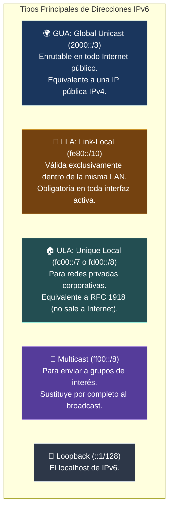
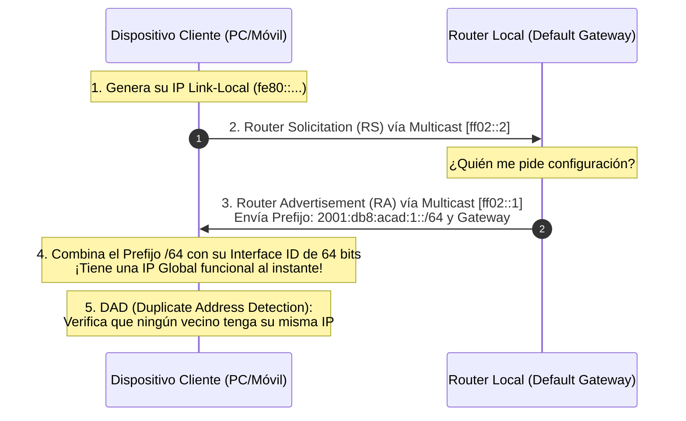

---
tags:
  - redes
  - ccna
  - ipv6
  - slaac
  - link-local
  - gua
  - eui-64
folder: "📂03 - Capa de Red y Direccionamiento"
aliases:
  - "Protocolo IPv6 (Estructura, Tipos y Autoconfiguración)"
  - "Direccionamiento IPv6 y SLAAC"
date: 2026-09-07
---

> [!info] 🧭 Navegación
> ◀ [[03.2 - Subnetting y VLSM (Cálculo Práctico de Subredes)]] · 🔼 [[00 - Índice Maestro de Redes]] · ▶ [[03.4 - Protocolos de Soporte en Capa 3 (ARP e ICMP)]]

---

# 🌌 03.3 - Protocolo IPv6 (Estructura, Tipos y Autoconfiguración)

## 1. ¿Por Qué Nació IPv6? La Muerte del Espacio IPv4

En febrero de 2011, la autoridad central de asignación de números de Internet (**IANA**) entregó los últimos cinco bloques `/8` de direcciones IPv4 a los Registros Regionales de Internet (RIRs). IPv4 se había quedado oficialmente sin espacio.

Aunque parches como [[06.3 - NAT, PAT y CGNAT (Traducción de Direcciones de Red)]] extendieron la vida útil de IPv4, introdujeron complejidad: rompieron la conectividad extremo a extremo, complicaron las conexiones P2P y aumentaron la latencia en routers.

La solución definitiva diseñada por el IETF es **IPv6** (RFC 8200):
- **Espacio de Direccionamiento Masivo**: De 32 bits en IPv4 saltamos a **128 bits**.
  $$2^{128} \approx 340.282.366.920.938.463.463.374.607.431.768.211.456 \text{ direcciones}$$
  *(Suficiente para asignar trillones de IPs a cada milímetro cuadrado de la superficie de la Tierra)*.
- **Cabecera Simplificada y Rápida**: Tiene un tamaño fijo de **40 bytes**. Se eliminaron campos lentos como el Checksum (los routers ya no pierden tiempo recalculándolo en cada salto) y los flags de fragmentación obligatoria.
- **Eliminación del Broadcast**: **¡En IPv6 el Broadcast NO existe!** Todo el tráfico que antes se inundaba a ciegas por la LAN se sustituye por **Multicast eficiente**, eliminando el ruido en los dispositivos cliente.

---

## 2. Formato y Reglas de Compresión Hexadecimal

Una dirección IPv6 se escribe en **notación hexadecimal** dividida en **8 grupos de 4 dígitos** (llamados **hextetos** o *quibbles*) separados por dos puntos (`:`):

```
 2001 : 0db8 : 85a3 : 0000 : 0000 : 8a2e : 0370 : 7334
 └───┘  └───┘  └───┘  └───┘  └───┘  └───┘  └───┘  └───┘
   1      2      3      4      5      6      7      8   (8 hextetos x 16 bits = 128 bits)
```

Dado que escribir 32 caracteres hexadecimales es engorroso y propenso a errores, el estándar RFC 5952 define **dos reglas universales de compresión**:

### Regla 1: Omisión de ceros a la izquierda
En cualquier hexteto individual, puedes omitir los ceros situados a la izquierda:
- `0db8` $\longrightarrow$ `db8`
- `0000` $\longrightarrow$ `0`
- `0370` $\longrightarrow$ `370` *(Ojo: los ceros finales NO se tocan, o cambiarías el valor numérico)*.

### Regla 2: Compresión de ceros contiguos con doble dos puntos (`::`)
Cualquier secuencia consecutiva de uno o más hextetos compuestos exclusivamente por ceros (`0000`) puede sustituirse por un único doble dos puntos (`::`).
- > [!warning] 🚨 La Restricción del Doble Dos Puntos
  > **El símbolo `::` solo puede usarse UNA SOLA VEZ por dirección.** Si lo usaras dos veces (ej. `2001::1::2`), ningún ordenador podría deducir cuántos ceros faltan en cada hueco para completar los 8 hextetos.

### Ejemplo Práctico de Compresión Paso a Paso
1. **Dirección completa original**:
   `2001:0db8:0000:0000:0000:0000:0042:0001`
2. **Aplicando Regla 1 (ceros a la izquierda)**:
   `2001:db8:0:0:0:0:42:1`
3. **Aplicando Regla 2 (comprimir la cadena de ceros más larga)**:
   `2001:db8::42:1` *(De 39 caracteres a tan solo 14)*.

---

## 3. Tipos de Direcciones IPv6

En IPv6 no existen clases. Las direcciones se clasifican por su alcance y propósito:



### Tabla Resumen de Direcciones IPv6

| Tipo | Prefijo / Rango | Alcance (*Scope*) | Propósito y Equivalente en IPv4 |
|:---|:---:|:---:|:---|
| **Global Unicast (GUA)** | `2000::/3` (típico `2001:...`) | Global (Todo Internet) | IP Pública normal para servidores y clientes navegando. |
| **Link-Local (LLA)** | `fe80::/10` | Local (Mismo enlace/cable) | Comunicación interna entre vecinos y routers. Obligatoria. |
| **Unique Local (ULA)** | `fc00::/7` (habitual `fd00::/8`) | Local a la organización | Direcciones privadas internas (como `192.168.x.x` o `10.x.x.x`). |
| **Multicast** | `ff00::/8` | Configurable en cabecera | `ff02::1` (Todos los nodos), `ff02::2` (Todos los routers). |
| **Loopback** | `::1/128` | Interno al host | Interfaz virtual local (Equivalente a `127.0.0.1`). |
| **No especificada** | `::/128` | Ninguno | Indica ausencia de IP al arrancar (Equivalente a `0.0.0.0`). |

---

## 4. Anatomía de una Dirección Global Unicast (GUA)

La arquitectura estándar recomendada para IPv6 es el **bloque `/64` por subred**. Toda dirección GUA se estructura de forma fija:

```
  ┌───────────────────────────────┬───────────────┬───────────────────────────────┐
  │ Prefijo Global de Enrutamiento│  Subnet ID    │       Interface ID (Host)     │
  │     48 bits (Asignado por ISP)│    16 bits    │             64 bits           │
  └───────────────────────────────┴───────────────┴───────────────────────────────┘
  ▲                                               ▲
  └────────────── Prefijo de Red (/64) ───────────┴──── Identificador del equipo ─┘
```

- **Prefijo Global (48 bits)**: Tu proveedor de Internet te entrega típicamente un bloque `/48` o `/56`.
- **Subnet ID (16 bits)**: Te permite crear **$2^{16} = 65.536$ subredes independientes** dentro de tu propia red corporativa o doméstica sin pedir permiso al ISP.
- **Interface ID (64 bits)**: La porción de host que identifica a la tarjeta de red.

---

## 5. Autoconfiguración: SLAAC vs. DHCPv6

En IPv4 necesitabas obligatoriamente un servidor DHCP para obtener IP automáticamente. En IPv6, los dispositivos pueden conectarse y autoasignarse una IP global válida sin necesidad de ningún servidor mediante **SLAAC** (*Stateless Address Autoconfiguration*).



### ¿Cómo genera el cliente sus 64 bits de Interface ID?
1. **Método EUI-64 (Clásico)**: Toma la dirección MAC de 48 bits, la divide por la mitad (`OUI` y `NIC`), inyecta en medio los 16 bits fijos `FF:FE` y conmuta el séptimo bit (U/L).
   - *Problema de Privacidad*: Dado que la MAC nunca cambia, rastreadores web podían seguir tu portátil por todo el mundo identificando tu MAC incrustada en tu IP.
2. **Privacy Extensions (RFC 4941 - Estándar Moderno)**: El sistema operativo genera un Interface ID completamente **aleatorio y temporal** que cambia cada 24 horas para navegar de forma anónima, reservando una fija solo para servidores.

---

## 6. Perspectiva de Ciberseguridad: Amenazas en IPv6

> [!warning] 🚨 La Trampa de la "Red sin IPv6"
> Muchos administradores de sistemas creen erróneamente: *"En mi empresa no usamos IPv6, así que no me preocupo"*.
> **Realidad técnica**: Por defecto, todos los sistemas operativos modernos (Windows 10/11, Linux, macOS) tienen la pila IPv6 activa con mayor prioridad de resolución que IPv4.
> - **Ataques de Rogue Router Advertisement (Rogue RA)**: Un atacante en la red local emite paquetes ICMPv6 RA falsos haciéndose pasar por router IPv6. En milisegundos, todos los PCs de la LAN adoptan al atacante como su Gateway predeterminado y comienzan a enviarle todo su tráfico por IPv6 sin que el firewall IPv4 corporativo se entere (un ataque Man-in-the-Middle perfecto).

---

## 7. Práctica en Terminal Linux: Explorando IPv6

```bash
# 1. Ver tus direcciones IPv6 (verás tanto la global como la link-local fe80)
ip -6 addr show

# 2. Hacer ping a la dirección loopback local de IPv6
ping -6 ::1

# 3. Comprobar la tabla de enrutamiento IPv6
ip -6 route show

# 4. Descubrir todos los vecinos IPv6 activos en tu enlace local mediante Multicast
# (Reemplaza eth0 por el nombre de tu interfaz)
ping -6 -c 3 -I eth0 ff02::1
```

> [!brain] 🔬 Salida de `ip -6 addr show`:
> ```text
> inet6 2001:db8:1::50/64 scope global dynamic noprefixroute
> inet6 fe80::5054:ff:fe12:3456/64 scope link
> ```
> Observa que la dirección con `scope link` (`fe80::...`) incluye `ff:fe` en el centro: ¡esa interfaz utilizó el algoritmo EUI-64 a partir de su dirección MAC física!

---

## 8. Resumen y Siguiente Paso

En esta nota hemos cubierto:
- Por qué IPv6 es indispensable y cómo su espacio de 128 bits entierra para siempre la escasez de IPs.
- Las dos reglas sagradas de compresión hexadecimal y el uso estricto del `::`.
- Los tipos GUA, Link-Local (`fe80`), ULA y Multicast.
- El mecanismo de autoconfiguración automática SLAAC mediante anuncios de router (RA).

En la siguiente nota ([[03.4 - Protocolos de Soporte en Capa 3 (ARP e ICMP)]]), analizaremos los dos protocolos de soporte vitales sin los cuales la Capa 3 no podría operar: la resolución de direcciones con **ARP** y los diagnósticos con **ICMP**.
