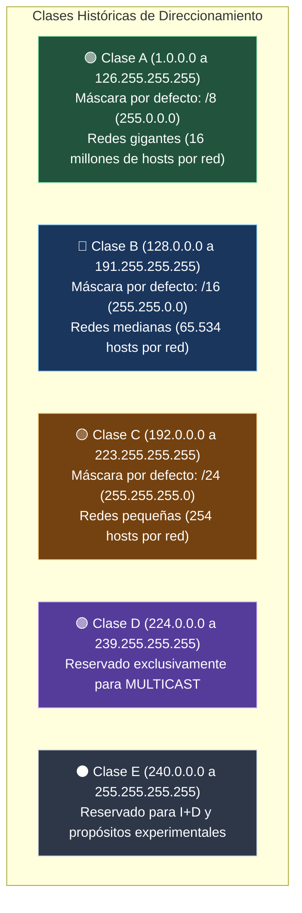

#redes #ccna #ipv4 #cabecera-ip #rfc1918 #apipa #cidr

> [!info] 🧭 Navegación
> ◀ [[🔀 02.3 - Conmutación, Switches, VLANs y Spanning Tree (STP)]] · 🔼 [[🌐 00 - Índice Maestro de Redes Informáticas]] · ▶ [[🧮 03.2 - Subnetting y VLSM (Cálculo Práctico de Subredes)]]

---

## 🌐 1. El Protocolo IP: El Pegamento Universal de Internet

El **Protocolo de Internet** (**IP** - *Internet Protocol*) opera en la **Capa 3 (Red)** y es el corazón de la arquitectura TCP/IP.
Las dos características operativas clave de IP son:

1. **No orientado a conexión (*Connectionless*)**: No establece una sesión previa antes de enviar paquetes (no hay "saludo" en Capa 3; cada paquete viaja como una carta independiente al buzón).
2. **Mejor esfuerzo (*Best Effort / No confiable*)**: El protocolo IP no garantiza que el paquete llegue, ni que llegue en orden, ni que no se duplique. Si un router sufre congestión, tira el paquete a la basura. La tarea de garantizar la entrega y ordenar los datos se delega por completo a la **Capa 4 (TCP)** ([[🤝 05.2 - Protocolo TCP (3-Way Handshake, Flujo y Confiabilidad)]]).

---

## 📍 2. Anatomía de la Cabecera IPv4

Un paquete IPv4 está formado por una **Cabecera** (de 20 bytes mínimos hasta 60 bytes si incluye opciones) y la **Carga Útil (*Payload*)** con los datos de las capas superiores.

```
 0                   1                   2                   3
 0 1 2 3 4 5 6 7 8 9 0 1 2 3 4 5 6 7 8 9 0 1 2 3 4 5 6 7 8 9 0 1
+-+-+-+-+-+-+-+-+-+-+-+-+-+-+-+-+-+-+-+-+-+-+-+-+-+-+-+-+-+-+-+-+
|Version|  IHL  |Type of Service|          Total Length         |
+-+-+-+-+-+-+-+-+-+-+-+-+-+-+-+-+-+-+-+-+-+-+-+-+-+-+-+-+-+-+-+-+
|         Identification        |Flags|      Fragment Offset    |
+-+-+-+-+-+-+-+-+-+-+-+-+-+-+-+-+-+-+-+-+-+-+-+-+-+-+-+-+-+-+-+-+
|  Time to Live |    Protocol   |        Header Checksum        |
+-+-+-+-+-+-+-+-+-+-+-+-+-+-+-+-+-+-+-+-+-+-+-+-+-+-+-+-+-+-+-+-+
|                       Source IP Address                       |
+-+-+-+-+-+-+-+-+-+-+-+-+-+-+-+-+-+-+-+-+-+-+-+-+-+-+-+-+-+-+-+-+
|                    Destination IP Address                     |
+-+-+-+-+-+-+-+-+-+-+-+-+-+-+-+-+-+-+-+-+-+-+-+-+-+-+-+-+-+-+-+-+
|                    Options (si IHL > 5) ...                   |
+-+-+-+-+-+-+-+-+-+-+-+-+-+-+-+-+-+-+-+-+-+-+-+-+-+-+-+-+-+-+-+-+
```

### 🔹 Campos Críticos de la Cabecera

1. **Version (4 bits)**: Siempre vale `4` (`0100` en binario) para IPv4 o `6` (`0110`) para IPv6.
2. **IHL (*Internet Header Length* - 4 bits)**: Tamaño de la cabecera en palabras de 32 bits (4 bytes). Típicamente vale `5` ($5 \times 4 = 20\text{ bytes}$).
3. **DSCP / ToS (8 bits)**: Priorización de paquetes para **Calidad de Servicio (QoS)** (voz sobre IP y videoconferencias tienen prioridad sobre descargas de ficheros).
4. **Total Length (16 bits)**: Longitud total del paquete (cabecera + payload) en bytes. El valor máximo teórico es de $65.535\text{ bytes}$.
5. **Identification, Flags y Fragment Offset (Control de Fragmentación)**:
   - Si un paquete de 1500 bytes debe atravesar un enlace con un **MTU** inferior (ej. un túnel VPN con MTU de 1400 bytes), el router debe trocear el paquete en fragmentos más pequeños.
   - **Flag DF (*Don't Fragment*)**: Si vale `1`, prohíbe terminantemente fragmentar el paquete. Si el router no puede enviarlo entero, lo destruye y responde con un mensaje ICMP de error (base del algoritmo *Path MTU Discovery*).
   - **Flag MF (*More Fragments*)**: Vale `1` si vienen más trozos detrás; vale `0` en el último fragmento.
6. **Time to Live (TTL - 8 bits)**:
   - Contador entero (típicamente 64 en Linux, 128 en Windows).
   - **Cada router que procesa el paquete le resta 1 al TTL**.
   - Si el TTL llega a `0`, el router descarta el paquete y devuelve un mensaje `ICMP Time-to-Live Exceeded`. Esto **evita que los paquetes viajen eternamente en bucles de enrutamiento** y es el principio físico que utiliza la herramienta `traceroute`.
7. **Protocol (8 bits)**: Indica a qué protocolo de Capa 4 se deben entregar los datos al llegar:
   - `1`: ICMP ([[🛠️ 03.4 - Protocolos de Soporte en Capa 3 (ARP e ICMP)]])
   - `6`: TCP ([[🤝 05.2 - Protocolo TCP (3-Way Handshake, Flujo y Confiabilidad)]])
   - `17`: UDP ([[⚡ 05.3 - Protocolo UDP (Datagramas, Rendimiento y QUIC)]])
   - `89`: OSPF ([[🚀 04.2 - Protocolos de Enrutamiento Dinámico (RIP, OSPF y BGP)]])
8. **Source & Destination IP (32 bits cada una)**: La dirección lógica de origen y de destino.

---

## 📍 3. Direcciones IPv4: Notación y Clases Históricas

Una dirección IPv4 tiene una longitud exacta de **32 bits** (4 bytes). Para que sea legible por humanos, se representa en **formato decimal por puntos** (*Dotted-Decimal Notation*), dividida en 4 octetos:

$$\underbrace{192}_{\text{Octeto 1}} \ . \ \underbrace{168}_{\text{Octeto 2}} \ . \ \underbrace{1}_{\text{Octeto 3}} \ . \ \underbrace{10}_{\text{Octeto 4}} \quad \longrightarrow \quad \text{32 bits binarios}$$

### 🔹 Clases Históricas de Red (*Classful Addressing - Obsoletas pero Fundacionales*)

En los albores de Internet (RFC 791), el espacio de direccionamiento se dividió rígidamente en 5 clases según el valor del primer octeto:



> [!tip] 💡 ¿Por qué murió el direccionamiento con clase?
> El sistema con clase provocó un colosal desperdicio de direcciones: si una empresa necesitaba 300 direcciones IP, una Clase C (/24 con 254 IPs) no le bastaba, por lo que se le otorgaba una Clase B (/16 con 65.534 IPs), desperdiciando más de 65.000 direcciones. 
> En 1993 nació **CIDR** (*Classless Inter-Domain Routing*), que permite crear máscaras de subred de cualquier tamaño arbitrario ([[🧮 03.2 - Subnetting y VLSM (Cálculo Práctico de Subredes)]]).

> [!abstract] 🎭 ¿Para qué sirve la Máscara y qué significa que "bloquea" la red?
> Una IP por sí sola no sirve para nada (es como dar un número de portal sin nombre de calle). La máscara funciona como una **plantilla troquelada de pintor**: los `255` congelan ("bloquean") los números comunes de la red (la calle), y los `0` dejan libres los números de cada equipo (el portal). 
> Permite al ordenador decidir si el destino es un vecino local (mismo switch) o si debe mandarlo al router.
> ➔ Explicación detallada con diagramas y analogías: [[🧮 03.2 - Subnetting y VLSM (Cálculo Práctico de Subredes)#🔹 2. Anatomía y Propósito Real de la Máscara de Subred|Ver explicación visual de la Máscara de Red]].

---

## ⚖️ 4. Direcciones IP Privadas (RFC 1918) vs. Direcciones Públicas

Con el crecimiento exponencial de Internet a mediados de los 90, el espacio de $2^{32} \approx 4.294.967.296$ direcciones IPv4 comenzó a agotarse velozmente. Como solución de rescate, el **RFC 1918** reservó tres rangos de direcciones designadas exclusivamente como **Direcciones Privadas**:

| Clase Original | Rango de Direcciones Privadas RFC 1918 | Prefijo CIDR | Nº Total de IPs Disponibles | Ámbito Típico |
|:---:|:---|:---:|:---:|:---|
| **Clase A** | `10.0.0.0` a `10.255.255.255` | `10.0.0.0/8` | 16.777.216 | Grandes corporaciones, nubes (AWS VPC, Azure) y redes celulares. |
| **Clase B** | `172.16.0.0` a `172.31.255.255` | `172.16.0.0/12` | 1.048.576 | Universidades, centros de datos y redes Docker por defecto. |
| **Clase C** | `192.168.0.0` a `192.168.255.255` | `192.168.0.0/16` | 65.536 | Redes domésticas (hogares) y pequeñas oficinas (SOHO). |

### 🔹 La Regla de Oro del RFC 1918

- **Las direcciones privadas NO son enrutables en Internet público**: Los routers de los proveedores de Internet (Tier 1 e ISP) tienen reglas estrictas que descartan inmediatamente cualquier paquete cuya IP de destino pertenezca a estos rangos.
- Miles de empresas y hogares pueden reutilizar exactamente la misma IP privada `192.168.1.15` al mismo tiempo sin entrar en conflicto, porque para salir a Internet su tráfico pasa por un router que realiza **NAT/PAT** ([[🔁 06.3 - NAT, PAT y CGNAT (Traducción de Direcciones de Red)]]).

---

## 📍 5. Direcciones IPv4 Especiales y Reservadas

No todas las IPs están destinadas a hosts o navegación. Estas son las direcciones especiales que encontrarás a diario:

1. **Loopback / Interfaz Local (`127.0.0.0/8`)**:
   - Se utiliza para que un equipo se comunique consigo mismo a través de la pila TCP/IP sin sacar tráfico al cable.
   - La dirección más famosa es `127.0.0.1` (`localhost`). Si ejecutas `ping 127.0.0.1` y responde, sabes que la pila TCP/IP y el software de red de tu sistema operativo funcionan correctamente.
2. **APIPA / Enlace Local (*Automatic Private IP Addressing* - `169.254.0.0/16`)**:
   - Si mi ordenador tiene configurado obtener IP por DHCP pero el servidor DHCP está caído o el cable no recibe respuesta, el sistema operativo (Windows/Linux/macOS) se autoasigna una IP en el rango `169.254.x.x`.
   - > [!warning] 🚨 Síntoma Clásico de Soporte Técnico
     > Si ves que mi ordenador tiene la IP `169.254.45.89`, **tu servidor DHCP no te está respondiendo**. Tienes enlace físico (Capa 1/2), pero nadie te asignó configuración en Capa 3.
3. **Dirección de Red y Dirección de Broadcast**:
   - **Dirección de Red** (todos los bits de host a `0`, ej. `192.168.1.0/24`): Identifica a la subred como un todo en las tablas de rutas. Nunca se asigna a un dispositivo final.
   - **Dirección de Broadcast Dirigido** (todos los bits de host a `1`, ej. `192.168.1.255/24`): Si envías un paquete a esta IP, el switch lo reenvía a todas las máquinas de la subred local.
4. **Ruta por Defecto / Dirección Indeterminada (`0.0.0.0/0`)**:
   - En una tabla de enrutamiento representa *"Cualquier destino / Internet"* (*Gateway of Last Resort*).
   - En un servicio en escucha (`0.0.0.0:80`) indica que el servidor web acepta peticiones por todas sus interfaces de red simultáneamente.

---

## 🛡️ 6. Perspectiva de Ciberseguridad (Pentesting)

> [!warning] 🚨 Vectores de Ataque sobre Capa 3
> 1. **IP Spoofing (Falsificación de IP Origen)**:
>    Dado que el protocolo IP no valida criptográficamente si la dirección de origen es real, un atacante puede generar paquetes UDP o ICMP crudos con la IP origen de una víctima para:
>    - Evadir listas de control de acceso (ACLs) perimetrales.
>    - Ejecutar ataques de **DDoS por Amplificación DNS/NTP** (el atacante envía una consulta minúscula a un servidor con la IP falsificada de la víctima; el servidor responde con un paquete 50 veces mayor saturando a la víctima).
> 2. **IP ID Idle Scan (*Zombie Scan* en Nmap)**:
>    El escáner `nmap -sI` permite escanear un objetivo de forma 100% invisible utilizando una máquina intermedia (*zombie*) inactiva, aprovechando los incrementos secuenciales del campo **Identification** de la cabecera IPv4.

---

## 💻 7. Práctica en Terminal Linux: Inspección y Pruebas con IPv4

```bash
# 1. Ver detalles de direcciones IPv4, máscara de subred y broadcast

ip -4 addr show

# 2. Comprobar la tabla de rutas y el Gateway predeterminado (Default Gateway)

ip -4 route show

# 3. Comprobar la salud de la pila TCP/IP local con loopback

ping -c 3 127.0.0.1

# 4. Forzar un TTL específico para comprobar cómo responden los routers intermedios

# (Si pones TTL=1, el primer router descartará el paquete de inmediato)

ping -c 1 -t 1 8.8.8.8
```

> [!brain] 🔬 Salida de `ping -t 1`:
> ```text
> From 192.168.1.1 icmp_seq=1 Time to live exceeded
> ```
> Tu propio router doméstico (`192.168.1.1`) restó 1 al TTL, el valor llegó a 0 y destruyó el paquete, enviándote de vuelta este error ICMP. ¡Acabas de reproducir manualmente cómo funciona el primer salto de `traceroute`!

---

## 📌 8. Resumen y Siguiente Paso

En esta nota he dominado:

- El carácter *connectionless* y *best-effort* del Protocolo IP.
- Todos los campos clave de la cabecera IPv4 (TTL, flags de fragmentación, protocolo).
- El direccionamiento con clase histórico y las direcciones privadas del RFC 1918.
- Los rangos especiales (Loopback `127.0.0.1` y APIPA `169.254.x.x`).

En la siguiente nota ([[🧮 03.2 - Subnetting y VLSM (Cálculo Práctico de Subredes)]]), entro en el cálculo matemático de subredes: aprendo a calcular máscaras CIDR, direcciones de red, broadcast y cómo diseñar esquemas eficientes con **VLSM** en cuestión de segundos.
