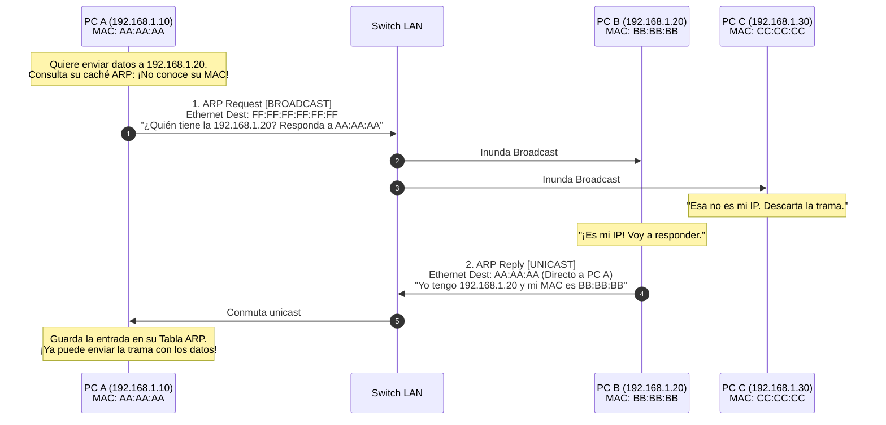
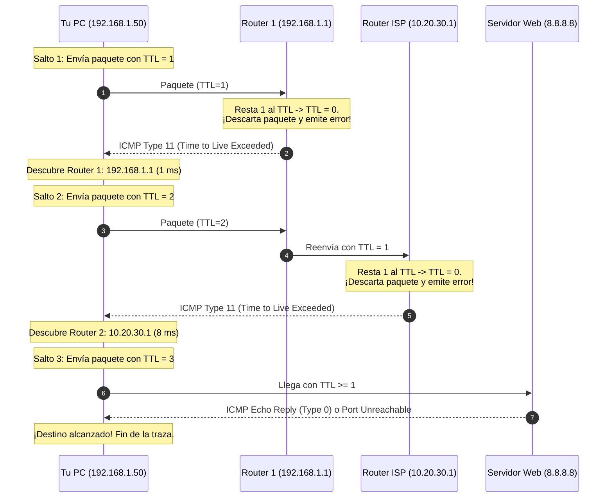

#redes #ccna #arp #icmp #traceroute #ping #arp-spoofing #ciberseguridad

> [!info] 🧭 Navegación
> ◀ [[🌌 03.3 - Protocolo IPv6 (Estructura, Tipos y Autoconfiguración)]] · 🔼 [[🌐 00 - Índice Maestro de Redes Informáticas]] · ▶ [[🧭 04.1 - Fundamentos de Routers y Enrutamiento Estático]]

---

## 🛠️ 1. El Puente entre Capas: ¿Por Qué Necesitamos Protocolos de Soporte?

El Protocolo IP (Capa 3) es brillante enrutando paquetes de una red a otra, pero tiene dos limitaciones operativas críticas:
En la pila de protocolos, la **Capa 3 (IP)** maneja direcciones lógicas globales (`192.168.1.1`), pero la tarjeta de red en la **Capa 2 (Ethernet)** solo sabe enviar voltajes o luz a una dirección física **MAC** (`00:1A:2B:3C:4D:5E`).

Sin un mecanismo que traduzca *"¿Quién tiene esta IP y cuál es su MAC?"*, la red se detendría por completo. Ese mecanismo es el protocolo **ARP**.

Asimismo, la red necesita un sistema de mensajería interna para informar de errores, paquetes perdidos, enlaces caídos o realizar pruebas de diagnóstico. Ese sistema de control es el protocolo **ICMP**.

---

## 📍 2. ARP (Address Resolution Protocol - RFC 826)

El protocolo **ARP** opera entre la Capa 2 y la Capa 3 con una única misión: **resolver una dirección IPv4 conocida a su correspondiente dirección física MAC**.



> [!abstract] 🏠 Analogía: El Nombre y la Cara en la Sala de Reuniones
> Entras en una sala con 50 personas desconocidas. En tu papel pone: *"Debes entregarle este informe confidencial a Carlos García"*. No sabes qué cara tiene Carlos.
> 1. Te pones en medio de la sala y **gritas a todos (Broadcast)**: *"¿Quién de vosotros es Carlos García?"*.
> 2. Las 49 personas que no se llaman Carlos te ignoran.
> 3. Carlos se levanta, se acerca **solo a ti (Unicast)** y te dice: *"Soy yo"*.
> 4. Te guardas su cara en tu memoria (tu tabla ARP) para no tener que volver a gritar durante los próximos 5 minutos.

### ⚖️ La Tabla / Caché ARP

Para evitar inundar la red con peticiones de broadcast por cada paquete que se envía, los sistemas operativos almacenan las asociaciones aprendidas en su **Caché ARP**:

- En Linux, las entradas dinámicas suelen expirar tras un periodo de inactividad de 60 a 300 segundos.
- Puedes inspeccionar tu tabla con `ip neigh show` o `arp -a`.

### 📍 Gratuitous ARP (GARP)

Un **ARP Gratuito** es un paquete ARP que un equipo envía sin que nadie se lo haya pedido, preguntando por su propia dirección IP:

- **Detección de IPs duplicadas**: Al arrancar, si alguien responde a su propio GARP, el sistema sabe que otro equipo ya está usando esa IP y alerta de conflicto.
- **Actualización de Switches en Clústeres (VRRP/HSRP)**: Si un servidor secundario toma el relevo de un servidor caído, emite un GARP para que todos los switches de la empresa apunten de inmediato el tráfico hacia su nueva tarjeta de red.

> [!note] ¿Y cómo funciona en IPv6?
> En IPv6 el protocolo ARP **se eliminó**. Su función la asume **NDP** (*Neighbor Discovery Protocol*), que utiliza mensajes ICMPv6 (**Neighbor Solicitation** y **Neighbor Advertisement**) enviados mediante Multicast, sin generar broadcasts.

---

## 📍 3. ICMP (Internet Control Message Protocol - RFC 792)

**ICMP** es el protocolo de diagnóstico y reporte de incidentes de la capa de red. Aunque ayuda a Capa 3, **sus mensajes viajan encapsulados directamente dentro de un paquete IP** (Protocol = `1` en IPv4).

### 📍 Anatomía y Mensajes Clave de ICMP

| Tipo (*Type*) | Código (*Code*) | Nombre / Significado | Causa Habitual / Uso |
|:---:|:---:|:---|:---|
| **0** | 0 | **Echo Reply** | Respuesta positiva a un comando `ping`. |
| **3** | 0 | **Destination Network Unreachable** | El router no tiene ninguna ruta para llegar a esa red. |
| **3** | 1 | **Destination Host Unreachable** | El router local de la red destino intentó hacer ARP pero nadie respondió. |
| **3** | 3 | **Destination Port Unreachable** | El paquete llegó al host, pero no hay ninguna aplicación escuchando en ese puerto UDP. |
| **3** | 4 | **Fragmentation Needed and DF set** | El paquete es mayor que el MTU del enlace y tiene activo el flag *Don't Fragment*. |
| **8** | 0 | **Echo Request** | Petición enviada al ejecutar `ping`. |
| **11** | 0 | **Time to Live Exceeded in Transit** | **El TTL del paquete llegó a 0** en un router intermedio. Base del comando `traceroute`. |

---

## 🔹 4. El Secreto Bajo el Capó de `traceroute`

Muchos administradores creen que `traceroute` (o `tracert` en Windows) utiliza un protocolo especial. En realidad, es un truco brillante que explota el campo **TTL** de la cabecera IPv4 y los mensajes de error **ICMP Type 11**:



---

## 🛡️ 5. Perspectiva de Ciberseguridad: Ataques L2/L3

> [!warning] 🚨 El Talón de Aquiles: ARP Spoofing (Envenenamiento ARP)
> El protocolo ARP se diseñó en 1982 **sin ningún tipo de autenticación ni verificación de firma**. Un equipo acepta ciegamente cualquier respuesta ARP que reciba, ¡incluso si nunca preguntó por ella!
> 
> **Cómo funciona el ataque Man-in-the-Middle (MitM) con `arpspoof`**:
> 1. Un atacante en la red local envía constantes respuestas ARP falsas a la **Víctima**: *"Oye, el Gateway `192.168.1.1` soy yo (MAC del atacante)"*.
> 2. Al mismo tiempo, engaña al **Router/Gateway**: *"Oye, la Víctima `192.168.1.50` soy yo (MAC del atacante)"*.
> 3. En segundos, ambas tablas ARP se envenenan. Todo el tráfico de la víctima pasa primero por la tarjeta del atacante, quien lo inspecciona con Wireshark y lo reenvía al router sin que nadie note la interrupción.
> 
> **Cómo mitigarlo profesionalmente en switches Cisco**:
> - Habilitar **DAI (*Dynamic ARP Inspection*)**: El switch intercepta todas las peticiones y respuestas ARP, contrastándolas contra la base de datos de asignaciones fiables de **DHCP Snooping**. Si la MAC y la IP no coinciden con lo que el DHCP otorgó, descarta el paquete y bloquea el puerto.

---

## 💻 6. Práctica en Terminal Linux: Inspección de Vecinos y Diagnóstico

```bash
# 1. Ver la tabla ARP completa (Capa 3 -> Capa 2)

ip neigh show

# 2. Borrar una entrada de la tabla ARP para forzar una nueva resolución

sudo ip neigh del 192.168.1.1 dev eth0

# 3. Capturar en vivo solo tráfico ARP e ICMP con tcpdump

sudo tcpdump -i eth0 -nn -vvv "arp or icmp"

# 4. Trazar la ruta exacta hacia un servidor público descubriendo los routers intermedios

traceroute -n 1.1.1.1
```

> [!brain] 🔬 Salida de `ip neigh show`:
> ```text
> 192.168.1.1 dev eth0 lladdr 00:11:22:33:44:55 REACHABLE
> 192.168.1.100 dev eth0 lladdr aa:bb:cc:dd:ee:ff STALE
> ```
> - `REACHABLE`: La entrada es válida y ha sido confirmada recientemente.
> - `STALE`: El temporizador ha expirado; la próxima vez que envíes datos a esa IP, el kernel lanzará una nueva petición ARP.

---

## 📌 7. Resumen y Siguiente Paso

Con esta nota concluyo el **Bloque 3**. He dominado:

- El protocolo IP, su cabecera y el direccionamiento privado RFC 1918.
- La matemática de máscaras CIDR, subredes FLSM y diseño con VLSM.
- La estructura y autoconfiguración SLAAC de IPv6.
- El funcionamiento de ARP y los diagnósticos esenciales de ICMP con `ping` y `traceroute`.

En el **Bloque 4** daremos el salto a la interconexión entre redes distintas: comenzaremos con [[🧭 04.1 - Fundamentos de Routers y Enrutamiento Estático]] para entender cómo los routers toman decisiones de salto a salto.
