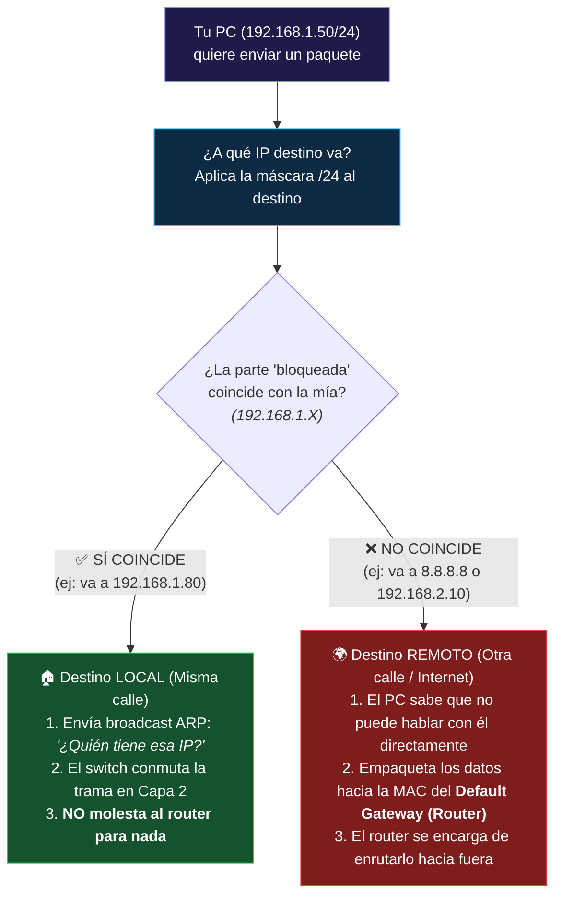
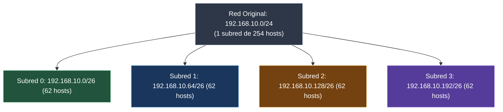

#redes #ccna #subnetting #vlsm #cidr #mascara-red #calculo-ip

> [!info] 🧭 Navegación
> ◀ [[🌐 03.1 - Protocolo IP y Direccionamiento IPv4]] · 🔼 [[🌐 00 - Índice Maestro de Redes Informáticas]] · ▶ [[🌌 03.3 - Protocolo IPv6 (Estructura, Tipos y Autoconfiguración)]]

---

## 🧮 1. ¿Por Qué Hacemos Subnetting?

El **Subnetting** (o subdivisión en subredes) es el proceso de dividir una red física o lógica grande en múltiples subredes más pequeñas e independientes.
Las razones fundamentales para hacer subnetting son:

1. **Reducción de Dominios de Difusión (*Broadcast*)**: Una red con 2.000 ordenadores colapsaría por el tráfico continuo de peticiones ARP ([[🛠️ 03.4 - Protocolos de Soporte en Capa 3 (ARP e ICMP)]]). Al dividirla en 8 subredes de 250 equipos, el broadcast se contiene localmente.
2. **Seguridad y Control de Tráfico**: Permite aplicar listas de control de acceso (ACLs) y reglas de firewall entre departamentos (ej. prohibir que la subred de Invitados acceda a la subred de Servidores).
3. **Eficiencia en el Uso de Direcciones**: Evita el desperdicio masivo de direcciones IPv4.

---

## 🔹 2. Anatomía y Propósito Real de la Máscara de Subred

### ❓ ¿Para Qué Sirve Realmente la Máscara? (El Gran Dilema)

Si a cualquier ordenador o router le das únicamente una dirección IP como `192.168.1.50`, **no tiene ni idea de qué hacer con ella**:

* ¿Dónde termina el identificador de la red y dónde empieza el número del equipo?
* ¿Está en una red gigante con 16 millones de máquinas, o en una red pequeña de oficina con 30 equipos?
* Si quiere enviar un paquete a `192.168.1.80`, ¿está ese equipo en la misma sala (mismo switch) o tiene que mandárselo al router?

> [!important] La Regla de Oro
> **Una dirección IP por sí sola no dice nada.** Es como decir que vives en el número "45", sin especificar la calle ni la ciudad. 
> La **Máscara de Subred** es la regla obligatoria que le dice al ordenador: *"De todos estos números, cuáles representan la calle (la Red) y cuáles representan el número de portal (el Host)"*.

---

### 🎨 La Analogía Visual: La Plantilla de Pintor (Por Qué se Llama "Máscara")

El término no es casualidad: funciona exactamente igual que una **máscara de pintar** o una **plantilla de cartón troquelada**:

1. Imagina que tienes una cartulina con 4 casillas para escribir números.
2. En las casillas que tapas con cartón sólido opaco (**los `255` o `1`s lógicos**), la tinta no puede cambiar: **esa parte queda "bloqueada" o "congelada"**. Representa el nombre de tu calle.
3. En las casillas donde recortas un agujero (**los `0`s lógicos**), puedes escribir lo que quieras: **esa parte queda libre**. Representa el número de cada casa o equipo.

```text
       Dirección IP:   192   .   168   .     1   .    50
                       │         │           │        │
     Máscara (/24):    255   .   255   .   255   .     0
                       ▼         ▼           ▼        ▼
                   [BLOQUEADO][BLOQUEADO][BLOQUEADO] [LIBRE]
                   └────── PARTE DE RED ───────────┘ └─ HOST ─┘
```

* **La parte "bloqueada" (`192.168.1`):** Todos los ordenadores, impresoras, móviles y servidores que convivan en esta red local **TIENEN que compartir exactamente estos mismos números**. Si un equipo cambia aunque sea un número de esta zona, automáticamente pertenece a otra red distinta.
* **La parte "libre" (`.50`):** Aquí cada dispositivo se pone un número único (del 1 al 254). No se pueden repetir dentro de la misma sala, pero son libres.

---

### 🚦 El Semáforo de Decisiones del Ordenador: ¿Vecino Local o Router?

Esta es la **utilidad práctica número 1** de la máscara en la vida real. Tu ordenador no tiene ojos físicos para mirar a su alrededor; solo tiene la máscara para tomar decisiones en microsegundos cada vez que envías un mensaje:



> [!example] Ejemplo Práctico de la Vida Real
> * **Si haces `ping 192.168.1.80`:**
>   * Tu PC ve que su máscara `/24` bloquea los tres primeros octetos (`192.168.1`).
>   * Como el destino también empieza por `192.168.1`, concluye: *"¡Es mi vecino de red! Hablo con él directamente a través del switch"*.
> * **Si haces `ping 8.8.8.8` (DNS de Google) o `ping 192.168.2.50` (otro departamento):**
>   * Tu PC compara: `8.8.8` o `192.168.2` **no coincide** con su parte bloqueada `192.168.1`.
>   * Concluye: *"¡Este equipo no vive en mi calle! Se lo entrego a mi Default Gateway (la IP del router) para que él lo envíe a Internet o a la otra VLAN"*.

---

### ⚙️ ¿Por Qué el 255 Bloquea y el 0 Deja Libre? (La Magia del AND Binario)

A nivel de procesador y circuitos electrónicos, los ordenadores no entienden números decimales, solo ceros y unos. 

Una máscara siempre son **unos consecutivos seguidos de ceros consecutivos**:

* Un `255` en decimal es en binario: `11111111` (8 unos).
* Un `0` en decimal es en binario: `00000000` (8 ceros).

Para aislar la red, la tarjeta de red aplica la compuerta lógica **AND** bit a bit entre la IP y la Máscara:

$$\text{Regla AND: Solo si ambos son 1, el resultado es 1. Cualquier cosa combinada con 0 da 0.}$$

```text
  IP del Host:     192  .  168  .    1  .   50   ➔  11000000.10101000.00000001 . 00110010
  Máscara:         255  .  255  .  255  .    0   ➔  11111111.11111111.11111111 . 00000000
  ────────────────────────────────────────────────────────────────────────────────────────────
  Resultado (AND): 192  .  168  .    1  .    0   ➔  11000000.10101000.00000001 . 00000000
                   └─────── PARTE BLOQUEADA ─────┘  └────── REINICIADO A CERO (HOST) ───────┘
                                                    (Dirección de Red: 192.168.1.0)
```

* **Donde la máscara tiene `1`s (`255`):** El número de la IP **se calca idéntico** (queda bloqueado y revelado).

* **Donde la máscara tiene `0`s (`0`):** El número del host **se borra por completo** (se apaga a cero).

* **El resultado final es la Dirección de Red (`192.168.1.0`):** El "apellido común" que identifica a todo el grupo en las tablas de enrutamiento.

---

### ✂️ ¿Y Qué Pasa Cuando la Máscara Corta a Mitad de un Número? (Subnetting)

Hasta ahora hemos visto el caso fácil: la máscara `/24` (`255.255.255.0`) corta justo en un punto decimal. 

Pero, ¿qué pasa si en tu empresa solo tienes 25 empleados en lugar de 254? Si usas una máscara `/24`, desperdiciarías más de 220 IPs.
Aquí es donde entra el **Subnetting**: movemos el corte de la tijera **hacia la derecha**, robando algunos ceros de los hosts para convertirlos en unos de red:

Por ejemplo, con una máscara **/27** (`255.255.255.224`):
* En binario, el último octeto tiene **3 unos y 5 ceros**: `11100000` (`128 + 64 + 32 = 224`).
* Ahora la máscara no solo bloquea `192.168.1`, ¡también **bloquea los primeros 3 bits del último número**!
* Solo quedan **5 bits libres** para los equipos: $2^5 - 2 = \mathbf{30 \text{ hosts por subred}}$.

```text
  Máscara /27:     11111111 . 11111111 . 11111111 . 1 1 1 0 0 0 0 0  (255.255.255.224)
                   └─────────── RED BLOQUEADA ───────────┘ └ HOST ┘
                                                           (5 bits libres = 30 equipos)
```

En lugar de una sola gran avenida de 254 casas, la máscara ha levantado **muros divisorios** dentro del mismo rango, dividiéndolo en pequeños vecindarios independientes de 30 casas cada uno (`.0`, `.32`, `.64`, `.96`...).

---

## ⚖️ 3. La Tabla Mágica del Subnetting (Memorización CCNA)

Para calcular subredes mentalmente en segundos sin hacer conversiones binarias completas, memoriza esta tabla del último octeto:

| Posición del Bit | $2^7$ | $2^6$ | $2^5$ | $2^4$ | $2^3$ | $2^2$ | $2^1$ | $2^0$ |
|:---|:---:|:---:|:---:|:---:|:---:|:---:|:---:|:---:|
| **Valor Decimal del Bit (*Salto Mágico*)** | **128** | **64** | **32** | **16** | **8** | **4** | **2** | **1** |
| **Máscara Decimal Acumulada** | **.128** | **.192** | **.224** | **.240** | **.248** | **.252** | **.254** | **.255** |
| **Prefijo CIDR (sobre red /24)** | `/25` | `/26` | `/27` | `/28` | `/29` | `/30` | `/31` | `/32` |
| **Bits de Host Restantes ($h$)** | 7 | 6 | 5 | 4 | 3 | 2 | 1 | 0 |
| **Hosts Útiles ($2^h - 2$)** | 126 | 62 | 30 | 14 | 6 | 2 | 2* | 1* |

### 🔹 Las Dos Fórmulas Sagradas

1. **Número de Subredes Creadas**: $2^s$ (donde $s$ es la cantidad de bits "robados" a la porción de host).
2. **Número de Hosts Útiles por Subred**: $2^h - 2$ (donde $h$ es la cantidad de bits de host restantes).
   - *¿Por qué se resta 2?* Porque **la primera dirección representa a la Red** y **la última representa al Broadcast**. Ninguna de las dos puede asignarse a un PC o tarjeta de red.

---

## 📍 4. Subnetting con Máscara Fija (FLSM - Fixed Length Subnet Mask)

En FLSM, dividimos una red en subredes de **idéntico tamaño**.

### 🔹 Ejercicio Práctico Paso a Paso

**Objetivo**: Tienes la red `192.168.10.0/24` y necesitas crear **4 subredes** para cuatro departamentos de tu empresa (Ventas, Contabilidad, IT y Almacén).



#### 🔹 Paso 1: ¿Cuántos bits necesitamos pedir prestados?

- Buscamos $2^s \ge 4$ subredes $\longrightarrow$ $2^2 = 4$. Necesitamos **2 bits**.
- La nueva máscara será: $24 + 2 = \mathbf{/26}$ (`255.255.255.192`).

#### 📍 Paso 2: Calcular el "Número Mágico" (El Salto entre Subredes)

- El salto es el valor decimal del último bit tomado prestado, o la fórmula universal:
  $$\text{Salto} = 256 - \text{Máscara} = 256 - 192 = \mathbf{64}$$
- Cada subred comenzará sumando 64 en el último octeto.

#### ⚖️ Paso 3: Construir la Tabla de Subredes

| Subred | Dirección de Red | Primera IP Útil (Red + 1) | Última IP Útil (Broadcast - 1) | Dirección de Broadcast | Máscara |
|:---:|:---|:---|:---|:---|:---:|
| **0** | `192.168.10.0` | `192.168.10.1` | `192.168.10.62` | `192.168.10.63` | `/26` |
| **1** | `192.168.10.64` | `192.168.10.65` | `192.168.10.126` | `192.168.10.127` | `/26` |
| **2** | `192.168.10.128` | `192.168.10.129` | `192.168.10.190` | `192.168.10.191` | `/26` |
| **3** | `192.168.10.192` | `192.168.10.193` | `192.168.10.254` | `192.168.10.255` | `/26` |

---

## 📍 5. VLSM (Variable Length Subnet Mask): La Técnica Profesional

En el mundo real, los departamentos no tienen el mismo número de ordenadores:

- Servidores: 50 hosts
- Oficinas: 25 hosts
- Enlace entre dos routers (punto a punto): **¡Solo 2 hosts!**

Si usamos FLSM con `/26` (bloques de 64), para conectar dos routers desperdiciaríamos 60 IPs útiles. **VLSM permite usar máscaras de diferentes tamaños en una misma topología.**

> [!tip] 💡 La Regla de Oro Inquebrantable de VLSM
> **Ordena SIEMPRE los requerimientos de mayor a menor número de hosts necesarios** antes de asignar la primera dirección IP. Si no lo haces, solaparás subredes y corromperás el enrutamiento.

### 📍 Caso Práctico Resuelto de VLSM

**Dirección Base**: `10.0.0.0/24` (Disponemos de 254 IPs).
**Requerimientos**:

1. **Sede Central**: 100 hosts
2. **Sucursal Norte**: 40 hosts
3. **Sucursal Sur**: 10 hosts
4. **Enlace WAN Router 1 a Router 2**: 2 hosts

```
  ESPACIO 10.0.0.0/24 (Total 256 direcciones)
  ┌───────────────────────────────┬───────────────┬───────┬───┐
  │ Sede Central (100 hosts)     │ Sucursal Norte│ Sur   │WAN│
  │ /25 (128 direcciones)         │ /26 (64 dirs) │/28(16)│/30│
  └───────────────────────────────┴───────────────┴───────┴───┘
  0                              128             192     208 212
```

#### 🔹 1. Sede Central (100 hosts)

- Buscamos $2^h - 2 \ge 100 \longrightarrow 2^7 - 2 = 126$ hosts útiles ($h=7$).
- Máscara: $32 - 7 = \mathbf{/25}$ (`255.255.255.128`). Salto: 128.
- **Red**: `10.0.0.0/25` | **Rango útil**: `10.0.0.1` a `10.0.0.126` | **Broadcast**: `10.0.0.127`

#### 🔹 2. Sucursal Norte (40 hosts)

- Tomamos la siguiente IP libre: `10.0.0.128`.
- Buscamos $2^h - 2 \ge 40 \longrightarrow 2^6 - 2 = 62$ hosts útiles ($h=6$).
- Máscara: $32 - 6 = \mathbf{/26}$ (`255.255.255.192`). Salto: 64.
- **Red**: `10.0.0.128/26` | **Rango útil**: `10.0.0.129` a `10.0.0.190` | **Broadcast**: `10.0.0.191`

#### 🔹 3. Sucursal Sur (10 hosts)

- Siguiente IP libre: `10.0.0.192`.
- Buscamos $2^h - 2 \ge 10 \longrightarrow 2^4 - 2 = 14$ hosts útiles ($h=4$).
- Máscara: $32 - 4 = \mathbf{/28}$ (`255.255.255.240`). Salto: 16.
- **Red**: `10.0.0.192/28` | **Rango útil**: `10.0.0.193` a `10.0.0.206` | **Broadcast**: `10.0.0.207`

#### 🔗 4. Enlace WAN Punto a Punto (2 hosts)

- Siguiente IP libre: `10.0.0.208`.
- Buscamos $2^h - 2 \ge 2 \longrightarrow 2^2 - 2 = 2$ hosts útiles ($h=2$).
- Máscara: $32 - 2 = \mathbf{/30}$ (`255.255.255.252`). Salto: 4.
- **Red**: `10.0.0.208/30` | **Rango útil**: `10.0.0.209` a `10.0.0.210` | **Broadcast**: `10.0.0.211`

> [!brain] 🔬 Subredes /30, /31 y /32 en CCNA
> - **/30**: El estándar clásico para enlaces punto a punto entre routers (4 IPs: 1 red, 2 útiles, 1 broadcast).
> - **/31 (RFC 3021)**: Estándar moderno en routers de centros de datos que permite 2 IPs útiles en un enlace punto a punto **sin gastar red ni broadcast**.
> - **/32**: Apunta a **un solo host exacto** (`255.255.255.255`). Se usa en interfaces virtuales Loopback de routers para monitorización y routing OSPF/BGP.

---

## 🛡️ 6. Perspectiva de Ciberseguridad: Escaneo por CIDR

> [!warning] 🚨 Reconocimiento de Objetivos con Nmap
> Un atacante nunca escanea IPs al azar en Internet. Determina la subred de la víctima y lanza escaneos basados en bloques CIDR:
> ```bash
> # Escanear solo las máquinas vivas en la subred /26 sin hacer ruido (Ping sweep)
> nmap -sn 192.168.10.0/26
> ```
> Si un administrador cometió un error de subnetting y asignó una máscara `/23` en lugar de `/24`, los equipos pensarán que la subred adyacente es local e intentarán resolver mediante ARP en lugar de pasar por el firewall corporativo, creando una brecha de seguridad.

---

## 💻 7. Práctica en Terminal Linux: Cálculo de Redes con `ipcalc`

No necesitas calcular subredes a mano en tu día a día como sysadmin; la herramienta `ipcalc` realiza todos los desgloses binarios y decimales al instante:

```bash
# 1. Instalar ipcalc

sudo apt install ipcalc -y

# 2. Desglosar una subred completa en decimal, binario, broadcast y rango útil

ipcalc 192.168.10.130/26

# 3. Calcular la división de una red en subredes específicas

ipcalc 192.168.1.0/24 26
```

> [!brain] 🔬 Salida de `ipcalc 192.168.10.130/26`:
> ```text
> Address:   192.168.10.130       11000000.10101000.00001010.10 000010
> Netmask:   255.255.255.192 = 26 11111111.11111111.11111111.11 000000
> Wildcard:  0.0.0.63             00000000.00000000.00000000.00 111111
> =>
> Network:   192.168.10.128/26    11000000.10101000.00001010.10 000000
> HostMin:   192.168.10.129       11000000.10101000.00001010.10 000001
> HostMax:   192.168.10.190       11000000.10101000.00001010.10 111110
> Broadcast: 192.168.10.191       11000000.10101000.00001010.10 111111
> Hosts/Net: 62                   (Class C)
> ```

---

## 📌 8. Resumen y Siguiente Paso

En esta nota he dominado la matemática fundamental de las redes:

- La lógica binaria de la máscara de red y la notación CIDR.
- El cálculo instantáneo de subredes FLSM con la técnica del "salto mágico".
- El diseño profesional con VLSM ordenando de mayor a menor para optimizar cada IP.

En la siguiente nota ([[🌌 03.3 - Protocolo IPv6 (Estructura, Tipos y Autoconfiguración)]]), conoceremos la solución definitiva al agotamiento de direcciones: el protocolo **IPv6**, con sus 128 bits hexadecimales y autoconfiguración sin servidores DHCP.
