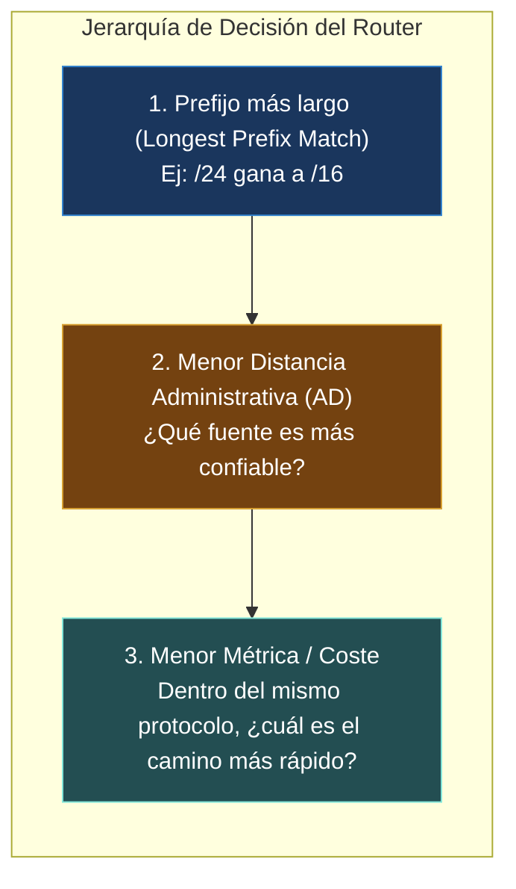
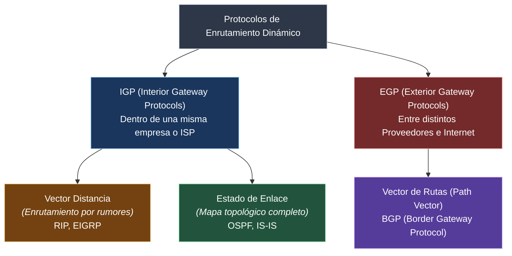
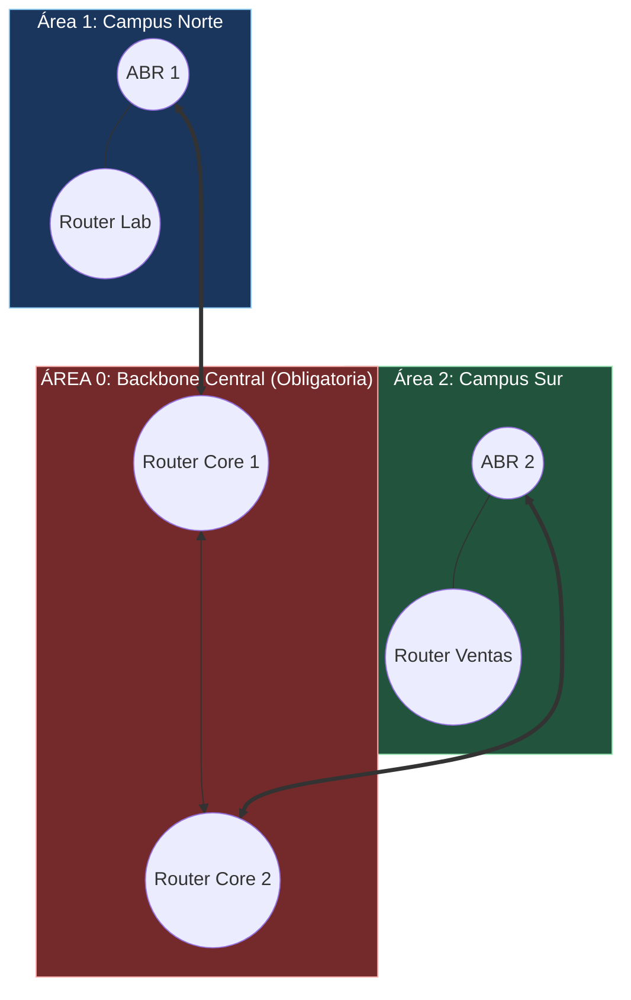
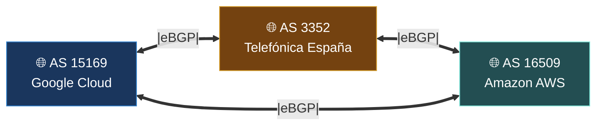

#redes #ccna #ospf #bgp #rip #enrutamiento-dinamico #distancia-administrativa #ciberseguridad

> [!info] 🧭 Navegación
> ◀ [[🧭 04.1 - Fundamentos de Routers y Enrutamiento Estático]] · 🔼 [[🌐 00 - Índice Maestro de Redes Informáticas]] · ▶ [[🚪 05.1 - Conceptos de Capa 4 (Puertos, Sockets y Multiplexación)]]

---

## 🚀 1. ¿Por Qué Enrutamiento Dinámico?

En una red corporativa con 80 routers o en la inmensidad de Internet con más de 100.000 sistemas autónomos, el enrutamiento estático es inviable.
Los **Protocolos de Enrutamiento Dinámico** permiten que los routers:

1. **Descubran redes remotas automáticamente** hablando entre ellos.
2. **Calculen la mejor ruta matemática** basándose en métricas como el ancho de banda.
3. **Reaccionen en tiempo real (*Convergencia*)**: Si un enlace cae, calculan una ruta alternativa de respaldo de inmediato sin intervención del administrador.

---

## 🔹 2. Distancia Administrativa (AD) y Métricas: El Criterio de Decisión

Cuando un router aprende dos caminos distintos hacia la misma red a través de dos protocolos diferentes (por ejemplo, por OSPF y por RIP), ¿cuál instala en la tabla de enrutamiento?



### ⚖️ Tabla de Distancia Administrativa (Cisco Default AD)

La **Distancia Administrativa (AD)** es la medida de confiabilidad de la fuente de la ruta. Va de 0 a 255; **cuanto menor sea el número, más confiable es la ruta**:

| Tipo de Ruta / Protocolo | Distancia Administrativa (AD) | Confiabilidad |
|:---|:---:|:---|
| **Interfaz Conectada Directamente** | **0** | Confianza absoluta (cable físico propio). |
| **Ruta Estática** | **1** | Escrita por el administrador de sistemas. |
| **eBGP (*External BGP*)** | **20** | Rutas aprendidas de otros proveedores de Internet. |
| **EIGRP (Interno - Propietario Cisco)**| **90** | Protocolo corporativo avanzado de Cisco. |
| **OSPF (*Open Shortest Path First*)** | **110** | El estándar abierto por excelencia en empresas. |
| **IS-IS** | **115** | Usado en *backbones* de operadores de telecomunicaciones. |
| **RIP (*Routing Information Protocol*)**| **120** | Protocolo básico antiguo. |
| **iBGP (*Internal BGP*)** | **200** | BGP dentro de la misma organización. |
| **Ruta Inalcanzable / Descartada** | **255** | No creíble; nunca se instala en la tabla. |

---

## 🧭 3. Clasificación de Protocolos de Enrutamiento



### ⚖️ Vector Distancia vs. Estado de Enlace

> [!abstract] 🏠 Analogía: El Taxista Despistado vs. El GPS con Mapa Satelital
> - **Vector Distancia (RIP)**: Es como ir conduciendo y parar en cada gasolinera a preguntar: *"¿Para ir a Valencia? Tire 100 km recto y vuelva a preguntar"*. Solo conoces la dirección (vector) y la distancia (saltos) que te dice tu vecino. Si un vecino te miente o se confunde, se crean bucles.
> - **Estado de Enlace (OSPF)**: Cada router recibe un mapa topológico idéntico de toda la comarca con todas las carreteras, puentes y velocidades máximas. Cada router calcula con su propio procesador el camino óptimo hacia cualquier destino usando el algoritmo de caminos mínimos.

---

## 🧭 4. OSPF (Open Shortest Path First - RFC 2328)

**OSPFv2** (para IPv4) y **OSPFv3** (para IPv6) es el protocolo de estado de enlace estándar más desplegado en redes corporativas y centros de datos del mundo.

### 🔹 4.1 El Algoritmo de Dijkstra (SPF)

Cada router OSPF anuncia el estado de sus enlaces directos emitiendo paquetes **LSA** (*Link-State Advertisements*). Al recopilar los LSAs de todos los demás routers, construyen una base de datos topológica idéntica llamada **LSDB** (*Link-State Database*).

Sobre esa base de datos, cada router ejecuta de forma independiente el **Algoritmo de Dijkstra (SPF - Shortest Path First)** para calcular un árbol de rutas óptimas con él mismo como raíz.

$$\text{Métrica OSPF (Coste)} = \frac{\text{Ancho de Banda de Referencia (100 Mbps)}}{\text{Ancho de Banda Real de la Interfaz}}$$
*(Un enlace de 1 Gbps tiene menor coste que un enlace de 10 Mbps; OSPF prefiere siempre el camino más rápido, no el que tenga menos saltos).*

### 🧭 4.2 El Concepto de Áreas en OSPF

Para evitar que redes de miles de routers colapsen recalculando el algoritmo de Dijkstra ante el aleteo (*flapping*) de un solo cable, OSPF divide la red en **Áreas**:



- **Área 0 (*Backbone Area*)**: Es el núcleo central de la red. **Todas las demás áreas deben conectarse físicamente (o mediante túnel virtual) al Área 0**.
- **ABR (*Area Border Router*)**: Router frontera que tiene interfaces en el Área 0 y en un área secundaria. Limita la propagación de LSAs y resume las rutas entre áreas.

### 🧭 4.3 Estados de Adyacencia OSPF

Los routers OSPF descubren a sus vecinos enviando paquetes **Hello** por Multicast (`224.0.0.5`) cada 10 segundos. Para convertirse en vecinos operativos pasan por los siguientes estados:

1. `Down`: Sin información del vecino.
2. `Init`: Paquete Hello recibido del vecino.
3. `2-Way`: Comunicación bidireccional confirmada. (En redes Ethernet multiacceso se elige el **DR** - *Designated Router* y el **BDR** - *Backup Designated Router*).
4. `ExStart`: Negociación de quién inicia la sincronización de bases de datos.
5. `Exchange`: Intercambio de descriptores de bases de datos (DBD).
6. `Loading`: Solicitud de información detallada de enlaces (LSR / LSU).
7. **`Full`**: **Adyacencia completada al 100%**. Las bases de datos LSDB están sincronizadas.

---

## 🧭 5. BGP (Border Gateway Protocol - RFC 4271): El Protocolo que Une el Planeta

Si OSPF es el protocolo que une los routers dentro de tu empresa o de Telefónica, **BGP** es el protocolo que une a Telefónica con Google, Vodafone, Amazon y Microsoft. **BGP es el pegamento de Internet.**



### 🧭 Conceptos Clave de BGP

1. **Sistemas Autónomos (AS)**: Red gigante bajo una única administración técnica y política de enrutamiento común (ej. un ISP, un banco global, una universidad). Cada AS tiene un número oficial **ASN** asignado por la IANA (ej. Google es `AS15169`).
2. **Path Vector (Vector de Rutas)**: BGP no mide la velocidad en megabits. BGP rastrea la lista completa de números de Sistemas Autónomos por los que debe pasar un paquete para llegar a destino (**AS-Path**).
   - *Ejemplo de AS-Path*: Para que un usuario de Telefónica (AS3352) llegue a un servidor de Tokio, la ruta puede ser: `3352 1299 2914 2500`. BGP prefiere siempre el camino con menos AS intermedios para evitar bucles.
3. **eBGP vs. iBGP**:
   - **eBGP (*External BGP*)**: Conexión entre routers pertenecientes a diferentes AS (AD = 20).
   - **iBGP (*Internal BGP*)**: Sincronización de rutas externas entre routers dentro del mismo AS (AD = 200).
4. **Enrutamiento por Políticas y Dinero**: A diferencia de los IGPs que buscan el camino físicamente más rápido, en BGP mandan las **políticas comerciales**: si enviar tráfico por el ISP A cuesta 0.001€/GB y por el ISP B cuesta 0.05€/GB, el operador fuerza la salida por el ISP A mediante atributos como **Local Preference** o **AS-Path Prepending**.

---

## 🛡️ 6. Perspectiva de Ciberseguridad: BGP Hijacking y Ataques de Enrutamiento

> [!warning] 🚨 El Terror Global de Internet: BGP Hijacking
> Dado que BGP se diseñó originalmente sobre la base de la confianza mutua entre operadores, **un router BGP puede anunciar a todo Internet que él es el dueño de cualquier rango de IPs del mundo**, ¡incluso si no le pertenece!
> 
> **Casos Reales Notables**:
> - En 2008, Pakistan Telecom intentó bloquear YouTube dentro de su país anunciando una ruta BGP falsa para el prefijo de YouTube. Por error filtró esa ruta a su proveedor global y, en minutos, **todo el tráfico mundial hacia YouTube fue absorbido y destruido en Pakistán durante horas**.
> - En ataques cibernéticos modernos, cibercriminales anuncian rutas más específicas (`/24`) de servicios de criptomonedas o DNS públicos (ej. Amazon Route53) para desviar transacciones hacia sus propios servidores durante 15 minutos y robar millones de dólares antes de ser detectados.
> 
> **La Defensa Moderna: RPKI (*Resource Public Key Infrastructure*)**:
> Sistema criptográfico donde los dueños legítimos firman certificados ROA (*Route Origin Authorization*). Los routers de Internet validan criptográficamente con RPKI que solo el legítimo dueño del ASN pueda anunciar esos prefijos IP, descartando los anuncios fraudulentos.

---

## 💻 7. Práctica en Terminal Linux: Inspección de BGP y OSPF

En Linux, los routers de producción utilizan suites profesionales de enrutamiento como **FRRouting (FRR)** o **BIRD**. Sin embargo, puedo consultar las rutas BGP de Internet en vivo conectándome a servidores públicos de consulta llamados **Looking Glasses**:

```bash
# 1. Consultar el ASN y la procedencia BGP de cualquier dirección IP pública con whois

whois -h whois.cymru.com 8.8.8.8

# 2. Descubrir el AS-Path real que recorre un paquete hasta un destino

traceroute -A 1.1.1.1

# 3. Consultar la tabla BGP global conectándote por telnet a un servidor Looking Glass abierto

# (Servidor público de pruebas de Route Views de la Universidad de Oregon)

telnet route-views.routeviews.org
# Una vez dentro de la terminal de Route Views ejecuta:

# show ip bgp 8.8.8.8

# exit

```

> [!brain] 🔬 Salida de `show ip bgp 8.8.8.8`:
> ```text
> BGP routing table entry for 8.8.8.0/24
> Paths: (4 available, best #1)
>   3356 15169
>     4.69.184.193 from 4.69.184.193 (4.69.184.193)
>       Origin IGP, metric 0, localpref 100, valid, external, best
> ```
> Observa el `AS-Path`: `3356 15169`. El paquete salta por Level3/Lumen (`AS 3356`) y llega directamente al Sistema Autónomo de Google (`AS 15169`).

---

## 📌 8. Resumen y Siguiente Paso

Con esta nota cierro el **Bloque 4**. He dominado:

- El funcionamiento de los protocolos dinámicos, la Distancia Administrativa y las métricas.
- La diferencia entre Vector Distancia y Estado de Enlace.
- El algoritmo Dijkstra, las bases de datos LSDB y la jerarquía de Áreas en OSPF.
- La arquitectura de Sistemas Autónomos y el protocolo BGP que mueve Internet.

En el **Bloque 5** nos adentraremos en la **Capa de Transporte (Capa 4)**: comenzaremos con [[🚪 05.1 - Conceptos de Capa 4 (Puertos, Sockets y Multiplexación)]] para entender cómo cientos de programas pueden usar la red a la vez sin mezclar sus datos.
