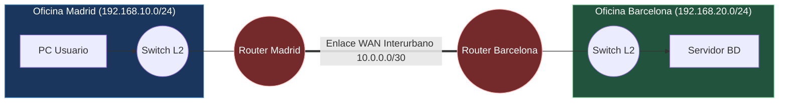
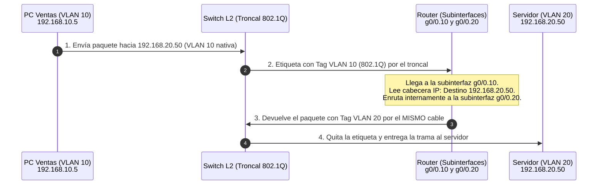

#redes #ccna #routing #enrutamiento-estatico #router-on-a-stick #longest-prefix-match #tabla-enrutamiento

> [!info] 🧭 Navegación
> ◀ [[🛠️ 03.4 - Protocolos de Soporte en Capa 3 (ARP e ICMP)]] · 🔼 [[🌐 00 - Índice Maestro de Redes Informáticas]] · ▶ [[🚀 04.2 - Protocolos de Enrutamiento Dinámico (RIP, OSPF y BGP)]]

---

## 🧭 1. El Propósito del Router: Cruzando Fronteras de Red

Un **Router** (o encaminador) es un dispositivo que opera en la **Capa 3 (Red)** del modelo OSI. Su función principal es interconectar dos o más redes lógicas diferentes y **determinar la mejor ruta** para reenviar los paquetes IP hacia su destino final.

A diferencia de un switch, que se limita a conmutar tramas entre puertos locales dentro de un mismo barrio (LAN), el router actúa como la aduana fronteriza o la oficina central de correos que decide por qué autopista interurbana debe viajar cada paquete.



> [!abstract] 🏠 Analogía: El Cartero Local vs. La Central Logística de Envíos
> - El **Switch** es el cartero de tu barrio: conoce a todos los vecinos por su nombre y puerta (dirección MAC) y reparte las cartas sin salir de tu calle.
> - El **Router** es la central de distribución logística: cuando entregas una carta con destino a otra ciudad (otra IP), el cartero local se la da al router. El router mira el código postal, consulta su gran mapa de carreteras (la **Tabla de Enrutamiento**) y decide qué camión debe llevarla.

---

## ⚖️ 2. Anatomía de la Tabla de Enrutamiento

Para decidir qué hacer con cada paquete recibido, el router consulta su **Tabla de Enrutamiento** almacenada en memoria RAM. Cada entrada contiene cinco elementos esenciales:

```
 S*    0.0.0.0/0 [1/0] via 192.168.1.1, GigabitEthernet0/0
 C     192.168.10.0/24 is directly connected, GigabitEthernet0/1
 S     192.168.20.0/24 [1/0] via 10.0.0.2
 O     172.16.0.0/16 [110/20] via 10.0.0.2, 00:14:22, GigabitEthernet0/2
 ─     ─────────────  ───────  ───────────  ────────  ──────────────────
 │           │           │          │          │              │
Tipo    Red Destino   AD/Métrica Siguiente  Tiempo     Interfaz Salida
                       (Coste)    Salto (Next-Hop)
```

1. **Tipo / Código de Origen**:
   - `C` (*Connected*): Red directamente conectada a una de sus interfaces físicas activas.
   - `S` (*Static*): Ruta configurada manualmente por el administrador.
   - `O` (*OSPF*): Ruta aprendida dinámicamente mediante el protocolo OSPF ([[🚀 04.2 - Protocolos de Enrutamiento Dinámico (RIP, OSPF y BGP)]]).
   - `*`: Marca de candidato a ruta por defecto.
2. **Red de Destino y Prefijo CIDR**: El bloque de direcciones al que aplica esta regla.
3. **Distancia Administrativa (AD) y Métrica**:
   - **AD (Confiabilidad)**: Valor de 0 a 255. Cuanto menor sea el número, más creíble es la fuente (Conectada = 0, Estática = 1, OSPF = 110).
   - **Métrica (Coste)**: El valor que calcula el protocolo dinámico para valorar qué ruta es más rápida (menos saltos, más ancho de banda).
4. **Siguiente Salto (*Next-Hop*)**: La dirección IP del router vecino que recibirá el paquete.
5. **Interfaz de Salida**: El puerto físico por el que debe salir la trama.

---

## 🧭 3. La Regla de Oro del Enrutamiento: Longest Prefix Match

¿Qué ocurre si un paquete tiene como destino la IP `192.168.10.45` y la tabla de enrutamiento contiene tres rutas que coinciden con esa IP?

```
 Ruta A: 192.168.0.0/16    (Coincide con los primeros 16 bits)
 Ruta B: 192.168.10.0/24   (Coincide con los primeros 24 bits)  <-- ¡GANADORA!
 Ruta C: 0.0.0.0/0         (Coincide con 0 bits - Ruta por defecto)
```

> [!brain] 🔬 Longest Prefix Match (Coincidencia de Prefijo Más Largo)
> El router **elige SIEMPRE la ruta que tenga la máscara de subred más específica (el prefijo más largo / mayor cantidad de unos consecutivos)**, sin importar la distancia administrativa ni la métrica. Solo recurre a la ruta por defecto (`/0`) si ninguna otra ruta coincide.

### 🧭 La Ruta por Defecto (*Default Gateway / Gateway of Last Resort*)

Representada como `0.0.0.0/0` en IPv4 o `::/0` en IPv6:

- Es la red comodín.
- Si un paquete va dirigido a una IP que no figura en ninguna entrada específica de la tabla de enrutamiento (ej. `142.250.200.14` en los servidores de Google), el router lo envía a través del **Default Gateway** hacia tu proveedor de Internet (ISP).

---

## 🧭 4. Enrutamiento Estático: Configuración y Rutas Flotantes

En el **enrutamiento estático**, el administrador escribe manualmente en el router las instrucciones de hacia dónde enviar cada red.

- **Ventajas**:
  - Consumo de CPU y memoria prácticamente nulo (el router no tiene que procesar algoritmos).
  - No genera tráfico de control adicional en los enlaces.
  - Máxima seguridad: El administrador tiene el control absoluto de por dónde viajan los paquetes.
- **Desventajas**:
  - Inviable en redes grandes (si tienes 500 routers, tendrías que escribir miles de rutas a mano).
  - **Cero tolerancia automática a fallos**: Si el cable del enlace principal se corta, la ruta estática sigue apuntando hacia la nada y el tráfico se pierde, salvo que usemos una ruta flotante.

### 🧭 La Ruta Estática Flotante (*Floating Static Route*)

Una ruta flotante es una ruta estática de respaldo que se configura con una **Distancia Administrativa deliberadamente mayor** (por ejemplo, AD = 10) que la ruta principal (AD = 1):

- Mientras el enlace principal esté activo, la ruta flotante permanece oculta e inactiva fuera de la tabla de enrutamiento.
- Si la interfaz principal cae (`DOWN`), el router saca automáticamente la ruta flotante a la tabla para desviar el tráfico por un enlace 4G/5G de reserva.

---

## 🧭 5. Enrutamiento entre VLANs (Inter-VLAN Routing)

En el [[🔀 02.3 - Conmutación, Switches, VLANs y Spanning Tree (STP)]] aprendimos que las VLANs aíslan completamente el tráfico. Para que un usuario de la VLAN 10 (Ventas) pueda enviar un archivo a un servidor en la VLAN 20 (Contabilidad), los paquetes **deben salir a un dispositivo de Capa 3**.

Existen dos arquitecturas predominantes:

### 🧭 5.1 Router-on-a-Stick (ROAS)

Se utiliza un router conectado a un switch mediante un **único cable físico configurado como enlace troncal 802.1Q**:



En el router Cisco se configuran **subinterfaces lógicas**:
```text
interface GigabitEthernet0/0.10
 encapsulation dot1Q 10
 ip address 192.168.10.1 255.255.255.0

interface GigabitEthernet0/0.20
 encapsulation dot1Q 20
 ip address 192.168.20.1 255.255.255.0
```

### 🏛️ 5.2 Switch de Capa 3 (Switch Multicapa / SVI)

Es el estándar moderno en redes empresariales. El propio switch tiene capacidad de enrutamiento integrada en hardware mediante chips ASIC especializados:

- No requiere que el tráfico suba y baje por un cable externo hacia un router.
- El enrutamiento inter-VLAN se realiza a **velocidad de cable (*wire-speed*) de decenas de gigabits por segundo**.
- Se configura mediante **Interfaces Virtuales Conmutadas (SVI)**: `interface Vlan10` / `ip address 192.168.10.1 255.255.255.0`.

---

## 🛡️ 6. Perspectiva de Ciberseguridad: Riesgos en Enrutamiento

> [!warning] 🚨 Enrutamiento y Salto de Perímetros
> - **Inyección de Rutas Maliciosas**: Si un router acepta rutas estáticas o dinámicas sin autenticación criptográfica, un atacante puede inyectar una ruta más específica (`/32`) apuntando a su propia máquina. Gracias a la regla del *Longest Prefix Match*, todo el tráfico hacia esa IP sensible se desviará hacia el atacante (secuestro de tráfico / Blackholing).
> - **IP Forwarding Inseguro**: Si un servidor Linux en una DMZ tiene activo el reenvío de paquetes en el kernel sin un firewall estricto, un atacante que comprometa esa máquina puede usarla como router pivote (*pivoting*) para alcanzar las redes internas de la empresa.

---

## 💻 7. Práctica en Terminal Linux: Creación de un Router por Software

Cualquier máquina Linux puede convertirse en un router profesional configurando el kernel y la tabla de rutas:

```bash
# 1. Comprobar la tabla de enrutamiento actual del sistema

ip route show

# 2. Habilitar el reenvío de paquetes IPv4 en el kernel en tiempo real

sudo sysctl -w net.ipv4.ip_forward=1

# 3. Añadir una ruta estática hacia una red remota a través de un router intermedio

sudo ip route add 10.50.0.0/16 via 192.168.1.254 dev eth0

# 4. Añadir o cambiar la ruta por defecto (Default Gateway)

sudo ip route replace default via 192.168.1.1 dev eth0

# 5. Probar qué ruta exacta elegirá el kernel para alcanzar una IP destino (LPM test)

ip route get 10.50.12.34
```

> [!brain] 🔬 Salida de `ip route get`:
> ```text
> 10.50.12.34 via 192.168.1.254 dev eth0 src 192.168.1.50 uid 1000
>     cache
> ```
> El kernel consulta su tabla, aplica *Longest Prefix Match* y te indica inmediatamente qué interfaz de salida (`dev eth0`), qué siguiente salto (`via 192.168.1.254`) y qué IP de origen usará.

---

## 📌 8. Resumen y Siguiente Paso

En esta nota he aprendido:

- El papel de los routers como directores del tráfico entre redes distintas.
- Cómo se estructura la tabla de enrutamiento y la regla del *Longest Prefix Match*.
- Cómo diseñar esquemas de respaldo con rutas estáticas flotantes.
- Las dos formas de comunicar VLANs: *Router-on-a-Stick* y *Switches de Capa 3*.

En la siguiente nota ([[🚀 04.2 - Protocolos de Enrutamiento Dinámico (RIP, OSPF y BGP)]]), veo cómo los routers hablan entre sí para actualizar sus mapas de red automáticamente cuando caen cables o enlaces mediante **OSPF** y **BGP**.
