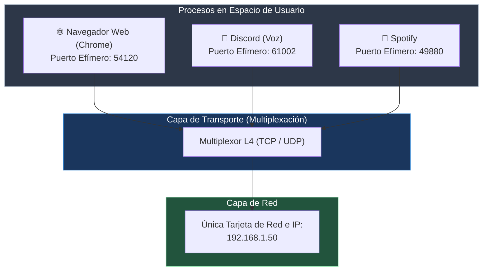
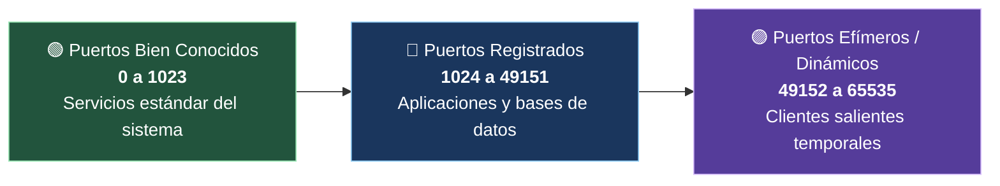

---
tags:
  - redes
  - ccna
  - capa-transporte
  - puertos
  - sockets
  - multiplexacion
  - quintupla
  - nmap
folder: "📂05 - Capa de Transporte"
aliases:
  - "Conceptos de Capa 4 (Puertos y Sockets)"
  - "Multiplexación y Clasificación de Puertos"
date: 2026-09-07
---

> [!info] 🧭 Navegación
> ◀ [[04.2 - Protocolos de Enrutamiento Dinámico (RIP, OSPF y BGP)]] · 🔼 [[00 - Índice Maestro de Redes]] · ▶ [[05.2 - Protocolo TCP (3-Way Handshake, Flujo y Confiabilidad)]]

---

# 🚪 05.1 - Conceptos de Capa 4 (Puertos, Sockets y Multiplexación)

## 1. El Rol de la Capa de Transporte: Comunicación Proceso a Proceso

Hasta ahora hemos aprendido cómo viajan los paquetes entre ordenadores a través del direccionamiento IP (Capa 3). Sin embargo, tu ordenador no es un bloque monolítico: en este instante tienes abierto el navegador web con 15 pestañas, la aplicación de Discord, Spotify reproduciendo música y una sesión de SSH abierta en tu terminal.

Si llega un paquete IP a la tarjeta de red de tu ordenador... **¿cómo sabe el sistema operativo a qué programa concreto debe entregárselo?**

Aquí entra la **Capa de Transporte (Capa 4)**, cuya misión es garantizar la **comunicación de proceso a proceso (*End-to-End*)** utilizando el mecanismo de los **Puertos**.



> [!abstract] 🏠 Analogía: El Bloque de Vecinos y los Buzones
> Imagina un edificio de apartamentos en la calle Mayor, número 15:
> - La **Dirección IP** es el edificio: `Calle Mayor 15`. El cartero (el Router) deja todas las cartas en el portal.
> - El **Número de Puerto** es el piso y la puerta: `3º B`, `4º A`, `Bajo Izquierda`.
> - Si una carta llega con la dirección del edificio pero sin el piso (sin puerto), nadie sabe a quién pertenece y el conserje (el kernel) la destruye.

---

## 2. Los Rangos Oficiales de Puertos (0 a 65535)

En los encabezados de TCP y UDP, el campo de puerto tiene un tamaño de **16 bits**, lo que genera un total exacto de **$2^{16} = 65.536$ puertos posibles** (del 0 al 65535).

La **IANA** (*Internet Assigned Numbers Authority*) divide este universo en tres rangos oficiales estrictos:



### 1. Puertos Bien Conocidos (*Well-Known Ports*: 0 - 1023)
Reservados para protocolos estándar de infraestructura y servicios esenciales de Internet:
- En sistemas tipo Unix/Linux, **solo el usuario `root` (o procesos con la capacidad `CAP_NET_BIND_SERVICE`) puede abrir y escuchar en estos puertos**.

| Puerto | Protocolo L4 | Servicio | Descripción |
|:---:|:---:|:---|:---|
| **20 / 21** | TCP | **FTP** | Transferencia de archivos (20: Datos, 21: Control). |
| **22** | TCP | **SSH / SFTP** | Shell remota segura y administración cifrada. |
| **23** | TCP | **Telnet** | Shell remota obsoleta (texto claro, sin cifrar). |
| **25** | TCP | **SMTP** | Envío y retransmisión de correo electrónico. |
| **53** | TCP / UDP | **DNS** | Resolución de nombres de dominio (UDP consultas, TCP zonas). |
| **67 / 68** | UDP | **DHCP** | Asignación automática de IP (67: Servidor, 68: Cliente). |
| **69** | UDP | **TFTP** | FTP trivial sin autenticación para arranque de routers/PXE. |
| **80** | TCP | **HTTP** | Tráfico web sin cifrar. |
| **110** | TCP | **POP3** | Descarga de correo desde el buzón del servidor. |
| **123** | UDP | **NTP** | Sincronización de reloj y fecha de red. |
| **143** | TCP | **IMAP** | Gestión y sincronización de correo en el servidor. |
| **161 / 162**| UDP | **SNMP** | Monitorización y telemetría de dispositivos de red. |
| **443** | TCP / UDP | **HTTPS** | Tráfico web cifrado con TLS / HTTP/3 QUIC. |

### 2. Puertos Registrados (*Registered Ports*: 1024 - 49151)
Asignados por la IANA a empresas u organizaciones para aplicaciones de software y bases de datos conocidas:
- `1433`: Microsoft SQL Server
- `1521`: Oracle Database
- `3306`: MySQL / MariaDB
- `3389`: RDP (Escritorio Remoto de Windows)
- `5432`: PostgreSQL
- `6379`: Redis (Almacén clave-valor en memoria)
- `8080 / 8443`: Servidores web alternativos / Proxies HTTP

### 3. Puertos Dinámicos o Efímeros (*Ephemeral Ports*: 49152 - 65535)
Asignados de forma temporal y aleatoria por el sistema operativo cliente cuando abres una conexión hacia un servidor.
- Cuando tu navegador entra a `https://google.com`, el puerto destino es el `443` (fijo y conocido), pero el puerto de tu ordenador es un puerto efímero aleatorio (ej. `52189`). Cuando cierras la pestaña, ese puerto se libera de inmediato.

---

## 3. El Concepto de Socket y la Quíntupla (5-Tuple)

Un **Socket** es el punto final (*endpoint*) de una comunicación de red bidireccional. Matemáticamente se define como:

$$\text{Socket} = \text{Dirección IP} + \text{Protocolo de Transporte} + \text{Número de Puerto}$$
*(Ejemplo: `192.168.1.50:TCP:443`)*

Para que un sistema operativo distinga sin ambigüedad una conexión de red entre millones de paquetes que cruzan la tarjeta, el kernel utiliza la **Quíntupla (*5-Tuple*)**:

```
  ┌─────────────────────────────────────────────────────────────┐
  │                 LA QUÍNTUPLA DE UNA CONEXIÓN               │
  ├───────────────────┬─────────────────────────────────────────┤
  │ 1. IP Origen      │ 192.168.1.50 (Tu PC)                    │
  │ 2. Puerto Origen  │ 54231 (Puerto efímero de tu pestaña)    │
  │ 3. IP Destino     │ 142.250.200.14 (Servidor Google)        │
  │ 4. Puerto Destino │ 443 (Servicio HTTPS)                    │
  │ 5. Protocolo L4   │ TCP (6)                                 │
  └───────────────────┴─────────────────────────────────────────┘
```

> [!tip] 💡 ¿Por qué puedes abrir 50 pestañas al mismo sitio web a la vez?
> Todas las pestañas van a la misma IP destino (`Google`) y al mismo puerto (`443`). Pero para cada pestaña individual, tu sistema operativo genera un **puerto de origen efímero diferente** (`54231`, `54232`, `54233`). Gracias a eso, la quíntupla es 100% única y el navegador sabe qué pestaña debe recibir cada imagen o vídeo.

---

## 4. Perspectiva de Ciberseguridad: Auditoría y Escaneo de Puertos con Nmap

> [!warning] 🚨 La Superficie de Ataque: Los Puertos Expuestos
> En ciberseguridad defensiva y ofensiva (Pentesting), un puerto abierto representa una puerta de entrada a un proceso en ejecución con privilegios en el sistema.
> 
> Cuando lanzamos un escaneo con **Nmap** (`nmap -sS -p- 192.168.1.100`), la herramienta puede clasificar cada puerto en tres estados fundamentales:
> 1. **Open (Abierto)**: Hay un servicio escuchando y aceptó la sincronización SYN respondiendo con `SYN-ACK`. *(Objetivo para buscar vulnerabilidades en la versión del software)*.
> 2. **Closed (Cerrado)**: El paquete llegó al host, pero no hay ningún programa escuchando en ese puerto. El kernel respondió con un paquete `RST` (Reset).
> 3. **Filtered (Filtrado)**: Un firewall (como `iptables` o `ufw`) descartó el paquete silenciosamente (*DROP*). Nmap no recibe respuesta y no puede determinar si el puerto existe.
> 
> *Riesgo crítico común*: Desarrolladores que levantan una base de datos Redis (`6379`) o Elasticsearch (`9200`) en `0.0.0.0` sin contraseña pensando que nadie los verá. Al estar el puerto abierto a Internet, atacantes automatizados secuestran o borran los datos en cuestión de minutos.

---

## 5. Práctica en Terminal Linux: Inspección de Sockets y Conexiones

En Linux, la herramienta moderna más rápida y potente para auditar puertos y sockets abiertos es `ss` (*Socket Statistics*), que sustituyó al clásico `netstat`:

```bash
# 1. Listar todos los puertos TCP y UDP en estado de ESCUCHA (Listen) junto con el proceso dueño
sudo ss -tulpn

# 2. Ver todas las conexiones activas establecidas en este momento hacia el exterior
ss -tun state established

# 3. Descubrir qué proceso exacto está utilizando un puerto específico (ej. puerto 80)
sudo lsof -i :80

# 4. Probar si un puerto remoto está abierto sin usar un escáner complejo (usando Netcat)
nc -zv -w 3 1.1.1.1 53
```

> [!brain] 🔬 Desglose de flags de `ss -tulpn`:
> - `-t`: Filtrar solo sockets **TCP**.
> - `-u`: Filtrar solo sockets **UDP**.
> - `-l`: Mostrar solo sockets en modo **Listening** (servicios a la espera de clientes).
> - `-p`: Mostrar el **PID y nombre del proceso** (requiere `sudo`).
> - `-n`: Salida numérico (muestra `443` en lugar de resolverlo a la palabra `https`, mucho más rápido).

---

## 6. Resumen y Siguiente Paso

En esta nota hemos comprendido:
- La misión de la Capa de Transporte conectando procesos específicos.
- La clasificación de puertos: Bien conocidos (0-1023), Registrados y Efímeros.
- La definición matemática de Socket y la Quíntupla que hace única cada conexión.
- La importancia del escaneo y la auditoría de puertos en seguridad.

En la siguiente nota ([[05.2 - Protocolo TCP (3-Way Handshake, Flujo y Confiabilidad)]]), analizaremos a fondo el protocolo que garantiza que ningún archivo llegue corrupto a destino: **TCP**, su famoso **saludo de tres vías** y el control de flujo con ventana deslizante.
