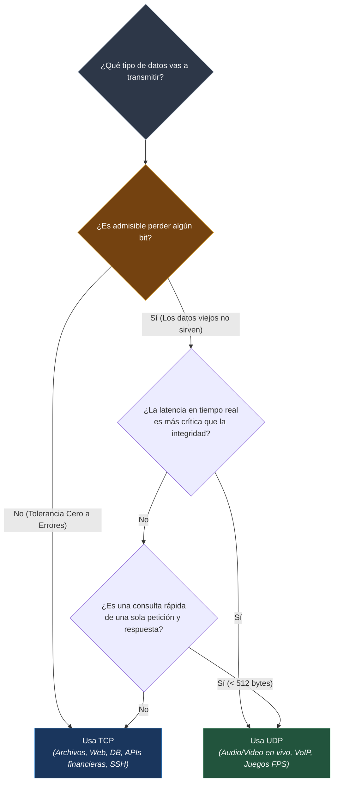

#redes #ccna #comparativa #tcp-vs-udp #kernel-bypass #sockets #rendimiento

> [!info] 🧭 Navegación
> ◀ [[⚡ 05.3 - Protocolo UDP (Datagramas, Rendimiento y QUIC)]] · 🔼 [[🌐 00 - Índice Maestro de Redes Informáticas]] · ▶ [[📖 06.1 - DNS (Domain Name System - Jerarquía, Consultas y Registros)]]

---

## ⚖️ 1. La Matriz Comparativa Definitiva: TCP frente a UDP

En la Capa de Transporte no existe un protocolo "mejor" en términos absolutos; existen compromisos de ingeniería entre **Garantía y Fiabilidad** frente a **Velocidad y Latencia**:

| Característica / Dimensión | TCP (*Transmission Control Protocol*) | UDP (*User Datagram Protocol*) |
|:---|:---|:---|
| **RFC de Definición** | RFC 793 | RFC 768 |
| **Orientación a Conexión** | **Sí** (Requiere 3-Way Handshake previo) | **No** (Transmisión directa inmediata) |
| **Garantía de Entrega** | **Sí** (Acuses de recibo ACK y retransmisión) | **No** (Los paquetes perdidos se descartan) |
| **Orden de los Datos** | **Garantizado** (Reordenación por números de secuencia) | **No garantizado** (Llegan según la ruta de red) |
| **Tamaño de Cabecera** | **20 a 60 bytes** (Dependiendo de opciones) | **8 bytes fijos** (Sobrecarga mínima) |
| **Control de Flujo** | **Sí** (Mecanismo de Ventana Deslizante) | **No** (Envía sin importar la RAM del receptor) |
| **Control de Congestión** | **Sí** (Algoritmos CUBIC, BBR, Reno) | **No** (No modula la velocidad ante congestión) |
| **Modos de Transmisión** | **Solo Unicast** (Punto a punto 1 a 1) | **Unicast, Multicast y Broadcast** |
| **Velocidad y Latencia** | Mayor latencia inicial y fluctuante | **Mínima latencia** y constante |
| **Uso Típico** | Web (HTTP/1.1-2), SSH, Correo, Base de Datos, FTP | Streaming, Juegos, VoIP, DNS, DHCP, HTTP/3 (QUIC) |

---

## 🔹 2. Árbol de Decisión Arquitectónico: ¿Cuándo Elegir Cuál?

Si estás diseñando una aplicación de red o analizando un servicio en un pentesting, este diagrama resume el criterio de selección:

---

## 🔹 3. Protocolos Híbridos: Lo Mejor de Dos Mundos

Existen servicios que no se encasillan en un solo protocolo y combinan TCP y UDP según el escenario:

### 🚚 3.1 DNS (Domain Name System - Puerto 53)

- **Usa UDP para consultas estándar**: El 95% de las peticiones de navegación diaria (*"¿Cuál es la IP de `google.com`?"*) viajan en un único datagrama UDP de menos de 512 bytes. Es instantáneo y no satura los servidores raíz con handshakes.
- **Usa TCP para transferencias de zona y respuestas gigantes**: Si un servidor secundario sincroniza la zona completa con el primario (**AXFR**), o si la respuesta con claves criptográficas **DNSSEC** excede el MTU, DNS conmuta automáticamente a **TCP** (bit *Truncated* `TC = 1`).

### 🔐 3.2 Protocolos VPN: OpenVPN y WireGuard

- **OpenVPN**: Soporta tanto UDP como TCP.
  - *UDP (Recomendado)*: Ofrece el máximo rendimiento.
  - *TCP (Modo Rescate)*: Se utiliza en el puerto 443 para **evadir firewalls de hoteles o países con censura**, haciendo que el tráfico VPN se disfrace de tráfico web HTTPS convencional.
- **WireGuard**: Funciona **únicamente sobre UDP**. Su código compacto de menos de 4.000 líneas maneja el cifrado ChaCha20 y la entrega de paquetes con una sobrecarga casi imperceptible.

---

## 🚚 4. La Evolución Moderna: Kernel Bypass y Sockets en Espacio de Usuario

Históricamente, procesar paquetes de red era trabajo exclusivo del **Kernel del Sistema Operativo** (Linux Network Stack). Sin embargo, con tarjetas de red modernas de **100 Gbps a 400 Gbps**, el propio kernel de Linux se convierte en un cuello de botella:

- Cada paquete genera una interrupción de hardware en la CPU (*IRQ*).
- Cambiar de contexto entre el espacio de kernel y el espacio de usuario consume ciclos de reloj preciosos.

Para alcanzar latencias de microsegundos en la nube y el trading de alta frecuencia (HFT), la industria ha evolucionado hacia:

1. **DPDK (*Data Plane Development Kit*)**: Permite que las aplicaciones lean los paquetes directamente de la tarjeta de red (NIC) en memoria RAM sin pasar por el kernel de Linux (**Kernel Bypass**).
2. **eBPF y XDP (*eXpress Data Path*)**: Permite ejecutar programas de inspección y filtrado de paquetes dentro del kernel de Linux **antes incluso de que el sistema operativo cree la estructura `sk_buff` del paquete**, mitigando ataques DDoS de millones de paquetes por segundo con consumo de CPU residual.
3. **QUIC en Espacio de Usuario**: Al correr sobre UDP, protocolos como QUIC pueden actualizar sus algoritmos de congestión (ej. Google BBR) mediante una simple actualización del navegador web o del servidor Nginx sin necesidad de esperar a compilar un nuevo kernel en el sistema operativo.

---

## 📌 5. Resumen y Siguiente Paso

Con esta nota finalizamos con éxito el **Bloque 5 (Capa de Transporte)**. Ahora posees un dominio completo sobre:

- Puertos, sockets y la quíntupla de identificación de conexiones.
- El 3-Way Handshake, flags y control de flujo en TCP.
- La velocidad sin estado de UDP y su explotación en ataques de amplificación.
- La convergencia hacia QUIC / HTTP/3 y las tecnologías de ultra rendimiento.

En el **Bloque 6** alcanzo la cima de la interacción humana: entro en la **Capa de Aplicación** comenzando con el servicio que hace que Internet sea utilizable por personas: [[📖 06.1 - DNS (Domain Name System - Jerarquía, Consultas y Registros)]].
