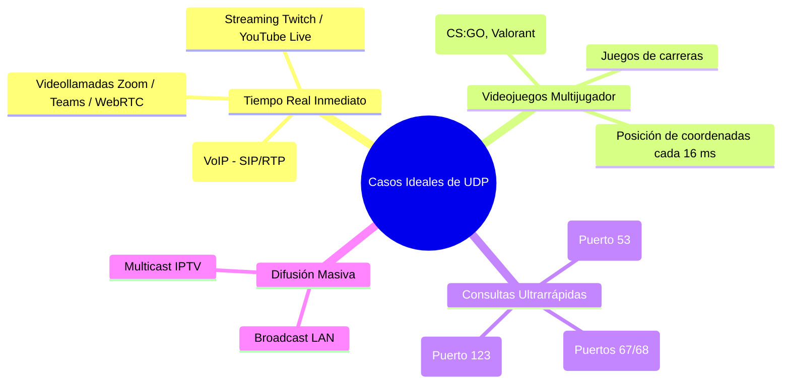

#redes #ccna #udp #datagrama #quic #http3 #amplificacion-ddos #streaming

> [!info] 🧭 Navegación
> ◀ [[🤝 05.2 - Protocolo TCP (3-Way Handshake, Flujo y Confiabilidad)]] · 🔼 [[🌐 00 - Índice Maestro de Redes Informáticas]] · ▶ [[⚖️ 05.4 - Comparativa TCP vs UDP y Evolución Moderna]]

---

## ⚡ 1. La Filosofía de UDP: Disparar y Olvidar (*Fire and Forget*)

El protocolo **UDP** (*User Datagram Protocol* - RFC 768) es el opuesto filosófico de TCP. Mientras TCP prioriza la fiabilidad absoluta a costa de retrasos y sobrecarga de control, UDP tiene un único objetivo: **entregar los datos a la máxima velocidad posible con la mínima latencia**.

Las propiedades fundamentales de UDP son:

1. **No orientado a conexión (*Connectionless*)**: No hay saludos, ni negociación de parámetros, ni sincronización previa. Si una aplicación tiene datos, los expulsa al cable de inmediato.
2. **No confiable (*Unreliable*)**: No existen acuses de recibo (ACKs), ni retransmisión de paquetes perdidos, ni garantía de entrega. Si un paquete se descarta por el camino, se perdió para siempre.
3. **Sin orden garantizado**: Los datagramas pueden llegar en orden inverso o duplicados; a UDP no le importa.
4. **Sin control de congestión**: UDP no frena su velocidad aunque los routers de la red estén ardiendo.

> [!abstract] 🏠 Analogía: El Mensajero con Acuse de Recibo vs. El Lanzador de Periódicos
> - **TCP** es un cartero de mensajería urgente certificada: llama al timbre, espera a que abras, te pide el DNI, firmas el acuse de recibo y, si no estás, vuelve al día siguiente hasta asegurarse de que tienes el paquete.
> - **UDP** es el repartidor de periódicos en bicicleta de las películas: pasa a toda velocidad por la acera y lanza el periódico por encima de la valla de tu jardín. Si cae en el tejado o en la piscina del vecino... él ya está a dos manzanas de distancia y no va a volver a comprobarlo.

---

## 🚚 2. Anatomía de la Cabecera UDP: La Belleza de la Simplicidad

Mientras la cabecera de TCP necesita entre 20 y 60 bytes repletos de flags y números de secuencia, **la cabecera de UDP mide exactamente 8 bytes**:

```
 0                   1                   2                   3
 0 1 2 3 4 5 6 7 8 9 0 1 2 3 4 5 6 7 8 9 0 1 2 3 4 5 6 7 8 9 0 1
+-+-+-+-+-+-+-+-+-+-+-+-+-+-+-+-+-+-+-+-+-+-+-+-+-+-+-+-+-+-+-+-+
|          Source Port          |       Destination Port        |
+-+-+-+-+-+-+-+-+-+-+-+-+-+-+-+-+-+-+-+-+-+-+-+-+-+-+-+-+-+-+-+-+
|            Length             |           Checksum            |
+-+-+-+-+-+-+-+-+-+-+-+-+-+-+-+-+-+-+-+-+-+-+-+-+-+-+-+-+-+-+-+-+
|                       Data (Carga Útil) ...                   |
+-+-+-+-+-+-+-+-+-+-+-+-+-+-+-+-+-+-+-+-+-+-+-+-+-+-+-+-+-+-+-+-+
```

### 🚚 Los 4 Campos de UDP Desglosados

1. **Source Port (16 bits)**: Puerto del proceso emisor (opcional en clientes; si no se usa se rellena con ceros).
2. **Destination Port (16 bits)**: Puerto del servicio receptor (ej. `53` para DNS).
3. **Length (16 bits)**: Longitud total del datagrama (cabecera de 8 bytes + carga útil) en bytes. Tamaño mínimo: 8 bytes.
4. **Checksum (16 bits)**: Suma de comprobación matemática para detectar si los bits se corrompieron en el cable. *(En IPv4 es opcional; en IPv6 es 100% obligatorio)*.

---

## 🚚 3. ¿Cuándo es UDP la Mejor Opción? (Casos de Uso Reales)

Podría parecer que nadie querría un protocolo "no confiable". Sin embargo, **el mundo digital moderno colapsaría sin UDP**:



> [!tip] 💡 ¿Por qué Zoom o los videojuegos usan UDP y no TCP?
> Si estás jugando una partida en línea y tu personaje dispara, se envían 60 paquetes por segundo con tus coordenadas. 
> Si usaras TCP y el paquete #10 se perdiera por una interferencia Wi-Fi, **toda la partida se congelaría** durante 150 ms esperando a que el servidor retransmita la coordenada antigua. Para cuando llegara, ¡ya estarías muerto! 
> Con UDP, el paquete #10 se pierde, pero a nadie le importa porque el paquete #11 ya viene detrás con tu posición actual. **En tiempo real, los datos viejos no tienen valor.**

---

## 🚚 4. La Revolución Moderna: QUIC y HTTP/3

Durante casi 30 años, la web navegó sobre **TCP + TLS + HTTP/1.1 / HTTP/2**. Sin embargo, a medida que las webs se llenaron de cientos de imágenes y scripts, los ingenieros de Google identificaron un cuello de botella estructural: el **Bloqueo al Inicio de Línea (*Head-of-Line Blocking*)** de TCP. Si se pierde un paquete TCP de un archivo CSS secundario, el navegador frena la carga de toda la página web.

Para solucionarlo, el IETF estandarizó **QUIC (RFC 9000)**, el protocolo que da vida a **HTTP/3**:

```mermaid
graph TD
    subgraph PILA_TRADICIONAL["Pila Clásica (HTTP/2)"]
        H2[HTTP/2] --> TLS[Cifrado TLS 1.2 / 1.3]
        TLS --> TCP_STACK[TCP (En Kernel)]
        TCP_STACK --> IP1[IP]
    end

    subgraph PILA_MODERNA["Pila Moderna (HTTP/3)"]
        H3[HTTP/3] --> QUIC["Protocolo QUIC (Espacio de Usuario)<br>- Cifrado integrado TLS 1.3 nativo<br>- Múltiples flujos independientes<br>- 0-RTT Connection Handshake"]
        QUIC --> UDP_STACK["UDP (En Kernel - Ultrarrápido)"]
        UDP_STACK --> IP2[IP]
    end

    style PILA_TRADICIONAL fill:#2d3748,stroke:#cbd5e0,color:#fff
    style PILA_MODERNA fill:#1a365d,stroke:#3182ce,color:#fff
    style QUIC fill:#234e52,stroke:#81e6d9,color:#fff
```

### 🚚 Ventajas Disruptivas de QUIC sobre UDP

1. **0-RTT Handshake**: Establece la conexión y la negociación de cifrado TLS 1.3 en **un solo viaje de ida y vuelta**, o en cero viajes si ya te habías conectado antes.
2. **Fin del Head-of-Line Blocking**: Permite decenas de flujos de datos independientes. Si se pierde un paquete de una imagen, solo esa imagen espera; el resto de la web sigue cargando a máxima velocidad.
3. **Migración de Conexión sin Cortes**: Si estás descargando un archivo por Wi-Fi y sales a la calle cambiando a 4G/5G (cambiando tu IP por completo), **la descarga en HTTP/3 no se corta**. QUIC identifica la sesión mediante un *Connection ID* de 64 bits independiente de la IP.

---

## 🛡️ 5. Perspectiva de Ciberseguridad: Ataques de Amplificación y Reflexión UDP

> [!warning] 🚨 La Pesadilla de los Terabits: DDoS por Amplificación UDP
> Debido a que UDP no tiene handshake previo y **no valida si la IP origen es legítima**, es el vector predilecto para los mayores ataques de denegación de servicio distribuido (**DDoS**) del planeta:
> 
> **Mecánica del Ataque de Reflexión y Amplificación**:
> 1. El atacante falsifica la IP de origen en un paquete UDP, poniendo la **IP de la Víctima** (**IP Spoofing**).
> 2. Envía una consulta diminuta (ej. 60 bytes) a miles de servidores públicos de DNS, NTP o servidores de bases de datos Memcached.
> 3. La consulta pide una respuesta masiva (ej. `dig ANY isc.org`).
> 4. Los servidores responden con paquetes gigantescos (ej. 3.000 bytes) dirigidos **a la IP de la víctima inocente**.
> 
> | Protocolo Explotado | Factor de Amplificación |
> |:---|:---:|
> | **DNS** | **20x a 50x** |
> | **NTP (Monlist)** | **550x** |
> | **Memcached (Puerto 11211)** | **¡10.000x a 51.000x!** |
> 
> *(Un atacante con una conexión casera de 100 Mbps puede desatar un bombardeo de más de 1 Terabit por segundo sobre la víctima).*

---

## 💻 6. Práctica en Terminal Linux: Interactuando con UDP

```bash
# 1. Escuchar en un puerto UDP local a la espera de datagramas con Netcat

nc -u -l -p 9999

# 2. En otra terminal, enviar un mensaje UDP hacia ese puerto

echo "¡Hola mundo por UDP!" | nc -u 127.0.0.1 9999

# 3. Lanzar una consulta DNS pura sobre UDP y ver los 8 bytes de cabecera en tcpdump

sudo tcpdump -i any -nn -vvv "udp port 53" -c 2
```

> [!brain] 🔬 Salida de `tcpdump` con datagrama UDP:
> ```text
> 12:55:01.000 IP 192.168.1.50.53412 > 1.1.1.1.53: [udp sum ok] 23412+ A? google.com. (28)
> ```
> Observa la extrema sencillez frente a TCP: No hay flags `[S]`, ni números de acuse de recibo, ni sincronización. La consulta viaja empacada directamente en un único datagrama.

---

## 📌 7. Resumen y Siguiente Paso

En esta nota he cubierto:

- El diseño ligero y directo de UDP y su cabecera de 8 bytes.
- Por qué aplicaciones en tiempo real como VoIP, videojuegos y DNS eligen UDP.
- La evolución a QUIC / HTTP/3 combinando la velocidad de UDP con el cifrado y fiabilidad en espacio de usuario.
- El vector de riesgo de los ataques DDoS por amplificación UDP.

En la siguiente nota ([[⚖️ 05.4 - Comparativa TCP vs UDP y Evolución Moderna]]), consolidaremos el Bloque 5 con una **matriz comparativa exhaustiva**, criterios de decisión técnica para arquitectura y el futuro del transporte de datos.
