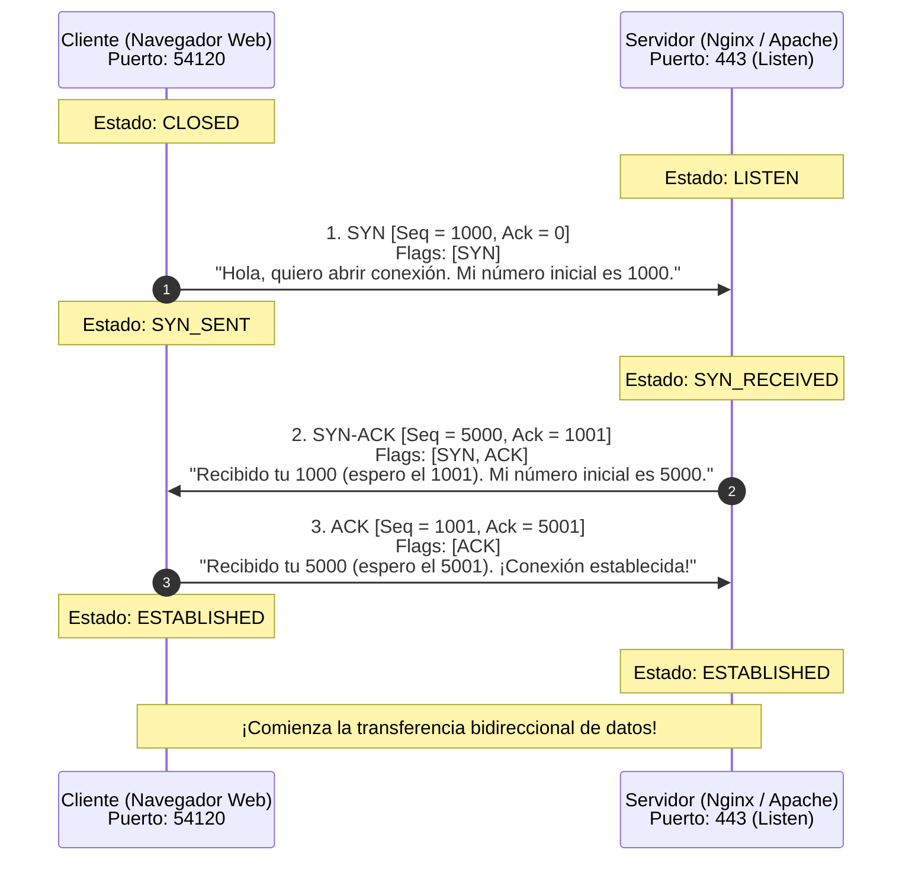
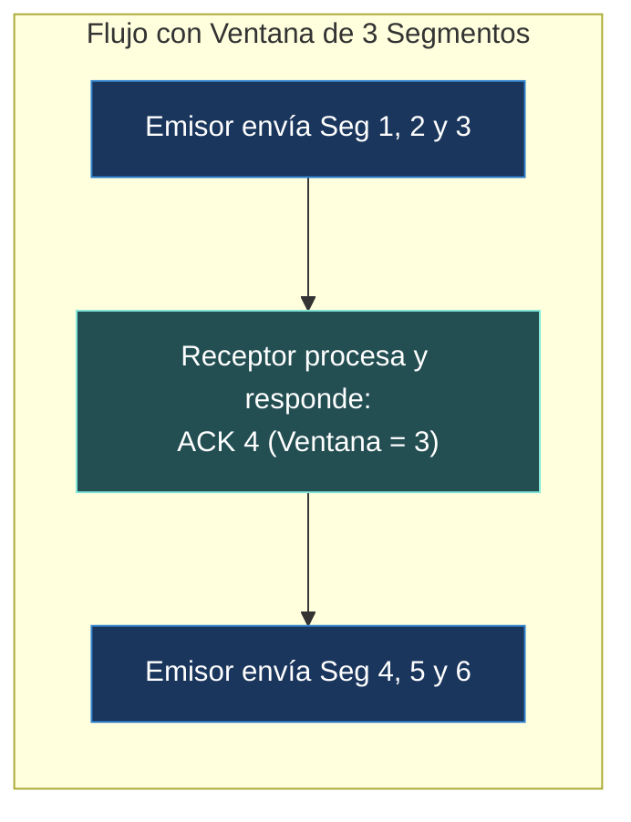
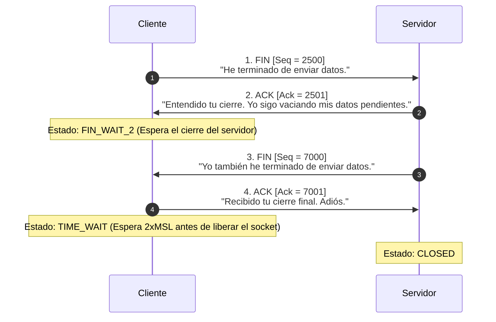

#redes #ccna #tcp #handshake #3-way-handshake #syn-flood #ventana-deslizante #wireshark

> [!info] 🧭 Navegación
> ◀ [[🚪 05.1 - Conceptos de Capa 4 (Puertos, Sockets y Multiplexación)]] · 🔼 [[🌐 00 - Índice Maestro de Redes Informáticas]] · ▶ [[⚡ 05.3 - Protocolo UDP (Datagramas, Rendimiento y QUIC)]]

---

## 🤝 1. ¿Qué es TCP y Por Qué Gobierna Internet?

**TCP** (*Transmission Control Protocol* - RFC 793) es el caballo de batalla de Internet.
Frente a la naturaleza "no confiable" de la Capa 3 (IP), TCP implementa una capa de fiabilidad absoluta sobre el caos de la red:

1. **Orientado a Conexión**: Antes de transferir datos, emisor y receptor deben establecer un acuerdo formal previo (**3-Way Handshake**).
2. **Confiable (*Reliable*)**: Todo segmento enviado debe ser confirmado por el receptor mediante un acuse de recibo (**ACK**). Si un paquete se pierde en el camino, TCP lo retransmite automáticamente.
3. **Ordenado (*In-Order Delivery*)**: Aunque los paquetes viajen por rutas distintas de Internet y lleguen desordenados, TCP los reensambla en el orden exacto original utilizando **Números de Secuencia**.
4. **Control de Flujo y Congestión**: Regula la velocidad para no ahogar al receptor ni colapsar los routers intermedios (**Ventana Deslizante**).

---

## 🚚 2. Anatomía de la Cabecera TCP

La cabecera TCP tiene un tamaño mínimo de **20 bytes** (sin opciones) y puede crecer hasta 60 bytes.

```
 0                   1                   2                   3
 0 1 2 3 4 5 6 7 8 9 0 1 2 3 4 5 6 7 8 9 0 1 2 3 4 5 6 7 8 9 0 1
+-+-+-+-+-+-+-+-+-+-+-+-+-+-+-+-+-+-+-+-+-+-+-+-+-+-+-+-+-+-+-+-+
|          Source Port          |       Destination Port        |
+-+-+-+-+-+-+-+-+-+-+-+-+-+-+-+-+-+-+-+-+-+-+-+-+-+-+-+-+-+-+-+-+
|                        Sequence Number                        |
+-+-+-+-+-+-+-+-+-+-+-+-+-+-+-+-+-+-+-+-+-+-+-+-+-+-+-+-+-+-+-+-+
|                    Acknowledgment Number                      |
+-+-+-+-+-+-+-+-+-+-+-+-+-+-+-+-+-+-+-+-+-+-+-+-+-+-+-+-+-+-+-+-+
|  Data |           |U|A|P|R|S|F|                               |
| Offset| Reserved  |R|C|S|S|Y|I|            Window             |
|       |           |G|K|H|T|N|N|                               |
+-+-+-+-+-+-+-+-+-+-+-+-+-+-+-+-+-+-+-+-+-+-+-+-+-+-+-+-+-+-+-+-+
|           Checksum            |         Urgent Pointer        |
+-+-+-+-+-+-+-+-+-+-+-+-+-+-+-+-+-+-+-+-+-+-+-+-+-+-+-+-+-+-+-+-+
|                    Options (si Data Offset > 5) ...           |
+-+-+-+-+-+-+-+-+-+-+-+-+-+-+-+-+-+-+-+-+-+-+-+-+-+-+-+-+-+-+-+-+
```

### 🚚 Los Flags de Control de TCP (Los Interruptores de la Conexión)

Los flags son bits individuales (0 o 1) que indican el propósito del segmento:

- **SYN (*Synchronize*)**: Se activa solo durante el inicio de la conexión para sincronizar los números de secuencia iniciales.
- **ACK (*Acknowledgment*)**: Indica que el campo *Acknowledgment Number* contiene un acuse de recibo válido. Casi todos los paquetes tras el primer SYN llevan este flag encendido.
- **FIN (*Finish*)**: Indica que el emisor ha terminado de enviar datos y solicita un cierre ordenado de la sesión.
- **RST (*Reset*)**: Cancela y destruye la conexión de forma abrupta e inmediata (se emite si intentas conectar a un puerto cerrado o si se detecta una anomalía crítica).
- **PSH (*Push*)**: Le pide al receptor que entregue los datos a la aplicación de inmediato sin esperar a llenar el búfer.
- **URG (*Urgent*)**: Los datos deben procesarse con prioridad inmediata (señalados por el *Urgent Pointer*).

---

## 🔹 3. El Saludo de Tres Vías (The 3-Way Handshake)

Para sincronizar sus números de secuencia y confirmar que ambos extremos están vivos y listos para transmitir en Full-Duplex, TCP ejecuta el proceso **SYN $\longrightarrow$ SYN-ACK $\longrightarrow$ ACK**:



> [!brain] 🔬 La Lógica de los Números de Secuencia y Ack
> El valor del **Acknowledgment Number** siempre representa el **siguiente byte que el receptor espera recibir**:
> - Si el cliente envía `Seq = 1000` con 500 bytes de carga útil, el servidor responderá con `Ack = 1500` (*"Recibí perfectamente hasta el byte 1499; envíame a partir del 1500"*).

---

## 🔹 4. Control de Flujo: La Ventana Deslizante (Sliding Window)

¿Qué pasa si un servidor potente con conexión de 10 Gbps envía datos a un móvil modesto conectado a una red móvil lenta? Si el servidor envía datos a máxima velocidad, desbordaría la memoria RAM del móvil y los paquetes se perderían.

TCP resuelve esto mediante el campo **Window Size**:

- El receptor informa continuamente en sus paquetes de respuesta: *"Mi búfer libre en este momento es de 64.240 bytes"*.
- El emisor tiene prohibido transmitir más bytes que los permitidos por esa ventana hasta recibir un nuevo ACK.
- **Zero Window**: Si la aplicación del móvil se congela y no procesa el búfer, el receptor envía `Window = 0`. El servidor **frena en seco** y espera a que el móvil le avise de que su memoria vuelve a tener espacio disponible.



---

## 🔹 5. Cierre de Conexión: El Desmantelamiento en Cuatro Pasos (4-Way Teardown)

Cuando uno de los dos extremos (por ejemplo, el cliente) termina de enviar datos, no corta el cable de golpe; realiza un cierre elegante en 4 fases:



> [!tip] 💡 ¿Por qué existe el estado TIME_WAIT?
> El cliente permanece en estado `TIME_WAIT` durante aproximadamente 60 a 120 segundos ($2 \times \text{MSL}$ - *Maximum Segment Lifetime*):
> 1. Garantiza que el último paquete `ACK` llegue al servidor (si se pierde por el camino, el servidor reenviará su `FIN` y el cliente debe seguir vivo para responder).
> 2. Evita que paquetes viejos rezagados en routers de Internet interfieran si se abre una nueva conexión con los mismos puertos inmediatamente después.

---

## 🛡️ 6. Perspectiva de Ciberseguridad: Ataques sobre TCP

> [!warning] 🚨 Ataque SYN Flood (Denegación de Servicio L4)
> El apretón de manos de TCP tiene una vulnerabilidad de diseño por agotamiento de recursos:
> 1. Un atacante emite millones de paquetes con el flag **`SYN`** por segundo, falsificando IPs de origen aleatorias que no existen (**IP Spoofing**).
> 2. El servidor responde con `SYN-ACK` a esas IPs fantasmas y reserva un bloque de memoria en su tabla interna (**SYN Backlog**) esperando el tercer `ACK`.
> 3. Como las IPs no existen, el tercer `ACK` nunca llega. La memoria del servidor se llena de conexiones semiabiertas en estado `SYN_RECEIVED` hasta agotar los recursos. **El servidor web deja de responder a usuarios legítimos.**
> 
> **La Mitigación Estándar: SYN Cookies**
> Con las **SYN Cookies** activadas en el kernel de Linux (`net.ipv4.tcp_syncookies = 1`), el servidor **no guarda nada en memoria RAM** al recibir el primer SYN. Codifica toda la información de la conexión criptográficamente dentro del número de secuencia del `SYN-ACK`. Solo si el cliente responde con el tercer `ACK`, el servidor valida el cálculo matemático y asigna memoria a la conexión.

---

## 💻 7. Práctica en Terminal Linux: Auditoría de Conexiones TCP

```bash
# 1. Comprobar si tu sistema tiene activada la protección contra SYN Flood

sysctl net.ipv4.tcp_syncookies

# 2. Ver cuántas conexiones tienes en cada estado TCP (ESTABLISHED, TIME_WAIT, LISTEN)

ss -s

# 3. Capturar en vivo el 3-Way Handshake hacia un servidor web con tcpdump

# (Ejecuta este comando y luego abre https://example.com con curl)

sudo tcpdump -i any -nn "tcp[tcpflags] & (tcp-syn|tcp-ack) != 0 and port 80" -c 6
```

> [!brain] 🔬 Salida de `tcpdump` capturando un 3-Way Handshake:
> ```text
> 12:45:01.100 IP 192.168.1.50.48120 > 93.184.216.34.80: Flags [S], seq 12345678, ...
> 12:45:01.125 IP 93.184.216.34.80 > 192.168.1.50.48120: Flags [S.], seq 87654321, ack 12345679, ...
> 12:45:01.126 IP 192.168.1.50.48120 > 93.184.216.34.80: Flags [.], seq 12345679, ack 87654322, ...
> ```
> - `Flags [S]`: Paso 1 (SYN).
> - `Flags [S.]`: Paso 2 (SYN + ACK; el punto `.` denota el flag ACK en tcpdump).
> - `Flags [.]`: Paso 3 (ACK final). ¡Conexión establecida con precisión milimétrica!

---

## 📌 8. Resumen y Siguiente Paso

En esta nota he dominado:

- Las propiedades esenciales de TCP: conexión, fiabilidad y orden.
- El ciclo de vida completo del 3-Way Handshake y el cierre en 4 pasos.
- El control de flujo con ventana deslizante para evitar la saturación de memoria.
- La mitigación de ataques SYN Flood mediante SYN Cookies.

En la siguiente nota ([[⚡ 05.3 - Protocolo UDP (Datagramas, Rendimiento y QUIC)]]), exploro la otra cara de la moneda: el protocolo **UDP**, la velocidad sin ataduras y cómo el nuevo estándar **QUIC / HTTP/3** está revolucionando el transporte moderno.
