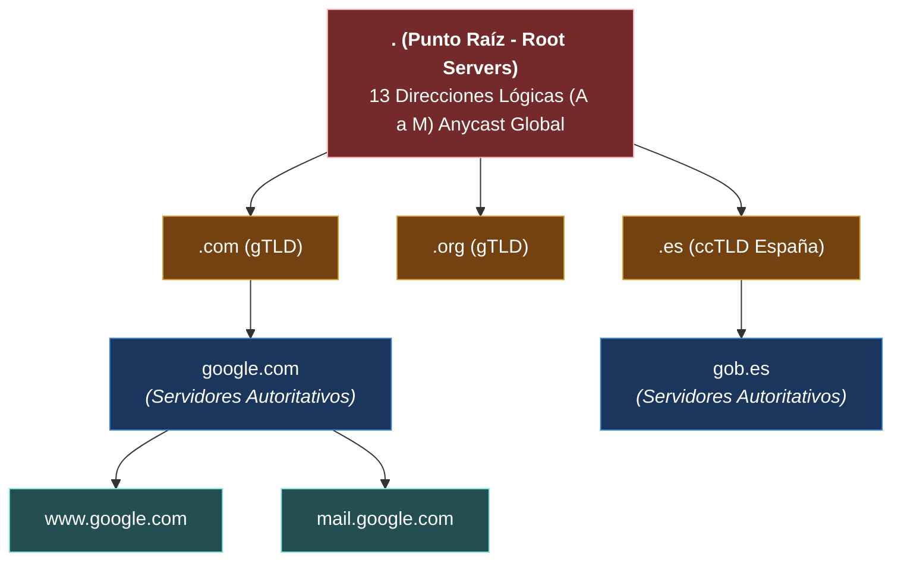
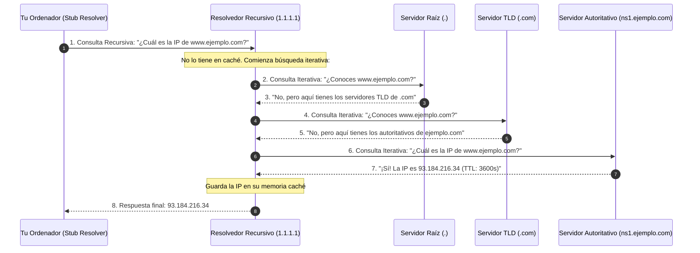

---
tags:
  - redes
  - ccna
  - dns
  - registros-dns
  - dig
  - dnssec
  - ciberseguridad
folder: "📂06 - Capa de Aplicación y Servicios de Red"
aliases:
  - "DNS (Domain Name System - Jerarquía y Registros)"
  - "Resolución DNS, Registros A/AAAA/MX y Seguridad"
date: 2026-09-07
---

> [!info] 🧭 Navegación
> ◀ [[05.4 - Comparativa TCP vs UDP y Evolución Moderna]] · 🔼 [[00 - Índice Maestro de Redes]] · ▶ [[06.2 - DHCP (Dynamic Host Configuration Protocol y Proceso DORA)]]

---

# 📖 06.1 - DNS (Domain Name System - Jerarquía, Consultas y Registros)

## 1. La Libreta Telefónica de Internet

Los humanos somos excelentes recordando palabras e historias (`wikipedia.org`, `amazon.es`), pero pésimos memorizando secuencias binarias o números decimales como `142.250.200.14` o `2a00:1450:4003:809::200e`. Los routers y switches, en cambio, solo entienden direcciones IP.

El **Sistema de Nombres de Dominio** (**DNS** - RFC 1034 / 1035) es la base de datos distribuida, global y jerárquica más grande jamás construida por la humanidad, cuya misión principal es **traducir nombres de host legibles a direcciones IP**.

> [!abstract] 🏠 Analogía: Los Contactos de tu Teléfono Móvil
> En tu móvil no marcas `+34 612 345 678` cada vez que quieres llamar a tu mejor amigo; pulsas sobre "Carlos". La aplicación de contactos de tu teléfono busca internamente el número asociado a ese nombre y lanza la llamada. DNS es esa agenda de contactos a escala de todo el planeta.

---

## 2. La Jerarquía Global del Árbol DNS

El espacio de nombres de DNS se organiza como una estructura de **árbol invertido** con la raíz en la cúspide:



### Los Cuatro Niveles de Servidores
1. **Root Name Servers (Servidores Raíz `.`)**:
   - Existen **13 direcciones IP lógicas** de servidores raíz (desde `a.root-servers.net` hasta `m.root-servers.net`), gestionadas por entidades como la NASA, ICANN, Verisign y la Universidad de Maryland.
   - Gracias a la tecnología **Anycast** ([[03.3 - Protocolo IPv6 (Estructura, Tipos y Autoconfiguración)]]), esas 13 direcciones se replican en más de 1.500 servidores físicos distribuidos por todo el globo.
2. **TLD Name Servers (*Top-Level Domain*)**:
   - Administran extensiones genéricas (**gTLD**: `.com`, `.org`, `.net`, `.edu`) o de código de país (**ccTLD**: `.es`, `.mx`, `.fr`, `.uk`).
3. **Authoritative Name Servers (Servidores Autoritativos)**:
   - Tienen la copia maestra oficial de la zona de un dominio (ej. los DNS de Cloudflare, AWS Route53 o el registrador donde compraste el dominio). **Tienen la última palabra sobre las IPs de ese dominio.**
4. **Recursive Resolvers (Resolvedores Recursivos / DNS Caché)**:
   - Los servidores a los que apunta tu ordenador (el DNS de tu proveedor de Internet o servicios públicos como Cloudflare `1.1.1.1` o Google `8.8.8.8`). Hacen todo el trabajo de consultar la jerarquía por ti y guardan las respuestas en memoria RAM (**Caché**) para responder al instante la próxima vez.

---

## 3. Resolución Recursiva vs. Iterativa: El Viaje de una Consulta

Cuando escribes `www.ejemplo.com` en tu navegador:



- **Consulta Recursiva**: El cliente delega la tarea completa en el resolvedor: *"Consígueme la IP, no me des referencias a otros servidores"*.
- **Consulta Iterativa**: El resolvedor pregunta a los servidores jerárquicos: si no tienen la respuesta final, devuelven una referencia (*referral*) al servidor del siguiente nivel inferior.

---

## 4. Tipos de Registros DNS Esenciales

En el archivo de zona de un dominio se definen múltiples tipos de registros según su función:

| Tipo de Registro | Nombre Completo | Propósito Principal | Ejemplo de Contenido |
|:---:|:---|:---|:---|
| **A** | *Address* | Traduce un nombre de host a una **dirección IPv4**. | `ejemplo.com. IN A 93.184.216.34` |
| **AAAA** | *Quad-A* | Traduce un nombre de host a una **dirección IPv6** (128 bits). | `ejemplo.com. IN AAAA 2606:2800:220:1::` |
| **CNAME** | *Canonical Name* | Crea un **alias** que apunta a otro nombre de dominio (no a una IP). | `blog.ejemplo.com. IN CNAME servers.cdn.com.` |
| **MX** | *Mail Exchange* | Especifica los **servidores de correo** del dominio con su prioridad. | `ejemplo.com. IN MX 10 mail.ejemplo.com.` |
| **TXT** | *Text* | Texto arbitrario para validar titularidad y seguridad del correo. | `v=spf1 include:_spf.google.com ~all` |
| **NS** | *Name Server* | Delega la zona a servidores de nombres autoritativos. | `ejemplo.com. IN NS ns1.cloudflare.com.` |
| **PTR** | *Pointer* | **Resolución DNS Inversa**: traduce una IP a su nombre asociado. | `34.216.184.93.in-addr.arpa. IN PTR ejemplo.com.` |
| **SOA** | *Start of Authority* | Metadatos de la zona: correo del admin, serial number, TTL global. | `ns1.ejemplo.com. admin.ejemplo.com. (...)` |

> [!tip] 💡 La Prioridad en Registros MX
> En los registros de correo (MX), el número representa la **prioridad**: **cuanto menor sea el número, mayor preferencia tiene el servidor**. Si el servidor con prioridad `10` no responde, el remitente lo intentará con el de prioridad `20`.

---

## 5. El TTL (Time to Live) en DNS: La Espada de Doble Filo

Cada registro DNS devuelto incluye un contador **TTL** en segundos (ej. `TTL = 300` para 5 minutos, o `TTL = 86400` para 24 horas):
- **TTL Alto (ej. 24h)**: Reduce la carga en tus servidores DNS y acelera la carga para los usuarios (las respuestas se quedan en la caché del ISP). *Desventaja*: Si cambias de servidor o migras de IP, los usuarios tardarán hasta 24 horas en enterarse (**Tiempo de Propagación DNS**).
- **TTL Bajo (ej. 60s)**: Ideal para migraciones críticas o balanceo de carga dinámico; los cambios se propagan casi en tiempo real.

---

## 6. Perspectiva de Ciberseguridad: Ataques sobre DNS

> [!warning] 🚨 Vectores de Ataque Críticos en DNS
> 1. **DNS Spoofing / Cache Poisoning (Envenenamiento de Caché)**:
>    Un atacante inyecta respuestas DNS fraudulentas en la memoria de un resolvedor recursivo vulnerable (ej. ataque Kaminsky). Cuando cualquier usuario de ese ISP entra a `banco.com`, el DNS envenenado le entrega la IP del servidor del atacante con una web clonada de phishing.
>    - *Mitigación Definitiva: **DNSSEC***: Sistema criptográfico donde cada registro DNS se firma digitalmente con claves públicas y privadas (**RRSIG** y **DNSKEY**). Si un atacante altera la IP, la firma no coincide y el resolvedor descarta la respuesta.
> 2. **Transferencia de Zona Completa (*AXFR Exposure*)**:
>    Si un administrador deja su servidor DNS autoritativo mal configurado permitiendo transferencias de zona abiertas a cualquier IP, un pentester puede ejecutar:
>    ```bash
>    dig axfr @ns1.objetivo.com objetivo.com
>    ```
>    En un segundo, el atacante descarga la lista íntegra de todos los subdominios, servidores internos, VPNs y entornos de desarrollo de la empresa sin disparar alarmas.
> 3. **Exfiltración de Datos por DNS Tunneling**:
>    Incluso en las redes corporativas más blindadas donde todo tráfico web está bloqueado por un proxy, las consultas DNS (puerto 53 UDP) suelen permitirse hacia el exterior. Atacantes utilizan herramientas como `dnscat2` o `iodine` para codificar archivos robados en los subdominios de consultas DNS (`base64_archivo.atacante.com`), burlando firewalls perimetrales.

---

## 7. Práctica en Terminal Linux: Auditoría DNS con `dig`

La herramienta profesional estándar en Linux para interrogar al sistema DNS es `dig` (*Domain Information Groper*):

```bash
# 1. Consulta estándar del registro A (IPv4) de un dominio
dig google.com +noall +answer

# 2. Consultar registros específicos (IPv6, Correo o TXT)
dig cloudflare.com AAAA +short
dig gmail.com MX +short
dig github.com TXT +short

# 3. Trazar la resolución jerárquica completa paso a paso (Root -> TLD -> Autoritativo)
dig +trace www.wikipedia.org

# 4. Forzar una consulta a un servidor DNS público específico (ej. Cloudflare 1.1.1.1)
dig @1.1.1.1 example.com

# 5. Resolución inversa (averiguar el nombre detrás de una IP con -x)
dig -x 8.8.8.8 +short
```

> [!brain] 🔬 Salida de `dig +trace`:
> Al ejecutar `dig +trace`, verás cómo tu terminal contacta primero con uno de los servidores raíz (`k.root-servers.net`), luego salta al TLD (`a.org-servers.net`) y finalmente obtiene la respuesta del autoritativo de Wikimedia. ¡El proceso iterativo desplegado ante tus ojos!

---

## 8. Resumen y Siguiente Paso

En esta nota hemos cubierto:
- El rol indispensable de DNS y su arquitectura de árbol jerárquico.
- La diferencia entre consultas recursivas e iterativas.
- La función de los registros A, AAAA, CNAME, MX, TXT y PTR.
- Los vectores de riesgo: envenenamiento de caché, transferencias AXFR y la protección de DNSSEC.

En la siguiente nota ([[06.2 - DHCP (Dynamic Host Configuration Protocol y Proceso DORA)]]), aprenderemos cómo los equipos obtienen automáticamente su IP, máscara, gateway y DNS al conectarse mediante el protocolo **DHCP** y el ciclo **DORA**.
