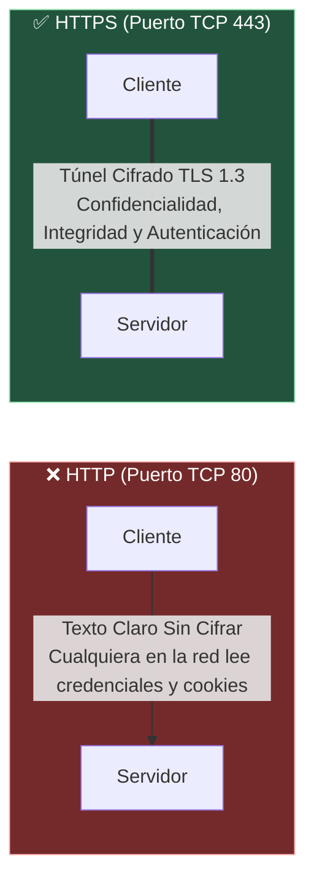
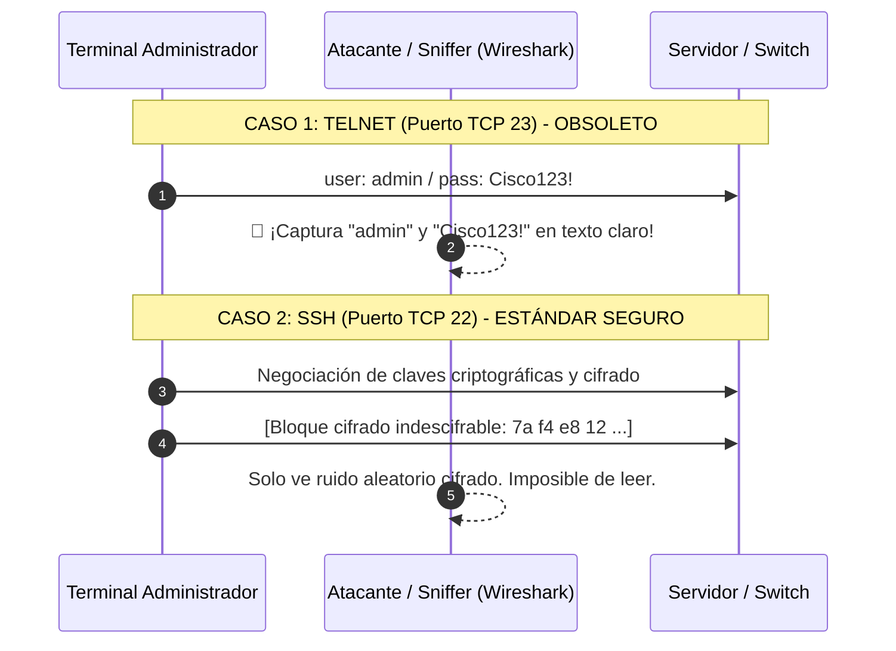

---
tags:
  - redes
  - ccna
  - protocolos-aplicacion
  - http
  - https
  - ssh
  - ftp
  - smtp
  - snmp
  - wireshark
folder: "📂06 - Capa de Aplicación y Servicios de Red"
aliases:
  - "Protocolos de Aplicación Comunes"
  - "HTTP/S, SSH vs Telnet, FTP, Correo y SNMP"
date: 2026-09-07
---

> [!info] 🧭 Navegación
> ◀ [[06.3 - NAT, PAT y CGNAT (Traducción de Direcciones de Red)]] · 🔼 [[00 - Índice Maestro de Redes]] · ▶ [[07.1 - Estándares IEEE 802.11 (De Wi-Fi 4 a Wi-Fi 7)]]

---

# 🌐 06.4 - Protocolos de Aplicación Comunes (HTTP-S, SSH, FTP, Correo y Gestión)

## 1. La Capa de Aplicación (Capa 7 OSI): Donde Trabaja el Usuario

La **Capa de Aplicación** proporciona la interfaz directa entre el software que utilizamos (navegadores web, terminales de administración, clientes de correo) y la infraestructura de red subyacente.

En esta nota desglosaremos los protocolos estándar más importantes de la industria, agrupados por su propósito operativo: **Web**, **Administración Remota**, **Transferencia de Archivos**, **Correo Electrónico** y **Gestión de Infraestructura**.

---

## 2. Protocolos Web: HTTP vs. HTTPS

La Web funciona bajo un modelo **Cliente-Servidor sin estado (*Stateless*)** donde el cliente envía peticiones y el servidor devuelve respuestas.



### Métodos HTTP Principales
- `GET`: Solicitar un recurso (página HTML, imagen, JSON) sin modificar el servidor.
- `POST`: Enviar datos al servidor para crear un recurso (formularios, subida de datos).
- `PUT` / `PATCH`: Reemplazar o actualizar parcialmente un recurso existente.
- `DELETE`: Eliminar un recurso del servidor.
- `HEAD`: Solicita solo las cabeceras HTTP de respuesta sin el cuerpo (útil para comprobar si un archivo cambió o su tamaño sin descargarlo).

### Códigos de Estado HTTP Esenciales
- **`2xx` (Éxito)**: `200 OK` (Petición completada), `201 Created` (Recurso creado con éxito).
- **`3xx` (Redirección)**: `301 Moved Permanently` (Redirección fija a HTTPS), `302 Found` (Temporal).
- **`4xx` (Error del Cliente)**: `400 Bad Request`, `401 Unauthorized` (Falta autenticación), `403 Forbidden` (Acceso denegado), `404 Not Found` (Recurso inexistente).
- **`5xx` (Error del Servidor)**: `500 Internal Server Error` (Fallo en el backend), `502 Bad Gateway`, `503 Service Unavailable` (Sobrecarga de tráfico).

> [!brain] 🔬 ¿Cómo funciona el Handshake TLS en HTTPS?
> En HTTPS, tras completar el 3-Way Handshake de TCP en el puerto 443, se ejecuta la negociación **TLS (Transport Layer Security)**:
> 1. **ClientHello**: El cliente propone versiones de TLS y algoritmos de cifrado (*Cipher Suites*).
> 2. **ServerHello + Certificado X.509**: El servidor demuestra su identidad presentando un certificado emitido por una Autoridad de Certificación (CA) de confianza con su clave pública.
> 3. **Intercambio de Claves Asimétrico (Diffie-Hellman / ECDHE)**: Negocian una **clave de sesión simétrica secreta** efímera sin enviarla jamás por el cable.
> 4. **Transferencia Cifrada Simétrica**: A partir de ese milisegundo, todos los datos HTTP viajan blindados con cifrado ultrarrápido **AES-GCM** o **ChaCha20**.

---

## 3. Administración Remota: SSH vs. Telnet

Para administrar routers, switches y servidores Linux mediante consola de comandos, existen dos alternativas históricas:



- **Telnet (Puerto TCP 23)**: Obsoleto y prohibido en entornos profesionales. Toda pulsación de tecla viaja en texto plano sin cifrar.
- **SSH (*Secure Shell* - Puerto TCP 22)**: Proporciona confidencialidad, autenticación robusta mediante claves criptográficas públicas/privadas (**Ed25519**, RSA de 4096 bits) y la posibilidad de crear túneles cifrados (*Port Forwarding local/remoto* y proxies SOCKS5).

---

## 4. Transferencia de Archivos: FTP, SFTP y TFTP

| Protocolo | Puerto L4 | Transporte | Seguridad | Características y Casos de Uso |
|:---|:---:|:---:|:---:|:---|
| **FTP** | **TCP 20 y 21** | TCP | ❌ Texto claro | Utiliza **dos canales separados**: Puerto `21` para órdenes de control y Puerto `20` para la transferencia real de datos. |
| **SFTP** | **TCP 22** | TCP (vía SSH) | ✅ Cifrado fuerte | Es un subsistema que corre íntegramente dentro de un túnel SSH. Un solo puerto, seguro y amigable con firewalls. |
| **TFTP** | **UDP 69** | UDP | ❌ Sin seguridad | Trivial FTP: Extremadamente simple, sin autenticación ni contraseñas. Usado para subir firmwares a routers Cisco y arranque en red PXE. |

> [!warning] 🚨 El Dolor de Cabeza de FTP con Firewalls y NAT
> - En **FTP Modo Activo**: El cliente conecta al puerto 21 del servidor, y luego **el servidor inicia una conexión desde su puerto 20 hacia el cliente**. Si el cliente está detrás de un router con NAT, ¡el router bloquea la conexión entrante del servidor!
> - En **FTP Modo Pasivo (PASV)**: El servidor le entrega al cliente un puerto efímero alto para que sea siempre el cliente quien inicie la conexión hacia afuera, resolviendo el bloqueo de NAT.

---

## 5. Correo Electrónico: La Tríada SMTP, IMAP y POP3

El envío y la recepción de correo electrónico son dos procesos completamente distintos que utilizan protocolos especializados:

```mermaid
graph LR
    PC_REMITENTE[Remitente (Thunderbird)] -->|1. Envío PUSH:<br>SMTP (587 / 465)| SRV_ORIGEN[Servidor Correo Remitente]
    SRV_ORIGEN -->|2. Retransmisión PUSH:<br>SMTP (Puerto 25)| SRV_DESTINO[Servidor Correo Destino]
    
    SRV_DESTINO -->|3a. Sincronización PULL:<br>IMAP (Puerto 993)| PC_DESTINO[Receptor (Móvil)]
    SRV_DESTINO -.->|3b. Descarga y Borrado:<br>POP3 (Puerto 995)| PC_DESTINO_OLD[Receptor Antiguo]

    style PC_REMITENTE fill:#2d3748,stroke:#cbd5e0,color:#fff
    style SRV_ORIGEN fill:#1a365d,stroke:#3182ce,color:#fff
    style SRV_DESTINO fill:#1a365d,stroke:#3182ce,color:#fff
    style PC_DESTINO fill:#22543d,stroke:#9ae6b4,color:#fff
    style PC_DESTINO_OLD fill:#744210,stroke:#d69e2e,color:#fff
```

1. **SMTP (*Simple Mail Transfer Protocol*)**:
   - Protocolo de **empuje (*Push*)**. Es el único que se usa para **enviar** correos desde un cliente al servidor, y para **retransmitir** correos de un servidor a otro en Internet.
   - Puertos: `25` (entre servidores), `587` (envío cliente a servidor con STARTTLS) y `465` (envío con SSL directo).
2. **IMAP (*Internet Message Access Protocol* - Puerto 143 / IMAPS 993)**:
   - Protocolo de **consulta y sincronización (*Pull*)**. Los correos permanecen almacenados en el servidor; si lees o borras un correo en el móvil, el cambio se refleja inmediatamente en tu portátil.
3. **POP3 (*Post Office Protocol* - Puerto 110 / POP3S 995)**:
   - Protocolo antiguo de descarga. Descarga los correos a tu ordenador local y los borra del servidor por defecto. Inadecuado para el uso actual multidispositivo.

---

## 6. Gestión, Tiempo y Monitorización: NTP y SNMP

### 6.1 NTP (Network Time Protocol - Puerto UDP 123)
En informática distribuida, tener los relojes desfasados por tan solo 3 minutos provoca que:
- Los certificados HTTPS fallen (error de "certificado caducado" o "aún no válido").
- La autenticación de dos factores (TOTP de Google Authenticator) deje de coincidir.
- Los registros forenses (*Logs*) sean imposibles de correlacionar durante un incidente de seguridad.
**NTP** sincroniza los relojes de millones de servidores con una precisión de microsegundos frente a relojes atómicos (**Stratum 0**).

### 6.2 SNMP (Simple Network Management Protocol - Puertos UDP 161 y 162)
Permite a los administradores monitorizar en tiempo real el uso de CPU, temperatura de fuentes y tráfico de interfaces de miles de routers, switches e impresoras mediante software como Zabbix, Grafana o PRTG:
- **SNMPv1 y SNMPv2c**: **Completamente inseguras**. Utilizan una "cadena de comunidad" (*Community String*, habitualmente la palabra `public`) que viaja en texto claro por la red.
- **SNMPv3**: El único estándar admisible en producción moderna. Incorpora autenticación con hash (HMAC-SHA) y cifrado robusto con AES de 256 bits.

---

## 7. Perspectiva de Ciberseguridad: Auditoría de Protocolos L7

> [!warning] 🚨 Vectores de Ataque en Capa de Aplicación
> 1. **Captura de Credenciales en Texto Claro**:
>    Si en una auditoría interna un pentester encuentra tráfico Telnet (`23`), FTP (`21`) o HTTP (`80`), solo necesita abrir Wireshark ([[09.2 - Análisis de Tráfico de Red con Wireshark y Tcpdump]]) y filtrar por `http.request.method == "POST"` o `telnet` para obtener nombres de usuario y contraseñas en claro.
> 2. **Enumeración SNMPv2c**:
>    Si un switch tiene la comunidad `public` por defecto, cualquier atacante ejecuta:
>    ```bash
>    snmpwalk -v2c -c public 192.168.1.1
>    ```
>    El switch responderá volcando la tabla de rutas completa, nombres de interfaces, versiones exactas de firmware y direcciones IP de administración.

---

## 8. Práctica en Terminal Linux: Comprobación de Servicios

```bash
# 1. Comprobar las cabeceras de respuesta HTTP de un servidor web con curl
curl -I https://www.google.com

# 2. Conexión de diagnóstico SSL/TLS cruda con OpenSSL para inspeccionar certificados
openssl s_client -connect github.com:443 -brief

# 3. Comprobar el estado de sincronización del reloj del sistema con NTP
timedatectl status

# 4. Probar la autenticación remota SSH en modo detallado (Verbose)
ssh -vvv usuario@servidor_ip
```

> [!brain] 🔬 Salida de `openssl s_client -brief`:
> ```text
> CONNECTION ESTABLISHED
> Protocol version: TLSv1.3
> Ciphersuite: TLS_AES_128_GCM_SHA256
> Peer signing digest: SHA256
> Verification: OK
> ```
> Observa cómo la terminal te confirma la versión de protocolo (TLS 1.3) y el algoritmo de cifrado simétrico en uso (`AES_128_GCM`).

---

## 9. Resumen y Siguiente Paso

Con esta nota culminamos el **Bloque 6 (Capa de Aplicación y Servicios)**. Hemos dominado:
- El funcionamiento de HTTP, códigos de estado y la arquitectura TLS en HTTPS.
- Por qué Telnet y FTP son reliquias inseguras frente a SSH y SFTP.
- La arquitectura de correo electrónico (envío con SMTP, sincronización con IMAP).
- La sincronización temporal con NTP y la monitorización segura con SNMPv3.

En el **Bloque 7** nos desconectaremos de los cables para dominar las **Redes Inalámbricas (Wi-Fi)**: comenzaremos con [[07.1 - Estándares IEEE 802.11 (De Wi-Fi 4 a Wi-Fi 7)]] para entender la evolución de las velocidades, modulaciones y protocolos del aire.
