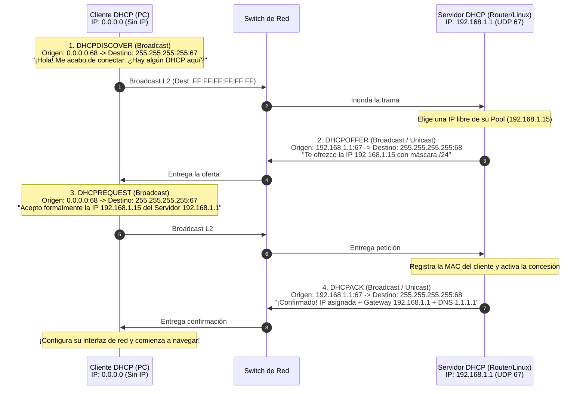
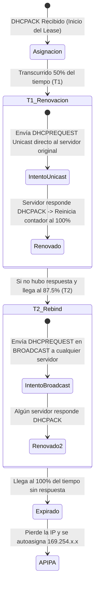
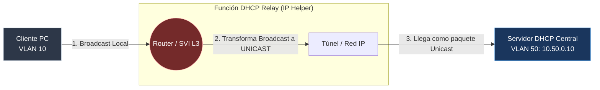

#redes #ccna #dhcp #dora #dhcp-snooping #dhcp-relay #ciberseguridad

> [!info] 🧭 Navegación
> ◀ [[📖 06.1 - DNS (Domain Name System - Jerarquía, Consultas y Registros)]] · 🔼 [[🌐 00 - Índice Maestro de Redes Informáticas]] · ▶ [[🔁 06.3 - NAT, PAT y CGNAT (Traducción de Direcciones de Red)]]

---

## 📡 1. El Propósito de DHCP: Automatizando la Configuración de Red

El protocolo **DHCP** (*Dynamic Host Configuration Protocol* - RFC 2131) opera en la **Capa de Aplicación** sobre **UDP**:

- **Servidor DHCP**: Escucha en el puerto **UDP 67**.
- **Cliente DHCP**: Escucha en el puerto **UDP 68**.

Su misión es entregar automáticamente y de forma temporal una configuración completa de red a cualquier dispositivo que se conecte al cable o a la red inalámbrica.

> [!abstract] 🏠 Analogía: El Hotel y la Llave de la Habitación
> Cuando llegas a un hotel, no eliges tú la habitación ni te quedas con ella para siempre:
> 1. Te acercas a la recepción (el Servidor DHCP).
> 2. El recepcionista mira en su libro de registro qué habitaciones están libres en ese momento.
> 3. Te entrega la llave de la habitación 304 junto con una tarjeta que indica la clave de la Wi-Fi y la hora de salida (el tiempo de concesión / *Lease Time*).
> 4. Cuando termina tu estancia, devuelves la llave y esa habitación queda disponible para el siguiente huésped.

---

## 🔹 2. El Ciclo DORA: El Saludo de Cuatro Fases

Cuando un ordenador se conecta a una red sin tener una IP estática configurada, inicia un diálogo estructurado en cuatro mensajes conocido con el acrónimo **DORA**:



### 🔹 Las Cuatro Fases Desglosadas

1. **Discover (DHCPDISCOVER)**:
   - El cliente no tiene IP (`0.0.0.0`) y no sabe la IP del servidor. Envía un broadcast a nivel de red (`255.255.255.255`) y de enlace (`FF:FF:FF:FF:FF:FF`).
2. **Offer (DHCPOFFER)**:
   - Los servidores DHCP que escucharon el mensaje reservan temporalmente una dirección libre de su rango (*Pool*) y envían una propuesta con la IP ofrecida (**YIADDR** - *Your IP Address*), máscara de red, tiempo de préstamo y la IP del servidor.
3. **Request (DHCPREQUEST)**:
   - El cliente acepta la oferta. **Se envía en broadcast** para dos propósitos:
     a) Confirmar al servidor elegido que acepta su oferta.
     b) Notificar amablemente a otros posibles servidores DHCP que retiren sus ofertas y devuelvan esas IPs a sus pools.

4. **Acknowledge (DHCPACK)**:
   - El servidor sella el acuerdo en su base de datos y entrega los parámetros finales (IP, Máscara, Default Gateway, Servidores DNS, Dominio de búsqueda y NTP).

---

## 🔹 3. El Tiempo de Concesión (*Lease Time*) y su Renovación

Una dirección IP entregada por DHCP nunca es propiedad definitiva del cliente; es un **alquiler temporal** (*Lease*), típicamente de 24 horas en oficinas o 2 horas en cafeterías:



- **Temporizador T1 (50% del Lease)**: El cliente contacta **en unicast directo** con su servidor DHCP original para renovar el alquiler sin molestar al resto de la red.
- **Temporizador T2 (87.5% del Lease)**: Si el servidor original se apagó o está caído, el cliente emite un broadcast desesperado buscando **cualquier otro servidor DHCP** que extienda su contrato.
- **Expiración (100%)**: Si nadie responde, el cliente está obligado a soltar la IP de inmediato, perdiendo la conectividad y cayendo en el rango [[🌐 03.1 - Protocolo IP y Direccionamiento IPv4|APIPA (169.254.x.x)]].

---

## ☁️ 4. DHCP Relay Agent: Cruzando Fronteras de Enrutadores

En redes medianas y grandes, las empresas centralizan sus servidores DHCP en una VLAN de Servidores dedicada. 

Sin embargo, tenemos un problema físico: **los routers bloquean y destruyen los paquetes de broadcast por diseño**. Si un PC de la VLAN 10 emite un `DHCPDISCOVER` en broadcast, el router local lo descarta y el servidor DHCP centralizado en la VLAN 50 nunca se entera.



### 🧰 La Solución: `ip helper-address`

El router local se configura como **DHCP Relay Agent**:

1. Intercepta el paquete `DHCPDISCOVER` de broadcast en su interfaz local.
2. Inyecta su propia IP de interfaz en el campo **GIADDR** (*Gateway IP Address*) para que el servidor sepa de qué subred exacta debe extraer la IP.
3. Envía el paquete **en Unicast limpio** a través de la red corporativa directamente a la IP del servidor DHCP centralizado.

En routers Cisco se configura con una sola línea:
```text
interface GigabitEthernet0/0.10
 ip helper-address 10.50.0.10
```

---

## 🛡️ 5. Perspectiva de Ciberseguridad: Ataques y Defensas en DHCP

> [!warning] 🚨 Ataques Críticos de Capa 2 contra DHCP
> 1. **DHCP Starvation (Agotamiento del Rango de IPs)**:
>    Un atacante ejecuta herramientas como `yersinia` emitiendo miles de paquetes `DHCPDISCOVER` falsos por segundo con direcciones MAC aleatorias inventadas. El servidor DHCP agota todas las IPs disponibles de su pool en cuestión de 10 segundos.
> 2. **Rogue DHCP Server (Servidor DHCP Malicioso)**:
>    Una vez agotado el pool legítimo (o simplemente compitiendo por velocidad), el atacante levanta su propio servidor DHCP en la red local. Cuando un nuevo usuario legítimo se conecta, el atacante responde primero y le entrega:
>    - Una IP válida.
>    - **Su propia máquina atacante como Default Gateway**.
>    - **Su propio DNS malicioso**.
>    En ese instante, el atacante ha conseguido un **Man-in-the-Middle absoluto** sobre todo el tráfico del usuario de forma 100% invisible.
> 
> **La Defensa Definitiva en Switches Cisco: DHCP Snooping**
> El switch actúa como un firewall de Capa 2:
> - Configura los puertos que van hacia servidores legítimos como **Trusted** (Confiables).
> - Configura todos los puertos donde se conectan usuarios como **Untrusted** (No confiables).
> - **Si entra un paquete `DHCPOFFER` o `DHCPACK` por un puerto Untrusted, el switch lo descarta de inmediato y apaga el puerto.**

---

## 💻 6. Práctica en Terminal Linux: Renovación e Inspección DHCP

```bash
# 1. Liberar formalmente tu IP actual enviando un mensaje DHCPRELEASE al servidor

sudo dhclient -r -v eth0

# 2. Solicitar una nueva IP ejecutando el ciclo DORA completo en la terminal

sudo dhclient -v eth0

# 3. Inspeccionar el archivo de concesión (Lease) guardado por el sistema operativo

cat /var/lib/dhcp/dhclient.leases | tail -n 25

# 4. Capturar en tiempo real las 4 fases de DORA con tcpdump

sudo tcpdump -i eth0 -vn -e "port 67 or port 68"
```

> [!brain] 🔬 Salida de `dhclient -v eth0`:
> ```text
> DHCPDISCOVER on eth0 to 255.255.255.255 port 67 interval 3
> DHCPOFFER of 192.168.1.150 from 192.168.1.1
> DHCPREQUEST for 192.168.1.150 on eth0 to 255.255.255.255 port 67
> DHCPACK of 192.168.1.150 from 192.168.1.1
> bound to 192.168.1.150 -- renewal in 39822 seconds.
> ```
> Observa con total claridad las cuatro líneas del proceso DORA ejecutándose en milisegundos.

---

## 📌 7. Resumen y Siguiente Paso

En esta nota he dominado:

- La función de DHCP y sus puertos UDP 67/68.
- El ciclo de cuatro pasos **DORA** (Discover, Offer, Request, Acknowledge).
- Los temporizadores de renovación T1 (50%) y T2 (87.5%).
- La función de retransmisión Unicast de DHCP Relay (`ip helper-address`).
- El ataque Rogue DHCP y su mitigación con **DHCP Snooping**.

En la siguiente nota ([[🔁 06.3 - NAT, PAT y CGNAT (Traducción de Direcciones de Red)]]), veo la tecnología que permitió que miles de millones de dispositivos naveguen por Internet utilizando una sola dirección IP pública: **NAT y sobrecarga PAT**.
