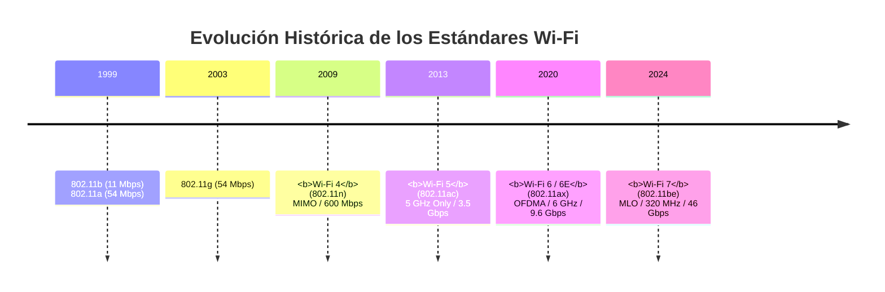
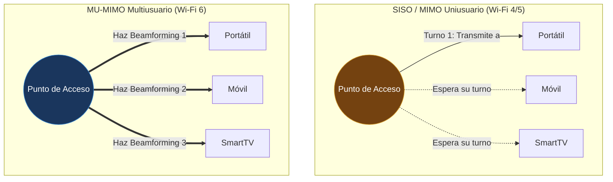
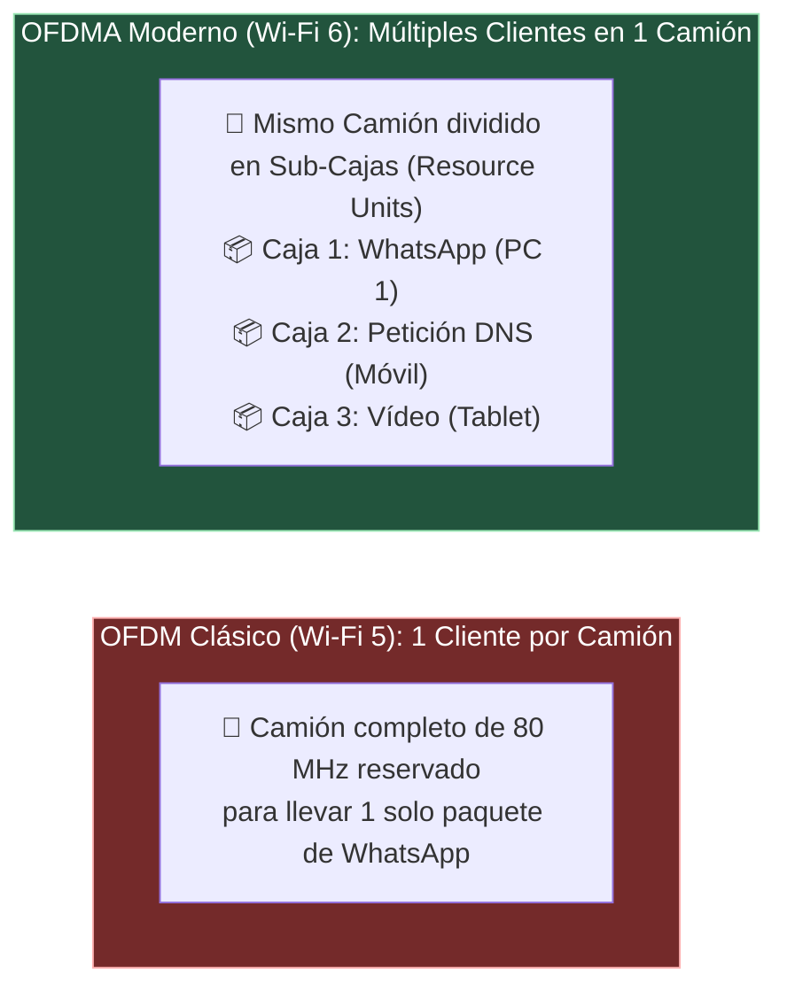

#redes #ccna #wifi #ieee-802-11 #wifi6 #wifi7 #ofdma #mimo

> [!info] 🧭 Navegación
> ◀ [[🌐 06.4 - Protocolos de Aplicación Comunes (HTTP-S, SSH, FTP, Correo y Gestión)]] · 🔼 [[🌐 00 - Índice Maestro de Redes Informáticas]] · ▶ [[📻 07.2 - Frecuencias, Canales, Celdas y Roaming]]

---

## 📡 1. El Nacimiento del Estándar Inalámbrico

En 1997, el Instituto de Ingenieros Eléctricos y Electrónicos (**IEEE**) publicó el estándar **802.11**.
Para evitar confusiones con la sopa de letras (`802.11b`, `802.11a`, `802.11g`, `802.11n`, `802.11ac`, `802.11ax`), la **Wi-Fi Alliance** introdujo una nomenclatura simplificada y comercial para el gran público:



---

## ⚖️ 2. Tabla Comparativa de Estándares IEEE 802.11

| Nombre Comercial | Estándar IEEE | Año | Frecuencias Operativas | Ancho de Canal Máximo | Modulación Máxima | Velocidad Máxima Teórica | Tecnología Revolucionaria |
|:---:|:---:|:---:|:---:|:---:|:---:|:---:|:---|
| — | **802.11b** | 1999 | 2.4 GHz | 20 MHz | 11 Mbps (DSSS) | 11 Mbps | Primer estándar masivo doméstico. |
| — | **802.11a** | 1999 | 5 GHz | 20 MHz | 54 Mbps (OFDM) | 54 Mbps | Primera incursión en 5 GHz (costoso). |
| — | **802.11g** | 2003 | 2.4 GHz | 20 MHz | 54 Mbps (OFDM) | 54 Mbps | Compatibilidad con 802.11b a 54 Mbps. |
| **Wi-Fi 4** | **802.11n** | 2009 | 2.4 GHz y 5 GHz | 40 MHz | 64-QAM | 600 Mbps | **MIMO** (Múltiples antenas) y agregación. |
| **Wi-Fi 5** | **802.11ac** | 2013 | Solo 5 GHz | 80 y 160 MHz | 256-QAM | 3.46 Gbps (Wave 1) / 6.9 Gbps (Wave 2) | Canales ultra anchos y **MU-MIMO en bajada**. |
| **Wi-Fi 6** | **802.11ax** | 2019 | 2.4 GHz y 5 GHz | 160 MHz | 1024-QAM | 9.6 Gbps | **OFDMA**, TWT (ahorro batería IoT) y alta concurrencia. |
| **Wi-Fi 6E** | **802.11ax** | 2020 | **Banda de 6 GHz** | 160 MHz | 1024-QAM | 9.6 Gbps | Abre la nueva banda limpia de 6 GHz sin interferencias. |
| **Wi-Fi 7** | **802.11be** | 2024 | 2.4, 5 y 6 GHz | **320 MHz** | **4096-QAM** | **46 Gbps** | **MLO** (*Multi-Link Operation*), latencia sub-1ms. |

---

## 📻 3. Innovaciones Clave que Revolucionaron el Wi-Fi

### 🔹 3.1 De SISO a MIMO y MU-MIMO

- **SISO (*Single Input, Single Output*)**: Una sola antena para emitir y una para recibir. Solo un dispositivo puede hablar al mismo tiempo.
- **MIMO (*Multiple Input, Multiple Output*) - Wi-Fi 4**: Usa múltiples antenas emisoras y receptoras al mismo tiempo (*Spatial Streams*), multiplicando la velocidad sin necesidad de aumentar el espectro de radio.
- **MU-MIMO (*Multi-User MIMO*) - Wi-Fi 5 y 6**: El punto de acceso (AP) puede enfocar haces de radio direccionales (**Beamforming**) para comunicarse con **múltiples clientes físicamente separados de forma simultánea**, en lugar de tener que turnarse uno a uno.



---

## 📻 4. El Salto Paradigmático de Wi-Fi 6: OFDMA

En Wi-Fi 5 (**OFDM**), cuando un cliente transmite, ocupa el canal completo de 80 MHz, incluso si solo está enviando un paquete diminuto de texto de WhatsApp de 50 bytes. El resto del canal se desperdicia mientras los demás esperan.

**Wi-Fi 6 introdujo OFDMA** (*Orthogonal Frequency Division Multiple Access*), heredado de las redes celulares 4G/5G LTE:



> [!abstract] 🏠 Analogía del Camión de Reparto
> - **Wi-Fi 5 (OFDM)**: Envías un camión tráiler entero de 18 ruedas a tu destino aunque dentro solo lleves un sobre postal. Nadie más puede usar la autopista hasta que el camión regrese.
> - **Wi-Fi 6 (OFDMA)**: El camión se divide en decenas de compartimentos pequeños (*Resource Units - RU*). En un solo viaje, el camión lleva los sobres y paquetes de 30 clientes diferentes al mismo tiempo. Por eso Wi-Fi 6 brilla en entornos masivos como oficinas, aeropuertos y estadios.

### 🔹 TWT (Target Wake Time)

En Wi-Fi 6, el router y los dispositivos IoT (bombillas inteligentes, sensores de temperatura a batería) negocian horas exactas de despertar: el sensor apaga su radio Wi-Fi por completo durante 10 minutos, se despierta en el microsegundo pactado, envía su telemetría y vuelve a dormirse, **multiplicando por 5 la duración de las baterías**.

---

## 📻 5. El Futuro Presente: Wi-Fi 7 y Multi-Link Operation (MLO)

Wi-Fi 7 (**802.11be**) no solo alcanza velocidades de fibra óptica de hasta **46 Gbps** con canales monstruosos de **320 MHz** y modulación microscópica **4096-QAM**, sino que introduce **MLO (*Multi-Link Operation*)**:

- En todos los estándares anteriores, tu móvil se conectaba **o** a la banda de 2.4 GHz, **o** a la de 5 GHz.
- Con **MLO**, un dispositivo Wi-Fi 7 **se conecta y transmite simultáneamente por las bandas de 5 GHz y 6 GHz a la vez**. Si una frecuencia sufre una interferencia, los datos continúan viajando por la otra sin perder un solo milisegundo de latencia (ideal para realidad virtual y telemedicina).

---

## 🛡️ 6. Perspectiva de Ciberseguridad: Coexistencia y Downgrade

> [!warning] 🚨 La Trampa de la Retrocompatibilidad
> Todos los estándares Wi-Fi modernos son retrocompatibles: un router Wi-Fi 6 o Wi-Fi 7 aceptará felizmente la conexión de un dispositivo antiguo 802.11b o 802.11g.
> 
> **Consecuencias de Rendimiento y Seguridad**:
> 1. **Degradación Global de la Red**: Si un dispositivo 802.11b antiguo se conecta a mi red, el router tiene que desacelerar sus transmisiones y utilizar preámbulos lentos para que ese cliente no se pierda, penalizando la velocidad de todos los dispositivos modernos del hogar.
> 2. **Ataques de Downgrade Inalámbrico**: Los atacantes pueden emitir tramas de baliza (*Beacon frames*) o de desautenticación para forzar a las tarjetas de red a degradar su cifrado y estándar a versiones obsoletas donde existan vulnerabilidades conocidas ([[🔐 07.3 - Seguridad en Redes Inalámbricas (WPA2, WPA3 y Enterprise)]]).

---

## 💻 7. Práctica en Terminal Linux: Auditoría Inalámbrica

```bash
# 1. Identificar el chipset y el controlador de tu tarjeta Wi-Fi física

lspci -nnk | grep -i net -A 3

# 2. Comprobar qué estándares IEEE soporta tu tarjeta (802.11n, ac, ax) y sus bandas

iw list | grep -E "(Supported interface modes|Band |Frequencies)"

# 3. Ver a qué estándar, frecuencia y velocidad estás conectado actualmente

iw dev wlan0 link

# 4. Listar todas las redes Wi-Fi al alcance con su estándar y señal

nmcli dev wifi list
```

> [!brain] 🔬 Salida de `iw dev wlan0 link`:
> ```text
> Connected to 00:11:22:33:44:55 (on wlan0)
>     SSID: MiOficina_5G
>     freq: 5180
>     RX: 866.7 MBit/s VHT-MCS 9 80MHz short GI VHT-NSS 2
>     tx bitrate: 866.7 MBit/s
> ```
> - `freq: 5180`: Banda de 5 GHz (Canal 36).
> - `VHT` (*Very High Throughput*): Estándar **Wi-Fi 5 (802.11ac)**.
> - `80MHz`: Ancho de canal utilizado.
> - `VHT-NSS 2`: MIMO $2 \times 2$ (dos flujos espaciales simultáneos).

---

## 📌 8. Resumen y Siguiente Paso

En esta nota he cubierto:

- La historia y evolución desde 802.11b hasta el flamante Wi-Fi 7.
- La diferencia entre MIMO uniusuario y MU-MIMO multiusuario.
- Cómo OFDMA transformó el aire en Wi-Fi 6 dividiendo canales en *Resource Units*.
- El papel de Wi-Fi 6E (banda de 6 GHz) y Wi-Fi 7 con canales de 320 MHz y MLO.

En la siguiente nota ([[📻 07.2 - Frecuencias, Canales, Celdas y Roaming]]), profundizo en el espectro radioeléctrico: el dilema entre **2.4 GHz vs 5 GHz vs 6 GHz**, cómo planificar canales sin solapamiento y cómo funciona el **Roaming** entre antenas.
