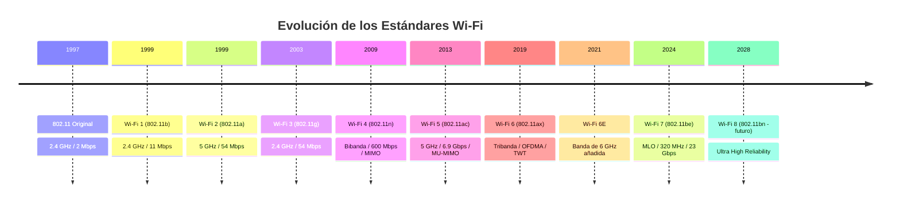

#redes #wifi #802.11 #generaciones-wifi #wifi7 #ofdma #mimo #beamforming

> [!info] Navegación
> ◀ Anterior: [[📡 07.1 - Estándares IEEE 802.11 (De Wi-Fi 4 a Wi-Fi 7)|Estándares 802.11]] | 🔗 Relacionado: [[📻 07.2 - Frecuencias, Canales, Celdas y Roaming|Frecuencias y Canales]]

---

# 07.4 — Todas las Generaciones Wi-Fi Explicadas

Desde los 2 Mbps del estándar original hasta los 23 Gbps del Wi-Fi 7. Cada generación resolvió los problemas de la anterior. Aquí tienes la historia completa con los conceptos técnicos clave de cada salto.

---

## 📅 Línea Temporal Completa

---

## 🔍 Generación por Generación

### 802.11 Original (1997) — El Comienzo

El estándar fundacional. Pura historia.

- **Banda:** 2.4 GHz
- **Velocidad máxima:** 2 Mbps
- **Sin nombre comercial "Wi-Fi"** — el término Wi-Fi lo acuñó la Wi-Fi Alliance en 1999.
- Usos reales: prácticamente ninguno para el público general. Fue el prototipo.

---

### Wi-Fi 1 — 802.11b (1999)

La primera generación que llegó masivamente a hogares y empresas.

- **Banda:** 2.4 GHz
- **Velocidad:** 11 Mbps
- **El problema:** Usaba la misma frecuencia que los hornos microondas y teléfonos inalámbricos → interferencias constantes.
- **Importancia histórica:** Democratizó la conectividad inalámbrica en hogares.

---

### Wi-Fi 2 — 802.11a (1999)

Salió el mismo año que el 802.11b, pero para entornos corporativos.

- **Banda:** 5 GHz (¡ya en 1999!)
- **Velocidad:** 54 Mbps
- **Ventaja:** La banda de 5 GHz estaba virgen → señal limpia sin interferencias.
- **Desventaja:** Mayor frecuencia = menor alcance. Las paredes atenúan mucho más la señal de 5 GHz.

---

### Wi-Fi 3 — 802.11g (2003)

Lo mejor de los dos mundos anteriores: la velocidad del `a` en la frecuencia del `b`.

- **Banda:** 2.4 GHz
- **Velocidad:** 54 Mbps
- **Retrocompatibilidad:** Funcionaba con dispositivos 802.11b.
- El estándar que mantuvo al mundo conectado durante años.

---

### Wi-Fi 4 — 802.11n (2009) — El Gran Salto

Este es el primer estándar verdaderamente moderno. Introdujo tecnologías que siguen siendo fundamentales hoy.

- **Bandas:** **2.4 GHz Y 5 GHz simultáneamente (bibanda)**
- **Velocidad:** Hasta 600 Mbps teóricos
- **Tecnología clave → MIMO (Multiple Input Multiple Output):**

> [!note] ¿Qué es MIMO?
> En lugar de una sola antena enviando y recibiendo, MIMO usa **múltiples antenas** en paralelo. Imagina 4 personas cargando cajas en vez de una sola → el mismo trabajo en menos tiempo. Más antenas = más flujos de datos simultáneos = más velocidad.

---

### Wi-Fi 5 — 802.11ac (2013) — La Era del Streaming HD

Diseñado para satisfacer la demanda del streaming de vídeo en HD y 4K que explotó en esta época.

- **Banda:** Solo **5 GHz** (abandona 2.4 GHz para datos de alta velocidad)
- **Velocidad:** Hasta 6.9 Gbps teóricos
- **Canales más anchos:** 80 MHz y 160 MHz (Wi-Fi 4 usaba máximo 40 MHz)
- **Beamforming:** El router "apunta" la señal directamente al dispositivo en lugar de emitirla en todas direcciones.
- **MU-MIMO (Multi-User MIMO):** El router puede hablar con **varios dispositivos simultáneamente**, no de uno en uno.

> [!example] Analogía de MU-MIMO
> Wi-Fi 4 con MIMO = un camarero que atiende a una mesa a la vez.
> Wi-Fi 5 con MU-MIMO = tres camareros atendiendo tres mesas a la vez.

---

### Wi-Fi 6 — 802.11ax (2019) — Eficiencia en Entornos Densos

El problema que resuelve Wi-Fi 6 no es la velocidad pura, sino el **rendimiento cuando hay muchos dispositivos conectados** (estadios, aeropuertos, edificios de apartamentos, hogares con 30+ dispositivos IoT).

- **Bandas:** 2.4, 5 GHz (y opcionalmente 6 GHz con Wi-Fi 6E)
- **Velocidad:** Hasta 9.6 Gbps teóricos
- **Tecnología clave → OFDMA (Orthogonal Frequency Division Multiple Access):**

> [!note] ¿Qué es OFDMA?
> Divide el canal Wi-Fi en subceldas más pequeñas llamadas **Resource Units (RU)**. En lugar de hablar con un dispositivo por canal completo, el router puede hablar con **muchos dispositivos en fragmentos del mismo canal** de forma simultánea.
> Es como convertir una autopista de 4 carriles anchos en 12 carriles estrechos, todos usándose a la vez.

- **TWT (Target Wake Time):** El router "negocia" con cada dispositivo IoT cuándo debe despertar para comunicarse, manteniéndolo dormido el resto del tiempo → **batería del dispositivo IoT multiplicada por varios factores**.

---

### Wi-Fi 6E (2021) — El Espectro Libre

No es un nuevo estándar, es una **extensión del 6** que añade la banda de **6 GHz**.

- La banda de 6 GHz tiene **1.200 MHz de espectro adicional** totalmente libre de dispositivos heredados.
- Permite canales de 160 MHz en un entorno sin interferencias.
- Requiere que tanto el router como el dispositivo soporten 6E.

---

### Wi-Fi 7 — 802.11be (2024) — El Presente

El estándar actual de vanguardia. La innovación principal no es solo más velocidad, es la **latencia determinista**.

- **Velocidad:** Hasta **23 Gbps** teóricos
- **Canales:** Hasta **320 MHz** de anchura
- **Modulación:** 4096-QAM (más datos por símbolo, requiere señal perfecta)
- **Tecnología estrella → MLO (Multi-Link Operation):**

> [!note] ¿Qué es MLO?
> Un dispositivo Wi-Fi 7 puede usar **múltiples bandas simultáneamente** (2.4 + 5 + 6 GHz) como si fueran una sola tubería agregada. Si 6 GHz tiene interferencias puntualmente, el tráfico se desvía automáticamente a 5 GHz sin que lo notes.
> Es el salto equivalente a tener 3 tuberías de agua en lugar de una.

---

### Wi-Fi 8 — 802.11bn (~2028) — El Futuro

Aún en desarrollo. El enfoque no es batir récords de velocidad sino alcanzar **Ultra High Reliability (UHR)**.

- Diseñado para aplicaciones que necesitan conexión **garantizada y sin drops**: cirugía remota, vehículos autónomos en entornos cerrados, sistemas de control industrial.
- La fiabilidad y la latencia predecible importan más que la velocidad pico.

---

## 📊 Tabla Resumen

| Generación | Estándar | Año | Banda | Velocidad máx. | Tecnología clave |
|---|---|---|---|---|---|
| Original | 802.11 | 1997 | 2.4 GHz | 2 Mbps | — |
| Wi-Fi 1 | 802.11b | 1999 | 2.4 GHz | 11 Mbps | — |
| Wi-Fi 2 | 802.11a | 1999 | 5 GHz | 54 Mbps | Banda 5 GHz |
| Wi-Fi 3 | 802.11g | 2003 | 2.4 GHz | 54 Mbps | Retrocompat. |
| **Wi-Fi 4** | **802.11n** | **2009** | **Bibanda** | **600 Mbps** | **MIMO** |
| **Wi-Fi 5** | **802.11ac** | **2013** | **5 GHz** | **6.9 Gbps** | **MU-MIMO, Beamforming** |
| **Wi-Fi 6** | **802.11ax** | **2019** | **Tribanda** | **9.6 Gbps** | **OFDMA, TWT** |
| Wi-Fi 6E | 802.11ax | 2021 | + 6 GHz | 9.6 Gbps | Espectro libre |
| **Wi-Fi 7** | **802.11be** | **2024** | **Tribanda** | **23 Gbps** | **MLO, 320 MHz** |
| Wi-Fi 8 | 802.11bn | ~2028 | — | — | Ultra Alta Fiabilidad |

> [!tip] 💡 ¿Qué necesitas realmente en casa?
> Para el 99% de los usuarios, un **router Wi-Fi 6** es más que suficiente. Si tienes muchos dispositivos IoT o una instalación con muchos equipos simultáneos, Wi-Fi 6 marcará una diferencia real. El Wi-Fi 7 brilla en entornos profesionales o cuando se aprovecha MLO con dispositivos compatibles.
