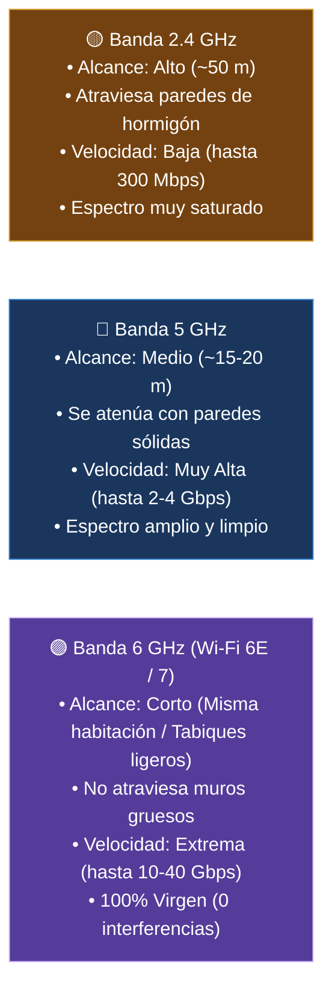
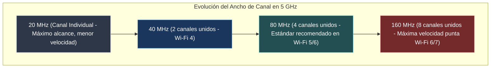
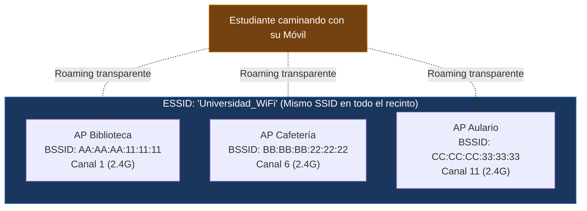

#redes #ccna #wifi #canales-wifi #roaming #bssid #ssid #frecuencias

> [!info] 🧭 Navegación
> ◀ [[📡 07.1 - Estándares IEEE 802.11 (De Wi-Fi 4 a Wi-Fi 7)]] · 🔼 [[🌐 00 - Índice Maestro de Redes Informáticas]] · ▶ [[🔐 07.3 - Seguridad en Redes Inalámbricas (WPA2, WPA3 y Enterprise)]]

---

## ⚖️ 1. La Física del Espectro Radioeléctrico: El Dilema Alcance vs. Velocidad

Las señales Wi-Fi viajan por el aire mediante ondas electromagnéticas no guiadas. En la física de las telecomunicaciones rige una ley inexorable:

$$\text{A mayor frecuencia} \longrightarrow \text{Mayor ancho de banda (velocidad), pero menor alcance y menor capacidad de atravesar paredes}$$



> [!abstract] 🏠 Analogía: El Subwoofer y el Silbato
> - La **frecuencia de 2.4 GHz** es como el bombo de un subwoofer o la música baja de la discoteca de tu barrio: las ondas son largas y graves, atraviesan los muros de mi casa y las escuchas aunque estés a tres plantas de distancia.
> - La **frecuencia de 5 y 6 GHz** es como el tono agudo de un silbato: transporta muchísima más información por segundo, pero en cuanto cierras una puerta gruesa de madera o ladrillo, la onda choca y se apaga.

---

## 📻 2. Canales en 2.4 GHz: La Regla Inquebrantable de los Canales 1, 6 y 11

En la banda de 2.4 GHz disponemos de un espectro diminuto de unos 83.5 MHz (de 2400 a 2483.5 MHz), dividido en 13 canales en Europa y 11 en EE.UU.

Cada canal estándar ocupa un ancho de **20 MHz**, pero los centros de los canales están separados por apenas **5 MHz**. Esto significa que **la inmensa mayoría de los canales se solapan y colisionan entre sí**:

```
      CANALES SOLAPADOS EN LA BANDA DE 2.4 GHz

      ┌─────── Canal 1 ───────┐
      │   (2401 - 2423 MHz)   │
      └───────────────────────┘
            ┌─────── Canal 2 ───────┐  <-- ¡Solapamiento destructivo!
            └───────────────────────┘
                                  ┌─────── Canal 6 ───────┐
                                  │   (2426 - 2448 MHz)   │
                                  └───────────────────────┘
                                                                ┌─────── Canal 11 ──────┐
                                                                │   (2451 - 2473 MHz)   │
                                                                └───────────────────────┘
```

> [!warning] 🚨 La Regla de Oro de la Banda 2.4 GHz
> En cualquier instalación profesional, **solo existen TRES canales no solapados utilizables: el Canal 1, el Canal 6 y el Canal 11**.
> Si configuras tu router en el canal 2, 3, 4 o 5, estarás sufriendo interferencias destructivas simultáneas tanto de las redes del canal 1 como de las del canal 6.
> *Asimismo*: **Nunca actives el ancho de 40 MHz en 2.4 GHz** en una comunidad de vecinos; ocuparás casi toda la banda, destruyendo tu propia red y la de tus vecinos.

---

## 📻 3. Canales en 5 GHz y Agrupación (*Channel Bonding*)

En la banda de 5 GHz disponemos de decenas de canales independientes que no se solapan. Además, el estándar permite **agrupar canales contiguos (*Channel Bonding*)** para multiplicar el ancho de banda:



### 📻 Canales DFS (*Dynamic Frequency Selection*)

En la banda de 5 GHz, ciertos canales (del 52 al 144) están reservados prioritariamente para **radares meteorológicos y militares**.

- Si tu punto de acceso utiliza canales DFS, está obligado por ley a escuchar el espectro. Si detecta la pulsación de un radar, debe **apagar el canal inmediatamente y saltar a otro canal limpio**, provocando un corte temporal de conexión en los clientes de 1 a 10 minutos.

---

## 🔹 4. Terminología Inalámbrica: SSID, BSSID y ESSID

1. **SSID (*Service Set Identifier*)**: Es el nombre legible para humanos de la red Wi-Fi (ej. `Oficina_Corporativa`). Puede tener hasta 32 caracteres.
2. **BSSID (*Basic Service Set Identifier*)**: Es la **dirección MAC física** de la radio del punto de acceso que emite esa señal.
3. **ESSID (*Extended Service Set Identifier*)**: La red formada por **múltiples puntos de acceso (múltiples BSSIDs)** que anuncian exactamente el mismo SSID para dar cobertura ininterrumpida a todo un edificio o campus.



---

## 🔹 5. Planificación Celular en Panal de Abeja (*Honeycomb Pattern*)

Cuando despliego redes Wi-Fi en oficinas, hoteles o naves industriales con decenas de puntos de acceso, no podemos colocar las antenas al azar:

```
         DISEÑO DE CELDAS SIN INTERFERENCIA CO-CANAL (CCI)

                 ┌───────────┐
                 │  Canal 1  │
                 └─────┬─────┘
           ┌───────────┴───────────┐
           │                       │
     ┌─────┴─────┐           ┌─────┴─────┐
     │  Canal 6  │           │ Canal 11  │
     └─────┬─────┘           └─────┬─────┘
           │                       │
           └───────────┬───────────┘
                 ┌─────┴─────┐
                 │  Canal 1  │  (Reutilizado solo cuando la distancia
                 └───────────┘   atenúa la señal a cero)
```

- **Solapamiento Ideal entre Celdas**: Las celdas adyacentes deben solaparse entre un **15% y un 20%** con una potencia de señal de aproximadamente **-67 dBm** en la frontera.
- Si solapan menos del 15%, el usuario sufrirá zonas muertas sin señal.
- Si solapan con el mismo canal, se produce **Interferencia Co-Canal (CCI)**: los puntos de acceso competirán entre sí por el medio como si estuvieran en el mismo cable, destruyendo el rendimiento.

---

## 📻 6. Roaming Inalámbrico: Transición Fluida entre Antenas

El **Roaming** (o itinerancia) es el mecanismo por el cual un cliente inalámbrico (ej. un móvil) se desconecta de un punto de acceso cuya señal se debilita y se conecta a otro AP más cercano que emite el mismo SSID, **sin cortar una videollamada ni cambiar de dirección IP**.

> [!brain] 🔬 La Realidad Técnica del Roaming
> En el estándar Wi-Fi original, **la decisión de hacer Roaming es 100% del CLIENTE (del móvil o portátil), nunca del router**.
> Esto provocaba el molesto problema del **Cliente Pegajoso (*Sticky Client*)**: tu móvil seguía aferrado con una sola raya de cobertura al AP lejano de la entrada de la oficina, negándose a conectar al AP que tenías justo encima de tu mesa.

### 🔹 La Tríada Estándar de Asistencia al Roaming Rápido

Para resolver esto, la IEEE estandarizó tres protocolos de asistencia:

1. **IEEE 802.11k (Gestión de Recursos de Radio)**: El AP actual le entrega al móvil una lista reducida de las mejores frecuencias de los APs vecinos, evitando que el móvil gaste batería escaneando 40 canales a ciegas.
2. **IEEE 802.11v (Gestión de Transición BSS)**: La controladora Wi-Fi puede "empujar" amablemente al cliente pegajoso para que migre al AP más cercano cuando detecta que su calidad de señal cae por debajo de -72 dBm.
3. **IEEE 802.11r (Fast BSS Transition - Fast Roaming)**: Permite autenticar criptográficamente la clave de red en el nuevo AP **en menos de 50 milisegundos** antes de cortar la conexión vieja, haciendo que el salto sea 100% inaudible en llamadas VoIP o Zoom.

---

## 💻 7. Práctica en Terminal Linux: Auditoría de Espectro y Señal

```bash
# 1. Escanear el espectro y ver SSID, BSSID, Canal y Potencia de señal (en dBm)

sudo iw dev wlan0 scan | grep -E "(SSID|BSS|freq|signal)"

# 2. Resumen rápido tabular con NetworkManager de todas las antenas visibles

nmcli -f SSID,BSSID,CHAN,FREQ,SIGNAL,BARS dev wifi list

# 3. Monitorizar la calidad de señal y SNR en tiempo real con wavemon

# (Instalar con: sudo apt install wavemon)

wavemon
```

> [!tip] 💡 Interpretando la Potencia de Señal en dBm
> Las señales de radio Wi-Fi se miden en números negativos en decibelios-milivatio (**dBm**):
> - **-30 a -50 dBm**: Señal excelente (al lado del router).
> - **-60 a -67 dBm**: Señal muy buena (ideal para streaming 4K y roaming).
> - **-75 a -80 dBm**: Señal débil (velocidades bajas, cortes y desconexiones).
> - **-90 dBm**: Límite del ruido; la tarjeta de red apenas distingue los bits del ruido ambiental.

---

## 📌 8. Resumen y Siguiente Paso

En esta nota he dominado:

- El comportamiento físico de las bandas de 2.4 GHz, 5 GHz y 6 GHz.
- Por qué solo los canales 1, 6 y 11 son viables en 2.4 GHz.
- La diferencia entre SSID, BSSID y ESSID.
- La planificación de celdas en panal y los estándares 802.11k/v/r para roaming sin cortes.

En la siguiente nota ([[🔐 07.3 - Seguridad en Redes Inalámbricas (WPA2, WPA3 y Enterprise)]]), analizo cómo se protege el tráfico que viaja por el aire: desde las vulnerabilidades de **WEP** y **WPA2** hasta el cifrado moderno con **WPA3-SAE** y la autenticación corporativa con servidores **RADIUS (802.1X)**.
