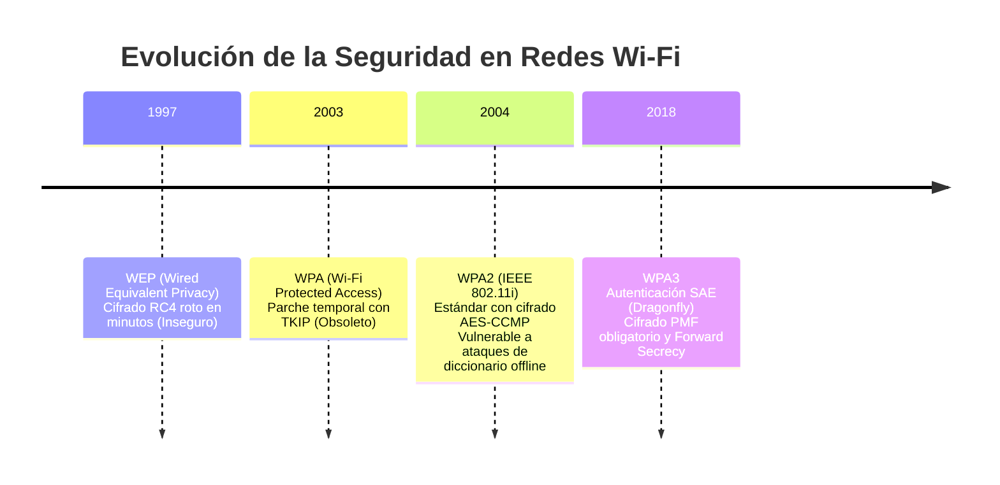
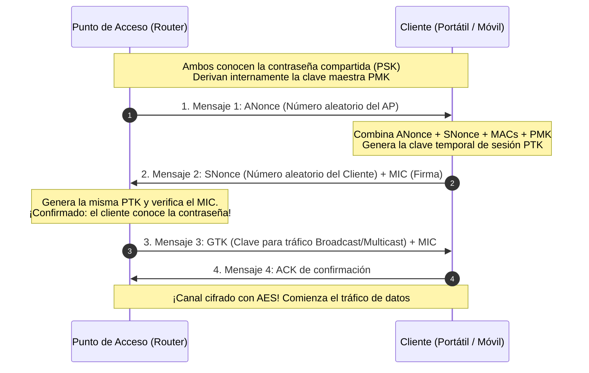
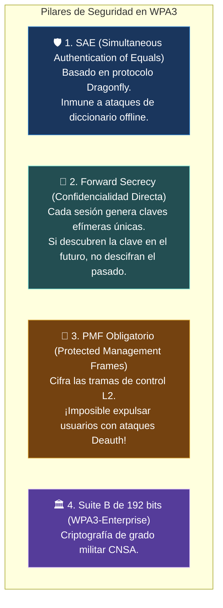
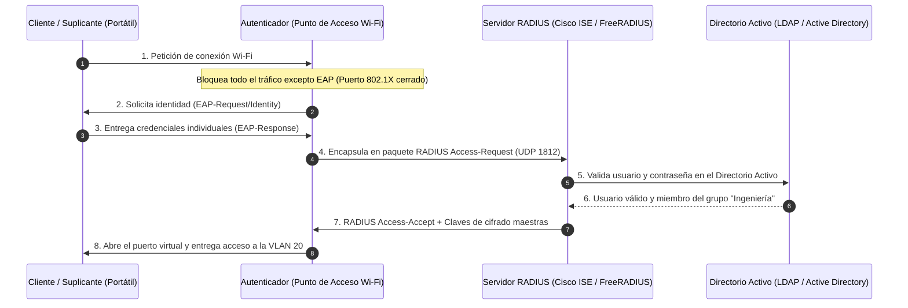

#redes #ccna #wifi #seguridad-wifi #wpa2 #wpa3 #802-1x #radius #aircrack-ng #ciberseguridad

> [!info] 🧭 Navegación
> ◀ [[📻 07.2 - Frecuencias, Canales, Celdas y Roaming]] · 🔼 [[🌐 00 - Índice Maestro de Redes Informáticas]] · ▶ [[☣️ 08.1 - Amenazas Comunes en Redes (Ataques Capas 2, 3 y 4)]]

---

## 🔹 1. El Desafío del Medio Inalámbrico: La Red sin Paredes

En una red de cable Ethernet, el perímetro defensivo coincide con las paredes físicas del edificio: un intruso necesita colarse en la oficina y pinchar un cable en una roseta RJ-45.

En las redes inalámbricas, **las ondas de radio atraviesan paredes, ventanas y vallas**. Un atacante sentado cómodamente en un coche en el aparcamiento o a 200 metros de distancia con una antena direccional puede capturar cada trama que viaja por el aire. Por ello, la seguridad en Wi-Fi depende exclusivamente de la **fuerza criptográfica de sus protocolos de autenticación y cifrado**.

---

## 🛡️ 2. La Evolución de los Protocolos de Seguridad Wi-Fi



### 🔹 2.1 WEP (*Wired Equivalent Privacy* - Roto y Prohibido)

- Utilizaba el algoritmo de flujo **RC4** con una clave fija compartida y un Vector de Inicialización (**IV**) diminuto de solo **24 bits**.
- Dado que el IV se repetía con frecuencia, herramientas como `aircrack-ng` aprovechan debilidades matemáticas (ataques FMS y PTW) para **extraer la contraseña en claro en menos de 60 segundos** capturando unos 20.000 paquetes. Está completamente prohibido en cualquier entorno profesional.

### 🔹 2.2 WPA2-Personal (PSK) y el 4-Way Handshake

Estandarizado en **IEEE 802.11i**, introdujo el cifrado militar por bloques **AES con CCMP** (*Counter Mode CBC-MAC Protocol*). 

Para conectar un dispositivo, utiliza el proceso **4-Way Handshake (Saludo de 4 Vías)**:



> [!warning] 🚨 La Gran Vulnerabilidad de WPA2-PSK: El Ataque de Diccionario Fuera de Línea
> En WPA2-Personal, el apretón de manos de 4 vías **revela información matemática suficiente para validar si una contraseña es correcta o no**.
> Un atacante no necesita interactuar con el router para adivinar la clave:
> 1. Expulsa al usuario legítimo de la red enviando tramas de desautenticación falsificadas (**Deauth Attack**).
> 2. Cuando el usuario se reconecta automáticamente, el atacante **captura el 4-Way Handshake en el aire**.
> 3. Se marcha a su casa y utiliza la potencia de sus tarjetas gráficas (GPU) con herramientas como `hashcat` para probar **cientos de millones de contraseñas por segundo fuera de línea (*Offline Brute-Force*)** hasta reventar la clave.

---

## 🛡️ 3. WPA3: La Fortaleza Moderna contra Ataques de Fuerza Bruta

Para erradicar para siempre los ataques de diccionario y el espionaje retrospectivo, la Wi-Fi Alliance lanzó **WPA3**:



### 🛡️ ¿Por qué SAE es invulnerable a ataques de diccionario offline?

En WPA3-Personal (**SAE** - *Simultaneous Authentication of Equals*), el intercambio de claves utiliza **criptografía de curva elíptica**. 

- En el handshake, **no se transmite ningún hash derivado de la contraseña**.
- Si un atacante quiere probar si la contraseña es `12345678`, **está obligado a enviar un paquete en vivo al router**.
- Si el router detecta 5 intentos fallidos en tiempo real, bloquea la dirección MAC. Probar un diccionario de 10 millones de contraseñas tardaría siglos.

---

## ⚖️ 4. WPA Personal vs. WPA Enterprise (802.1X con Servidor RADIUS)

En entornos corporativos y universidades, utilizar **WPA Personal** (una única contraseña precompartida para todos) es una aberración de seguridad: si un empleado es despedido de la empresa, tendrías que cambiar la contraseña en los 800 dispositivos de la organización.

La solución empresarial es **WPA Enterprise (IEEE 802.1X)**:



### 🔹 Ventajas de WPA Enterprise

- **Credenciales Únicas por Usuario**: Cada empleado entra con su propio usuario y contraseña corporativa o con un certificado digital emitido en su tarjeta inteligente.
- **Baja Inmediata**: Si un empleado deja la empresa, el administrador deshabilita su cuenta en el Active Directory y pierde el acceso a la Wi-Fi instantáneamente.
- **Asignación Dinámica de VLANs**: El servidor RADIUS puede indicarle al punto de acceso que coloque al empleado de Finanzas en la VLAN 10 y al de Marketing en la VLAN 20 conectándose ambos al mismo SSID.

---

## 🛡️ 5. Perspectiva de Ciberseguridad: Auditoría Inalámbrica (Pentesting)

> [!warning] 🚨 Vectores de Ataque Avanzados en Redes Wi-Fi
> 1. **Ataque Evil Twin (Gemelo Malvado) y Rouge AP**:
>    El atacante levanta un punto de acceso falso emitiendo exactamente el mismo SSID que la empresa (ej. `Cafeteria_WiFi`) pero con mayor potencia de emisión. 
>    - Expulsa a los clientes de la red legítima mediante un ataque de desautenticación.
>    - Los dispositivos se reconectan automáticamente a la antena del atacante por tener mayor señal.
>    - El atacante les presenta un portal cautivo falso pidiéndoles que introduzcan su contraseña de red para "actualizar el firmware", capturando credenciales en texto plano.
> 2. **Rogue AP Interno**:
>    Un empleado conecta un router doméstico barato a una roseta de red de su oficina para tener Wi-Fi en su móvil, creando una brecha de seguridad que elude todos los cortafuegos y controles 802.1X de la corporación.

---

## 💻 6. Práctica en Terminal Linux: Auditoría Inalámbrica

> [!tip] 💡 Modo Monitor y Captura de Paquetes
> Por defecto, las tarjetas Wi-Fi descartan todas las tramas que no van dirigidas a su propia dirección MAC. Para auditar el aire, debemos activar el **Modo Monitor**:

```bash
# 1. Comprobar procesos que puedan interferir y detenerlos

sudo airmon-ng check kill

# 2. Poner la tarjeta inalámbrica en Modo Monitor

sudo airmon-ng start wlan0

# 3. Escanear todo el espectro capturando BSSIDs, clientes asociados y tipo de cifrado

sudo airodump-ng wlan0mon

# 4. Capturar el 4-Way Handshake de una red específica en un archivo .cap

sudo airodump-ng -c 6 --bssid 00:11:22:33:44:55 -w captura_handshake wlan0mon

# 5. Volver al modo cliente normal al terminar

sudo airmon-ng stop wlan0mon
sudo systemctl restart NetworkManager
```

> [!brain] 🔬 Salida de `airodump-ng`:
> ```text
> BSSID              PWR  Beacons    #Data, #/s  CH   MB   ENC CIPHER  AUTH ESSID
> 00:11:22:33:44:55  -45       85      120    4   6  54e. WPA2 CCMP   PSK  Empresa_WiFi
> ```
> Observa el campo `ENC` (WPA2), `CIPHER` (CCMP/AES) y `AUTH` (PSK). Si en la esquina superior derecha aparece `[ WPA handshake: 00:11:22:33:44:55 ]`, ¡has capturado el apretón de manos con éxito!

---

## 📌 7. Resumen y Siguiente Paso

Con esta nota completo el **Bloque 7 (Redes Inalámbricas)**. He dominado:

- Las debilidades históricas de WEP y WPA.
- El 4-Way Handshake de WPA2 y su vulnerabilidad a la captura y ataque de diccionario offline.
- La protección impenetrable de WPA3 mediante SAE (Dragonfly), Forward Secrecy y PMF.
- La arquitectura empresarial de autenticación individual con **802.1X y servidores RADIUS**.

En el **Bloque 8** entro de lleno en la trinchera de la **Seguridad Básica e Intermedia en Redes**: comenzaremos con [[☣️ 08.1 - Amenazas Comunes en Redes (Ataques Capas 2, 3 y 4)]] para diseccionar los ataques más peligrosos que amenazan la infraestructura.
