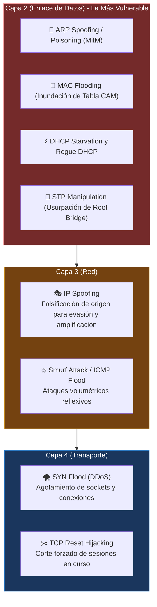
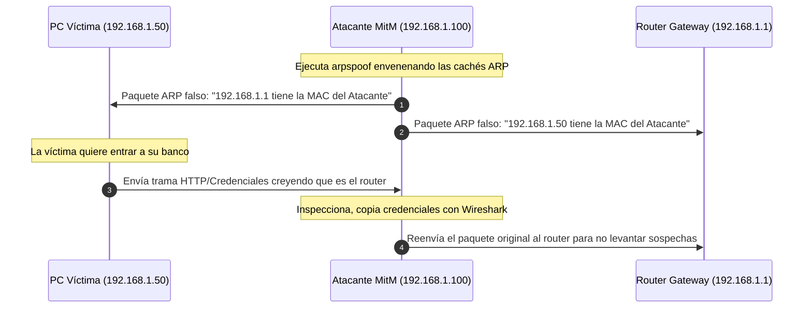
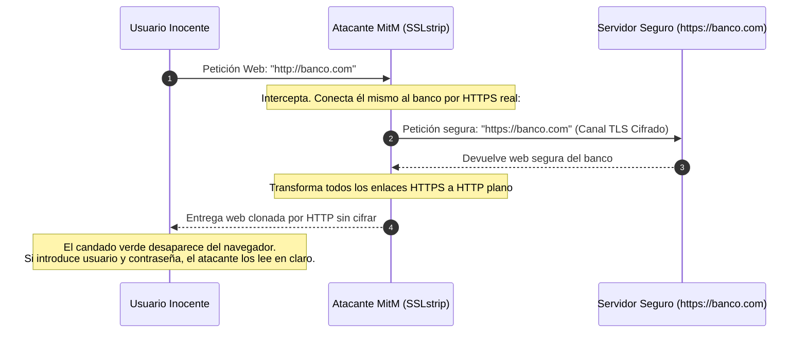

---
tags:
  - redes
  - ccna
  - ciberseguridad
  - arp-spoofing
  - mac-flooding
  - syn-flood
  - dhcp-starvation
  - port-security
  - mitm
folder: "📂08 - Seguridad en Redes"
aliases:
  - "Amenazas Comunes en Redes (Ataques Capas 2, 3 y 4)"
  - "Vectores de Ataque en Redes Locales y Mitigaciones"
date: 2026-09-07
---

> [!info] 🧭 Navegación
> ◀ [[07.3 - Seguridad en Redes Inalámbricas (WPA2, WPA3 y Enterprise)]] · 🔼 [[00 - Índice Maestro de Redes]] · ▶ [[08.2 - Mecanismos de Protección y Filtrado (ACLs, Firewalls y Zonas)]]

---

# ☣️ 08.1 - Amenazas Comunes en Redes (Ataques Capas 2, 3 y 4)

## 1. El Paradigma de la Seguridad en Redes: La Amenaza Interna

Tradicionalmente, las empresas invertían todo su presupuesto de ciberseguridad en el perímetro exterior: un firewall perimetral protegiendo la conexión hacia Internet. Sin embargo, en el modelo de red local clásica (**LAN**), **cualquier dispositivo conectado al cable o a la Wi-Fi corporativa goza de confianza casi ciega por defecto**.

Si un atacante logra acceder físicamente al edificio, conectar una Raspberry Pi invisible detrás de una impresora, o comprometer el portátil de un empleado mediante un correo de phishing, **la red interna se convierte en un campo de tiro abierto**.

En esta nota diseccionaremos los vectores de ataque más letales organizados por su capa operativa en el modelo OSI:



---

## 2. Ataques Críticos en Capa 2 (Enlace de Datos)

La Capa 2 es el eslabón más débil de la cadena: los conmutadores (switches) se diseñaron hace 30 años asumiendo que todos los dispositivos de la red eran amistosos.

### 2.1 Envenenamiento ARP (ARP Spoofing / Poisoning)
- **Mecánica**: El atacante emite constantes respuestas ARP falsificadas a la **Víctima** haciéndose pasar por el **Default Gateway**, y al **Router** haciéndose pasar por la **Víctima**.
- **Consecuencia**: Todo el tráfico entre la víctima e Internet cruza el ordenador del atacante (**Man-in-the-Middle - MitM**). El atacante puede registrar contraseñas, inyectar código malicioso o modificar datos al vuelo.



- **Mitigación Profesional en Switches**: **DAI (*Dynamic ARP Inspection*)**. El switch intercepta toda trama ARP y la contrasta contra la base de datos de asignaciones fiables de DHCP Snooping. Si la IP y la MAC no coinciden con la asignación legítima, descarta el paquete y bloquea el puerto.

---

### 2.2 Inundación de Tabla CAM (*MAC Flooding*)
- **Mecánica**: Un atacante ejecuta herramientas como `macof` enviando hasta 150.000 tramas Ethernet por segundo, cada una con direcciones MAC de origen aleatorias e inventadas.
- **Consecuencia**: La memoria RAM del switch que alberga la tabla CAM se satura por completo.
- **Modo Fail-Open**: Al quedarse sin memoria para registrar nuevas MACs, muchos switches entran en pánico y **comienzan a actuar como un HUB antiguo**, inundando (*Flooding*) todo el tráfico confidencial de todos los empleados por todos los puertos físicos.
- **Mitigación**: **Port Security** en switches Cisco:
  ```text
  interface GigabitEthernet0/1
   switchport mode access
   switchport port-security
   switchport port-security maximum 1
   switchport port-security mac-address sticky
   switchport port-security violation shutdown
  ```
  *(Si el switch detecta una segunda MAC en el mismo puerto de red, apaga el puerto físicamente y dispara una alerta SNMP al administrador).*

---

### 2.3 DHCP Starvation y Servidor Rogue DHCP
- **Mecánica**: El atacante vacía el pool de direcciones IP del router enviando miles de peticiones `DHCPDISCOVER` con MACs falsificadas. Una vez agotadas las IPs, levanta su propio servidor DHCP pirata.
- **Consecuencia**: Cuando un empleado enciende su ordenador, el DHCP del atacante le entrega su propia IP como puerta de enlace predeterminada y sus propios servidores DNS, obteniendo control total de la navegación.
- **Mitigación**: **DHCP Snooping** (configurar los puertos de usuarios como *Untrusted*, impidiendo que emitan respuestas DHCPOFFER o DHCPACK).

---

### 2.4 Manipulación del Protocolo Spanning Tree (STP Attack)
- **Mecánica**: El atacante conecta un dispositivo que inyecta tramas **BPDU de Spanning Tree** configuradas con una prioridad artificialmente baja (`Priority = 0`).
- **Consecuencia**: Los switches de la empresa eligen al equipo del atacante como el **Root Bridge** de toda la red, provocando que todo el tráfico troncal de la compañía se reenvíe hacia su máquina antes de salir.
- **Mitigación**: Habilitar **BPDU Guard** y **Root Guard** en todos los puertos de acceso de los switches:
  ```text
  spanning-tree portfast bpduguard enable
  ```

---

## 3. Ataques Críticos en Capa 3 y Capa 4

### 3.1 IP Spoofing (Suplantación de Dirección IP)
Dado que el protocolo IPv4 original no valida criptográficamente la procedencia de los paquetes, un atacante puede escribir cualquier dirección IP en el campo *Source IP Address* de la cabecera:
- **Evasión de Firewalls**: Si un cortafuegos permite el acceso al panel de administración solo desde la IP interna `192.168.1.200`, el atacante envía paquetes con esa IP falsificada.
- **Ataques de Reflexión / Smurf Attack**: Envío masivo de peticiones de ping ICMP a la dirección de broadcast de una red remota con la IP origen de la víctima; todos los hosts de esa red responden al unísono contra la víctima.
- **Mitigación**: **uRPF (*Unicast Reverse Path Forwarding*)**: El router inspecciona la IP origen del paquete entrante; si en su tabla de rutas no usaría esa misma interfaz para responderle a esa IP, asume que es una dirección falsificada y la descarta de inmediato.

### 3.2 SYN Flood (Inundación SYN en Capa 4)
- Explotación directa del 3-Way Handshake de TCP ([[05.2 - Protocolo TCP (3-Way Handshake, Flujo y Confiabilidad)]]):
- El atacante emite millones de paquetes `SYN` por segundo desde IPs falsificadas. El servidor reserva memoria en su cola de conexiones semiabiertas (*SYN Backlog*) esperando el `ACK` final que nunca llegará, agotando la RAM y bloqueando el servicio a usuarios legítimos.
- **Mitigación**: Habilitar **SYN Cookies** en el kernel (`sysctl -w net.ipv4.tcp_syncookies=1`).

---

## 4. Ataques de Intercepción: Man-in-the-Middle y SSL Stripping

Una vez que un atacante logra posicionarse en medio del tráfico mediante ARP Spoofing o Rogue DHCP, se enfrenta al cifrado HTTPS ([[06.4 - Protocolos de Aplicación Comunes (HTTP-S, SSH, FTP, Correo y Gestión)]]):



- **SSL Stripping**: Herramientas como `bettercap` degradan las conexiones seguras HTTPS a HTTP sin cifrar de forma transparente para el usuario descuidado.
- **La Defensa Universal: HSTS (*HTTP Strict Transport Security*)**:
  Cabecera de seguridad emitida por el servidor web (`Strict-Transport-Security: max-age=31536000; includeSubDomains; preload`). Le ordena al navegador que **rechace terminantemente cualquier intento de conectar por HTTP no seguro**, abortando la conexión si un atacante intenta realizar SSL Stripping.

---

## 5. Práctica en Terminal Linux: Detección y Auditoría de Amenazas

```bash
# 1. Detección de ARP Poisoning: Monitorizar cambios bruscos de MAC en la tabla de vecinos
# (Si la misma MAC empieza a aparecer asociada a múltiples IPs, estás bajo ataque ARP Spoofing)
watch -n 1 "ip neigh show"

# 2. Comprobar si el kernel tiene activa la protección uRPF contra IP Spoofing
cat /proc/sys/net/ipv4/conf/all/rp_filter
# (El valor 1 indica modo estricto recomendado)

# 3. Detectar tormentas de paquetes SYN entrantes anómalas con ss
ss -ant state syn-recv

# 4. Capturar tráfico de broadcast y anomalías ARP en la red con tcpdump
sudo tcpdump -i eth0 -nn -vvv "arp" -c 10
```

> [!brain] 🔬 Síntoma Forense de ARP Spoofing en `ip neigh show`:
> ```text
> 192.168.1.1 dev eth0 lladdr aa:bb:cc:11:22:33 REACHABLE
> 192.168.1.20 dev eth0 lladdr aa:bb:cc:11:22:33 REACHABLE
> ```
> ¡Alarma crítica! El router (`192.168.1.1`) y el servidor (`192.168.1.20`) comparten exactamente la misma dirección MAC física (`aa:bb:cc:11:22:33`). La máquina con esa MAC está ejecutando un envenenamiento ARP en este instante.

---

## 6. Resumen y Siguiente Paso

En esta nota hemos diseccionado:
- Las vulnerabilidades letales de la Capa 2: ARP Spoofing, MAC Flooding, Rogue DHCP y manipulación STP.
- Los mecanismos de blindaje de switches: DAI, Port Security, DHCP Snooping y BPDU Guard.
- Los ataques de Capa 3 y 4: IP Spoofing, SYN Flood y Man-in-the-Middle con SSL Stripping.

En la siguiente nota ([[08.2 - Mecanismos de Protección y Filtrado (ACLs, Firewalls y Zonas)]]), aprenderemos a construir las defensas perimetrales e internas: **Listas de Control de Acceso (ACLs)**, firewalls **Stateless vs Stateful**, cortafuegos de nueva generación (**NGFW**) y diseño de zonas seguras con **DMZ**.
