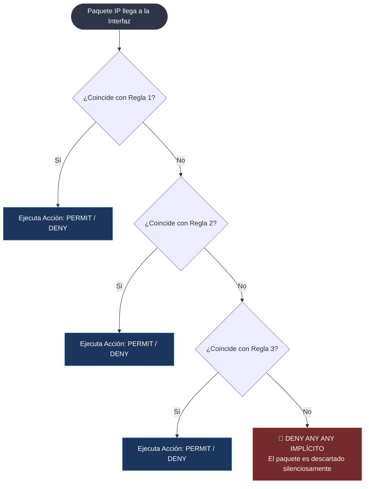
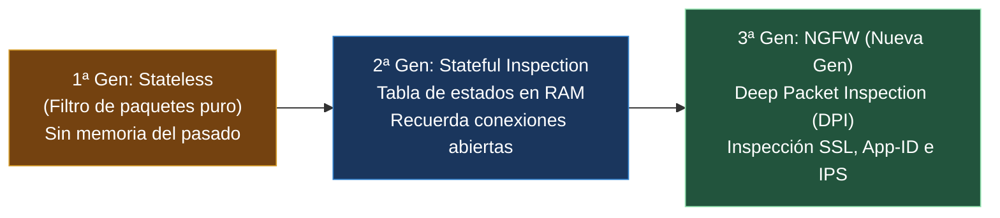

---
tags:
  - redes
  - ccna
  - acls
  - firewalls
  - stateful
  - ngfw
  - dmz
  - iptables
  - ciberseguridad
folder: "📂08 - Seguridad en Redes"
aliases:
  - "Mecanismos de Protección y Filtrado (ACLs, Firewalls y Zonas)"
  - "ACLs Estándar y Extendidas, Firewalls Stateful y Arquitectura DMZ"
date: 2026-09-07
---

> [!info] 🧭 Navegación
> ◀ [[08.1 - Amenazas Comunes en Redes (Ataques Capas 2, 3 y 4)]] · 🔼 [[00 - Índice Maestro de Redes]] · ▶ [[08.3 - VPNs (Redes Privadas Virtuales, IPsec y WireGuard)]]

---

# 🛡️ 08.2 - Mecanismos de Protección y Filtrado (ACLs, Firewalls y Zonas)

## 1. El Principio del Mínimo Privilegio en Redes

En una red corporativa segura, **todo tráfico no autorizado explícitamente debe ser denegado por defecto** (*Default Deny*). 

Para implementar este principio, los ingenieros de redes utilizamos dos herramientas complementarias:
1. **Listas de Control de Acceso (ACLs)**: Filtros rápidos y eficientes ejecutados directamente en los procesadores y switches/routers de Capa 3.
2. **Cortafuegos (Firewalls)**: Dispositivos de seguridad dedicados con capacidad de mantener el estado de las sesiones e inspeccionar las capas superiores del modelo OSI.

---

## 2. Listas de Control de Acceso (ACLs)

Una **ACL** (*Access Control List*) es una serie secuencial de reglas de permiso (**`permit`**) o denegación (**`deny`**) que se aplican a una interfaz física o lógica del router para tráfico entrante (**`inbound`**) o saliente (**`outbound`**).



> [!warning] 🚨 La Regla de Oro de las ACLs: Deny Implícito
> Al final de **toda** ACL existe una regla invisible automática: **`deny ip any any`**.
> Si un paquete no coincide con ninguna de las líneas que escribiste arriba, **se descarta de inmediato**. Si creas una ACL con una sola línea que dice `deny 192.168.1.5`, ¡estarás bloqueando a ese host y también a todo el resto del planeta! Para permitir a los demás, debes añadir siempre al final: `permit ip any any`.

### Comparativa: ACLs Estándar vs. ACLs Extendidas

| Característica | ACL Estándar | ACL Extendida |
|:---|:---|:---|
| **Criterio de Filtrado** | **Solo IP de Origen** | **IP Origen, IP Destino, Protocolo (TCP/UDP/ICMP) y Puertos L4** |
| **Rango Numérico (Cisco)**| `1` a `99` y `1300` a `1999` | `100` a `199` y `2000` a `2699` |
| **Granularidad** | Muy baja (bloquea todo o nada hacia el host) | **Quirúrgica** (ej. permitir solo HTTPS al servidor web) |
| **Regla de Ubicación Óptima** | **Lo más cerca posible del DESTINO** | **Lo más cerca posible del ORIGEN** |

> [!tip] 💡 ¿Por qué las ACLs Extendidas se colocan cerca del Origen?
> Si un paquete de Madrid con destino a Tokio va a ser denegado, es absurdo permitir que viaje por 10 routers transoceánicos consumiendo ancho de banda para descartarlo en Japón. **Las ACLs extendidas se aplican en la primera interfaz de entrada de Madrid para destruirlo de inmediato.**
> En cambio, una ACL estándar solo mira el origen: si la colocas en el origen, ¡bloquearías al usuario para salir a cualquier parte del mundo! Por eso se coloca junto a la puerta del destino.

### Máscaras Comodín (*Wildcard Masks*)
En routers Cisco, las ACLs no usan la máscara de subred ordinaria; usan la **Wildcard Mask**, que es el **inverso binario** de la máscara:
- Máscara `/24` (`255.255.255.0`) $\longrightarrow$ Wildcard: **`0.0.0.255`** (`0` significa "el bit debe coincidir exactamente"; `255` significa "ignora este octeto").
- Host único (`/32` `255.255.255.255`) $\longrightarrow$ Wildcard: `0.0.0.0` (o palabra clave `host`).
- Cualquier destino (`/0` `0.0.0.0`) $\longrightarrow$ Wildcard: `255.255.255.255` (o palabra clave `any`).

---

## 3. Generaciones de Firewalls: De Stateless a NGFW



### 3.1 Firewalls sin Estado (*Stateless*)
Evalúan cada paquete de forma aislada e independiente:
- No saben si un paquete entrante es la respuesta legítima a una petición web que hiciste hace 1 segundo.
- Para que un usuario navegue por la web, el administrador está obligado a abrir el puerto 80/443 de salida **y también dejar abiertos todos los puertos efímeros de entrada**, dejando una enorme brecha de seguridad.

### 3.2 Firewalls con Inspección de Estado (*Stateful*)
El estándar de la industria (ej. `iptables` en Linux, pfSense, Cisco ASA):
- Mantienen una **Tabla de Estados de Conexión** activa en memoria RAM.
- Cuando un cliente interno abre una conexión TCP hacia `google.com:443`, el cortafuegos registra la quíntupla exacta de la sesión.
- Cuando Google responde, el firewall consulta su tabla: *"Este paquete entrante pertenece a la sesión #4812 ya autorizada"*. Permite la entrada automáticamente bajo el estado **`ESTABLISHED, RELATED`**, **manteniendo todos los puertos cerrados a conexiones entrantes no solicitadas**.

### 3.3 Cortafuegos de Nueva Generación (*NGFW*)
Fabricantes líderes como Palo Alto Networks, Fortinet y Check Point integran inteligencia de Capa 7:
- **App-ID (Conciencia de Aplicación)**: Un firewall tradicional ve tráfico en el puerto 443 y asume que es HTTPS. Un NGFW realiza **inspección profunda de paquetes (DPI)** y descubre si por el puerto 443 viaja tráfico web legítimo, una sesión de BitTorrent camuflada o una consola de comando C2 de un ransomware.
- **Descifrado SSL/TLS al vuelo**: Intercepta el tráfico cifrado, lo descifra con un certificado de inspección intermedio, escanea el archivo en busca de malware y lo vuelve a cifrar antes de entregarlo.
- **IPS (*Intrusion Prevention System*)**: Bloquea en milisegundos intentos de explotación de vulnerabilidades conocidas (exploits de Apache, Log4j, etc.).

---

## 4. Arquitectura de Zonas de Red y la DMZ (Zona Desmilitarizada)

En el diseño de redes corporativas seguras, dividimos la infraestructura en **Zonas de Seguridad** con diferentes niveles de confianza, implementando una arquitectura de tres patas:

```mermaid
graph LR
    INTERNET["🌍 WAN / Internet<br>Nivel Confianza: 0%<br>(Público, Hostil)"] 
    
    FW{🔥 FIREWALL PERIMETRAL}
    
    DMZ["🏛️ DMZ (Zona Desmilitarizada)<br>Nivel Confianza: 50%<br>(Servidores Web, Correo, DNS Público)"]
    
    LAN["🏢 LAN Interna<br>Nivel Confianza: 100%<br>(Puestos Empleados, DB, Active Directory)"]

    INTERNET ==|1. Permite solo puertos 80/443|=> FW
    FW ==> DMZ
    
    LAN ==|2. Navegación e inspección total|=> FW
    FW ==> INTERNET

    DMZ -.->|3. ¡TERMINANTEMENTE PROHIBIDO INICIAR CONEXIÓN!| LAN

    style INTERNET fill:#742a2a,stroke:#feb2b2,color:#fff
    style FW fill:#744210,stroke:#d69e2e,color:#fff
    style DMZ fill:#1a365d,stroke:#3182ce,color:#fff
    style LAN fill:#22543d,stroke:#9ae6b4,color:#fff
```

### Las Tres Reglas Inquebrantables de la DMZ
1. **El exterior (Internet) puede conectar a la DMZ**: Solo a los puertos estrictamente necesarios de los servidores públicos (ej. 80/443 al servidor web; 25 al servidor de correo).
2. **El exterior NUNCA puede conectar directamente a la LAN interna**: La base de datos de clientes y las nóminas de los empleados nunca deben ser alcanzables desde una IP pública.
3. **La DMZ NUNCA puede iniciar conexiones hacia la LAN interna**: Si un atacante en Internet explota una vulnerabilidad en el servidor web de la DMZ y toma control del servidor, **se encuentra en una celda aislada**: el firewall le bloquea el paso hacia los servidores y estaciones de la LAN corporativa.

---

## 5. Práctica en Terminal Linux: Filtrado y Firewalls con `iptables` y `ufw`

Linux cuenta con el subsistema `Netfilter` en el kernel, gestionado mediante `iptables`, `nftables` o la interfaz simplificada `ufw`:

```bash
# --- GESTIÓN CON UFW (Uncomplicated Firewall) ---
# 1. Política por defecto: Denegar todo el tráfico entrante y permitir todo el saliente
sudo ufw default deny incoming
sudo ufw default allow outgoing

# 2. Permitir solo SSH (22) y Servidor Web Seguro (443)
sudo ufw allow 22/tcp
sudo ufw allow 443/tcp

# 3. Activar el cortafuegos y ver el estado de las reglas
sudo ufw enable
sudo ufw status verbose

# --- GESTIÓN AVANZADA CON IPTABLES (Stateful Inspection) ---
# 4. Permitir tráfico de retorno para conexiones ya establecidas (Stateful Rule de oro)
sudo iptables -A INPUT -m conntrack --ctstate ESTABLISHED,RELATED -j ACCEPT

# 5. Permitir tráfico en la interfaz de loopback local
sudo iptables -A INPUT -i lo -j ACCEPT

# 6. Listar todas las reglas de filtrado activas con contadores de paquetes y bytes
sudo iptables -L -v -n --line-numbers
```

> [!brain] 🔬 Desglose de `iptables -L -v -n`:
> ```text
> Chain INPUT (policy DROP 12 packets, 720 bytes)
>  pkts bytes target prot opt in  out source    destination
>  1420  180K ACCEPT all  --  *   *   0.0.0.0/0 0.0.0.0/0 state RELATED,ESTABLISHED
>    45  2700 ACCEPT tcp  --  eth0 *   0.0.0.0/0 0.0.0.0/0 tcp dpt:22
> ```
> Observa cómo la política por defecto es `DROP`. Los paquetes entrantes de conexiones existentes son aceptados masivamente por la regla `RELATED,ESTABLISHED` sin pasar por el resto de líneas, optimizando el rendimiento de la CPU del servidor.

---

## 6. Resumen y Siguiente Paso

En esta nota hemos cubierto:
- La lógica secuencial de las ACLs y el peligro del *Deny Any Any* implícito.
- La diferencia de ubicación entre ACLs estándar (cerca del destino) y extendidas (cerca del origen).
- La evolución desde firewalls Stateless hasta la inspección con estado Stateful y los NGFW.
- La arquitectura de zonas y el aislamiento de la DMZ para mitigar incidentes.

En la siguiente nota ([[08.3 - VPNs (Redes Privadas Virtuales, IPsec y WireGuard)]]), analizaremos cómo extender el perímetro de la empresa de forma segura sobre Internet público mediante **túneles cifrados VPN**, **IPsec** y **WireGuard**.
