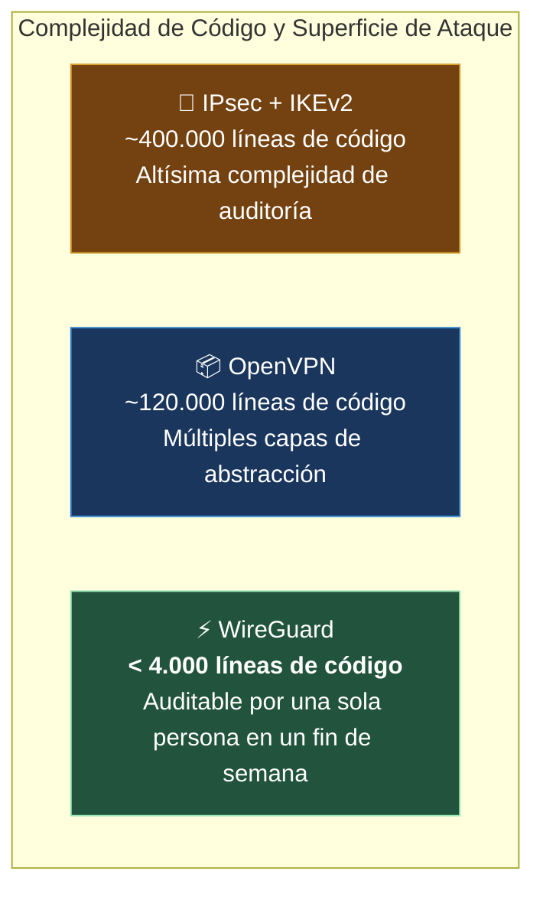

#redes #ccna #vpn #ipsec #wireguard #openvpn #tunel-cifrado #ciberseguridad

> [!info] 🧭 Navegación
> ◀ [[🛡️ 08.2 - Mecanismos de Protección y Filtrado (ACLs, Firewalls y Zonas)]] · 🔼 [[🌐 00 - Índice Maestro de Redes Informáticas]] · ▶ [[🧰 09.1 - Comandos Esenciales de Diagnóstico de Red (Linux y Windows)]]

---

## 🔐 1. El Concepto de Red Privada Virtual (VPN)

Antiguamente, si una empresa quería conectar de forma segura su sede de Madrid con su fábrica de Valencia, tenía que alquilar a la compañía telefónica una **Línea Dedicada Punto a Punto** (*Leased Line*). Era una solución extremadamente segura, pero con un coste mensual astronómico.

Una **VPN** (*Virtual Private Network*) resuelve este problema creando un **túnel privado, autenticado y fuertemente cifrado a través de una red pública y no confiable: Internet**.

```mermaid
graph LR
    subgraph SEDE_A["Sede Madrid (192.168.10.0/24)"]
        PC1[PC Empleado] --> R_MAD((Router Madrid))
    end

    subgraph INTERNET["Internet Público (Hostil / Espías / ISPs)"]
        R_MAD ===|🔒 TÚNEL CIFRADO VPN (IPsec / WireGuard)| R_VAL((Router Valencia))
    end

    subgraph SEDE_B["Sede Valencia (192.168.20.0/24)"]
        R_VAL --> Srv[Servidor Central]
    end

    style SEDE_A fill:#1a365d,stroke:#3182ce,color:#fff
    style INTERNET fill:#2d3748,stroke:#cbd5e0,color:#fff
    style SEDE_B fill:#22543d,stroke:#9ae6b4,color:#fff
    style R_MAD fill:#742a2a,stroke:#feb2b2,color:#fff
    style R_VAL fill:#742a2a,stroke:#feb2b2,color:#fff
```

> [!abstract] 🏠 Analogía: El Vehículo Blindado en la Autovía Pública
> Internet es una autovía pública por la que circulan millones de coches y camiones a la vista de todos (los routers y proveedores pueden inspeccionar los paquetes). 
> Una VPN es como meter tu información dentro de un **camión blindado acorazado con lunas tintadas y escolta armada**: el camión circula por la misma autovía pública que todos los demás, pero nadie desde fuera puede ver qué transporta, ni alterar su contenido, ni robar el dinero.

### 🔐 Los Tres Pilares Criptográficos de una VPN

1. **Confidencialidad**: Cifrado simétrico de alta velocidad (**AES-256-GCM** o **ChaCha20**) para que ningún observador intermedio pueda leer los datos.
2. **Integridad de Datos**: Funciones de hash criptográfico (**HMAC-SHA256** o **Poly1305**) para garantizar que nadie alteró ni un solo bit del paquete durante el tránsito.
3. **Autenticación y Anti-Replay**: Verificación de la identidad de ambos extremos (mediante certificados digitales X.509 o claves públicas asimétricas) y numeración secuencial para impedir que un atacante reenvíe paquetes viejos capturados (**Ataques de Replay**).

---

## 🔐 2. Tipos de Arquitecturas VPN

| Modelo de VPN | ¿Quién conecta con quién? | Uso Habitual en Empresas | Tecnologías Típicas |
|:---|:---|:---|:---|
| **Site-to-Site (Sitio a Sitio)** | **Router perimetral a Router perimetral** | Interconectar sedes fijas, sucursales y centros de datos con la nube (AWS Direct Connect / Azure VPN). | **IPsec en Modo Túnel** |
| **Remote Access (Cliente a Sitio)** | **Portátil individual a Router/Firewall corporativo** | Empleados en teletrabajo desde sus hogares, hoteles o aeropuertos. | **WireGuard**, OpenVPN, Cisco AnyConnect (SSL/TLS) |

---

## 🔐 3. IPsec (Internet Protocol Security): El Estándar Corporativo

**IPsec** no es un único protocolo, sino una **suite completa de estándares del IETF** que opera en la **Capa 3 (Red)** del modelo OSI, asegurando todo el tráfico IP de forma transparente para las aplicaciones.

### ⚖️ 3.1 Modos de Operación: Transport Mode vs. Tunnel Mode

```
  PAQUETE IP ORIGINAL:
  ┌───────────────┬───────────────────────────────┐
  │ Cabecera IP   │   Carga Útil (TCP / Datos)    │
  └───────────────┴───────────────────────────────┘

  1. MODO TRANSPORTE (Transport Mode - Host a Host):
  ┌───────────────┬───────────┬───────────────────┬─────────┐
  │ Cabecera IP   │  ESP Hdr  │   Payload Cifrado │ ESP Trl │
  └───────────────┴───────────┴───────────────────┴─────────┘
  ▲ Solo se cifra el contenido; la cabecera IP original viaja visible.

  2. MODO TÚNEL (Tunnel Mode - Site to Site Estándar):
  ┌───────────────┬───────────┬───────────────────┬───────────────────┬─────────┐
  │ Nueva Cab. IP │  ESP Hdr  │ Cab. IP Original  │   Payload Cifrado │ ESP Trl │
  │   Pública     │           │   (Privada)       │                   │         │
  └───────────────┴───────────┴───────────────────┴───────────────────┴─────────┘
  ▲ ¡Se cifra el paquete original entero! Se añade una cabecera pública externa.
```

- **Modo Transporte**: Solo cifra la carga útil; la cabecera IP original queda al descubierto. Se usa para conexiones punto a punto entre dos servidores finales en la misma red.
- **Modo Túnel (*Tunnel Mode*)**: **Cifra el paquete IP original completo (incluida la cabecera con las IPs privadas internas de la empresa)** y le antepone una nueva cabecera IP externa con las IPs públicas de los dos routers. Es el modo universal en VPNs Site-to-Site.

### 🔐 3.2 Los Protocolos Clave de IPsec

1. **ESP (*Encapsulating Security Payload* - Protocolo IP 50)**: El componente principal que proporciona cifrado, autenticación e integridad simultáneamente.
2. **AH (*Authentication Header* - Protocolo IP 51)**: Solo proporciona autenticación e integridad, **pero no cifra los datos**. Casi extinto en la actualidad.
3. **IKE (*Internet Key Exchange* - IKEv1 y el moderno IKEv2)**: Protocolo que opera sobre **UDP puerto 500** (y **UDP 4500** para NAT-Traversal):
   - **Fase 1**: Autentica a los dos routers y crea un canal seguro inicial (**IKE SA**).
   - **Fase 2**: Negocia las claves efímeras y suites de cifrado específicas para el tráfico de datos (**IPsec SA**).

---

## 🔐 4. WireGuard: La Revolución Moderna del Cifrado en Redes

Durante más de dos décadas, IPsec y OpenVPN dominaron el mercado a pesar de ser monstruos de software gigantescos y lentos (OpenVPN tiene más de 100.000 líneas de código y corre en espacio de usuario).

En 2020 se integró formalmente en el kernel de Linux (versión 5.6) el protocolo **WireGuard**:



### 🔐 Principios Revolucionarios de WireGuard

1. **Cryptokey Routing**: Cada cliente o nodo remoto se identifica simplemente por su **Clave Pública Curve25519**. La tabla de rutas interna asocia directamente la clave pública con la IP permitida (`AllowedIPs`), eliminando handshakes ruidosos.
2. **Criptografía de Última Generación Fija (*Opinionated Crypto*)**: No pierde tiempo negociando suites criptográficas obsoletas; utiliza exclusivamente los algoritmos más rápidos y seguros del mundo:
   - **ChaCha20** para cifrado simétrico con autenticador **Poly1305**.
   - **Curve25519** para intercambio de claves asimétrico (ECDH).
   - **BLAKE2s** para hashing ultrarrápido.
3. **Conexión Sin Estado (*Stateless Feel*)**: No mantiene una conexión TCP fija. Si no hay datos que enviar, la interfaz permanece completamente en silencio de radio. Si el usuario cambia de red Wi-Fi a 4G en el móvil, el túnel continúa funcionando de forma instantánea sin reconexiones.

---

## 🛡️ 5. Perspectiva de Ciberseguridad: Mitos y Riesgos de las VPNs

> [!warning] 🚨 La Ilusión de Anonimato en las VPNs Comerciales
> Existe una campaña publicitaria masiva en Internet prometiendo que una VPN comercial (NordVPN, ExpressVPN, etc.) te hace "100% anónimo e invulnerable a los hackers".
> 
> **La Realidad Técnica**:
> 1. **Una VPN comercial solo traslada la confianza**: En lugar de confiar en que tu proveedor de fibra (Telefónica, Movistar) no espíe tu tráfico, confías en que la empresa de la VPN no espíe ni guarde registros de tus datos.
> 2. **Fugas de DNS (*DNS Leaks*)**: Si el sistema operativo envía las consultas DNS al servidor de tu ISP en lugar de canalizarlas por el túnel VPN, **todo el mundo sabe qué webs visitas** a pesar del cifrado del túnel.
> 3. **Huella Digital del Navegador (*Browser Fingerprinting*)**: Las cookies, extensiones y fuentes del navegador siguen identificándote con precisión quirúrgica aunque tu IP pública cambie a Suiza.
> 4. **VPNs y Malware**: Una VPN cifra el túnel, **pero no desinfecta el contenido**. Si descargas un archivo con ransomware por un túnel VPN, llegará perfectamente cifrado y seguro a mi ordenador para destruirlo.

---

## 💻 6. Práctica en Terminal Linux: Despliegue de un Túnel WireGuard

```bash
# 1. Instalar las herramientas de WireGuard en Linux

sudo apt update && sudo apt install wireguard -y

# 2. Generar el par de claves criptográficas asimétricas (Privada y Pública)

wg genkey | tee privatekey | wg pubkey > publickey

# 3. Ver las claves generadas

cat privatekey
cat publickey

# 4. Crear la configuración del túnel en /etc/wireguard/wg0.conf:

# [Interface]

# Address = 10.200.0.2/24

# PrivateKey = <Contenido de privatekey>

#
# [Peer]

# PublicKey = <Clave Pública del Servidor>

# Endpoint = vpn.empresa.com:51820

# AllowedIPs = 10.200.0.0/24

# 5. Levantar la interfaz del túnel VPN en un comando

sudo wg-quick up wg0

# 6. Inspeccionar el estado de la conexión, tráfico transferido y último handshake

sudo wg show
```

> [!brain] 🔬 Salida de `wg show`:
> ```text
> interface: wg0
>   public key: 4Bf...k8=
>   private key: (hidden)
>   listening port: 51820
>
> peer: xT2...9A=
>   endpoint: 203.0.113.50:51820
>   allowed ips: 10.200.0.0/24
>   latest handshake: 12 seconds ago
>   transfer: 1.45 MiB received, 420.12 KiB sent
> ```
> ¡En menos de 10 líneas de configuración tienes un túnel con cifrado militar de velocidad de cable operando nativamente en el kernel de Linux!

---

## 📌 7. Resumen y Siguiente Paso

Con esta nota completo el **Bloque 8 (Seguridad Básica e Intermedia)**. He aprendido:

- Los principios criptográficos de confidencialidad, integridad y anti-replay en VPNs.
- Las diferencias entre VPNs Site-to-Site y de Acceso Remoto.
- La arquitectura profunda de IPsec (Modo Túnel vs Modo Transporte, ESP, IKEv2).
- La arquitectura minimalista y ultrarrápida de WireGuard.
- La desmitificación de la privacidad en VPNs comerciales y las fugas de DNS.

En el **Bloque 9 (Diagnóstico, Monitorización y Laboratorio Práctico)**, abro mi caja de herramientas: comenzaremos con [[🧰 09.1 - Comandos Esenciales de Diagnóstico de Red (Linux y Windows)]] para convertirme en experto de la consola de comandos.
