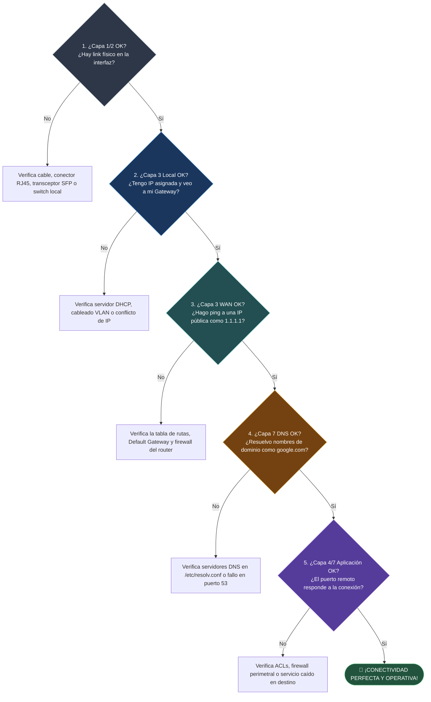

---
tags:
  - redes
  - ccna
  - diagnostico
  - comandos-red
  - linux
  - windows
  - troubleshooting
  - sysadmin
folder: "📂09 - Diagnóstico, Monitorización y Laboratorio"
aliases:
  - "Comandos Esenciales de Diagnóstico de Red"
  - "Troubleshooting de Redes en Linux y Windows"
date: 2026-09-07
---

> [!info] 🧭 Navegación
> ◀ [[08.3 - VPNs (Redes Privadas Virtuales, IPsec y WireGuard)]] · 🔼 [[00 - Índice Maestro de Redes]] · ▶ [[09.2 - Análisis de Tráfico de Red con Wireshark y Tcpdump]]

---

# 🧰 09.1 - Comandos Esenciales de Diagnóstico de Red (Linux y Windows)

## 1. La Metodología Científica de Troubleshooting de Red

Cuando un usuario o un servidor pierde la conexión, un técnico novato empieza a cambiar cables, reiniciar routers o modificar DNS al azar. Un ingeniero de redes de nivel CCNA o un pentester sigue un **enfoque sistemático ascendente (Bottom-Up)** basado en el modelo OSI:



---

## 2. Tabla Comparativa Universal: Comandos Linux vs. Windows

| Función de Diagnóstico | Capa OSI | Comando Estándar en Linux (Moderno) | Comando Estándar en Windows |
|:---|:---:|:---|:---|
| **Ver Interfaces y Direcciones IP** | L2 / L3 | `ip addr show` (o `ip a`) | `ipconfig /all` |
| **Ver Estado Físico y Velocidad** | L1 / L2 | `sudo ethtool eth0` | `Get-NetAdapter` (PowerShell) |
| **Tabla de Enrutamiento / Gateway** | L3 | `ip route show` | `route print` / `Get-NetRoute` |
| **Comprobar Caché de Vecinos ARP** | L2 / L3 | `ip neigh show` | `arp -a` |
| **Prueba de Conectividad Básica** | L3 | `ping -c 4 <IP>` | `ping -n 4 <IP>` |
| **Trazar Ruta Salto a Salto** | L3 | `traceroute -n <IP>` / `tracepath`| `tracert -d <IP>` |
| **Traza Continua con Jitter y Pérdida**| L3 | `mtr <IP>` | `pathping <IP>` |
| **Resolución de Nombres DNS** | L7 | `dig <dominio>` / `host` | `nslookup <dominio>` |
| **Auditar Sockets y Puertos en Escucha**| L4 | `ss -tulpn` | `netstat -ano` |
| **Probar Puerto TCP Abierto** | L4 | `nc -zv <IP> <puerto>` | `Test-NetConnection -Port <p> <IP>` |

---

## 3. Guía Práctica de Comandos Esenciales en Linux

### 3.1 `ping`: Más Allá del Eco Básico
El comando `ping` envía paquetes `ICMP Echo Request` (Type 8) y espera `Echo Reply` (Type 0) ([[03.4 - Protocolos de Soporte en Capa 3 (ARP e ICMP)]]):

```bash
# 1. Enviar exactamente 4 paquetes y calcular estadísticas de RTT y Jitter
ping -c 4 1.1.1.1

# 2. Ping rápido de ráfaga para detectar pérdida de paquetes intermitente (requiere root)
sudo ping -f -c 500 192.168.1.1

# 3. Path MTU Discovery: Averiguar el tamaño máximo de paquete que admite la red sin fragmentar
# (Flag -M do activa el bit Don't Fragment en la cabecera IPv4)
# (1472 bytes de datos + 20 bytes IP + 8 bytes ICMP = 1500 bytes MTU estándar)
ping -s 1472 -M do 8.8.8.8
```

> [!tip] 💡 Diagnóstico del Tamaño de MTU
> Si al ejecutar `ping -s 1472 -M do 8.8.8.8` recibes el error:
> `ping: local error: message too long, mtu=1400`
> Has descubierto que la red o túnel VPN intermedio tiene un **MTU reducido**. Si una aplicación envía paquetes de 1500 bytes con el flag DF activado, se perderán en silencio (*Black Hole Router*).

---

### 3.2 `traceroute` y `mtr`: Localizando Cuellos de Botella
Si el `ping` falla o la latencia es desorbitada, necesitas saber en qué salto exacto ocurre el problema:

```bash
# 1. Traza sin resolver DNS inversos (mucho más rápido)
traceroute -n 8.8.8.8

# 2. Forzar traza usando paquetes TCP SYN al puerto 443 (útil si el firewall bloquea UDP/ICMP)
sudo traceroute -T -p 443 -n google.com

# 3. MTR (My Traceroute): La herramienta definitiva de diagnóstico continuo
# Combina ping continuo y traceroute mostrando pérdida de paquetes y latencia en vivo
mtr 1.1.1.1
```

> [!brain] 🔬 Cómo Interpretar la Salida de `mtr`:
> ```text
>                               Loss%   Snt   Last   Avg  Best  Wrst StDev
>  1.|-- 192.168.1.1            0.0%    50    1.2   1.1   0.9   2.4   0.3
>  2.|-- 10.20.30.1             0.0%    50    8.5   9.1   7.9  14.2   1.1
>  3.|-- 213.140.45.12         20.0%    50   14.2  15.0  13.1  35.2   4.5
>  4.|-- 8.8.8.8                0.0%    50   14.1  14.5  13.2  18.0   0.8
> ```
> Observa el salto 3: Tiene un 20% de pérdida, **pero el destino final (salto 4) tiene 0.0% de pérdida**.
> *Conclusión CCNA*: El router 3 no tiene problemas de conexión; simplemente tiene configurado un límite de tasa de respuesta a mensajes ICMP (*ICMP Rate Limiting*) en su CPU para protegerse de ataques. **La red está sana.**

---

### 3.3 `dig`: Inspección Quirúrgica del Sistema DNS
Olvídate del obsoleto `nslookup`; en Linux profesional usamos `dig`:

```bash
# 1. Obtener solo la dirección IP limpia sin texto decorativo
dig +short google.com

# 2. Consultar registros MX de correo o registros TXT de seguridad
dig +short github.com MX
dig +short google.com TXT

# 3. Trazar la jerarquía completa paso a paso desde los servidores raíz
dig +trace www.debian.org

# 4. Forzar una consulta a un DNS específico ignorando los del sistema
dig @8.8.8.8 cloudflare.com
```

---

### 3.4 `ss`: Auditoría de Sockets y Puertos en Vivo
`ss` (*Socket Statistics*) lee directamente la información de la memoria del kernel mediante el protocolo Netlink, siendo cientos de veces más rápido que el antiguo `netstat`:

```bash
# 1. Listar todos los puertos en ESCUCHA (Listen) TCP y UDP con PID del proceso
sudo ss -tulpn

# 2. Ver solo conexiones establecidas filtrando por puerto específico (ej. HTTPS)
ss -t state established '( sport = :https or dport = :https )'

# 3. Ver estadísticas resumidas de sockets del sistema
ss -s
```

---

### 3.5 `nc` (Netcat): La Navaja Suiza de Conectividad L4
Antes de asumir que un servidor web o base de datos remota está rota, comprueba si su puerto TCP acepta conexiones en menos de 1 segundo:

```bash
# Probar si el puerto MySQL (3306) o SSH (22) está abierto y alcanzable
nc -zv -w 2 192.168.1.100 22
nc -zv -w 2 192.168.1.100 3306
```
- Si responde `Connection to 192.168.1.100 22 port [tcp/ssh] succeeded!`, la red, el enrutamiento y el cortafuegos están perfectamente configurados.

---

## 4. Perspectiva de Ciberseguridad: Living-off-the-Land (LotL)

> [!warning] 🚨 Reconocimiento sin Herramientas Externas
> Cuando un pentester o atacante compromete un servidor en un ejercicio de Red Team, **lo primero que hace es no descargar herramientas externas** (como Nmap) para evitar que los sistemas antivirus / EDR disparen alertas.
> 
> En su lugar, utilizan las herramientas nativas del sistema (**Living-off-the-Land**):
> - Con `ip neigh show` o `arp -a` descubren todas las demás máquinas activas de la red local.
> - Con `cat /etc/resolv.conf` y `cat /etc/hosts` descubren los dominios internos y servidores DNS corporativos.
> - Con `ip route show` descubren las subredes ocultas de la empresa y la IP del router pivote.
> - Con un simple bucle en Bash con `nc` o `/dev/tcp`, pueden escanear puertos de toda la subred interna sin instalar nada:
> ```bash
> for p in 21 22 80 443 3306; do (echo >/dev/tcp/192.168.1.1/$p) >/dev/null 2>&1 && echo "Puerto $p ABIERTO"; done
> ```

---

## 5. Resumen y Siguiente Paso

En esta nota hemos dominado:
- El árbol de decisión de troubleshooting Bottom-Up.
- La tabla de equivalencias de comandos entre Linux y Windows.
- El uso avanzado de `ping`, `traceroute`, `mtr`, `dig`, `ss` y `nc`.
- Las técnicas de reconocimiento nativo Living-off-the-Land.

En la siguiente nota ([[09.2 - Análisis de Tráfico de Red con Wireshark y Tcpdump]]), nos pondremos las gafas de rayos X de la red: aprenderemos a capturar tramas en crudo con **Tcpdump** e inspeccionar flujos de paquetes capa por capa con **Wireshark**.
