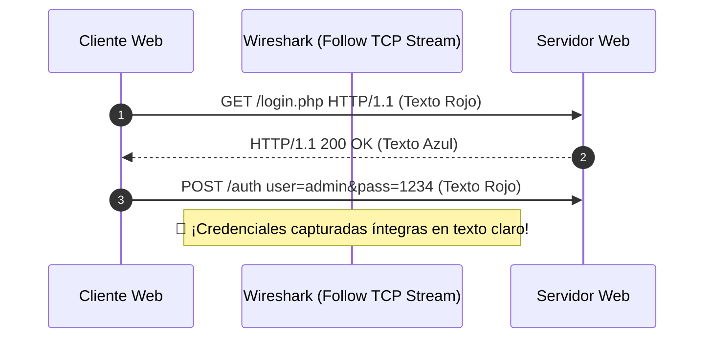

---
tags:
  - redes
  - ccna
  - wireshark
  - tcpdump
  - tshark
  - sniffing
  - analisis-trafico
  - bpf
  - ciberseguridad
folder: "📂09 - Diagnóstico, Monitorización y Laboratorio"
aliases:
  - "Análisis de Tráfico de Red con Wireshark y Tcpdump"
  - "Captura de Paquetes, Filtros BPF y Disección de Protocolos"
date: 2026-09-07
---

> [!info] 🧭 Navegación
> ◀ [[09.1 - Comandos Esenciales de Diagnóstico de Red (Linux y Windows)]] · 🔼 [[00 - Índice Maestro de Redes]] · ▶ [[09.3 - Entornos de Simulación y Laboratorio (Packet Tracer, GNS3 y EVE-NG)]]

---

# 🦈 09.2 - Análisis de Tráfico de Red con Wireshark y Tcpdump

## 1. Las Gafas de Rayos X de la Red

En informática, los programas a menudo fallan diciendo *"Error de conexión desconocido"* o *"Timeout"*. Para un administrador novato, la red es una caja negra invisible.

Un **Sniffer o Analizador de Paquetes** es el equivalente a poner un estetoscopio o unas gafas de visión térmica sobre el cable: permite **capturar, decodificar e inspeccionar cada bit exacto** que entra y sale de la tarjeta de red, capa por capa del modelo OSI.

> [!abstract] 🏠 Analogía: Abrir la Correspondencia en la Cinta Transportadora
> Imagina la cinta clasificadora de una oficina de correos central:
> - Sin analizador, solo ves paquetes cerrados pasando a toda velocidad por la cinta.
> - Con **Tcpdump / Wireshark**, pulsas un botón que saca una fotocopia instantánea de cada sobre: puedes leer la matrícula de la furgoneta (Capa 2), la dirección postal (Capa 3), el número de albarán (Capa 4) y, si la carta no va en un sobre opaco lacrado (cifrado TLS), ¡puedes leer la carta entera!

---

## 2. El Modo Promiscuo de la Tarjeta de Red

Por diseño, el hardware de una tarjeta de red (NIC) filtra el tráfico en Capa 2:
- Si la dirección MAC destino de una trama no coincide con su propia MAC física y no es de broadcast/multicast, **la tarjeta la descarta en el chip de hardware** sin molestar a la CPU del ordenador.
- Cuando activamos un analizador de paquetes, la tarjeta entra en **Modo Promiscuo (*Promiscuous Mode*)**: la NIC desactiva su filtro de hardware y **entrega absolutamente todas las tramas que circulan por el medio físico al kernel del sistema operativo**, permitiéndonos auditar el tráfico de la red.

---

## 3. Tcpdump vs. Wireshark vs. Tshark

| Herramienta | Entorno | Ventajas Clave | Casos de Uso Habituales |
|:---|:---:|:---|:---|
| **Tcpdump** | Consola CLI (Linux / BSD) | Ultraligero, bajo consumo de CPU/RAM, viene preinstalado en casi cualquier servidor o router embebido. | Servidores en producción (*Headless*), captura desatendida de tráfico de larga duración a disco. |
| **Wireshark** | Interfaz Gráfica (GUI) | Disección visual capa por capa, gráficos de flujo, reconstrucción de sesiones TCP y estadísticas avanzadas. | Análisis forense en profundidad, depuración en entornos de escritorio y laboratorios CCNA. |
| **Tshark** | Consola CLI (Suite Wireshark) | Combina el motor de disección completo de Wireshark con la velocidad de la terminal y scripts de automatización. | Extracción automatizada de campos específicos en scripts de Bash o pipelines de seguridad. |

---

## 4. La Gran Diferencia: Filtros de Captura (BPF) vs. Filtros de Visualización

Una de las confusiones más comunes en exámenes CCNA y certificaciones de seguridad es mezclar los dos tipos de filtros:

```mermaid
graph TD
    WIRE([Tráfico Crudo en el Cable]) --> BPF{1. Filtro de Captura (BPF)<br><i>Ejecutado en el KERNEL</i><br>¿El paquete coincide con la regla?}
    BPF -- No --> DROP[Descartado inmediatamente<br>(Ahorra CPU y disco)]
    BPF -- Sí --> DISK[Guardado en memoria / archivo .pcap]
    
    DISK --> DISPLAY{2. Filtro de Visualización<br><i>Ejecutado en Wireshark GUI</i><br>¿Cumple el filtro de búsqueda?}
    DISPLAY -- No --> HIDE[Oculto en pantalla temporalmente]
    DISPLAY -- Sí --> SHOW[Mostrado en la interfaz con colores]

    style WIRE fill:#2d3748,stroke:#cbd5e0,color:#fff
    style BPF fill:#744210,stroke:#d69e2e,color:#fff
    style DISPLAY fill:#1a365d,stroke:#3182ce,color:#fff
    style SHOW fill:#22543d,stroke:#9ae6b4,color:#fff
```

### 1. Filtros de Captura (Berkeley Packet Filter - BPF)
Se aplican **antes de capturar el paquete**, directamente en el kernel mediante el subsistema BPF:
- Si capturas en un enlace saturado de 10 Gbps sin filtro BPF, llenarás el disco duro en minutos y saturarás la RAM.
- **Sintaxis BPF**:
  - `host 192.168.1.50`
  - `tcp port 443`
  - `net 10.0.0.0/8 and not port 22`
  - `icmp or arp`

### 2. Filtros de Visualización (*Display Filters* en Wireshark)
Se aplican **a posteriori** sobre paquetes que ya han sido capturados y guardados en memoria:
- Permite buscar quirúrgicamente campos internos de cualquier protocolo superior.
- **Sintaxis de Wireshark**:
  - `ip.addr == 192.168.1.50`
  - `tcp.flags.syn == 1 and tcp.flags.ack == 0` *(Encuentra solo intentos de inicio de conexión)*
  - `http.request.method == "POST"`
  - `dns.qry.name contains "google"`

---

## 5. Casos Prácticos de Disección en Wireshark

### 5.1 Reconstrucción de Sesiones con "Follow TCP Stream"
Una de las funciones más potentes de Wireshark es la capacidad de reordenar todos los segmentos y reconstruir la conversación exacta que tuvieron el cliente y el servidor:
- Si haces clic derecho sobre un paquete HTTP o Telnet y seleccionas **Follow $\longrightarrow$ TCP Stream**:
  - Verás en color **rojo** todo lo que el cliente tecleó o envió (incluyendo nombres de usuario, contraseñas y cookies).
  - Verás en color **azul** la respuesta devuelta por el servidor en texto claro.
- Si haces lo mismo sobre una sesión de **SSH** o **HTTPS (TLS 1.3)**, Wireshark solo te mostrará bloques ininteligibles de bytes cifrados pseudoaleatorios, demostrando la eficacia de la criptografía.



---

## 6. Práctica de Laboratorio en Terminal Linux: Captura y Extracción

En entornos profesionales de servidores o pentesting remoto, rara vez disponemos de entorno gráfico. Dominar la terminal con `tcpdump` y `tshark` es una habilidad obligatoria:

```bash
# 1. Capturar 50 paquetes en la interfaz eth0 y guardarlos en un archivo .pcap estándar
sudo tcpdump -i eth0 -nn -w captura_red.pcap -c 50

# 2. Capturar solo tráfico web (puerto 80 o 443) ignorando el ruido de nuestra sesión SSH (puerto 22)
sudo tcpdump -i eth0 -nn "not port 22 and (port 80 or port 443)"

# 3. Leer un archivo .pcap capturado previamente mostrando cabeceras completas
tcpdump -r captura_red.pcap -nn -vvv

# 4. Disección avanzada con Tshark: Extraer todas las consultas DNS solicitadas en vivo
sudo tshark -i eth0 -Y "dns.flags.response == 0" -T fields -e ip.src -e dns.qry.name

# 5. Extraer todas las URLs solicitadas por HTTP en texto claro con Tshark
sudo tshark -r captura_red.pcap -Y "http.request" -T fields -e http.host -e http.request.uri
```

> [!brain] 🔬 Salida de `tshark` extrayendo consultas DNS en vivo:
> ```text
> 192.168.1.50   api.github.com
> 192.168.1.50   telemetry.dropbox.com
> 192.168.1.50   updates.cdn-apple.com
> ```
> Con una sola línea de comandos puedes monitorizar y auditar en tiempo real a qué servidores externos se conecta cualquier máquina de la red.

---

## 7. Perspectiva de Ciberseguridad: Captura en Entornos Conmutados (Switched Networks)

> [!warning] 🚨 El Mito de "El Switch me Protege de los Sniffers"
> En el [[02.3 - Conmutación, Switches, VLANs y Spanning Tree (STP)]] aprendimos que un switch solo envía el tráfico al puerto destino, por lo que poner tu tarjeta en modo promiscuo solo te dejará ver tus propios paquetes y los broadcasts.
> 
> **Cómo se captura tráfico de terceros en redes reales**:
> 1. **Método Legítimo de Administrador (SPAN / Port Mirroring)**:
>    El ingeniero entra al switch Cisco y configura una sesión de espejo: *"Copia todo el tráfico del puerto Fa0/1 (donde está el servidor crítico) y duplícalo en tiempo real al puerto Fa0/24 (donde tengo conectado mi portátil con Wireshark)"*.
>    ```text
>    monitor session 1 source interface fastEthernet 0/1
>    monitor session 1 destination interface fastEthernet 0/24
>    ```
> 2. **Método Ofensivo de Pentester**:
>    Si el atacante no tiene acceso al switch para hacer SPAN, utiliza **ARP Spoofing** ([[08.1 - Amenazas Comunes en Redes (Ataques Capas 2, 3 y 4)]]) para forzar al switch a enviarle todo el tráfico de la víctima directamente a su tarjeta de red.

---

## 8. Resumen y Siguiente Paso

En esta nota hemos aprendido:
- El funcionamiento del modo promiscuo en tarjetas de red.
- La diferencia crítica entre filtros de captura en kernel (BPF) y filtros de visualización en Wireshark.
- Cómo diseccionar el 3-Way Handshake y reconstruir conversaciones con *Follow TCP Stream*.
- El uso profesional de `tcpdump` y `tshark` para auditoría desatendida en servidores Linux.

En la siguiente y última nota del curso ([[09.3 - Entornos de Simulación y Laboratorio (Packet Tracer, GNS3 y EVE-NG)]]), aprenderemos a diseñar, montar y probar topologías de red completas en simuladores profesionales para preparar exámenes Cisco CCNA y laboratorios de ciberseguridad.
