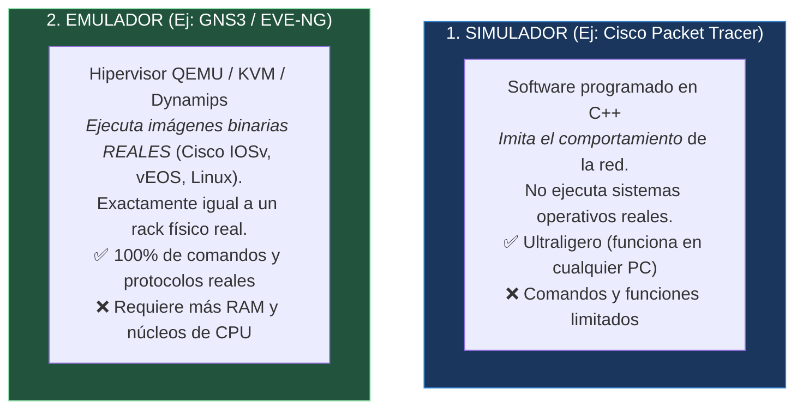
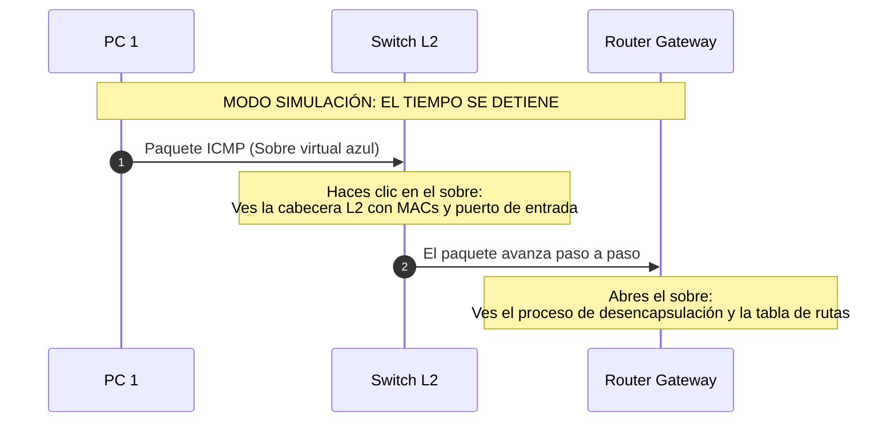

#redes #ccna #packet-tracer #gns3 #eve-ng #simulacion #emulacion #laboratorios

> [!info] 🧭 Navegación
> ◀ [[🦈 09.2 - Análisis de Tráfico de Red con Wireshark y Tcpdump]] · 🔼 [[🌐 00 - Índice Maestro de Redes Informáticas]] · ▶ [[🌐 00 - Índice Maestro de Redes Informáticas]]

---

## 💻 1. La Necesidad del Laboratorio Virtual

En los albores de las certificaciones de redes en los años 90, para preparar el examen de **Cisco CCNA** tenías que comprar tres routers Cisco 2500 usados y dos switches Catalyst en eBay, gastando miles de euros y llenando tu habitación de cables, ruido ensordecedor de ventiladores y calor.

Hoy en día, **puedes desplegar una red corporativa multinacional con 30 routers, cortafuegos de nueva generación y servidores Linux en tu propio ordenador portátil** utilizando entornos de virtualización, simulación y emulación.

---

## ⚖️ 2. La Gran Diferencia: Simulación vs. Emulación

Es fundamental comprender la diferencia técnica entre ambas aproximaciones:



> [!abstract] 🏠 Analogía: El Simulador de Vuelo de Videojuego vs. El Simulador Profesional de Cabina
> - **Cisco Packet Tracer (Simulador)**: Es como jugar a un simulador de vuelo en el móvil con pantalla táctil: es divertido, muy visual, te enseña perfectamente los principios básicos de la aerodinámica (cómo vuelan los paquetes), pero muchos botones de la cabina no hacen nada.
> - **GNS3 / EVE-NG (Emulador)**: Es como meterte en la cabina hidráulica de entrenamiento de pilotos de Boeing: cada interruptor, cada error de motor y cada sistema informático es el software real que vuela un avión de verdad.

---

## ⚖️ 3. Comparativa de las Tres Grandes Plataformas

| Característica | Cisco Packet Tracer | GNS3 | EVE-NG (*Emulated Virtual Environment*) |
|:---|:---|:---|:---|
| **Tipo de Entorno** | **Simulador de software** | **Emulador de hardware** | **Emulador de hardware empresarial** |
| **Desarrollador** | Cisco Networking Academy | Comunidad Open Source | EVE-NG Team |
| **Precio / Licencia** | **100% Gratuito** (cuenta Cisco) | Gratuito / Open Source | Versión Community Gratuita / Versión Pro |
| **Consumo de Recursos** | Mínimo (~200 MB de RAM) | Moderado (4 a 16 GB de RAM) | Moderado a Alto (8 a 64 GB de RAM) |
| **Interfaz de Usuario** | Aplicación de escritorio nativa | Cliente de escritorio + VM | **100% Navegador Web (HTML5)** |
| **Captura con Wireshark**| Animación propia de paquetes | **Integración nativa con Wireshark** | **Integración nativa con Wireshark** |
| **Soporte Multifabricante**| Solo Cisco (y PCs genéricos) | **Cisco, Juniper, Linux, Arista, MikroTik** | **Cualquier sistema operativo (KVM/QEMU)** |
| **Nivel Recomendado** | **Desde Cero a CCNA 200-301** | **CCNA, CCNP y Pentesting** | **CCNP, CCIE y Red Team / Blue Team** |

---

## 🧪 4. Cisco Packet Tracer: La Herramienta Educativa Definitiva

Para quien empieza desde cero, **Packet Tracer** es la mejor herramienta didáctica del mundo gracias a su **Modo Simulación**:



### 🧪 Funciones Estrella de Packet Tracer

1. **Modo Tiempo Real vs. Modo Simulación**: Puedes "congelar el tiempo" de la red y avanzar fotograma a fotograma viendo cómo los sobres de colores (PDUs) viajan por los cables, dónde colisionan o por qué un switch los descarta.
2. **Inspección de Capas PDU**: Puedes hacer clic en cualquier sobre virtual en cualquier punto de la ruta para ver el desglose exacto de las 7 capas del modelo OSI en ese instante.
3. **Mundo Físico Integrado**: Permite diseñar el edificio de la empresa, colocar racks de servidores, conectar latiguillos a los patch panels y organizar regletas de alimentación.

---

## 🧪 5. GNS3 y EVE-NG: Los Laboratorios de la Industria Real

Cuando avanzas hacia la especialización en **Ciberseguridad (Pentesting de Redes)** o certificaciones avanzadas de Cisco (**CCNP / CCIE**), Packet Tracer se queda corto porque carece de comandos avanzados de switching o sistemas operativos reales.

### 🧪 ¿Por qué la industria prefiere EVE-NG?

- Se instala como una máquina virtual Linux (Ubuntu Server) en un servidor local o en tu portátil con VMware Workstation o VirtualBox.
- Creas tus topologías arrastrando cables directamente en tu navegador web Chrome o Firefox.
- Puedes conectar una máquina **Kali Linux real**, un firewall **pfSense real** y tres **routers Cisco reales**.
- **Wireshark en un clic**: Haces clic derecho sobre cualquier cable de la topología virtual y seleccionas *"Capture"*; se abre Wireshark en tu escritorio mostrando el tráfico que circula en ese instante por ese cable virtual.

---

## 💻 6. Topología Recomendada para tu Laboratorio de Práctica

Para consolidar todos los conocimientos adquiridos a lo largo de este curso de redes, monta la siguiente topología de práctica en Packet Tracer o EVE-NG:

```mermaid
graph TD
    INTERNET((Nube / Internet)) --- R1((Router Madrid))

    subgraph SEDE_MADRID["Sede Corporativa Madrid"]
        R1 ===|Troncal 802.1Q (Router-on-a-Stick)| SW1((Switch L2))
        SW1 --- PC_Ventas["PC Ventas<br>(VLAN 10: 192.168.10.10)"]
        SW1 --- SRV_WEB["Servidor Web / DNS<br>(VLAN 20: 192.168.20.10)"]
    end

    R1 ===|Enlace WAN Punto a Punto /30 (OSPF)| R2((Router Barcelona))

    subgraph SEDE_BARCELONA["Sucursal Barcelona"]
        R2 --- SW2((Switch L2))
        SW2 --- PC_Sucursal["PC Sucursal<br>(192.168.30.10)"]
    end

    style INTERNET fill:#2d3748,stroke:#cbd5e0,color:#fff
    style R1 fill:#742a2a,stroke:#feb2b2,color:#fff
    style R2 fill:#742a2a,stroke:#feb2b2,color:#fff
    style SW1 fill:#1a365d,stroke:#3182ce,color:#fff
    style SW2 fill:#1a365d,stroke:#3182ce,color:#fff
    style SEDE_MADRID fill:#234e52,stroke:#81e6d9,color:#fff
    style SEDE_BARCELONA fill:#553c9a,stroke:#d6bcfa,color:#fff
```

### 💻 Hitos Prácticos a Configurar en este Laboratorio:

1. **Capa 2**: Configurar VLAN 10 y VLAN 20 en el Switch 1, enlaces de acceso y troncal 802.1Q hacia el Router 1 ([[🔀 02.3 - Conmutación, Switches, VLANs y Spanning Tree (STP)]]).
2. **Capa 3 (Inter-VLAN)**: Configurar subinterfaces en el Router 1 (*Router-on-a-Stick*) con `encapsulation dot1Q` y sus direcciones IP de gateway ([[🧭 04.1 - Fundamentos de Routers y Enrutamiento Estático]]).
3. **Servicios**: Configurar un servidor DHCP en el Router 1 para entregar IPs automáticas a la VLAN 10 mediante `ip helper-address` ([[📡 06.2 - DHCP (Dynamic Host Configuration Protocol y Proceso DORA)]]).
4. **Enrutamiento Dinámico**: Habilitar el protocolo **OSPF Área 0** entre el Router 1 y el Router 2 para que Madrid y Barcelona se comuniquen automáticamente ([[🚀 04.2 - Protocolos de Enrutamiento Dinámico (RIP, OSPF y BGP)]]).
5. **Seguridad y NAT**: Configurar PAT en el Router 1 para dar salida a Internet a los PCs con direcciones privadas ([[🔁 06.3 - NAT, PAT y CGNAT (Traducción de Direcciones de Red)]]) y aplicar una ACL extendida para bloquear el acceso desde Ventas a los servidores internos ([[🛡️ 08.2 - Mecanismos de Protección y Filtrado (ACLs, Firewalls y Zonas)]]).

---

## 📌 7. Resumen Final de la Bóveda de Redes

> [!tip] 🎓 ¡Enhorabuena! Has completado la ruta de Redes Informáticas desde Cero
> A lo largo de estas 28 notas exhaustivas has adquirido los fundamentos de ingeniería de redes y ciberseguridad equivalentes a las certificaciones **CompTIA Network+** y **Cisco CCNA 200-301**:
> - Has viajado desde la física de los electrones y la luz ([[🔌 02.1 - Medios de Transmisión y Capa Física]]) hasta los protocolos de servicios de Internet ([[🌐 06.4 - Protocolos de Aplicación Comunes (HTTP-S, SSH, FTP, Correo y Gestión)]]).
> - Comprendes cómo piensan los routers con el algoritmo de Dijkstra ([[🚀 04.2 - Protocolos de Enrutamiento Dinámico (RIP, OSPF y BGP)]]) y cómo se coordinan los switches evitando bucles con STP ([[🔀 02.3 - Conmutación, Switches, VLANs y Spanning Tree (STP)]]).
> - Conoces los vectores de ataque ofensivos reales y cómo blindar cada capa con defensas perimetrales e inspección de tráfico ([[☣️ 08.1 - Amenazas Comunes en Redes (Ataques Capas 2, 3 y 4)]] y [[🦈 09.2 - Análisis de Tráfico de Red con Wireshark y Tcpdump]]).
> 
> *Para repasar cualquier tema o saltar a un concepto específico, consulta en cualquier momento tu centro de mando central*: **[[🌐 00 - Índice Maestro de Redes Informáticas]]**.
