#seguridad #hardware #hacking #privacidad

> [!info] Navegación
> ◀ Anterior: [[09 - Mitigación, Antivirus y Recuperación de Datos]]

---

# 10 — Hardware Hacking y Privacidad Física: Gadgets y Uso Real

El acceso físico a un dispositivo suele significar el **compromiso total del sistema** ("Game Over"). En esta sección exploramos las herramientas de hardware que utilizan tanto los profesionales de ciberseguridad (Red Team) para auditar, como los atacantes para infiltrarse.

---

## 🛑 1. Infiltración Física, Redes y USB (BadUSB)

Estos dispositivos aprovechan la confianza ciega que los sistemas operativos tienen sobre ciertos periféricos (como los teclados y ratones) para saltarse cualquier tipo de antivirus o protección lógica de la máquina.

### 🦆 USB Rubber Ducky

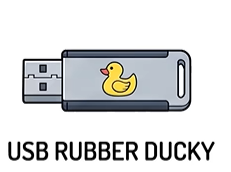

- **Qué es:** A simple vista es un pendrive normal, pero internamente cuenta con un chip que engaña al ordenador diciéndole: *"Hola, soy un teclado USB"*. 
 
- **Profundidad:** Se programa usando un lenguaje muy sencillo llamado *DuckyScript*. Como los sistemas operativos confían por defecto en los teclados (HID - Human Interface Device), no salta ninguna alerta. Las versiones modernas incluyen un botón físico encubierto para detonar la carga (*payload*) solo cuando el atacante pulsa.
 
- **Uso Real:** Se enchufa y en milisegundos "teclea" a una velocidad sobrehumana para abrir una terminal oculta (Powershell), descargar un *script* malicioso, ejecutarlo, desactivar el Defender y cerrar la ventana antes de que el usuario pueda reaccionar.
 
- **Precio Real:** ~79.99$ (Hak5).

---
### 🐰 Bash Bunny

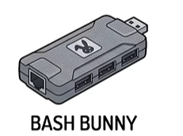

- **Qué es:** El hermano hipervitaminado del Rubber Ducky. Es capaz de emular simultáneamente **varios dispositivos a la vez**: un teclado, una tarjeta de red ultrarrápida, un puerto serie y una memoria USB.
 
- **Profundidad:** Cuenta con un **interruptor físico de 3 posiciones**. El atacante puede cargar el *Payload 1* en la primera posición (ej. robo de credenciales en Windows), el *Payload 2* en la segunda (ej. ataque a Mac), y la tercera posición se usa para ponerlo en modo almacenamiento y configurar los *scripts* tranquilamente en casa.
 
- **Uso Real:** Al conectarlo, puede simular ser un adaptador Ethernet que es más rápido que el Wi-Fi del ordenador. El PC redirige automáticamente todo el tráfico por él, permitiendo robar el *hash* de la contraseña del usuario (robo de NTLMv2) en cuestión de segundos, incluso con el PC bloqueado.
 
- **Precio Real:** ~119.99$ (Hak5).

---
### 🐢 LAN Turtle

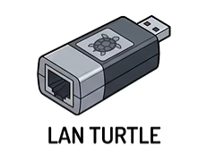

- **Qué es:** Aparenta ser un simple adaptador de red de USB a Ethernet, pero esconde un mini ordenador Linux completo en su interior.
 
- **Profundidad:** Permite la persistencia de acceso remoto. Al tener su propio sistema operativo, puede ejecutar *scripts* programados y realizar ataques de *spoofing* de red a bajo nivel de forma totalmente transparente para el usuario.
 
- **Uso Real:** Se deja conectado físicamente detrás del PC de una oficina, entre la torre y el cable de red. Pasa completamente desapercibido. Desde ahí, abre una conexión remota cifrada (túnel SSH) hacia el servidor del atacante, quien ahora tiene control total de la red interna de la empresa desde su sofá.
 
- **Precio Real:** ~79.99$ (Hak5).

---
### ⌨️ Key Grabber USB

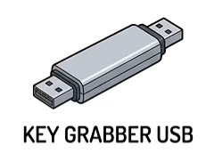

- **Qué es:** Un hardware keylogger. Es un adaptador muy pequeño que se intercala entre el cable del teclado y el puerto USB de la torre del ordenador.
 
- **Profundidad:** Al ser puramente físico (hardware y no software), **es 100% indetectable por cualquier antivirus**, EDR o sistema de seguridad. Todo lo que el usuario teclea se guarda en la memoria interna del grabber.
 
- **Uso Real:** Interceptar contraseñas maestras, correos y conversaciones. Los modelos avanzados incluyen Wi-Fi: el atacante no necesita volver a recoger el grabber; simplemente se sienta en el parking de la oficina, se conecta a la red Wi-Fi invisible que emite el aparatito y descarga el archivo de texto con todo lo tecleado en el día.

---
### 🔌 O.MG Cables

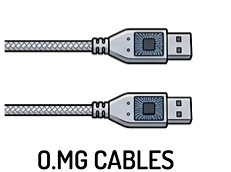

- **Qué es:** Cables de carga y datos (Lightning, USB-C, Micro-USB) idénticos a los originales (con el mismo peso, color y tacto), pero que esconden un microchip inalámbrico y un servidor web miniatura en la punta del conector.
 
- **Profundidad:** Incluyen capacidades increíbles como **Geofencing** (el cable sabe si está dentro de la empresa o en casa, y solo ejecuta el ataque en la empresa) y destrucción remota de pruebas (borra su propia memoria si detecta que lo están investigando).
 
- **Uso Real:** Un atacante regala o sustituye el cable del móvil de la víctima. Cuando esta lo usa para cargar el teléfono en el PC, el atacante (que puede estar en una furgoneta fuera del edificio) se conecta al Wi-Fi del cable usando su móvil, abriendo una interfaz web desde donde puede lanzar ataques DuckyScript en directo al PC de la víctima.
 
- **Precio Real:** 139.99$ - 179.99$.

---

## 📻 2. Radiofrecuencia (RF), Inalámbricas y Acceso Físico

El espectro invisible. Las señales Wi-Fi, Bluetooth, RFID de tarjetas de acceso o las ondas de radio de los mandos de garaje no están protegidas por paredes, por lo que pueden ser interceptadas desde el exterior.

### 🍍 Wi-Fi Pineapple

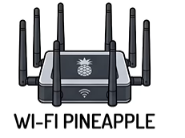

- **Qué es:** El rey indiscutible de las auditorías Wi-Fi. Un router táctico con múltiples antenas diseñado para lanzar ataques de *Man-in-the-Middle* (MitM) de forma automatizada.
 
- **Profundidad:** Usa una técnica llamada *Karma attack*. Los móviles están gritando constantemente al aire: *"¿Estás ahí, Wi-Fi de Mi_Casa?"*. El Pineapple escucha eso y responde: *"¡Sí, soy yo, conéctate!"*. Tiene la suite *PineAP* que automatiza la falsificación de redes y captura de *handshakes* (los apretones de manos cifrados para reventar contraseñas).
 
- **Uso Real:** Se oculta en una mochila en una cafetería. Clona la red de la cafetería, redirige a las víctimas a un "Evil Portal" (página de login falsa idéntica a la de Starbucks) para que metan su email, y a partir de ahí espía todo su tráfico no cifrado.
 
- **Precio Real:** ~119.99$ (Mark VII).

---
### 🐬 Flipper Zero

- **Qué es:** Conocido como el "Tamagotchi para Hackers". Es una multiherramienta de bolsillo de código abierto con una mascota virtual (un delfín) que sube de nivel cuanto más lo usas.
 
- **Profundidad:** Interactúa con casi todo lo invisible: **Sub-GHz** (mandos a distancia, barreras), **NFC/RFID** (tarjetas de hotel, abonos transporte, chips de perros), **Infrarrojos** (teles, aires acondicionados) e **iButton**.
 
- **Uso Real:** Leer, guardar y emular la señal de la tarjeta del garaje de la empresa, apagar todas las televisiones de una tienda de electrónica a la vez, o inyectar BadUSB conectándolo por cable al móvil o PC.
 
- **Precio Real:** ~169.00$.

---
### 📡 HackRF One

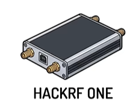

- **Qué es:** Una radio definida por software (SDR) extremadamente potente. Transmite y recibe señales de radio desde 1 MHz hasta 6 GHz (cubriendo radio FM, Bluetooth, Wi-Fi, móviles, GPS, etc.).
 
- **Profundidad:** A diferencia del Flipper (que está limitado a ciertas bandas legales), el HackRF One es un dispositivo de laboratorio puro capaz de realizar ataques de *Replay* (grabar y repetir) en protocolos complejos y cerrados.
 
- **Uso Real:** Ampliamente usado para hackear sistemas de apertura de coches (clonando la llave keyless), interceptar la telemetría de aviones, atacar sistemas de infraestructuras críticas (SCADA) o falsificar coordenadas GPS para desviar drones de su ruta.
 
- **Precio Real:** ~330.00$ (Great Scott Gadgets).

---
### 💳 ProxMark III

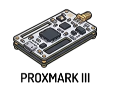

- **Qué es:** El estándar de la industria (el "bisturí") para la investigación y explotación de sistemas RFID y NFC.
 
- **Profundidad:** Es inmensamente más potente que un Flipper Zero para esto. Puede atacar tarjetas cifradas de alta seguridad (MIFARE Classic, iCLASS, DESFire) mediante ataques de fuerza bruta, lectura de claves por defecto y desencriptación offline.
 
- **Uso Real:** El atacante se cruza con un directivo por un pasillo, acerca su mochila a la tarjeta que lleva colgada, extrae los datos cifrados, rompe la clave en su portátil y escribe un clon perfecto en una tarjeta en blanco para infiltrarse en los servidores de la empresa.
 
- **Precio Real:** ~300.00$ (RDV4 oficial), aunque existen versiones antiguas ("Easy") por ~40$.

---
### 🪪 RFIDler

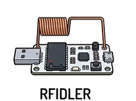

- **Qué es:** Un hardware de código abierto enfocado principalmente al estudio y suplantación de etiquetas RFID de **baja frecuencia** (LF a 125kHz y 134kHz).
 
- **Profundidad:** Es una alternativa más especializada y modular para protocolos muy específicos y sistemas anticuados que el Proxmark a veces no cubre o lo hace con una curva de aprendizaje más alta.
 
- **Uso Real:** Emular tarjetas de control de presencia, llaveros antiguos de garajes residenciales o sistemas de identificación industrial heredados (legacy systems).

---
### 🚫 Signal Jammers (Inhibidores)

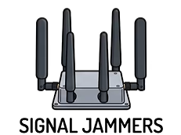

- **Qué es:** Dispositivos (altamente ilegales para el público) que inundan las bandas de frecuencia con "ruido" de radio para ensordecer a los receptores reales, impidiendo cualquier comunicación.
 
- **Profundidad:** Pueden cortar simultáneamente Wi-Fi, 4G/5G y GPS.
 
- **Uso Real:** Los ladrones de coches y de casas los usan de forma habitual para impedir que las alarmas inalámbricas llamen a la centralita de policía o para bloquear la señal del localizador GPS del coche robado. Su uso es un delito federal en casi todo el mundo por interrumpir llamadas de emergencias y servicios críticos.

---
### 🔓 Lockpicks for Tech (Ganzúas)

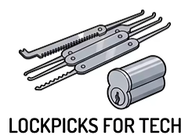

- **Qué es:** Herramientas de *Lockpicking* (apertura física de cerraduras sin llave).
 
- **Profundidad:** En ciberseguridad, un servidor con encriptación militar no sirve de nada si alguien tiene acceso físico para arrancar el disco duro o enchufar un USB Ducky.
 
- **Uso Real:** Se usan ganzúas, *Bump Keys* (llaves de impacto) o ataques de "Under the Door" en las auditorías de Red Team para abrir los *racks* (armarios metálicos) donde están los servidores o los switches de red en los centros de datos, demostrando que la seguridad física es la primera capa de la ciberseguridad.

---

## 🛡️ 3. Hardware Enfocado a la Privacidad Extrema

Los expertos en seguridad usan dispositivos específicos (o modificados) para recuperar el control absoluto sobre sus datos y evitar el rastreo corporativo y gubernamental.

### 🐧 Pulsera con sistema operativo Tails

- **Qué es:** Una memoria USB en forma de pulsera que contiene el sistema operativo amnésico *Tails* (The Amnesic Incognito Live System).
 
- **Profundidad:** Enruta absolutamente todo el tráfico de internet a través de la red Tor. Está diseñado para arrancar en modo "Live" (desde el USB) sin tocar el disco duro del ordenador anfitrión.
 
- **Uso Real:** Arrancar cualquier equipo de forma segura. Al sacar el USB o apagar el ordenador, *Tails* borra de la RAM cualquier rastro de la actividad, por lo que es imposible que un forense determine qué se hizo en ese equipo.

---

### 🌐 Router de Viaje (GL.iNet)

- **Qué es:** Un enrutador portátil del tamaño de un cargador de móvil que unifica la conexión de varios dispositivos bajo una sola IP local.
 
- **Profundidad:** Inicia automáticamente un túnel VPN (WireGuard/OpenVPN) a nivel de hardware o actúa como repetidor y firewall, cifrando todo el tráfico antes de que salga a la red exterior.
 
- **Uso Real:** En lugar de conectar tu móvil, portátil y tablet a la red insegura de un hotel o aeropuerto (exponiendo tu MAC y tráfico), conectas solo el router de viaje al hotel. Todos tus dispositivos se conectan a tu router de forma segura. El hotel solo ve "un" dispositivo emitiendo ruido cifrado.
 
- **Precio Real:** ~90$ - 130$ (Modelos Beryl AX o Slate AX).

---

### ⌚ Smartwatch Autoprogramable

- **Qué es:** Relojes inteligentes de código abierto y hardware libre basados en Arduino y pantallas de bajo consumo (e-ink), sin servicios de Google ni Apple.
 
- **Profundidad:** No tienen telemetría en la nube ni envían datos a servidores externos. Tú controlas exactamente el firmware que ejecutan y qué Bluetooth transmiten.
 
- **Uso Real:** Monitorear pasos y recordatorios sin que una corporación sepa cuándo duermes, qué rutas haces o comparta esos datos médicos con empresas de publicidad y aseguradoras.
 
- **Precio Real:** ~27$ - 30$ (Ej: PineTime).

---

### 📚 Kiwix (Wikipedia sin conexión)

- **Qué es:** Una aplicación de código abierto para descargar e inspeccionar grandes bases de conocimiento completas.
 
- **Profundidad:** Permite comprimir y almacenar enciclopedias enteras (como toda la Wikipedia en español con imágenes) en archivos `.zim` altamente eficientes para llevarlos en un pendrive o tarjeta SD.
 
- **Uso Real:** Navegar y buscar información sin necesidad de conectarse a Internet, evitando así el perfilado de datos que hacen los ISP y buscadores sobre tus intereses o dudas.

---

### 🎧 iPod Classic modificado (Rockbox)

- **Qué es:** Un reproductor de música antiguo (como el iPod Classic) revivido con almacenamiento MicroSD, batería nueva y firmware libre (*Rockbox*).
 
- **Profundidad:** Carece por completo de chips Bluetooth, Wi-Fi o GPS.
 
- **Uso Real:** Escuchar música de forma 100% privada. Evita el rastreo algorítmico de plataformas como Spotify y el rastreo físico que tiendas y centros comerciales realizan escaneando continuamente tu señal Bluetooth (por ejemplo, al usar AirPods) para triangular tu ubicación por los pasillos.

---

### 🕳️ Pi-hole y Unbound en Raspberry Pi

- **Qué es:** Un pequeño servidor que actúa como "agujero negro" (Pi-hole) de DNS para toda tu red doméstica, combinado con un resolvedor de nombres (Unbound).
 
- **Profundidad:** Bloquea dominios de rastreadores, anuncios y telemetría de Smart TVs, Windows y móviles *antes* de que salgan a internet. Con Unbound, tú mismo resuelves las direcciones web, por lo que tu operador de internet no sabe qué webs visitas.
 
- **Uso Real:** Protege a todos los dispositivos conectados a tu casa de forma centralizada sin necesidad de instalar bloqueadores en cada uno de ellos.

---

### 💻 Laptop Framework con Linux

- **Qué es:** Un ordenador portátil 100% modular y fácil de reparar, donde cada pieza (pantalla, teclado, puertos) se puede sustituir fácilmente.
 
- **Profundidad:** Incluye interruptores físicos (kill switches) para cortar por hardware el circuito de la cámara y el micrófono, haciendo imposible que un malware te grabe.
 
- **Uso Real:** Ejecutando un sistema operativo Linux, brinda a los expertos un control total, auditable y absoluto sobre el hardware, el software y la privacidad del equipo frente a los sistemas cerrados corporativos.
 
- **Precio Real:** A partir de ~800$ - 1.000$ (Versión base DIY).
