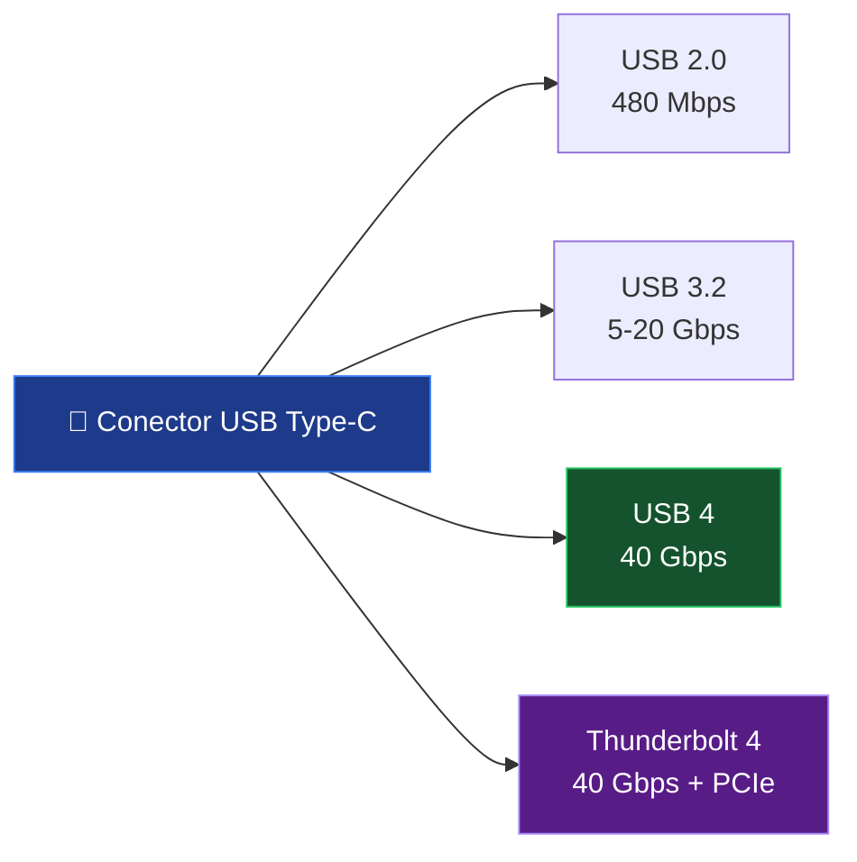

#sistemas #hardware #usb #conectividad #usb4 #typec #puertos

> [!info] Navegación
> 🔗 Relacionado: [[Componentes del PC Explicados|Componentes del PC]]

---

# Colores de Puertos USB — Guía Completa

El color de un puerto USB **no es decorativo**: es un código que te dice exactamente qué velocidad y capacidad de carga tiene ese puerto. Conocerlos te permite saber qué esperar antes de conectar cualquier cable.

---

## 🎨 El Sistema de Colores

### ⬜ Blanco — USB 1.0 / 1.1 (1996-1998)

El origen de todo. El estándar universal que reemplazó el caos de puertos propietarios (PS/2, Serie, Paralelo...).

- **Velocidad:** 12 Mbps (~1.5 MB/s reales)
- **Potencia:** 2.5W (500 mA a 5V)
- **Hoy:** No lo encontrarás en ningún equipo moderno. Solo en hardware industrial o retro.

---

### ⬛ Negro — USB 2.0 (2000)

El estándar que dominó durante más de una década y aún se encuentra en muchos periféricos.

- **Velocidad:** 480 Mbps (~60 MB/s reales)
- **Potencia:** 2.5W (500 mA a 5V)
- **Usos comunes:** Teclados, ratones, hubs baratos, impresoras, webcams de gama baja.

> [!note] ¿Por qué solo 60 MB/s si dice 480 Mbps?
> Los 480 Mbps son la velocidad bruta del bus. El protocolo USB 2.0 tiene sobrecarga de señalización que consume en torno al 20% del ancho de banda, y las velocidades reales además dependen del controlador USB del host y del dispositivo.

---

### 🔵 Azul — USB 3.0 / USB 3.1 Gen 1 / SuperSpeed (2008)

El gran salto generacional. Fácilmente identificable por su lengüeta interior azul.

- **Velocidad:** 5 Gbps (~400-500 MB/s reales)
- **Potencia:** 4.5W (900 mA a 5V)
- **Retrocompatible** con USB 2.0 y 1.1
- **Arquitectura interna:** 9 pines (añade 5 pines a los 4 del USB 2.0 para la señalización SuperSpeed)

> [!tip] Cómo identificarlo físicamente
> Mira dentro del conector: si la lengüeta interior es **azul**, es USB 3.0. Si es negra o blanca, es USB 2.0.

---

### 🩵 Teal / Azul Claro — USB 3.1 Gen 2 / SuperSpeed+ (2013)

- **Velocidad:** 10 Gbps (~900 MB/s reales)
- **Potencia:** 15W (3A a 5V)
- **Uso principal:** SSDs externos, hubs de alta velocidad, capturadoras de vídeo.

---

### 🟡 Amarillo / 🔴 Rojo — Carga Always-On o USB 3.2

Los puertos amarillos o rojos tienen **significados diferentes según el fabricante**:

1. **Carga Always-On:** El puerto sigue entregando corriente incluso con el PC apagado. Ideal para cargar el móvil durante la noche sin necesitar que el PC esté encendido.
2. **USB 3.2 Gen 2x2:** El estándar de 20 Gbps (SuperSpeed 20). Muy raro de ver en hardware de consumo.

---

### 🟢 Verde — Carga Rápida

Generalmente indica compatibilidad con protocolos de **carga rápida propietarios** (Qualcomm Quick Charge, MediaTek Pump Express) o simplemente un código de color estético de la marca del fabricante. Lee siempre las especificaciones para confirmarlo.

---

## 🔄 El Salto al USB 4 / Type-C

### Conector USB Type-C — El Conector Universal

El conector Type-C **no es un estándar de velocidad**: es solo la **forma física del conector**. Un puerto Type-C puede ser USB 2.0, USB 3.x, USB 4 o Thunderbolt. El conector es reversible (no tiene orientación arriba/abajo).

### USB 4 — El Estándar de Próxima Generación

- **Velocidad:** Hasta **40 Gbps** (USB 4 Gen 3x2)
- **Potencia:** Power Delivery hasta **240W** (USB PD 3.1)
- **Funciones adicionales:**
  - **DisplayPort Alt Mode:** Conectar monitores directamente sin adaptador.
  - **Thunderbolt 3/4 compatible:** Los puertos Thunderbolt usan la misma especificación.
  - **eGPU:** Conectar una tarjeta gráfica externa mediante un dock.

> [!warning] Trampa habitual con Type-C
> Ver un puerto Type-C NO garantiza alta velocidad. Un portátil barato puede tener un puerto Type-C que solo sea USB 2.0 (480 Mbps). **Siempre revisa las especificaciones del fabricante** para saber qué versión de USB hay detrás del conector.

---

## 📊 Tabla Resumen Completa

| Color | Estándar | Velocidad | Potencia | Característica |
|---|---|---|---|---|
| ⬜ Blanco | USB 1.0/1.1 | 12 Mbps | 2.5W | Universal original (1996) |
| ⬛ Negro | USB 2.0 | 480 Mbps | 2.5W | Estándar dominante ~10 años |
| 🔵 Azul | USB 3.0 | 5 Gbps | 4.5W | SuperSpeed, 9 pines |
| 🩵 Teal | USB 3.1 Gen2 | 10 Gbps | 15W | SuperSpeed+ |
| 🟡 Amarillo | Always-On / 3.2 | Varía | — | Carga con PC apagado o 20 Gbps |
| 🔴 Rojo | Varía por marca | Varía | — | Carga rápida o siempre activo |
| 🟢 Verde | Quick Charge | Varía | — | Carga rápida propietaria |
| 🔵 Type-C | USB 4 | 40 Gbps | 240W | Reversible, DisplayPort, eGPU |

> [!tip] 💡 Regla práctica
> Para transferir archivos grandes (SSDs externos, vídeo sin editar): busca **azul o teal** y asegúrate de usar también un cable USB 3.x.
> Para cargar dispositivos grandes (portátiles): busca **Type-C con USB PD (Power Delivery)**.
