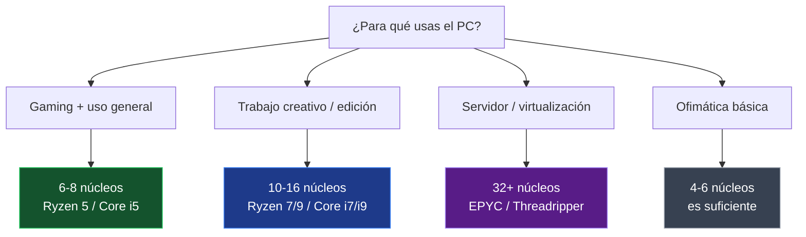

#sistemas #hardware #cpu #nucleos #cores #rendimiento #multicore

> [!info] Navegación
> 🔗 Relacionado: [[Componentes del PC Explicados|Componentes del PC]] | [[📂Sistemas Informáticos/📂Origen|Origen del Hardware]]

---

# Cuántos Núcleos de CPU Necesitas — Guía Completa

El número de núcleos de un procesador es uno de los factores más visibles al comprar un PC, pero también uno de los más mal entendidos. **Más núcleos no siempre significa mejor** para todo. Depende completamente de lo que hagas.

---

## 🧠 Conceptos Previos Imprescindibles

### ¿Qué es un Núcleo (Core)?

Cada núcleo es un **procesador independiente** dentro del mismo chip. Un procesador quad-core es como tener 4 CPUs pequeñas trabajando en el mismo paquete.

### Hyper-Threading / SMT

Una tecnología de Intel (Hyper-Threading) y AMD (SMT) que permite que **un núcleo físico ejecute dos hilos de forma simultánea**. Un procesador de 8 núcleos con HT aparece como 16 núcleos lógicos en el sistema operativo.

> [!note] Núcleos físicos vs. lógicos
> Los núcleos lógicos no son lo mismo que los físicos. El rendimiento ganado por HT es real pero menor al de un núcleo físico extra (típicamente un 15-30% más de rendimiento en tareas multihilo).

### Arquitecturas Híbridas (Intel desde 12ª Gen)

Intel introdujo procesadores con dos tipos de núcleos:
- **P-cores (Performance Cores):** Núcleos grandes, potentes y rápidos para tareas exigentes.
- **E-cores (Efficiency Cores):** Núcleos pequeños, eficientes para tareas en segundo plano.

El sistema operativo (Windows 11, Linux con soporte) distribuye las cargas inteligentemente entre ambos tipos.

---

## 📊 Por Conteo de Núcleos: Para Qué Sirve Cada Uno

### 1-2 Núcleos (Single/Dual-Core) — Historia y Dispositivos Básicos

- **Contexto histórico:** Fue el estándar hasta mediados de los 2000.
- **Usos actuales:** Microcontroladores, dispositivos IoT simples, sistemas embebidos.
- **Para un PC de usuario:** **Insuficiente** en 2024. El sistema operativo moderno solo ya consume varios núcleos.

---

### 4 Núcleos (Quad-Core) — El Mínimo Actual

- **Época:** Estándar mainstream de 2010 a ~2020.
- **Usos:** Ofimática, navegación web, vídeo en streaming.
- **Gaming:** Suficiente para juegos de la generación anterior, algunos títulos modernos ya lo notan.
- **Conclusión:** El **mínimo recomendado** para un PC de uso general en 2024.

---

### 6-8 Núcleos (Hexa/Octa-Core) — El Punto Dulce Actual 🎯

- **Usos:** **Gaming moderno**, creación de contenido básica/media (edición de vídeo 1080p), programación, streaming mientras juegas.
- **Por qué es el punto dulce:** La mayoría de juegos actuales están optimizados para 6-8 núcleos. Más núcleos no dan más FPS en gaming, pero permiten ejecutar otros procesos en paralelo sin bajadas de rendimiento.
- **Ejemplos:** Ryzen 5 7600X, Intel Core i5-14600K.

> [!tip] Arquitecturas híbridas aquí
> Los Intel Core i5 de 12ª-14ª gen tienen 6 P-cores + 4-8 E-cores. Para gaming, los P-cores hacen el trabajo pesado y los E-cores manejan Discord, el antivirus y el streaming sin robar recursos al juego.

---

### 10-16 Núcleos — Productividad Profesional

- **Usos:** Compilación de software, renderizado 3D con CPU, edición de vídeo 4K multipista, análisis de datos, multitarea extrema.
- **Por qué importan aquí:** Estas cargas de trabajo escalan directamente con el número de núcleos. El doble de núcleos puede significar el doble de velocidad de renderizado.
- **Ejemplos:** AMD Ryzen 9 7950X (16 núcleos), Intel Core i9-14900K (24 núcleos con híbrida).

---

### 24-32 Núcleos — Estaciones de Trabajo (Workstations)

- **Usos:** Efectos visuales en cine (VFX), simulaciones científicas, compilación de proyectos masivos, virtualización pesada en el escritorio.
- **Plataformas:** AMD Threadripper, Intel Xeon W.
- **Precio:** Procesadores de esta gama cuestan entre 800€ y 4000€+.

---

### 64-96+ Núcleos — Servidores y Cloud

- **Usos:** Centros de datos, virtualización masiva (decenas de VMs por servidor), bases de datos, infraestructura cloud.
- **Plataformas:** AMD EPYC (hasta 96 núcleos por procesador, 2 procesadores por servidor = 192 núcleos físicos), Intel Xeon Scalable.
- **No para escritorio:** El consumo eléctrico, el calor y el precio son incompatibles con uso personal.

---

## ⚡ Factores Que Importan Tanto Como los Núcleos

Saber el número de núcleos no es suficiente para comparar procesadores. Estos factores son igual de importantes:

| Factor | Qué mide | Impacto |
|---|---|---|
| **IPC (Instructions Per Cycle)** | Cuánto trabajo hace cada núcleo por ciclo de reloj | Crítico para rendimiento single-core |
| **Frecuencia de reloj (GHz)** | Velocidad del ciclo de reloj | Importante para gaming y apps single-threaded |
| **Caché L3** | Memoria ultrarrápida integrada en el chip | Reduce la latencia de acceso a datos frecuentes |
| **Latencia de RAM** | Velocidad con que la CPU accede a la RAM | Especialmente importante en AMD Ryzen |
| **TDP (Thermal Design Power)** | Calor generado (vatios) | Determina la refrigeración necesaria |

---

## 🎯 Guía de Decisión Rápida

> [!tip] 💡 La regla de oro
> Para gaming: compra el procesador más rápido en single-core que puedas permitirte, no el que más núcleos tenga. Para crear contenido o compilar código: más núcleos sí se traducen directamente en menos tiempo de espera.
