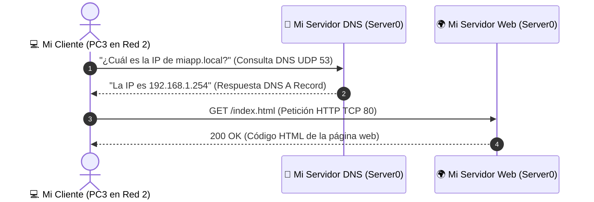

#sistemas-informaticos #packet-tracer #dns #http #web-server #html #resolucion-nombres

> [!info] 🧭 Navegación
> ◀ [[🔄 04 - Servidor DHCP (Automatización de IPs)]] · 🔼 [[🌐 README]] · ▶ [[📡 06 - Red Inalámbrica y Seguridad Básica (Acceso Wi-Fi)]]

---

## 🎯 1. Mi Objetivo y Caso de Uso Real

Mi objetivo en este proyecto es simular el funcionamiento de la World Wide Web y las intranets de empresa. En este laboratorio aprendo a alojar una página web mediante el protocolo **HTTP** y a configurar un **Servidor DNS (*Domain Name System*)** que traduzca nombres de dominio legibles (como `miapp.local`) en direcciones IP de máquina.

> [!abstract] 🏠 Caso Real: Despliegue de una Intranet o Backend Web
> Cuando una empresa despliega una intranet o un portal del empleado, los usuarios no acceden escribiendo `http://192.168.1.254` en su navegador.
> 
> En su lugar, abren el navegador y escriben `http://miapp.local` o `intranet.empresa`. Para que esto funcione, necesito un servicio de directorio que traduzca ese texto en milisegundos: el **Servidor DNS**.

---

## 🛠️ 2. Hardware e Infraestructura que Utilizo

Aprovecho la topología montada en el Proyecto 4. Para mantener la arquitectura limpia y eficiente, convierto **Server0** (`192.168.1.254`) en un **servidor multifunción**:
1. Servidor **DHCP** (ya en funcionamiento).
2. Servidor **Web HTTP/HTTPS** (aloja mi sitio web).
3. Servidor **DNS** (resuelve el dominio `miapp.local`).

![[PT_Proyecto_04_05_Servidores_DHCP_DNS.png]]



---

## ⚙️ 3. Pasos que Sigo en Packet Tracer

### 1️⃣ Paso 1: Configuro el Servicio Web (HTTP) en Server0

1. Hago clic sobre **Server0** (red izquierda: `192.168.1.254`).
2. Entro a la pestaña **Services** y selecciono **HTTP** en el menú de la izquierda.
3. Me aseguro de que las opciones **HTTP** y **HTTPS** tienen marcada la casilla **On**.
4. En la lista de archivos, busco `index.html` y hago clic en **(edit)** a la derecha.
5. Modifico el código HTML para personalizar la página de mi intranet:

```html
<html>
<head>
  <title>Intranet Corporativa</title>
</head>
<body style="background-color: #1a202c; color: #e2e8f0; font-family: Arial, sans-serif; text-align: center; padding: 40px;">
  <h1 style="color: #63b3ed;">🚀 ¡Servidor Web y Backend en Producción!</h1>
  <p style="font-size: 18px;">He accedido con éxito a través del dominio <b>miapp.local</b>.</p>
  <hr style="border: 1px solid #4a5568; margin: 20px auto; width: 60%;">
  <p style="color: #9ae6b4;">✅ Resolución DNS Operativa | ✅ Enrutamiento L3 Funcional</p>
</body>
</html>
```

6. Pulso el botón **Save** y confirmo con **Yes** cuando me pregunta si deseo sobreescribir el archivo existente.

---

### 2️⃣ Paso 2: Configuro el Servicio DNS en Server0

1. En la misma pestaña **Services** de **Server0**, hago clic en **DNS** en el menú izquierdo.
2. Marco la casilla **Service: On**.
3. Creo el registro de resolución de nombres (**Resource Record**):
   - **Name**: `miapp.local` *(el nombre que escribiré en el navegador)*.
   - **Type**: Lo mantengo en **A Record** *(asocia un nombre a una dirección IPv4)*.
   - **Address**: `192.168.1.254` *(la IP fija donde se encuentra alojada mi web)*.
4. Hago clic en el botón **Add** (Añadir).
5. Compruebo que en la tabla inferior aparece listado:
   `miapp.local -> A -> 192.168.1.254`.

---

### 3️⃣ Paso 3: Propago el DNS a los Clientes mediante DHCP

Para que los ordenadores sepan a quién consultar cuando escriba un nombre, **añado la IP del servidor DNS a la configuración de ambos servidores DHCP**.

#### 3.1 En Server0 (Red Izquierda):
1. Voy a **Services > DHCP**.
2. En el campo **DNS Server**, escribo: `192.168.1.254`.
3. Hago clic en el botón **Save**.

#### 3.2 En Server1 (Red Derecha):
1. Abro **Server1** ➡️ **Services > DHCP**.
2. En el campo **DNS Server**, escribo también: `192.168.1.254` *(los PCs de la red 2 cruzarán el router para consultarle)*.
3. Hago clic en **Save**.

---

### 4️⃣ Paso 4: Fuerzo la renovación DHCP en los Clientes

Para que mis PCs reciban la nueva dirección del servidor DNS:

1. Abro **PC1** (o cualquier otro PC) ➡️ **Desktop > IP Configuration**.
2. Hago clic en **Static** y vuelvo a hacer clic en **DHCP**.
3. Compruebo que ahora la casilla **DNS Server** muestra `192.168.1.254`.
4. Repito esta renovación rápida en los PCs de ambas redes.

---

## 🧪 4. Verificación y Pruebas que Realizo

### 🧪 Prueba 1: Diagnóstico por Terminal con `nslookup`

1. Abro **PC3** (situado en la red derecha: `192.168.2.100`).
2. Entro a **Desktop > Command Prompt**.
3. Ejecuto la consulta DNS:

```bash
nslookup miapp.local
```

### 📋 Salida que obtengo:

```text
Server:  192.168.1.254
Address: 192.168.1.254

Name:    miapp.local
Address: 192.168.1.254
```

> [!NOTE] 🔍 Lo que interpreto:
> Mi equipo en la red 2 ha cruzado el router, le ha preguntado al servidor DNS `192.168.1.254` quién es `miapp.local`, y el servidor le ha devuelto la dirección IP correcta.

---

### 🧪 Prueba 2: Navegación Web en el Navegador Gráfico

1. En el mismo **PC3**, abro la aplicación **Web Browser** en la pestaña **Desktop**.
2. En la barra de direcciones (**URL**), escribo:

```text
http://miapp.local
```

3. Pulso el botón **Go** (o presiono Enter).
4. Compruebo cómo carga de inmediato la página HTML personalizada que edité en el Paso 1 con todos sus estilos y mensajes.

---

## 🚨 5. Errores con los que Me Puedo Encontrar y Soluciones

| Error Posible | Causa | Cómo lo Soluciono |
|:---|:---|:---|
| **Host Name Unresolved** en el navegador | El servicio DNS está apagado o el PC no tiene asignado DNS Server. | 1. En Server0, confirmo que en **Services > DNS** la casilla está en **On**.<br>2. En el PC, miro **IP Configuration**: si el campo DNS Server está en `0.0.0.0`, refresco pasando de Static a DHCP. |
| **Request Timeout al cargar la página** | La IP configurada en el registro A es incorrecta o el Router no enruta. | Compruebo que en **Services > DNS** la dirección asociada a `miapp.local` es exactamente `192.168.1.254`. |
| **Aparece la página genérica de Cisco** | No guardé los cambios en `index.html` o no confirmé con *Yes*. | Vuelvo a **Services > HTTP**, edito `index.html`, pulso **Save** y confirmo con **Yes**. |

---

## 📌 6. Resumen de lo Aprendido y Siguiente Paso

En este proyecto he aprendido a:
- Alojar y personalizar páginas web con el protocolo HTTP (puerto TCP 80).
- Configurar registros DNS de tipo A para traducir nombres a direcciones IPv4 (puerto UDP 53).
- Distribuir servidores DNS de forma automatizada mediante el protocolo DHCP.

**El último salto**: Todos mis puestos están amarrados por cables de red a la pared. Para dar soporte a portátiles y movilidad en la empresa, necesito desplegar una red inalámbrica con un **Access Point (Wi-Fi)** protegido mediante **WPA2-PSK**.

👉 Continúo a mi proyecto final: [[📡 06 - Red Inalámbrica y Seguridad Básica (Acceso Wi-Fi)]]
