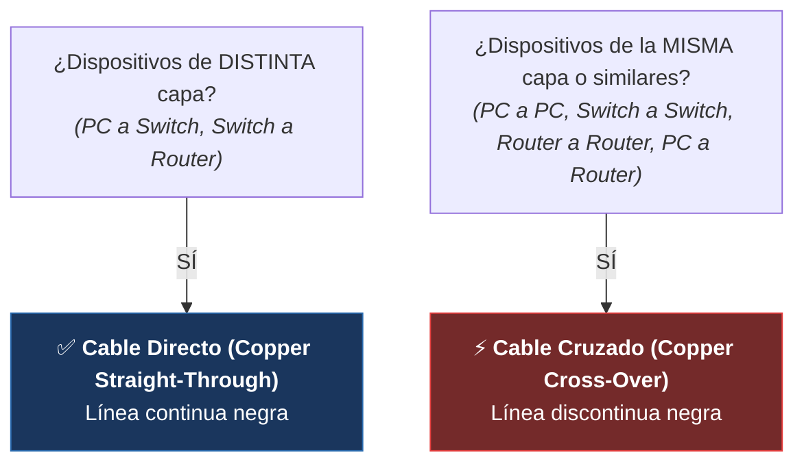

#sistemas-informaticos #packet-tracer #redes #laboratorio #ccna #cisco #networking

> [!abstract] 🧭 Centro de Mando: Laboratorio Progresivo de Packet Tracer
> En este centro de mando documento mi laboratorio práctico de **Proyectos Básicos en Cisco Packet Tracer**.
> 
> He organizado esta serie de **6 proyectos prácticos** para aprender redes de forma tangible, visual y progresiva: desde conectar dos ordenadores con un cable hasta levantar una infraestructura completa con enrutamiento, asignación automática de IPs, servidores web, resolución DNS y conectividad Wi-Fi segura.
> 
> En cada proyecto documento el caso de uso real, mi topología gráfica, los pasos exactos que sigo en la interfaz de Packet Tracer, los comandos de terminal y las comprobaciones de conectividad que realizo.

---

---

## 📚 Índice de Proyectos del Laboratorio

| # | Proyecto | Archivo / Enlace | Conceptos Clave | Topología |
|:---:|:---|:---|:---|:---|
| **01** | **La Conexión Directa** | [[🔌 01 - La Conexión Directa (PC a PC)]] | Comunicación P2P, Cable Cruzado, IP estática, comando `ping`. | 2 PCs directos |
| **02** | **La Oficina Pequeña** | [[🖧 02 - La Oficina Pequeña (Red LAN con Switch)]] | Conmutación L2, Switch 2960, Cable Directo, tiempos STP (naranja a verde). | 4 PCs + 1 Switch |
| **03** | **Separando Departamentos** | [[🚦 03 - Separando Departamentos (El Router)]] | Enrutamiento L3, Router ISR, Default Gateway, activación de puertos (`no shutdown`). | 2 LANs + 1 Router |
| **04** | **Servidor DHCP** | [[🔄 04 - Servidor DHCP (Automatización de IPs)]] | Servidores Cisco, Pools DHCP, proceso DORA, IPs estáticas vs dinámicas. | 2 LANs + 2 Servidores DHCP |
| **05** | **Servidor Web y DNS** | [[🌍 05 - Servidor Web y DNS (Resolución de Nombres)]] | HTTP, edición de `index.html`, Registros DNS tipo A (`miapp.local`), navegador web. | Clientes web + DNS + HTTP |
| **06** | **Red Inalámbrica Segura** | [[📡 06 - Red Inalámbrica y Seguridad Básica (Acceso Wi-Fi)]] | Access Point (AP-PT), WPA2-PSK, módulos físicos (WPC300N), conectividad móvil end-to-end. | Red mixta Cable + Wi-Fi |

---

## 📸 Galería Visual de Topologías en Packet Tracer

### 🔌 Proyecto 1: Conexión Directa (PC a PC)

![[PT_Proyecto_01_Conexion_Directa.png]]

### 🖧 Proyecto 2: Red LAN con Switch 2960

![[PT_Proyecto_02_Red_LAN_Switch.png]]

### 🚦 Proyecto 3: Separando Departamentos con Router

![[PT_Proyecto_03_Router_Departamentos.png]]

### 🔄 🌍 Proyectos 4 y 5: Servidores DHCP, Web HTTP y DNS

![[PT_Proyecto_04_05_Servidores_DHCP_DNS.png]]

### 📡 Proyecto 6: Extensión Inalámbrica Wi-Fi con Access Point y Portátil

![[PT_Proyecto_06_WiFi_Access_Point.png]]

---

## 🧰 Guía Visual de Componentes y Cables en Packet Tracer

Para no despistarme en la barra inferior de Packet Tracer:

### 📦 1. Categorías de Dispositivos (Esquina Inferior Izquierda)

| Icono / Categoría | Nombre en Packet Tracer | Dispositivos que Empleo en este Laboratorio |
|:---|:---|:---|
| **Network Devices** | Dispositivos de Red | Routers (modelo **4321** o **1941**), Switches (modelo **2960**). |
| **End Devices** | Dispositivos Finales | **PC-PT** (Ordenador de sobremesa), **Laptop-PT** (Portátil), **Server-PT** (Servidor). |
| **Wireless Devices** | Dispositivos Inalámbricos | **AP-PT** (Access Point inalámbrico estándar). |
| **Connections (Rayo Naranja)** | Conexiones y Cableado | Cable Directo (negro continuo), Cable Cruzado (negro discontinuo). |

### ⚡ 2. Regla de Oro para la Elección de Cables

---

## 🚦 Los Estados de las Luces en Packet Tracer (Troubleshooting Rápido)

- **Triángulos Rojos en Router**: El puerto del router está **apagado administrativamente** (`shutdown`). En los routers Cisco los puertos vienen apagados de fábrica; entro y los enciendo manualmente (marco casilla **On** o ejecuto `no shutdown` en CLI).

- **Círculos / Puntos Naranjas en Switch**: El puerto está negociando la conexión mediante el protocolo **Spanning Tree (STP)** para evitar bucles. Espero aproximadamente **30 segundos** y cambia automáticamente a verde.

- **Triángulos Verdes**: Enlace activo y funcional en Capa 1 y Capa 2. Listo para transmitir paquetes.

- **Ondas de Radio Discontinuas**: Conexión inalámbrica por radiofrecuencia establecida con éxito entre el Access Point y el dispositivo móvil.

---

## 💡 Pautas que Sigo al Realizar las Prácticas

1. **Construyo de forma acumulativa**: Voy guardando un archivo `.pkt` por cada proyecto (`Proyecto_01.pkt`, `Proyecto_02.pkt`, etc.) para comparar cómo evoluciona mi red.

2. **Uso el Modo Simulación**: Si un ping me falla o quiero ver cómo viajan los datos en tiempo real, abro la pestaña lateral derecha **Simulation** (o `Shift + S`) y avanzo los paquetes paso a paso.

3. **Tengo paciencia con el primer ping**: Al cruzar un router por primera vez, sé que el primer paquete siempre dará `Request timed out` mientras los dispositivos resuelven las tablas ARP. Lanzo el comando de ping dos veces seguidas para confirmar la conexión.

---
→ Siguiente nivel: [[📂Proyectos Intermedios/🌐 README|🚀 Pasar al Laboratorio de Proyectos Intermedios (07 en adelante)]]