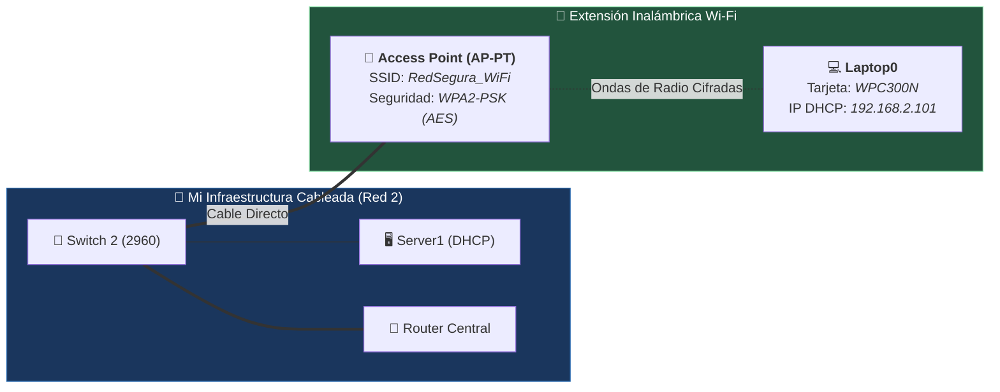

#sistemas-informaticos #packet-tracer #wifi #access-point #wpa2-psk #laptop #inalambrico #seguridad

> [!info] 🧭 Navegación
> ◀ [[🌍 05 - Servidor Web y DNS (Resolución de Nombres)]] · 🔼 [[🌐 README]]

---

## 🎯 1. Mi Objetivo y Caso de Uso Real

Mi objetivo en este proyecto final es integrar la movilidad inalámbrica en mi infraestructura corporativa. En este laboratorio aprendo a desplegar un **Punto de Acceso (*Access Point*)**, a proteger el perímetro aéreo mediante **autenticación WPA2-PSK con cifrado robusto**, a sustituir físicamente los módulos de hardware de un portátil en Packet Tracer y a verificar la conectividad integral extremo a extremo (*End-to-End*).

> [!abstract] 🏠 Caso Real: Despliegue de Cobertura Wi-Fi para Empleados
> En cualquier empresa moderna, los empleados se desplazan con sus portátiles a salas de reuniones o puestos flexibles sin rosetas de red en la pared.
> 
> No puedo dejar la red abierta (*Open*), pues cualquiera en la calle podría capturar contraseñas o acceder a los servidores internos. Necesito desplegar un Punto de Acceso conectado a mi red cableada y cifrar el tráfico aéreo mediante **WPA2-PSK (Pre-Shared Key)**.

---

## 🛠️ 2. Hardware e Infraestructura que Utilizo

Partiendo de la red montada en los proyectos anteriores, añado en mi **Red Derecha (Red 2 - 192.168.2.0/24)**:

- **1 Punto de Acceso Inalámbrico** (*Access Point* modelo **AP-PT**).
- **1 Cable de Red Directo** (*Copper Straight-Through*) para unir el AP al Switch 2.
- **1 Ordenador Portátil** (*Laptop-PT*).
- **1 Módulo Inalámbrico Cisco WPC300N** (para sustituir la tarjeta de red cableada del portátil).

![[PT_Proyecto_06_WiFi_Access_Point.png]]



---

## ⚙️ 3. Pasos que Sigo en Packet Tracer

### 1️⃣ Paso 1: Añado y Conecto el Access Point

1. En la barra inferior, selecciono la categoría **Wireless Devices**.
2. Localizo el dispositivo **AP-PT** (Access Point genérico) y lo arrastro cerca de mi **Switch 2**.
3. En **Connections**, elijo el cable directo continuo (**Copper Straight-Through**).
4. Conecto el puerto **Port 0** del Access Point a un puerto FastEthernet libre de mi **Switch 2** (ej. `FastEthernet0/5`).
5. Compruebo que la luz del AP se pone en verde de inmediato (los APs son puentes transparentes de Capa 2).

---

### 2️⃣ Paso 2: Configuro el SSID y la Clave WPA2 en el Access Point

1. Hago clic sobre el **Access Point** para abrir su ventana de configuración.
2. Me dirijo a la pestaña **Config**.
3. En el menú izquierdo, hago clic en **Port 1** (la interfaz de radio frecuencia inalámbrica):
   - **Port Status**: Confirmo que está en **On**.
   - **SSID**: Asigno el nombre: `RedSegura_WiFi`.
   - **Authentication**: Selecciono la opción **WPA2-PSK**.
   - **PSK Pass Phrase**: Escribo la contraseña de seguridad: `RedSegura123`.
   - **Encryption Type**: Mantengo seleccionado **AES**.
4. Cierro la ventana del Access Point.

---

### 3️⃣ Paso 3: Cambio el módulo de hardware del Portátil

> [!important] 🔌 Por qué el portátil no se conecta por sí solo
> Por defecto en Packet Tracer, **los portátiles vienen equipados con tarjeta de red por cable (RJ-45)**. Para que mi portátil pueda conectarse por Wi-Fi, debo apagarlo y cambiarle físicamente el módulo por una antena inalámbrica.

Sigo estos pasos exactos:

1. En **End Devices**, arrastro un **Laptop** (*Laptop-PT*) al lienzo.
2. Hago clic sobre el portátil y entro a la pestaña **Physical** (donde veo la bahía lateral y los conectores).
3. **Acción obligatoria**: Localizo el pequeño botón circular de encendido en el lateral del portátil (con su LED verde activo). **Hago clic sobre el botón para APAGAR el portátil** (el LED se apaga).
   *(Si intento quitar la tarjeta con el portátil encendido, Packet Tracer me da el aviso: "Cannot remove a module when the power is on")*.
4. Con el portátil apagado, hago clic sobre el conector Ethernet que está en la bahía lateral y **lo arrastro hacia la bandeja inferior** para dejar el hueco libre.
5. En la columna izquierda de módulos disponibles, selecciono **WPC300N** (antena inalámbrica a 2.4 GHz).
6. Arrastro el módulo **WPC300N** y lo suelto dentro de la bahía vacía del portátil. Observo aparecer la antena negra.
7. **Vuelvo a pulsar el botón de encendido para encender el portátil** (el LED verde se ilumina de nuevo).

---

### 4️⃣ Paso 4: Asocio el Portátil a mi Red Wi-Fi

1. En la misma ventana del Laptop, voy a la pestaña superior **Desktop**.
2. Abro la aplicación **PC Wireless**.
3. Pulso en la pestaña **Connect**.
4. Hago clic en el botón **Refresh** y espero unos segundos.
5. En la lista de redes detectadas, selecciono mi red: `RedSegura_WiFi`.
6. Pulso el botón **Connect** (abajo a la derecha).
7. Introduzco la contraseña:
   - En **Pre-shared Key**, escribo: `RedSegura123`.
   - Hago clic en **Connect**.
8. Cierro la aplicación **PC Wireless**.

**Verificación visual**: En el lienzo de Packet Tracer observo aparecer el haz de **ondas discontinuas** entre el Access Point y mi Laptop. El enlace inalámbrico ya está establecido.

---

### 5️⃣ Paso 5: Compruebo la IP Dinámica por DHCP en el Portátil

Dado que mi Access Point está conectado al Switch 2 (donde opera **Server1**), el portátil solicita su IP a través del aire.

1. En el Laptop, voy a **Desktop > IP Configuration**.
2. Confirmo que está seleccionado el modo **DHCP**.
3. Verifico que recibe los parámetros automáticamente:
   - **IPv4 Address**: `192.168.2.101` (o similar dentro del rango `.100`).
   - **Subnet Mask**: `255.255.255.0`.
   - **Default Gateway**: `192.168.2.1`.
   - **DNS Server**: `192.168.1.254`.

---

## 🧪 4. Verificación y Pruebas que Realizo

### 🧪 Prueba 1: Conectividad Local por Wi-Fi (Ping a la Puerta de Enlace)

1. Abro el **Command Prompt** de mi Laptop.
2. Lanzo un ping a la IP del Router en mi red local:
   ```bash
   ping 192.168.2.1
   ```
3. Compruebo que responde con `Reply from 192.168.2.1: bytes=32 time<1ms TTL=255`. Esto me confirma que la señal viaja por el aire al AP, pasa al Switch y llega al Router.

---

### 🧪 Prueba 2: Salto entre Redes (Ping al Servidor Remoto por Wi-Fi)

Desde la terminal del Laptop, lanzo ping al servidor de la otra red:

```bash
ping 192.168.1.254
```

> [!NOTE] 🧭 La Ruta que sigue mi paquete:
> El paquete sale de mi Laptop por radiofrecuencia (**Wi-Fi WPA2**) ➡️ llega al **Access Point** ➡️ viaja por cable directo al **Switch 2** ➡️ sube por Gigabit al **Router** (Capa 3) ➡️ el Router lo conmuta hacia la red 1 ➡️ baja al **Switch 1** ➡️ y llega a **Server0**.
> *(Si el primer paquete da timeout por ARP, el segundo confirma el 100% de éxito)*.

---

### 🧪 Prueba 3: Navegación Web por Nombre de Dominio desde el Portátil

1. En mi Laptop, abro el **Web Browser**.
2. En la barra de direcciones URL, escribo:
   ```text
   http://miapp.local
   ```
3. Pulso **Go**.
4. En pocos segundos compruebo cómo se despliega la página web personalizada de la intranet corporativa que edité en Server0.

---

## 🚨 5. Errores con los que Me Puedo Encontrar y Soluciones

| Error Posible | Causa | Cómo lo Soluciono |
|:---|:---|:---|
| **No aparecen ondas de radio y el portátil no conecta** | SSID mal escrito, clave errónea o el portátil no tiene la tarjeta inalámbrica. | Abro el Laptop en **Physical**: compruebo que tiene el módulo WPC300N y está encendido. En **PC Wireless > Connect**, refresco y verifico la clave `RedSegura123`. |
| **El portátil obtiene una IP `169.254.X.X` (APIPA)** | El cable entre el Switch y el AP está caído o el DHCP no responde en la red 2. | Compruebo que el cable entre el Switch 2 y el AP tiene triángulos verdes. En **Server1 > Services > DHCP**, verifico que el servicio está en **On**. |
| **El ping a `192.168.1.254` falla** | Las interfaces del Router están apagadas o el Default Gateway está en blanco. | Verifico que el Router tiene ambos puertos encendidos (`192.168.1.1` y `192.168.2.1`) con indicadores verdes. |

---

## 🏆 6. Conclusión y Logro de mi Laboratorio Completo

Con este proyecto completo con éxito la progresión de los 6 proyectos básicos en Cisco Packet Tracer. He diseñado e implementado una arquitectura de red completa que abarca:

1. **Capa 1 (Física)**: Cable cruzado, cable directo y radiofrecuencia Wi-Fi con módulos WPC300N.
2. **Capa 2 (Enlace de Datos)**: Conmutación en switches Cisco 2960, mitigación de bucles con STP y tablas MAC.
3. **Capa 3 (Red)**: Enrutamiento inter-subredes con router Cisco ISR, direccionamiento IPv4 y puertas de enlace (*Default Gateways*).
4. **Capa 4 (Transporte)**: Segmentación y control de flujo mediante TCP (puerto 80) y datagramas UDP (puertos 67/68 y 53).
5. **Capa 7 (Aplicación y Servicios)**:
   - Automatización de red con **DHCP**.
   - Alojamiento y maquetación web con **HTTP**.
   - Resolución distribuida de nombres de dominio con **DNS**.
   - Cifrado perimetral inalámbrico con **WPA2-PSK (AES)**.

¡Dispongo ahora de una base práctica sólida para cualquier certificación de nivel CCNA o despliegue de infraestructura de sistemas!
