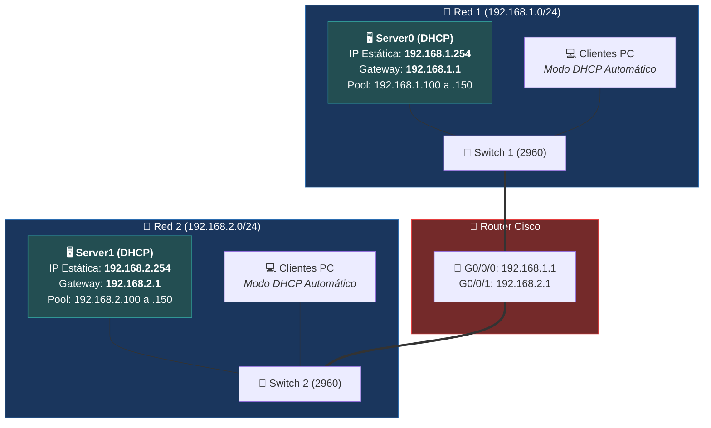

#sistemas-informaticos #packet-tracer #dhcp #servidor #pool-ip #automatizacion #ip-dinamica

> [!info] 🧭 Navegación
> ◀ [[🚦 03 - Separando Departamentos (El Router)]] · 🔼 [[🌐 README]] · ▶ [[🌍 05 - Servidor Web y DNS (Resolución de Nombres)]]

---

## 🎯 1. Mi Objetivo y Caso de Uso Real

Mi objetivo en este proyecto es automatizar la entrega de parámetros de red (dirección IP, máscara de subred y puerta de enlace predeterminada) mediante la configuración de un **Servidor DHCP (*Dynamic Host Configuration Protocol*)**. Aquí aprendo cómo escalar una infraestructura sin tener que configurar cada cliente manualmente.

> [!abstract] 🏠 Caso Real: La Cafetería o la Oficina con Empleados Móviles
> Asignar IPs fijas a mano funciona si tengo 3 ordenadores fijos. Pero si administro una oficina con 100 empleados o una red donde entran dispositivos portátiles a diario, no puedo configurar cada tarjeta a mano.
> 
> Necesito un servicio que, en cuanto un equipo se conecta al cable o al Wi-Fi, le entregue una IP libre de un rango (*Pool*) automáticamente y la recupere cuando se marche: eso hace mi **Servidor DHCP**.

---

## 🛠️ 2. Hardware e Infraestructura que Utilizo

Partiendo de la topología del Proyecto 3, añado:

- **2 Servidores Cisco** (Dispositivos finales / *Server-PT*):
  - **Server0**: Servidor DHCP para mi red izquierda (`192.168.1.0/24`).
  - **Server1**: Servidor DHCP para mi red derecha (`192.168.2.0/24`).
- **Cables directos** (*Copper Straight-Through*) para conectar los servidores a sus respectivos switches.

![[PT_Proyecto_04_05_Servidores_DHCP_DNS.png]]



> [!tip] 💡 Mi Regla de Oro para los Servidores
> **Los servidores NUNCA deben configurarse por DHCP**. Siempre les asigno una **IP Estática y fija**. Si un servidor cambiara de dirección IP de forma aleatoria, los clientes no sabrían a dónde enviar sus peticiones.

---

## ⚙️ 3. Pasos que Sigo en Packet Tracer

### 1️⃣ Paso 1: Conecto físicamente los Servidores a los Switches

1. En **End Devices**, selecciono **Server** (Server-PT).
2. Arrastro un servidor al lado izquierdo y lo nombro `Server0`.
3. Arrastro otro servidor al lado derecho y lo nombro `Server1`.
4. Con cables directos continuos (**Copper Straight-Through**):
   - Conecto el puerto `FastEthernet0` de **Server0** a un puerto libre de mi **Switch 1**.
   - Conecto el puerto `FastEthernet0` de **Server1** a un puerto libre de mi **Switch 2**.
5. Espero unos segundos a que las luces del Switch pasen de naranja a verde.

---

### 2️⃣ Paso 2: Configuro Server0 (Red Izquierda - 192.168.1.X)

#### 2.1 Asigno su IP Fija:
1. Hago clic en **Server0** y voy a **Desktop > IP Configuration**.
2. Configuro en modo **Static**:
   - **IPv4 Address**: `192.168.1.254`
   - **Subnet Mask**: `255.255.255.0`
   - **Default Gateway**: `192.168.1.1` *(la IP del Router en este lado)*

#### 2.2 Configuro y enciendo el Servicio DHCP:
1. En la ventana de Server0, entro a la pestaña superior **Services**.
2. En el menú lateral izquierdo, selecciono **DHCP**.
3. Aplico los siguientes parámetros:
   - **Service**: Marco la casilla **On** *(imprescindible para que empiece a repartir IPs)*.
   - **Pool Name**: `serverPool`.
   - **Default Gateway**: `192.168.1.1`.
   - **Start IP Address**: `192.168.1.100` *(empezará a repartir desde la .100 en adelante)*.
   - **Subnet Mask**: `255.255.255.0`.
   - **Maximum number of Users**: `50`.
4. Pulso el botón **Save** (Guardar) y confirmo que la tabla inferior se actualiza.

---

### 3️⃣ Paso 3: Configuro Server1 (Red Derecha - 192.168.2.X)

> [!CAUTION] ⚠️ Cuidado con el Gateway de la Red Derecha
> No debo cometer el error de duplicar la configuración de la red 1 en Server1.
> **Server1 está en la red 2**. Su puerta de enlace es `192.168.2.1` y su bolsa de IPs debe empezar en `192.168.2.100`.

#### 3.1 Asigno su IP Fija:
1. Hago clic en **Server1** y entro a **Desktop > IP Configuration**.
2. Configuro en **Static**:
   - **IPv4 Address**: `192.168.2.254`
   - **Subnet Mask**: `255.255.255.0`
   - **Default Gateway**: `192.168.2.1`

#### 3.2 Configuro el Servicio DHCP:
1. Voy a **Services > DHCP**.
2. Configuro:
   - **Service**: **On**.
   - **Default Gateway**: `192.168.2.1`.
   - **Start IP Address**: `192.168.2.100`.
   - **Subnet Mask**: `255.255.255.0`.
   - **Maximum number of Users**: `50`.
3. Pulso **Save**.

---

### 4️⃣ Paso 4: Cambio los Clientes PC a modo DHCP

1. Abro **PC1** ➡️ **Desktop > IP Configuration**.
2. Cambio de *Static* a **DHCP**.
3. En unos segundos compruebo el mensaje:
   ```text
   DHCP request successful.
   ```
   Y veo los campos asignados automáticamente:
   - IP Address: `192.168.1.100`
   - Subnet Mask: `255.255.255.0`
   - Default Gateway: `192.168.1.1`

4. Repito el cambio en los demás PCs:
   - **PC2**: Recibe automáticamente `192.168.1.101`.
   - **PC3** (red derecha): Recibe automáticamente `192.168.2.100` con Gateway `192.168.2.1`.
   - **PC4** (red derecha): Recibe automáticamente `192.168.2.101`.

---

## 🧪 4. Verificación y Pruebas que Realizo

### 🧪 Prueba 1: Inspecciono la concesión IP en Terminal

Abro el **Command Prompt** en PC1 y compruebo los datos asignados:

```bash
ipconfig
```

### 📋 Salida que obtengo:

```text
FastEthernet0 Connection:

   Connection-specific DNS Suffix..: 
   Link-local IPv6 Address.........: fe80::201:42ff:fea1:8801
   IPv4 Address....................: 192.168.1.100
   Subnet Mask.....................: 255.255.255.0
   Default Gateway.................: 192.168.1.1
```

### 🧪 Prueba 2: Ping Extremo a Extremo con IPs Dinámicas

Desde la misma terminal de **PC1** (`192.168.1.100`), lanzo un ping hacia **PC3** en la otra red (`192.168.2.100`):

```bash
ping 192.168.2.100
```

El resultado es exitoso (`Reply from 192.168.2.100`), lo que me confirma que los clientes obtienen IP dinámica y el router sigue enrutando perfectamente entre ambas subredes.

### 🧪 Prueba 3: Observo el proceso D.O.R.A. en Modo Simulación

Al cambiar a la pestaña **Simulation**, poner un PC en Static y volver a marcar DHCP, observo el intercambio de los 4 paquetes del protocolo:
1. **D**iscover: El PC envía un broadcast (`255.255.255.255`) buscando un servidor DHCP.
2. **O**ffer: El Server le ofrece la dirección `192.168.1.100`.
3. **R**equest: El PC solicita formalmente aceptar dicha oferta.
4. **A**cknowledge: El Server confirma la concesión y la registra.

---

## 🚨 5. Errores con los que Me Puedo Encontrar y Soluciones

| Error Posible | Causa | Cómo lo Soluciono |
|:---|:---|:---|
| **El PC recibe una IP tipo `169.254.X.X` (APIPA)** | El servidor DHCP está apagado, no hay cable físico o el pool no se guardó. | Reviso que el cable entre el Server y el Switch esté en verde. En **Services > DHCP**, confirmo que la casilla **On** está marcada y pulso de nuevo en **Save**. |
| **PC de la red derecha recibe Gateway `192.168.1.1`** | He copiado por error el Gateway de la red izquierda en Server1. | En **Server1 > Services > DHCP**, cambio el Default Gateway a `192.168.2.1` y pulso **Save**. En el PC, paso a Static y vuelvo a DHCP para refrescar. |
| **Pings fallan entre PCs y servidores** | He dejado los servidores en DHCP en vez de Static. | Verifico que los servidores tienen siempre IP fija estática en su pestaña **Desktop > IP Configuration**. |

---

## 📌 6. Resumen de lo Aprendido y Siguiente Paso

En este proyecto he aprendido a:
- Desplegar y conectar servidores dedicados en Packet Tracer.
- Configurar pools DHCP independientes para subredes distintas.
- Comprender el flujo de 4 pasos DORA y cómo los clientes obtienen parámetros de red sin intervención manual.

**El siguiente reto**: No quiero que mis usuarios tengan que recordar números de IP para acceder a los servicios de la empresa. Quiero que naveguen escribiendo `miapp.local`. Para lograrlo, configuro un **Servidor DNS** y un **Servidor Web HTTP**.

👉 Continúo a mi siguiente reto: [[🌍 05 - Servidor Web y DNS (Resolución de Nombres)]]
