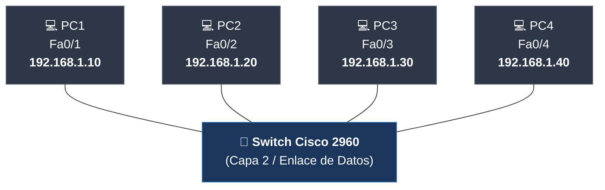

#sistemas-informaticos #packet-tracer #switch #lan #cisco-2960 #cable-directo #ethernet

> [!info] 🧭 Navegación
> ◀ [[🔌 01 - La Conexión Directa (PC a PC)]] · 🔼 [[🌐 README]] · ▶ [[🚦 03 - Separando Departamentos (El Router)]]

---

## 🎯 1. Mi Objetivo y Caso de Uso Real

Mi objetivo en este proyecto es escalar mi red a múltiples equipos introduciendo un dispositivo intermedio de Capa 2: el **Switch**. Aquí compruebo por qué el Switch es el estándar indiscutible de las redes de área local cableadas (LAN) y cómo gestiona el tráfico sin colisiones.

> [!abstract] 🏠 Caso Real: La Red de una Oficina o Aula
> En una oficina pequeña o en un aula de formación conviven 4 o más ordenadores, impresoras y servidores. 
> 
> No puedo llenar el suelo de cables cruzados conectando cada ordenador con todos los demás (para 4 PCs necesitaría 6 cables; para 10 PCs me harían falta 45 cables). En su lugar, coloco un dispositivo central inteligente: el **Switch**. Desde cada puesto tiro un único cable directo hasta él y todos quedan inmediatamente comunicados.

---

## 🛠️ 2. Hardware e Infraestructura que Utilizo

- **1 Switch Cisco Catalyst 2960-24TT** (24 puertos FastEthernet + 2 puertos GigabitEthernet).
- **4 PCs de sobremesa** (PC1, PC2, PC3, PC4).
- **4 Cables de Par Trenzado Directos** (*Copper Straight-Through* - línea continua negra).

![[PT_Proyecto_02_Red_LAN_Switch.png]]



> [!tip] 💡 ¿Por qué utilizo Cable Directo?
> Al conectar dispositivos de distinta capa (un PC que opera en Capas 1 a 7 con un Switch que conmuta en Capa 2), los pines de transmisión y recepción ya vienen cruzados internamente en los puertos del Switch. Por tanto, utilizo un **cable directo** (*Straight-Through*).

---

## ⚙️ 3. Pasos que Sigo en Packet Tracer

### 1️⃣ Paso 1: Limpio la topología previa

1. Selecciono la herramienta de borrado (icono de la **X** roja o pulso `Del`).
2. Hago clic sobre el cable cruzado que unía PC1 y PC2 para eliminarlo. Presiono `Esc` para volver al cursor normal.

### 2️⃣ Paso 2: Añado el Switch Cisco 2960

1. Me dirijo a la esquina inferior izquierda y selecciono la categoría **Network Devices**.
2. En la subcategoría inferior, pulso en **Switches**.
3. Selecciono el modelo **2960** (Cisco Catalyst 2960) y lo arrastro justo al centro del lienzo.

### 3️⃣ Paso 3: Añado dos ordenadores más

1. Vuelvo a **End Devices > PC**.
2. Arrastro dos nuevos PCs al lienzo y los nombro `PC3` y `PC4`.

### 4️⃣ Paso 4: Cableo los 4 PCs al Switch con Cable Directo

1. Me dirijo a **Connections** (Rayo Naranja).
2. Selecciono el cable con **línea continua negra** (**Copper Straight-Through**).
3. Conecto cada equipo a un puerto del Switch:
   - Clic en **PC1** (`FastEthernet0`) ➡️ Clic en el **Switch** (selecciono `FastEthernet0/1`).
   - Clic en **PC2** (`FastEthernet0`) ➡️ Clic en el **Switch** (selecciono `FastEthernet0/2`).
   - Clic en **PC3** (`FastEthernet0`) ➡️ Clic en el **Switch** (selecciono `FastEthernet0/3`).
   - Clic en **PC4** (`FastEthernet0`) ➡️ Clic en el **Switch** (selecciono `FastEthernet0/4`).

### 5️⃣ Paso 5: Observo las luces naranjas del Switch

> [!important] ⏱️ ¿Por qué las luces del Switch empiezan en NARANJA?
> Nada más conectar los cables, observo que el extremo del Switch muestra un **círculo naranja**, mientras que en el PC se ve un triángulo verde.
> 
> **No es un fallo**: el Switch ejecuta automáticamente el protocolo **STP (Spanning Tree Protocol)**. Durante unos **30 a 50 segundos**, el puerto pasa por los estados de *Listening* y *Learning* para comprobar que no hay bucles en la red. Pasado ese tiempo, cambia a **verde permanente** (*Forwarding*).
> 
> *Atajo que utilizo*: Si tengo prisa, pulso el botón **Fast Forward Time** (icono de dos flechas hacia la derecha en la barra inferior) o uso `Alt + D` para adelantar el tiempo.

### 6️⃣ Paso 6: Configuro las Direcciones IP de los Nuevos PCs

Mantengo PC1 (`192.168.1.10`) y PC2 (`192.168.1.20`), y configuro los nuevos:

1. Clic en **PC3** ➡️ **Desktop > IP Configuration**:
   - **IPv4 Address**: `192.168.1.30`
   - **Subnet Mask**: `255.255.255.0`
2. Clic en **PC4** ➡️ **Desktop > IP Configuration**:
   - **IPv4 Address**: `192.168.1.40`
   - **Subnet Mask**: `255.255.255.0`

---

## 🧪 4. Verificación y Pruebas que Realizo

### 🧪 Prueba 1: Ping cruzado entre múltiples puestos

1. Abro **PC1** y entro a **Desktop > Command Prompt**.
2. Lanzo ping a PC3:
   ```bash
   ping 192.168.1.30
   ```
3. Lanzo ping a PC4:
   ```bash
   ping 192.168.1.40
   ```
4. Compruebo que ambos responden con `Reply from 192.168.1.X: bytes=32 time<1ms TTL=128`.

### 🧪 Prueba 2: Consulto la Tabla MAC del Switch

Para entender cómo el Switch sabe a qué puerto enviar cada trama sin molestar a los demás equipos, consulto su **Tabla de Direcciones MAC** (*CAM Table*).

1. Hago clic sobre el **Switch 2960**.
2. Me dirijo a la pestaña **CLI** (consola de Cisco IOS).
3. Pulso `Enter` para activar la consola e introduzco:

```cisco
Switch> enable
Switch# show mac address-table
```

### 📋 Resultado que obtengo:

```text
          Mac Address Table
-------------------------------------------

Vlan    Mac Address       Type        Ports
----    -----------       --------    -----
   1    0001.42a1.8801    DYNAMIC     Fa0/1
   1    0001.42a1.8802    DYNAMIC     Fa0/2
   1    0001.42a1.8803    DYNAMIC     Fa0/3
   1    0001.42a1.8804    DYNAMIC     Fa0/4
Total Mac Addresses for this criterion: 4
```

> [!NOTE] 🧠 Lo que interpreto:
> El Switch ha aprendido de forma pasiva qué dirección MAC física está conectada a cada uno de sus puertos en cuanto los PCs enviaron sus paquetes de ping. A partir de ese momento, entrega las tramas de forma conmutada directamente al puerto del destinatario.

---

## 🚨 5. Errores con los que Me Puedo Encontrar y Soluciones

| Error Posible | Causa | Cómo lo Soluciono |
|:---|:---|:---|
| **El ping da timeout al instante** | He lanzado el ping mientras las luces del switch aún estaban en color naranja. | Espero 30 segundos a que STP cambie a color verde o pulso el botón *Fast Forward Time*. |
| **Conflicto de IP detectado** | He asignado por error la misma IP a dos máquinas (ej. `192.168.1.20` en PC2 y PC3). | Reviso **Desktop > IP Configuration** de cada equipo para asegurar que cada uno tiene una IP única (`.10`, `.20`, `.30`, `.40`). |
| **Luz roja persistente** | Puerto del PC o Switch deshabilitado. | Entro en la pestaña **Config** del Switch y confirmo que la casilla **Port Status (On)** está marcada en los puertos Fa0/1 a Fa0/4. |

---

## 📌 6. Resumen de lo Aprendido y Siguiente Paso

En este proyecto he aprendido a:
- Conectar múltiples puestos con un Switch Cisco 2960 como concentrador de Capa 2.
- Aplicar cables directos para enlazar equipos de diferente capa.
- Comprender el comportamiento del protocolo STP en la negociación de puertos.
- Inspeccionar en la consola IOS el aprendizaje dinámico de direcciones MAC.

**La limitación que detecto**: Todos los equipos están en la misma red local (`192.168.1.X`). Si mi organización crece y necesito aislar al departamento de Recursos Humanos del departamento de Informática para que no se interfieran, necesito interconectar redes distintas mediante un **Router**.

👉 Continúo a mi siguiente reto: [[🚦 03 - Separando Departamentos (El Router)]]
