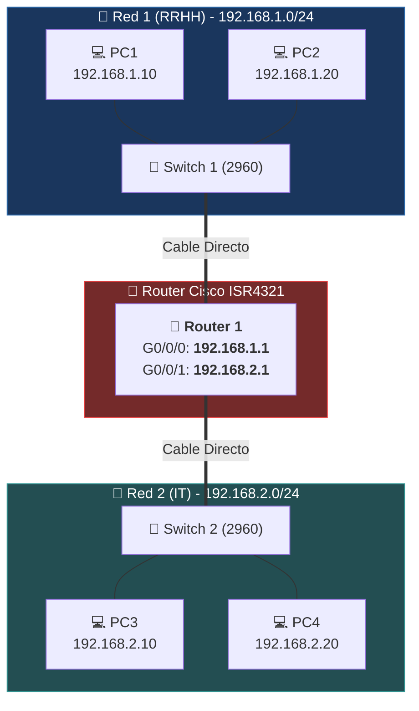

#sistemas-informaticos #packet-tracer #router #enrutamiento #default-gateway #subredes #cisco-4321

> [!info] 🧭 Navegación
> ◀ [[🖧 02 - La Oficina Pequeña (Red LAN con Switch)]] · 🔼 [[🌐 README]] · ▶ [[🔄 04 - Servidor DHCP (Automatización de IPs)]]

---

## 🎯 1. Mi Objetivo y Caso de Uso Real

Mi objetivo en este proyecto es conectar **dos redes lógicas distintas (subredes)** utilizando un dispositivo de Capa 3: el **Router**. Aquí comprendo el concepto crítico de la **Puerta de Enlace Predeterminada (*Default Gateway*)** y por qué un Switch no puede comunicar redes diferentes por sí solo.

> [!abstract] 🏠 Caso Real: Separando Recursos Humanos de Informática
> En mi empresa, los ordenadores de **Recursos Humanos** manejan nóminas y contratos confidenciales (`Red 192.168.1.0/24`), mientras que los desarrolladores de **Informática** hacen pruebas de software y servidores (`Red 192.168.2.0/24`).
> 
> Por seguridad y rendimiento, no pueden compartir el mismo dominio de difusión. Son como dos urbanizaciones distintas separadas por una autopista. Para enviar datos de una urbanización a otra, necesito un puesto fronterizo inteligente: el **Router**.

---

## 🛠️ 2. Hardware e Infraestructura que Utilizo

- **1 Router Cisco** (Modelo **ISR4321** o **1941**).
- **2 Switches Cisco Catalyst 2960** (Switch Izquierdo y Switch Derecho).
- **4 PCs de sobremesa** (2 en la red izquierda y 2 en la red derecha).
- **Cables directos** (*Copper Straight-Through*).

![[PT_Proyecto_03_Router_Departamentos.png]]



---

## ⚙️ 3. Pasos que Sigo en Packet Tracer

### 1️⃣ Paso 1: Organizo las dos redes en el lienzo

1. En el lado izquierdo, coloco el **Switch 1** y dos PCs (`PC1` y `PC2`).
2. En el lado derecho, coloco el **Switch 2** (otro switch 2960) y dos PCs (`PC3` y `PC4`).
3. Conecto cada PC a su respectivo Switch usando cables directos (**Copper Straight-Through**).

### 2️⃣ Paso 2: Coloco el Router en el centro

1. Entro a **Network Devices > Routers**.
2. Selecciono el modelo **4321** (o **1941**) y lo coloco entre ambos switches.
3. Tomo un cable directo (**Copper Straight-Through**):
   - Conecto un puerto libre del Switch 1 (ej. `GigabitEthernet0/1` o `FastEthernet0/24`) al puerto **GigabitEthernet0/0/0** del Router.
   - Conecto un puerto libre del Switch 2 al puerto **GigabitEthernet0/0/1** del Router.

### 3️⃣ Paso 3: Enciendo y configuro las interfaces del Router

> [!CAUTION] 🚨 Por qué veo TRIÁNGULOS ROJOS en los cables del Router
> A diferencia de los Switches, **los puertos de los Routers Cisco vienen APAGADOS de fábrica** (*Administratively Down*).
> Hasta que no entro y los enciendo manualmente, no pasa ningún paquete y los triángulos permanecen en rojo.

Aplico cualquiera de estos dos métodos:

#### Método A: Desde la Interfaz Gráfica

1. Hago clic sobre el **Router** y voy a la pestaña **Config**.
2. En el menú de la izquierda (sección *INTERFACE*), selecciono **GigabitEthernet0/0/0**:
   - Marco la casilla **Port Status: On** (el indicador cambia de rojo a verde).
   - En **IP Configuration**:
     - **IPv4 Address**: `192.168.1.1`
     - **Subnet Mask**: `255.255.255.0`
3. Selecciono **GigabitEthernet0/0/1**:
   - Marco la casilla **Port Status: On**.
   - En **IP Configuration**:
     - **IPv4 Address**: `192.168.2.1`
     - **Subnet Mask**: `255.255.255.0`

#### Método B: Desde la Consola Cisco IOS (CLI)

Si quiero practicar comandos de examen Cisco:
1. Hago clic en el Router y voy a la pestaña **CLI**.
2. Si aparece el mensaje `Continue with configuration dialog? [yes/no]:`, escribo `no` y pulso `Enter`.
3. Ejecuto los comandos:

```cisco
Router> enable
Router# configure terminal

! Configuro la interfaz de mi red izquierda (Red 1)
Router(config)# interface GigabitEthernet0/0/0
Router(config-if)# ip address 192.168.1.1 255.255.255.0
Router(config-if)# no shutdown
Router(config-if)# exit

! Configuro la interfaz de mi red derecha (Red 2)
Router(config)# interface GigabitEthernet0/0/1
Router(config-if)# ip address 192.168.2.1 255.255.255.0
Router(config-if)# no shutdown
Router(config-if)# end
Router# write memory
```

En cuanto aplico `no shutdown` (o marco *On*), compruebo que los triángulos rojos cambian a verde.

### 4️⃣ Paso 4: Configuro los PCs y el Default Gateway

Para que mis ordenadores sepan salir de su red local y comunicarse con otra distinta, **deben conocer la IP de salida hacia el router**: el **Default Gateway**.

#### En la Red Izquierda (192.168.1.X):
- **PC1**:
  - IP: `192.168.1.10` / Máscara: `255.255.255.0`
  - **Default Gateway**: `192.168.1.1` *(la IP del Router en este lado)*
- **PC2**:
  - IP: `192.168.1.20` / Máscara: `255.255.255.0`
  - **Default Gateway**: `192.168.1.1`

#### En la Red Derecha (192.168.2.X):
- **PC3**:
  - IP: `192.168.2.10` / Máscara: `255.255.255.0`
  - **Default Gateway**: `192.168.2.1` *(la IP del Router en este lado)*
- **PC4**:
  - IP: `192.168.2.20` / Máscara: `255.255.255.0`
  - **Default Gateway**: `192.168.2.1`

---

## 🧪 4. Verificación y Pruebas que Realizo

### 🧪 Prueba de Ping entre Redes Distintas

1. Abro **PC1** (red izquierda: `192.168.1.10`).
2. Entro a **Desktop > Command Prompt**.
3. Lanzo un ping hacia **PC3** (red derecha: `192.168.2.10`):

```bash
ping 192.168.2.10
```

### 💡 Por qué observo que falla el primer paquete (Request timed out)

```text
Pinging 192.168.2.10 with 32 bytes of data:

Request timed out.
Reply from 192.168.2.10: bytes=32 time<1ms TTL=127
Reply from 192.168.2.10: bytes=32 time<1ms TTL=127
Reply from 192.168.2.10: bytes=32 time<1ms TTL=127

Ping statistics for 192.168.2.10:
    Packets: Sent = 4, Received = 3, Lost = 1 (25% loss)
```

> [!NOTE] 🧠 Lo que ocurre por debajo (Protocolo ARP):
> Cuando veo que el primer paquete devuelve `Request timed out` y los siguientes funcionan, sé que **mi red está operando correctamente**.
> 
> Mientras salía el primer ping, PC1 tuvo que enviar una petición ARP para averiguar la MAC del Router; a su vez, el Router tuvo que enviar otra petición ARP en la red derecha para conocer la MAC de PC3. Ese proceso de resolución inicial tarda unos milisegundos y hace que el primer paquete expire.
> 
> Al repetir el comando `ping 192.168.2.10`, obtengo **4 de 4 paquetes recibidos (0% loss)**.

---

## 🚨 5. Errores con los que Me Puedo Encontrar y Soluciones

| Error Posible | Causa | Cómo lo Soluciono |
|:---|:---|:---|
| **Triángulos rojos entre Router y Switch** | Los puertos del Router están apagados. | Entro al Router, voy a **Config**, selecciono cada interfaz Gigabit y marco la casilla **On** en *Port Status*. |
| **Pings dan 100% loss entre redes** | He olvidado configurar el **Default Gateway** en los PCs o he puesto una IP incorrecta. | Compruebo que los PCs de la izquierda tienen como Gateway `192.168.1.1` y los de la derecha `192.168.2.1`. |
| **Poner el mismo Gateway a ambos lados** | El router no admite la misma subred en dos interfaces físicas distintas. | Verifico que cada interfaz pertenece a su propia red (`.1.1` y `.2.1`). |
| **Cables cruzados en vez de directos** | He empleado un cable erróneo entre switch y router. | Utilizo siempre cable negro continuo (**Copper Straight-Through**). |

---

## 📌 6. Resumen de lo Aprendido y Siguiente Paso

En este proyecto he aprendido a:
- Separar redes locales mediante direccionamiento IP de Capa 3.
- Activar y configurar interfaces de router Cisco mediante interfaz gráfica y comandos IOS.
- Comprender la función esencial del **Default Gateway** para permitir el salto inter-redes.

**La limitación que detecto**: He configurado las IPs a mano en 4 puestos. En una empresa real con decenas de portátiles, asignar IPs estáticas es ineficiente. Necesito automatizar la entrega de IPs con un **Servidor DHCP**.

👉 Continúo a mi siguiente reto: [[🔄 04 - Servidor DHCP (Automatización de IPs)]]
